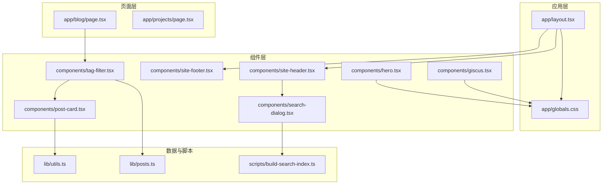
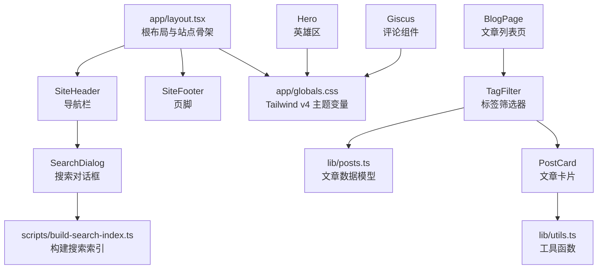
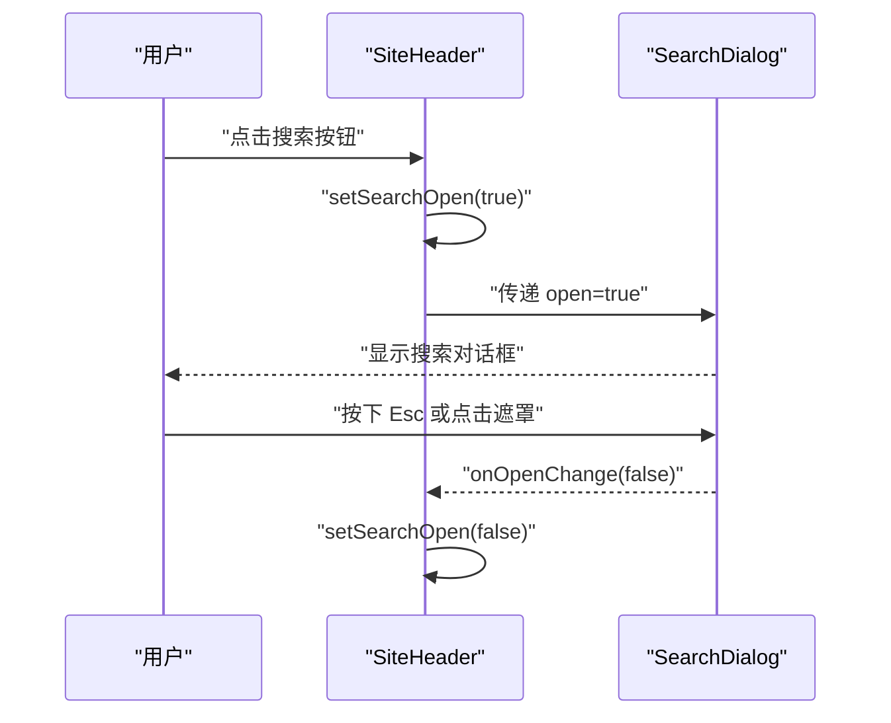
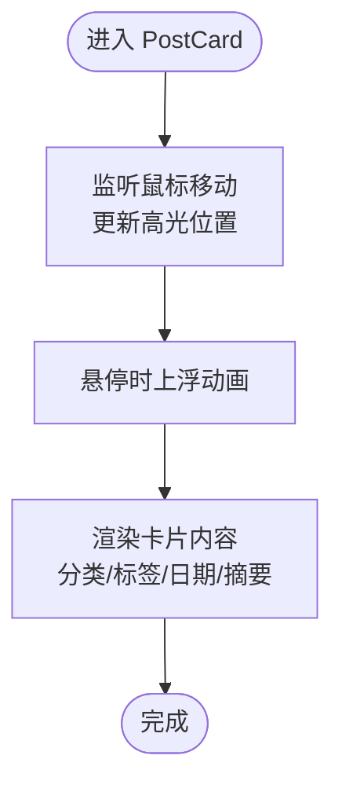
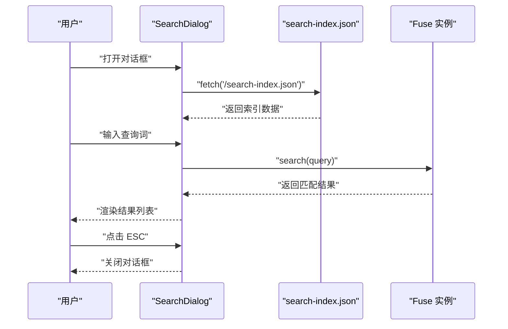
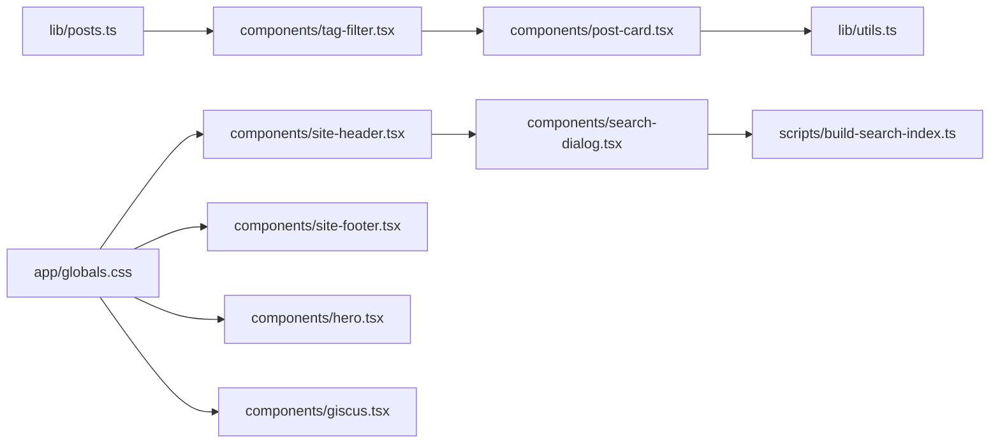

# UI 组件系统

<cite>
**本文引用的文件**
- [app/layout.tsx](file://app/layout.tsx)
- [app/globals.css](file://app/globals.css)
- [components/site-header.tsx](file://components/site-header.tsx)
- [components/site-footer.tsx](file://components/site-footer.tsx)
- [components/post-card.tsx](file://components/post-card.tsx)
- [components/search-dialog.tsx](file://components/search-dialog.tsx)
- [components/hero.tsx](file://components/hero.tsx)
- [components/giscus.tsx](file://components/giscus.tsx)
- [components/tag-filter.tsx](file://components/tag-filter.tsx)
- [mdx-components.tsx](file://mdx-components.tsx)
- [lib/utils.ts](file://lib/utils.ts)
- [lib/posts.ts](file://lib/posts.ts)
- [scripts/build-search-index.ts](file://scripts/build-search-index.ts)
- [package.json](file://package.json)
- [app/blog/page.tsx](file://app/blog/page.tsx)
- [app/projects/page.tsx](file://app/projects/page.tsx)
- [content/projects/example-project.mdx](file://content/projects/example-project.mdx)
</cite>

## 目录
1. [简介](#简介)
2. [项目结构](#项目结构)
3. [核心组件](#核心组件)
4. [架构总览](#架构总览)
5. [组件详解](#组件详解)
6. [依赖关系分析](#依赖关系分析)
7. [性能考量](#性能考量)
8. [故障排查指南](#故障排查指南)
9. [结论](#结论)
10. [附录](#附录)

## 简介
本文件系统性梳理 myWebsite 的 UI 组件体系，围绕基于 Tailwind CSS v4 的设计系统与变量主题，详细说明导航栏、页脚、文章卡片、搜索对话框、英雄区、评论组件与标签筛选器等核心组件的功能、属性接口、事件与状态管理，并提供主题定制、样式覆盖与功能扩展指南。同时涵盖 MDX 组件集成与自定义组件开发方法，以及响应式设计与无障碍访问的实现细节。

## 项目结构
- 应用层布局与全局样式
  - 布局文件负责注入全局样式与包裹主内容区域，统一挂载头部与页脚。
  - 全局 CSS 使用 Tailwind v4 的 @theme 定义颜色与字体变量，配合自定义工具类（如发光边框、玻璃卡片、打字机光标）实现统一视觉语言。
- 组件层
  - 头部导航、页脚、文章卡片、搜索对话框、英雄区、评论组件、标签筛选器等均为独立可复用 UI 组件。
  - 组件通过 props 与受控状态进行交互，部分组件内置键盘快捷键与动画效果。
- 数据与脚本
  - 文章数据模型与工具函数位于 lib 目录；搜索索引由构建脚本生成并输出至 public 目录供运行时使用。
- 页面层
  - 页面组件调用组件库与数据层，组合形成具体页面视图。

图表来源
- [app/layout.tsx:46-56](file://app/layout.tsx#L46-L56)
- [app/globals.css:1-278](file://app/globals.css#L1-L278)
- [components/site-header.tsx:19-102](file://components/site-header.tsx#L19-L102)
- [components/site-footer.tsx:3-39](file://components/site-footer.tsx#L3-L39)
- [components/post-card.tsx:20-80](file://components/post-card.tsx#L20-L80)
- [components/search-dialog.tsx:28-155](file://components/search-dialog.tsx#L28-L155)
- [components/hero.tsx:14-226](file://components/hero.tsx#L14-L226)
- [components/giscus.tsx:10-36](file://components/giscus.tsx#L10-L36)
- [components/tag-filter.tsx:14-76](file://components/tag-filter.tsx#L14-L76)
- [lib/utils.ts:4-23](file://lib/utils.ts#L4-L23)
- [lib/posts.ts:60-97](file://lib/posts.ts#L60-L97)
- [scripts/build-search-index.ts:29-94](file://scripts/build-search-index.ts#L29-L94)
- [app/blog/page.tsx:11-27](file://app/blog/page.tsx#L11-L27)
- [app/projects/page.tsx:10-95](file://app/projects/page.tsx#L10-L95)

章节来源
- [app/layout.tsx:46-56](file://app/layout.tsx#L46-L56)
- [app/globals.css:1-278](file://app/globals.css#L1-L278)

## 核心组件
- 导航栏（SiteHeader）
  - 功能：展示站点标识、主导航项、语言切换、搜索入口；根据当前路径高亮活动项；移动端/桌面端不同展示策略。
  - 属性接口：无（内部通过路由钩子与状态管理实现行为）。
  - 事件与状态：点击“搜索”按钮打开搜索对话框；键盘快捷键 Cmd/Ctrl+K 切换搜索框；语言切换链接动态计算。
  - 可访问性：为语言切换与搜索按钮提供 aria-label。
- 页脚（SiteFooter）
  - 功能：版权信息、社交链接、站点内导航。
  - 属性接口：无。
  - 事件与状态：无。
  - 可访问性：外链使用 rel="noopener noreferrer"，导航项 hover 提升对比度。
- 文章卡片（PostCard）
  - 功能：展示文章标题、摘要、分类、标签、阅读时长与日期；支持鼠标悬停产生径向高光与轻微上浮动画。
  - 属性接口：post（类型来自 lib/posts.ts）。
  - 事件与状态：鼠标移动更新高光位置；hover 上浮。
  - 可访问性：链接语义明确，hover 状态提升对比度。
- 搜索对话框（SearchDialog）
  - 功能：全局搜索入口，支持 Cmd/Ctrl+K 打开/关闭；输入查询后使用 Fuse.js 进行模糊检索；点击 ESC 关闭。
  - 属性接口：open（是否打开）、onOpenChange（回调）。
  - 事件与状态：首次打开时懒加载搜索索引；聚焦输入框；根据查询结果渲染列表。
  - 可访问性：ESC 关闭、点击遮罩关闭、列表项可点击跳转。
- 英雄区（Hero）
  - 功能：欢迎语、动态标语轮播、粒子网络画布动画、行动按钮。
  - 属性接口：无。
  - 事件与状态：粒子系统随窗口尺寸与鼠标位置动态变化；标语定时轮换。
  - 可访问性：画布元素设置 aria-hidden，避免干扰屏幕阅读器。
- 评论组件（Giscus）
  - 功能：集成 Giscus 评论系统；未配置时提示环境变量。
  - 属性接口：无。
  - 事件与状态：按环境变量开关显示。
  - 可访问性：遵循第三方组件默认可访问性。
- 标签筛选器（TagFilter）
  - 功能：按标签过滤文章列表；支持“全部”与单标签切换；空状态提示。
  - 属性接口：tags（标签与数量）、posts（文章列表）。
  - 事件与状态：受控状态 active 控制当前标签；使用动画过渡切换列表。
  - 可访问性：按钮具备 hover/active 状态对比度，列表项使用 Link 组件。

章节来源
- [components/site-header.tsx:19-102](file://components/site-header.tsx#L19-L102)
- [components/site-footer.tsx:3-39](file://components/site-footer.tsx#L3-L39)
- [components/post-card.tsx:20-80](file://components/post-card.tsx#L20-L80)
- [components/search-dialog.tsx:23-82](file://components/search-dialog.tsx#L23-L82)
- [components/hero.tsx:14-226](file://components/hero.tsx#L14-L226)
- [components/giscus.tsx:10-36](file://components/giscus.tsx#L10-L36)
- [components/tag-filter.tsx:9-76](file://components/tag-filter.tsx#L9-L76)

## 架构总览
整体采用“布局 + 组件 + 数据/脚本”的分层架构。布局文件统一注入全局样式与站点骨架；组件层提供可复用 UI；数据层负责内容解析与索引生成；页面层组合组件与数据形成最终页面。

图表来源
- [app/layout.tsx:46-56](file://app/layout.tsx#L46-L56)
- [app/globals.css:1-278](file://app/globals.css#L1-L278)
- [components/site-header.tsx:19-102](file://components/site-header.tsx#L19-L102)
- [components/site-footer.tsx:3-39](file://components/site-footer.tsx#L3-L39)
- [components/post-card.tsx:20-80](file://components/post-card.tsx#L20-L80)
- [components/search-dialog.tsx:28-155](file://components/search-dialog.tsx#L28-L155)
- [components/hero.tsx:14-226](file://components/hero.tsx#L14-L226)
- [components/giscus.tsx:10-36](file://components/giscus.tsx#L10-L36)
- [components/tag-filter.tsx:14-76](file://components/tag-filter.tsx#L14-L76)
- [lib/utils.ts:4-23](file://lib/utils.ts#L4-L23)
- [lib/posts.ts:60-97](file://lib/posts.ts#L60-L97)
- [scripts/build-search-index.ts:29-94](file://scripts/build-search-index.ts#L29-L94)
- [app/blog/page.tsx:11-27](file://app/blog/page.tsx#L11-L27)

## 组件详解

### 导航栏（SiteHeader）
- 结构与职责
  - 站点标识、主导航、语言切换、搜索入口；根据当前路径高亮活动项；移动端隐藏搜索入口，桌面端显示。
- 关键交互
  - 点击“搜索”按钮设置 open 状态为 true，从而渲染 SearchDialog。
  - 键盘快捷键 Cmd/Ctrl+K 切换搜索框。
  - 语言切换链接根据当前路径动态生成。
- 可访问性
  - 为语言切换与搜索按钮提供 aria-label。
- 自定义建议
  - 如需新增导航项，直接在 NAV_ITEMS 中添加条目；如需调整高亮逻辑，修改 isActive 函数。

图表来源
- [components/site-header.tsx:72-99](file://components/site-header.tsx#L72-L99)
- [components/search-dialog.tsx:84-154](file://components/search-dialog.tsx#L84-L154)

章节来源
- [components/site-header.tsx:19-102](file://components/site-header.tsx#L19-L102)

### 页脚（SiteFooter）
- 结构与职责
  - 版权信息、社交链接、站点内导航。
- 可访问性
  - 外链使用 rel="noopener noreferrer"，提升安全性；hover 提升对比度。
- 自定义建议
  - 新增社交链接或站点内导航项时，注意保持 hover 状态下的对比度与可读性。

章节来源
- [components/site-footer.tsx:3-39](file://components/site-footer.tsx#L3-L39)

### 文章卡片（PostCard）
- 结构与职责
  - 展示文章标题、摘要、分类、标签、阅读时长与日期；支持鼠标悬停产生径向高光与轻微上浮动画。
- 数据与样式
  - 分类映射到颜色变量，用于强调分类标识。
  - 使用 framer-motion 实现高光模板与悬停动画。
- 自定义建议
  - 如需调整高光效果，修改 spotlight 模板与动画参数；如需增加字段，扩展 Post 类型并在模板中渲染。

图表来源
- [components/post-card.tsx:20-80](file://components/post-card.tsx#L20-L80)
- [lib/utils.ts:8-15](file://lib/utils.ts#L8-L15)

章节来源
- [components/post-card.tsx:20-80](file://components/post-card.tsx#L20-L80)
- [lib/utils.ts:8-15](file://lib/utils.ts#L8-L15)

### 搜索对话框（SearchDialog）
- 结构与职责
  - 全局搜索入口，支持 Cmd/Ctrl+K 打开/关闭；输入查询后使用 Fuse.js 进行模糊检索；点击 ESC 关闭。
- 数据与流程
  - 首次打开时懒加载 /search-index.json；使用 useMemo 缓存 Fuse 实例；根据 query 与 entries 计算 results。
- 可访问性
  - ESC 关闭、点击遮罩关闭、列表项可点击跳转。
- 自定义建议
  - 如需扩展搜索范围，可在构建脚本中加入更多内容目录；如需调整权重，修改 Fuse 配置。

图表来源
- [components/search-dialog.tsx:28-155](file://components/search-dialog.tsx#L28-L155)
- [scripts/build-search-index.ts:29-94](file://scripts/build-search-index.ts#L29-L94)

章节来源
- [components/search-dialog.tsx:23-82](file://components/search-dialog.tsx#L23-L82)
- [scripts/build-search-index.ts:29-94](file://scripts/build-search-index.ts#L29-L94)

### 英雄区（Hero）
- 结构与职责
  - 欢迎语、动态标语轮播、粒子网络画布动画、行动按钮。
- 动画与交互
  - 使用 requestAnimationFrame 绘制粒子网络；鼠标靠近时产生吸引力；窗口尺寸变化时重绘。
- 可访问性
  - 画布元素设置 aria-hidden，避免干扰屏幕阅读器。
- 自定义建议
  - 如需调整粒子密度或动画参数，修改粒子初始化与绘制逻辑；如需更换标语，编辑 TAGLINES 数组。

章节来源
- [components/hero.tsx:14-226](file://components/hero.tsx#L14-L226)

### 评论组件（Giscus）
- 结构与职责
  - 集成 Giscus 评论系统；未配置时提示环境变量。
- 自定义建议
  - 在 .env.local 中配置 NEXT_PUBLIC_GISCUS_* 后启用；如需调整主题或语言，修改组件中的对应属性。

章节来源
- [components/giscus.tsx:10-36](file://components/giscus.tsx#L10-L36)

### 标签筛选器（TagFilter）
- 结构与职责
  - 按标签过滤文章列表；支持“全部”与单标签切换；空状态提示。
- 交互与状态
  - 受控状态 active 控制当前标签；使用动画过渡切换列表。
- 自定义建议
  - 如需扩展筛选维度，可在 props 中传入更多过滤条件；如需自定义空状态，替换空状态渲染节点。

章节来源
- [components/tag-filter.tsx:9-76](file://components/tag-filter.tsx#L9-L76)

### MDX 组件集成（mdx-components.tsx）
- 结构与职责
  - 提供 useMDXComponents，统一处理外部与内部链接的样式与行为；内部链接使用 Next.js Link，外部链接使用原生 a 标签并设置安全属性。
- 自定义建议
  - 可在此处扩展更多 MDX 内联组件（如代码块、图片、表格等），并确保与全局样式一致。

章节来源
- [mdx-components.tsx:5-30](file://mdx-components.tsx#L5-L30)

## 依赖关系分析
- 组件间耦合
  - SiteHeader 依赖 SearchDialog；TagFilter 依赖 PostCard 与 lib/posts.ts；PostCard 依赖 lib/utils.ts。
- 外部依赖
  - Tailwind CSS v4、@tailwindcss/typography、clsx、tailwind-merge、framer-motion、fuse.js、gray-matter、@giscus/react 等。
- 构建与运行
  - 构建脚本生成搜索索引；Next.js 在 dev/build 时预执行该脚本；运行时从 public 目录加载索引。

图表来源
- [lib/posts.ts:60-97](file://lib/posts.ts#L60-L97)
- [components/tag-filter.tsx:14-76](file://components/tag-filter.tsx#L14-L76)
- [components/post-card.tsx:20-80](file://components/post-card.tsx#L20-L80)
- [lib/utils.ts:4-23](file://lib/utils.ts#L4-L23)
- [components/site-header.tsx:19-102](file://components/site-header.tsx#L19-L102)
- [components/search-dialog.tsx:28-155](file://components/search-dialog.tsx#L28-L155)
- [scripts/build-search-index.ts:29-94](file://scripts/build-search-index.ts#L29-L94)
- [app/globals.css:1-278](file://app/globals.css#L1-L278)
- [components/site-footer.tsx:3-39](file://components/site-footer.tsx#L3-L39)
- [components/hero.tsx:14-226](file://components/hero.tsx#L14-L226)
- [components/giscus.tsx:10-36](file://components/giscus.tsx#L10-L36)

章节来源
- [package.json:14-33](file://package.json#L14-L33)

## 性能考量
- 懒加载与缓存
  - SearchDialog 首次打开才加载搜索索引，减少初始包体积；使用 useMemo 缓存 Fuse 实例，降低重复计算成本。
- 动画与渲染
  - PostCard 与 Hero 使用 requestAnimationFrame 与模板动画，避免频繁重排；Hero 粒子数量随窗口面积动态调整，兼顾性能与体验。
- 样式与主题
  - 使用 CSS 变量与 @theme 定义主题，减少重复样式；Tailwind v4 的原子类与 tailwind-merge 避免样式冲突与冗余。
- 可选优化建议
  - 对文章列表进行虚拟滚动（如需大量文章时）；对搜索结果进行分页或延迟加载；对高光效果进行节流。

## 故障排查指南
- 搜索对话框无结果或空白
  - 确认构建脚本已执行并生成 public/search-index.json；检查网络请求是否成功；确认 Fuse 配置权重合理。
- 语言切换链接异常
  - 检查 pathname 前缀逻辑；确认 /about 与 /cv 的特殊分支逻辑符合预期。
- 评论组件未显示
  - 检查 .env.local 是否正确配置 NEXT_PUBLIC_GISCUS_*；确认仓库与分类 ID 有效。
- 粒子动画卡顿
  - 调整粒子数量阈值与设备像素比；在低端设备上适当降低动画复杂度。
- MDX 链接样式不一致
  - 检查 mdx-components.tsx 中的链接处理逻辑；确保与全局样式一致。

章节来源
- [components/search-dialog.tsx:33-40](file://components/search-dialog.tsx#L33-L40)
- [components/site-header.tsx:26-31](file://components/site-header.tsx#L26-L31)
- [components/giscus.tsx:10-19](file://components/giscus.tsx#L10-L19)
- [components/hero.tsx:47-54](file://components/hero.tsx#L47-L54)
- [mdx-components.tsx:7-27](file://mdx-components.tsx#L7-L27)

## 结论
本 UI 组件系统以 Tailwind CSS v4 的变量主题为核心，结合原子类与自定义工具类，实现了统一且可扩展的设计语言。组件通过清晰的属性接口与受控状态管理，提供了良好的可维护性与可扩展性。借助 MDX 集成与构建期索引生成，站点在内容创作与检索体验上达到平衡。建议在后续迭代中持续关注性能优化与无障碍访问细节，以进一步提升用户体验。

## 附录

### 主题定制与样式覆盖
- 颜色与字体
  - 在 app/globals.css 的 @theme 中调整颜色变量与字体族；确保与组件中的 CSS 变量引用一致。
- 工具类
  - glow-border、glass、caret 等工具类可直接复用；如需扩展，建议在同文件中新增规则。
- 打印样式
  - CV 页面的打印样式已内置，可按需调整颜色与布局。

章节来源
- [app/globals.css:4-21](file://app/globals.css#L4-L21)
- [app/globals.css:83-130](file://app/globals.css#L83-L130)
- [app/globals.css:230-277](file://app/globals.css#L230-L277)

### 组件自定义与扩展指南
- 新增导航项
  - 在 SiteHeader 的 NAV_ITEMS 中添加条目；如需国际化，扩展语言切换逻辑。
- 扩展文章卡片
  - 在 PostCard 中增加字段渲染；如需更复杂的交互，扩展动画与事件处理。
- 扩展搜索范围
  - 在构建脚本中加入新的内容目录；调整 Fuse 权重与 keys。
- 自定义 MDX 组件
  - 在 mdx-components.tsx 中扩展组件映射；确保样式与全局主题一致。

章节来源
- [components/site-header.tsx:9-17](file://components/site-header.tsx#L9-L17)
- [components/post-card.tsx:20-80](file://components/post-card.tsx#L20-L80)
- [scripts/build-search-index.ts:29-88](file://scripts/build-search-index.ts#L29-L88)
- [mdx-components.tsx:5-30](file://mdx-components.tsx#L5-L30)

### 响应式设计与无障碍访问
- 响应式
  - 使用 Tailwind 原子类控制不同断点下的布局与间距；组件内部也包含断点相关的展示策略。
- 无障碍
  - 为交互元素提供 aria-label；外链使用 rel="noopener noreferrer"；Hero 的画布元素设置 aria-hidden；PostCard 与按钮 hover 状态提升对比度。

章节来源
- [components/site-header.tsx:67-95](file://components/site-header.tsx#L67-L95)
- [components/site-footer.tsx:13-35](file://components/site-footer.tsx#L13-L35)
- [components/post-card.tsx:34-78](file://components/post-card.tsx#L34-L78)
- [components/hero.tsx:140-141](file://components/hero.tsx#L140-L141)

### 页面使用示例
- 博客页
  - 调用 TagFilter 与 PostCard 渲染文章列表；使用 getAllPosts 与 getAllTags 获取数据。
- 项目页
  - 渲染项目卡片网格；支持外部链接与仓库链接；空状态提示。

章节来源
- [app/blog/page.tsx:11-27](file://app/blog/page.tsx#L11-L27)
- [app/projects/page.tsx:10-95](file://app/projects/page.tsx#L10-L95)