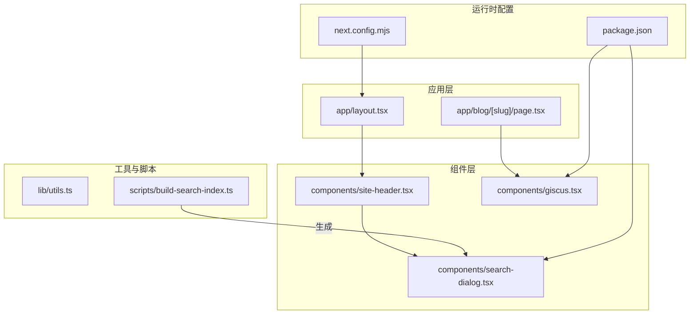
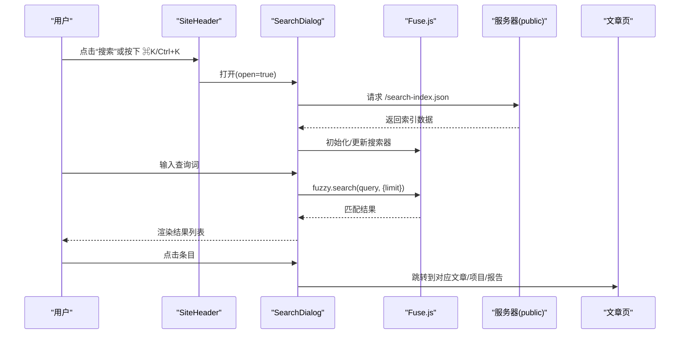
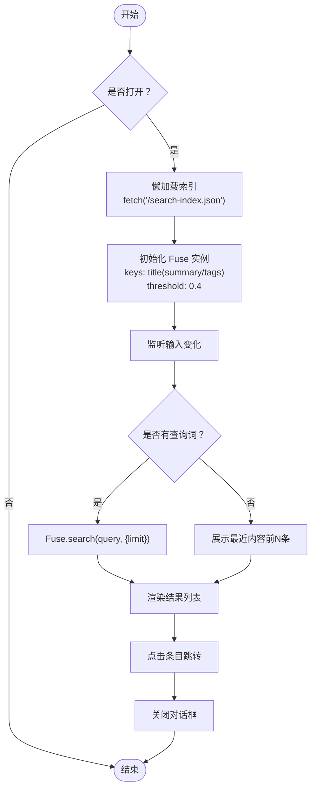
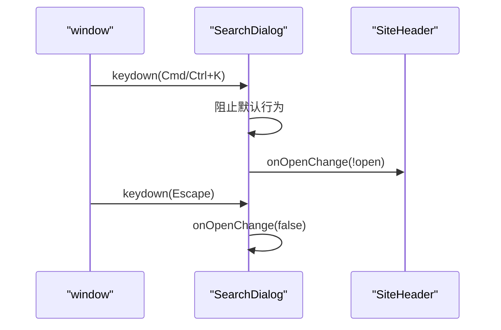
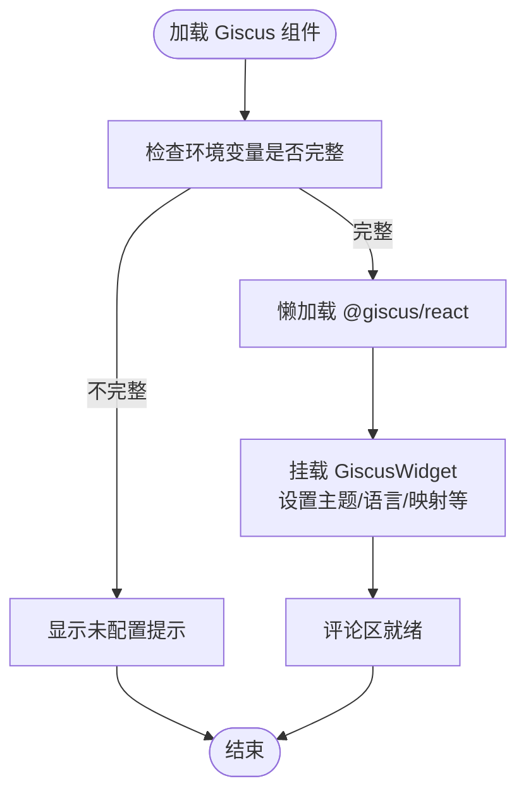
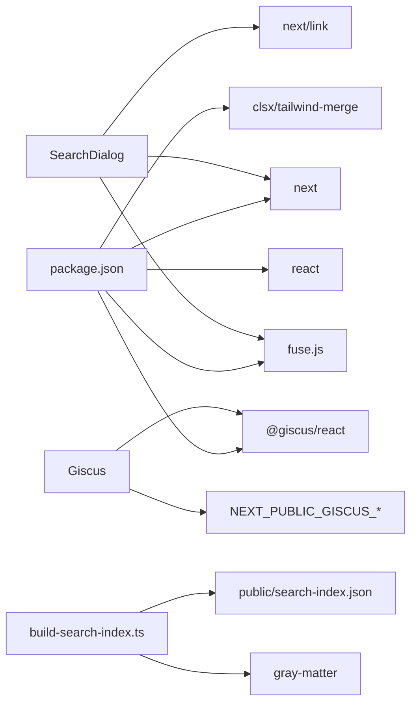

# 交互组件

<cite>
**本文引用的文件**
- [components/search-dialog.tsx](file://components/search-dialog.tsx)
- [components/giscus.tsx](file://components/giscus.tsx)
- [components/site-header.tsx](file://components/site-header.tsx)
- [scripts/build-search-index.ts](file://scripts/build-search-index.ts)
- [lib/utils.ts](file://lib/utils.ts)
- [app/blog/[slug]/page.tsx](file://app/blog/[slug]/page.tsx)
- [app/layout.tsx](file://app/layout.tsx)
- [package.json](file://package.json)
- [next.config.mjs](file://next.config.mjs)
</cite>

## 目录
1. [简介](#简介)
2. [项目结构](#项目结构)
3. [核心组件](#核心组件)
4. [架构总览](#架构总览)
5. [详细组件分析](#详细组件分析)
6. [依赖关系分析](#依赖关系分析)
7. [性能考虑](#性能考虑)
8. [故障排查指南](#故障排查指南)
9. [结论](#结论)
10. [附录](#附录)

## 简介
本文件聚焦于交互式组件的实现与使用，重点覆盖：
- SearchDialog 搜索对话框：包括模糊搜索算法、快捷键绑定、搜索结果展示与键盘导航支持
- Giscus 评论系统：GitHub Discussions 集成、评论加载机制与用户体验优化
- 组件状态管理、异步数据处理与错误处理策略
- 组件配置参数、事件回调与可扩展点
- 性能优化技巧与最佳实践

## 项目结构
该项目采用 Next.js 应用结构，交互组件主要位于 components 目录，内容索引构建脚本位于 scripts 目录，页面级组件在 app 目录下。整体布局由根布局统一注入头部与页脚，并在页面中按需挂载交互组件。

图表来源
- [app/layout.tsx:1-57](file://app/layout.tsx#L1-L57)
- [components/site-header.tsx:1-103](file://components/site-header.tsx#L1-L103)
- [components/search-dialog.tsx:1-156](file://components/search-dialog.tsx#L1-L156)
- [components/giscus.tsx:1-37](file://components/giscus.tsx#L1-L37)
- [scripts/build-search-index.ts:1-95](file://scripts/build-search-index.ts#L1-L95)
- [package.json:1-48](file://package.json#L1-L48)
- [next.config.mjs:1-19](file://next.config.mjs#L1-L19)

章节来源
- [app/layout.tsx:1-57](file://app/layout.tsx#L1-L57)
- [components/site-header.tsx:1-103](file://components/site-header.tsx#L1-L103)
- [components/search-dialog.tsx:1-156](file://components/search-dialog.tsx#L1-L156)
- [components/giscus.tsx:1-37](file://components/giscus.tsx#L1-L37)
- [scripts/build-search-index.ts:1-95](file://scripts/build-search-index.ts#L1-L95)
- [package.json:1-48](file://package.json#L1-L48)
- [next.config.mjs:1-19](file://next.config.mjs#L1-L19)

## 核心组件
- SearchDialog：提供全局快捷键触发、延迟加载搜索索引、基于 Fuse.js 的模糊搜索、结果列表渲染与跳转
- Giscus：封装 @giscus/react，读取环境变量进行配置校验，提供懒加载与主题设置
- SiteHeader：承载 SearchDialog 并提供触发入口（按钮与快捷键提示）
- build-search-index：构建静态搜索索引，写入 public/search-index.json
- utils：通用工具函数（类名合并、日期格式化、阅读时长估算）

章节来源
- [components/search-dialog.tsx:1-156](file://components/search-dialog.tsx#L1-L156)
- [components/giscus.tsx:1-37](file://components/giscus.tsx#L1-L37)
- [components/site-header.tsx:1-103](file://components/site-header.tsx#L1-L103)
- [scripts/build-search-index.ts:1-95](file://scripts/build-search-index.ts#L1-L95)
- [lib/utils.ts:1-24](file://lib/utils.ts#L1-L24)

## 架构总览
SearchDialog 通过懒加载从 public/search-index.json 获取索引数据；当用户输入查询词时，使用 Fuse.js 进行模糊匹配并限制返回数量；Giscus 在文章详情页按需加载评论区，使用环境变量进行配置校验与主题设置。

图表来源
- [components/site-header.tsx:72-99](file://components/site-header.tsx#L72-L99)
- [components/search-dialog.tsx:33-82](file://components/search-dialog.tsx#L33-L82)
- [app/blog/[slug]/page.tsx:94](file://app/blog/[slug]/page.tsx#L94)

## 详细组件分析

### SearchDialog 搜索对话框
- 功能要点
  - 全局快捷键：支持 macOS 的 Cmd+K 与 Windows/Linux 的 Ctrl+K 打开/关闭
  - ESC 键关闭对话框
  - 懒加载：首次打开时才请求 /search-index.json，避免首屏负担
  - 模糊搜索：基于 Fuse.js，权重分配为标题(0.5)、摘要(0.3)、标签(0.2)，阈值 0.4
  - 结果展示：空查询时显示最近内容的前若干条，有查询词时限制返回数量
  - 导航：点击条目后自动关闭对话框并跳转至对应路径

- 数据模型与映射
  - 搜索条目包含字段：标题、摘要、标签数组、分类、slug、日期、类型（post/project/report）
  - 类型到路径映射用于跳转

- 状态与生命周期
  - open/onOpenChange：控制对话框显隐
  - query：当前输入的查询词
  - entries：已加载的搜索索引
  - 使用 useMemo 缓存 Fuse 实例与结果，减少重复计算

- 错误处理
  - 拉取索引失败时回退为空数组，保证 UI 不崩溃
  - 无索引或无匹配时显示友好文案

- 可扩展点
  - 可增加键盘导航（上下选择、Enter 跳转）以提升可访问性
  - 可增加分页或“查看更多”以支持更多结果
  - 可增加搜索历史或热门关键词推荐

章节来源
- [components/search-dialog.tsx:1-156](file://components/search-dialog.tsx#L1-L156)
- [scripts/build-search-index.ts:29-88](file://scripts/build-search-index.ts#L29-L88)

#### 模糊搜索流程图

图表来源
- [components/search-dialog.tsx:33-82](file://components/search-dialog.tsx#L33-L82)

#### 快捷键绑定序列图

图表来源
- [components/search-dialog.tsx:42-55](file://components/search-dialog.tsx#L42-L55)
- [components/site-header.tsx:72-99](file://components/site-header.tsx#L72-L99)

### Giscus 评论系统
- 集成方式
  - 通过 @giscus/react 组件包装
  - 从环境变量读取仓库、分类等配置，若未配置则提示未启用
  - 支持懒加载、主题 dark_dimmed、语言 zh-CN、输入位置置顶等参数

- 配置要求
  - NEXT_PUBLIC_GISCUS_REPO、NEXT_PUBLIC_GISCUS_REPO_ID、NEXT_PUBLIC_GISCUS_CATEGORY、NEXT_PUBLIC_GISCUS_CATEGORY_ID
  - 在 GitHub Discussions 中完成相应配置后方可正常加载

- 用户体验优化
  - 未配置时显示占位提示，避免空白区域
  - 懒加载减少首屏资源占用
  - 主题与语言适配站点风格

章节来源
- [components/giscus.tsx:1-37](file://components/giscus.tsx#L1-L37)

#### Giscus 加载流程图

图表来源
- [components/giscus.tsx:10-36](file://components/giscus.tsx#L10-L36)

### SiteHeader 与 SearchDialog 协作
- SiteHeader 提供搜索入口按钮与快捷键提示，并维护 open 状态
- 将 open 与 onOpenChange 传递给 SearchDialog 控制其显隐
- 通过 requestAnimationFrame 确保打开时焦点落在输入框

章节来源
- [components/site-header.tsx:19-103](file://components/site-header.tsx#L19-L103)
- [components/search-dialog.tsx:57-63](file://components/search-dialog.tsx#L57-L63)

### 文章页集成 Giscus
- 在文章详情页末尾渲染 Giscus，实现每篇文章独立的评论讨论区
- 基于 pathname 映射，确保评论与页面一一对应

章节来源
- [app/blog/[slug]/page.tsx:94](file://app/blog/[slug]/page.tsx#L94)

## 依赖关系分析
- 运行时依赖
  - @giscus/react：评论系统
  - fuse.js：模糊搜索
  - gray-matter：解析 MD/MDX 头部元数据
  - next、react、next-mdx-remote：SSR/MDX 渲染
  - tailwind-merge、clsx：类名合并
- 构建脚本
  - build-search-index.ts 读取 content 下的 posts/projects/reports，生成 public/search-index.json
- Next.js 配置
  - 输出模式为 export，图片未优化，严格模式开启

图表来源
- [components/search-dialog.tsx:3-5](file://components/search-dialog.tsx#L3-L5)
- [components/giscus.tsx:3](file://components/giscus.tsx#L3)
- [scripts/build-search-index.ts:3](file://scripts/build-search-index.ts#L3)
- [package.json:14-33](file://package.json#L14-L33)

章节来源
- [package.json:14-33](file://package.json#L14-L33)
- [scripts/build-search-index.ts:1-95](file://scripts/build-search-index.ts#L1-L95)
- [next.config.mjs:7-16](file://next.config.mjs#L7-L16)

## 性能考虑
- 搜索性能
  - 懒加载索引：仅在首次打开对话框时请求，降低首屏负载
  - 使用 useMemo 缓存 Fuse 实例与结果，避免重复初始化与计算
  - 限制返回数量（limit），控制 DOM 渲染规模
- 评论加载
  - Giscus 使用 lazy 加载，减少首屏资源消耗
- 构建阶段优化
  - build-search-index 在开发/构建前执行，确保静态索引可用
- UI/UX
  - 打开时焦点管理，提升键盘可达性
  - ESC 关闭，Cmd/Ctrl+K 快速唤起，符合用户预期

章节来源
- [components/search-dialog.tsx:33-40](file://components/search-dialog.tsx#L33-L40)
- [components/search-dialog.tsx:65-82](file://components/search-dialog.tsx#L65-L82)
- [components/giscus.tsx:31-34](file://components/giscus.tsx#L31-L34)
- [package.json:6-12](file://package.json#L6-L12)

## 故障排查指南
- 搜索无结果或空白
  - 确认 public/search-index.json 是否存在且非空
  - 检查 build-search-index 是否在开发/构建前成功执行
  - 若网络异常导致拉取失败，组件会回退为空数组，需检查网络与服务端响应
- 快捷键无效
  - 确认浏览器支持 keydown 监听
  - 确认对话框处于打开状态时才生效
- Giscus 未显示
  - 检查 .env.local 是否正确设置 NEXT_PUBLIC_GISCUS_* 环境变量
  - 确认 GitHub Discussions 已启用并配置了对应仓库与分类
- 页面样式异常
  - 检查 next.config.mjs 的输出模式与图片配置是否符合预期

章节来源
- [components/search-dialog.tsx:36-40](file://components/search-dialog.tsx#L36-L40)
- [components/giscus.tsx:10-19](file://components/giscus.tsx#L10-L19)
- [next.config.mjs:7-16](file://next.config.mjs#L7-L16)

## 结论
本项目通过 SearchDialog 与 Giscus 两个核心交互组件，提供了高效的全文检索与评论互动能力。SearchDialog 采用 Fuse.js 实现高可用的模糊搜索，并通过懒加载与缓存优化性能；Giscus 则以环境变量驱动的方式实现灵活的 GitHub Discussions 集成。整体架构清晰、扩展性强，适合进一步增强键盘导航、结果分页与搜索历史等功能。

## 附录

### 组件配置参数与事件回调
- SearchDialog
  - 属性
    - open: boolean，控制对话框显隐
    - onOpenChange: (open: boolean) => void，回调用于切换 open 状态
  - 行为
    - 懒加载索引：首次打开时请求 /search-index.json
    - 快捷键：Cmd/Ctrl+K 切换，ESC 关闭
    - 模糊搜索：基于 Fuse.js，权重与阈值可调
    - 结果限制：空查询展示最近内容，有查询词限制返回数量
- Giscus
  - 属性（来自 @giscus/react）
    - repo、repoId、category、categoryId：GitHub 仓库与分类标识
    - mapping：讨论映射方式（pathname）
    - reactionsEnabled、emitMetadata、inputPosition、theme、lang、loading
  - 环境变量
    - NEXT_PUBLIC_GISCUS_REPO、NEXT_PUBLIC_GISCUS_REPO_ID、NEXT_PUBLIC_GISCUS_CATEGORY、NEXT_PUBLIC_GISCUS_CATEGORY_ID

章节来源
- [components/search-dialog.tsx:23-26](file://components/search-dialog.tsx#L23-L26)
- [components/giscus.tsx:21-34](file://components/giscus.tsx#L21-L34)

### 自定义扩展建议
- 键盘导航
  - 增加上下方向键选择、Enter 跳转、Tab/Shift+Tab 循环焦点
- 搜索增强
  - 增加搜索历史、热门关键词、过滤器（类型/日期）
  - 支持正则或布尔表达式查询
- 评论优化
  - 支持按语言切换、主题切换、加载动画
  - 增加评论数统计与排序选项