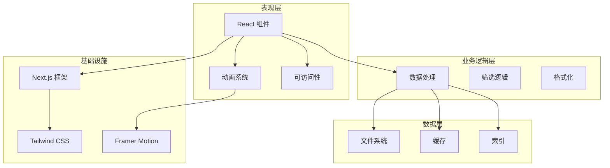
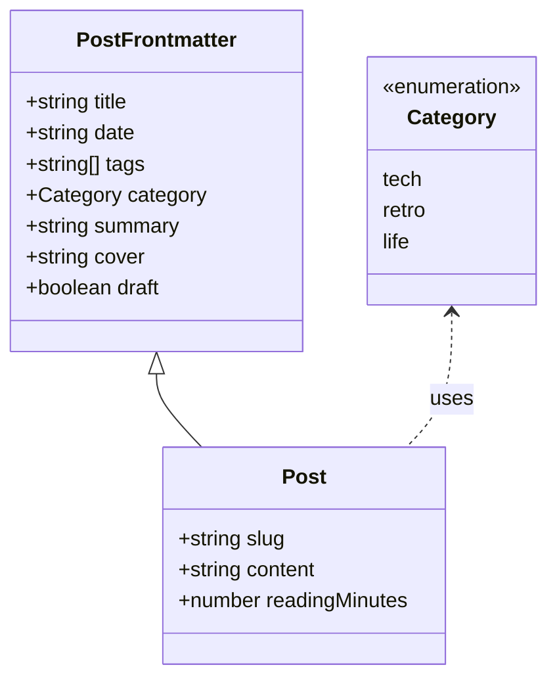
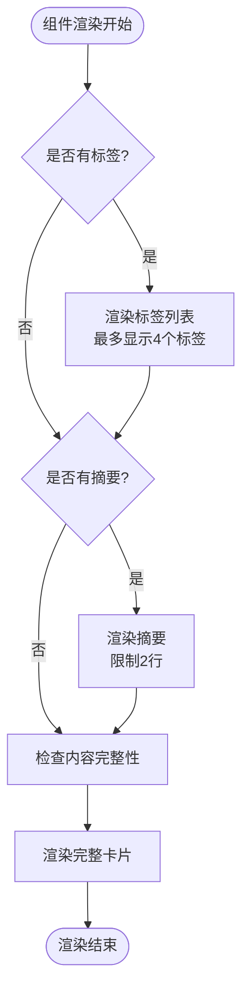
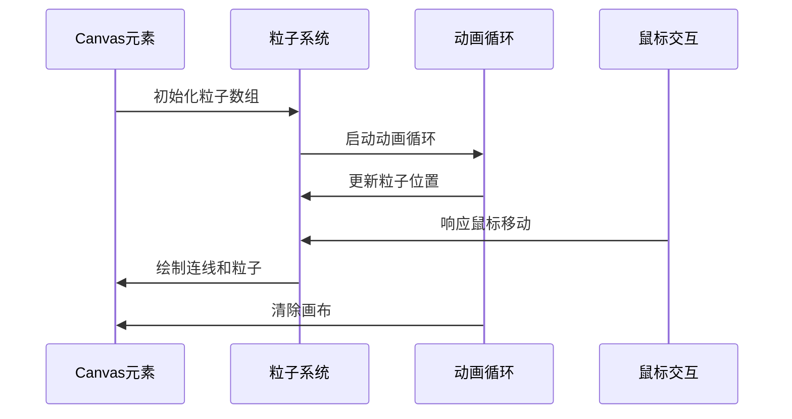
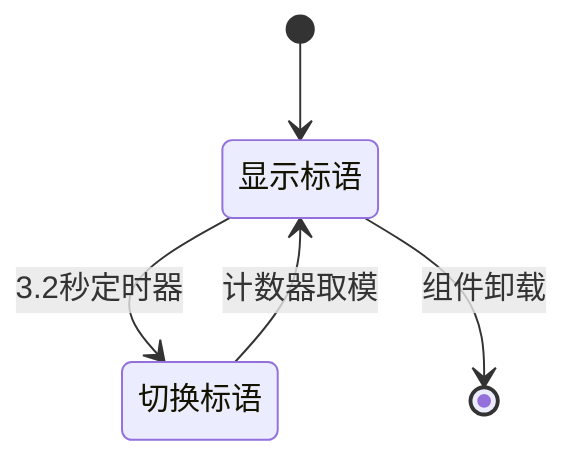
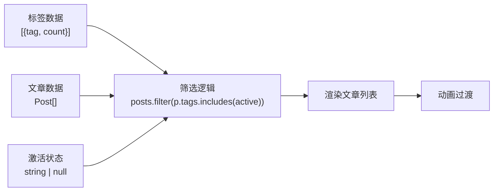
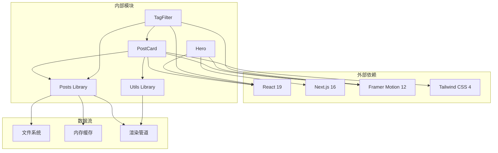

# 内容组件

<cite>
**本文档引用的文件**
- [post-card.tsx](file://components/post-card.tsx)
- [hero.tsx](file://components/hero.tsx)
- [tag-filter.tsx](file://components/tag-filter.tsx)
- [posts.ts](file://lib/posts.ts)
- [utils.ts](file://lib/utils.ts)
- [blog/page.tsx](file://app/blog/page.tsx)
- [tags/[tag]/page.tsx](file://app/tags/[tag]/page.tsx)
- [layout.tsx](file://app/layout.tsx)
- [globals.css](file://app/globals.css)
- [package.json](file://package.json)
</cite>

## 目录
1. [简介](#简介)
2. [项目结构](#项目结构)
3. [核心组件](#核心组件)
4. [架构概览](#架构概览)
5. [详细组件分析](#详细组件分析)
6. [依赖关系分析](#依赖关系分析)
7. [性能考虑](#性能考虑)
8. [故障排除指南](#故障排除指南)
9. [结论](#结论)

## 简介

本项目是一个现代化的个人技术博客网站，专注于内容展示组件的设计与实现。本文档深入分析了三个核心内容展示组件：PostCard 文章卡片组件、Hero 头部组件和 TagFilter 标签筛选组件。这些组件共同构成了网站的内容展示体系，提供了丰富的交互体验和良好的可访问性支持。

系统采用 Next.js 16 框架构建，使用 Tailwind CSS 进行样式设计，结合 Framer Motion 实现流畅的动画效果。组件设计遵循响应式原则，支持移动端和桌面端的优雅降级。

## 项目结构

项目采用模块化组织方式，主要目录结构如下：

```mermaid
graph TB
subgraph "应用层"
APP[app/]
LAYOUT[layout.tsx]
BLOG[blog/page.tsx]
TAGS[tags/[tag]/page.tsx]
end
subgraph "组件层"
COMPONENTS[components/]
POSTCARD[post-card.tsx]
HERO[hero.tsx]
TAGFILTER[tag-filter.tsx]
end
subgraph "库层"
LIB[lib/]
POSTS[posts.ts]
UTILS[utils.ts]
end
subgraph "内容层"
CONTENT[content/]
POSTS_CONTENT[posts/]
end
subgraph "样式层"
CSS[globals.css]
end
APP --> COMPONENTS
COMPONENTS --> LIB
LIB --> POSTS_CONTENT
APP --> CSS
```

**图表来源**
- [layout.tsx:46-56](file://app/layout.tsx#L46-L56)
- [blog/page.tsx:11-27](file://app/blog/page.tsx#L11-L27)
- [globals.css:1-278](file://app/globals.css#L1-L278)

**章节来源**
- [layout.tsx:1-57](file://app/layout.tsx#L1-L57)
- [package.json:1-48](file://package.json#L1-L48)

## 核心组件

### PostCard 组件

PostCard 是文章卡片的核心展示组件，负责单篇文章的视觉呈现。该组件实现了完整的卡片布局，包括标题、摘要、标签和时间信息的展示。

### Hero 组件

Hero 组件作为页面的头部区域，提供了动态粒子效果和旋转标语展示功能。组件包含在线状态指示器、个人介绍、动态标语和导航按钮等元素。

### TagFilter 组件

TagFilter 组件实现了标签筛选功能，允许用户根据标签对文章进行分类浏览。组件支持标签高亮显示、筛选状态管理和动画过渡效果。

**章节来源**
- [post-card.tsx:20-81](file://components/post-card.tsx#L20-L81)
- [hero.tsx:14-227](file://components/hero.tsx#L14-L227)
- [tag-filter.tsx:14-77](file://components/tag-filter.tsx#L14-L77)

## 架构概览

系统采用分层架构设计，各层职责明确：



**图表来源**
- [post-card.tsx:1-81](file://components/post-card.tsx#L1-L81)
- [hero.tsx:1-227](file://components/hero.tsx#L1-L227)
- [tag-filter.tsx:1-77](file://components/tag-filter.tsx#L1-L77)

## 详细组件分析

### PostCard 组件深度分析

PostCard 组件是内容展示的核心，实现了以下关键功能：

#### 数据结构与类型定义

组件使用统一的 Post 接口定义，确保类型安全：



**图表来源**
- [posts.ts:8-22](file://lib/posts.ts#L8-L22)

#### 渲染逻辑分析

组件采用条件渲染策略，根据数据完整性决定内容展示：



**图表来源**
- [post-card.tsx:60-76](file://components/post-card.tsx#L60-L76)

#### 交互功能实现

组件集成了多种交互效果：

1. **鼠标跟随光晕效果**：使用 Framer Motion 的 useMotionValue 和 useMotionTemplate
2. **悬停动画**：卡片轻微上移的弹性动画
3. **动态色彩系统**：基于 CSS 变量的主题色

**章节来源**
- [post-card.tsx:20-81](file://components/post-card.tsx#L20-L81)
- [posts.ts:18-22](file://lib/posts.ts#L18-L22)

### Hero 组件详细分析

Hero 组件是页面的视觉焦点，实现了复杂的动画效果：

#### 动态粒子系统

组件内置了完整的粒子网络系统：



**图表来源**
- [hero.tsx:24-133](file://components/hero.tsx#L24-L133)

#### 标语轮播机制

组件实现了自动轮播的标语展示：



**图表来源**
- [hero.tsx:18-22](file://components/hero.tsx#L18-L22)

#### 响应式设计实现

Hero 组件支持多尺寸屏幕的自适应：

- 移动端：内边距 6px，标题 4xl
- 桌面端：内边距 12px，标题 6xl
- 最大宽度：5xl 容器

**章节来源**
- [hero.tsx:14-227](file://components/hero.tsx#L14-L227)

### TagFilter 组件深入解析

TagFilter 组件实现了完整的标签筛选功能：

#### 状态管理模式

组件使用 React 的 useState 和 useMemo 实现高效的状态管理：



**图表来源**
- [tag-filter.tsx:17-20](file://components/tag-filter.tsx#L17-L20)

#### 用户界面设计

组件实现了直观的标签筛选界面：

1. **全部按钮**：默认选中状态，显示总文章数量
2. **标签按钮**：每个标签显示标签名和出现次数
3. **高亮效果**：当前选中的标签使用强调色
4. **网格布局**：响应式网格显示文章卡片

**章节来源**
- [tag-filter.tsx:14-77](file://components/tag-filter.tsx#L14-L77)

## 依赖关系分析

组件间的依赖关系体现了清晰的分层架构：



**图表来源**
- [package.json:14-33](file://package.json#L14-L33)
- [post-card.tsx:3-6](file://components/post-card.tsx#L3-L6)

**章节来源**
- [package.json:1-48](file://package.json#L1-L48)

## 性能考虑

### 渲染性能优化

1. **虚拟滚动**：对于大量文章的场景，可以考虑实现虚拟滚动
2. **懒加载**：图片资源的懒加载实现
3. **代码分割**：按需加载大型组件
4. **缓存策略**：利用 Next.js 的静态生成和增量静态再生

### 动画性能

组件使用了高效的动画实现：
- 使用 transform 替代布局重排
- requestAnimationFrame 优化动画帧率
- GPU 加速的 CSS 属性

### 数据处理优化

1. **Memoization**：使用 useMemo 避免不必要的重新计算
2. **批量更新**：React 19 的并发特性利用
3. **增量更新**：只更新变化的数据部分

## 故障排除指南

### 常见问题及解决方案

#### 文章数据加载失败

**问题症状**：页面显示空白或错误信息
**可能原因**：
- 内容文件缺失或格式不正确
- Frontmatter 字段缺失
- 文件权限问题

**解决步骤**：
1. 检查 `content/posts/` 目录下的文件格式
2. 验证 MDX 文件的 Frontmatter 结构
3. 确认文件编码为 UTF-8

#### 标签筛选功能异常

**问题症状**：标签按钮点击无反应
**可能原因**：
- 标签数据格式不正确
- 状态管理逻辑错误
- CSS 样式冲突

**解决步骤**：
1. 检查标签数据的结构 `{tag: string, count: number}`
2. 验证筛选逻辑的正确性
3. 确认按钮的点击事件绑定

#### 动画性能问题

**问题症状**：动画卡顿或延迟
**可能原因**：
- 动画帧率过低
- DOM 操作过多
- 设备性能不足

**解决步骤**：
1. 检查 requestAnimationFrame 的使用
2. 减少不必要的 DOM 操作
3. 考虑降级到更简单的动画效果

**章节来源**
- [posts.ts:33-58](file://lib/posts.ts#L33-L58)
- [tag-filter.tsx:17-20](file://components/tag-filter.tsx#L17-L20)

## 结论

本项目的内容展示组件展现了现代前端开发的最佳实践。通过精心设计的组件架构、完善的类型系统和优秀的用户体验，成功构建了一个功能丰富且性能优异的内容展示平台。

### 主要成就

1. **组件化设计**：清晰的职责分离和可复用的组件结构
2. **性能优化**：高效的渲染策略和动画实现
3. **用户体验**：流畅的交互效果和响应式设计
4. **可维护性**：完善的类型定义和错误处理机制

### 技术亮点

- 使用 TypeScript 确保类型安全
- 结合 Framer Motion 实现专业级动画
- 采用 Tailwind CSS 实现快速样式开发
- 利用 Next.js 的静态生成能力提升性能

### 改进建议

1. **可访问性增强**：添加更多键盘导航支持
2. **SEO 优化**：完善结构化数据和元标签
3. **国际化支持**：扩展多语言内容管理
4. **性能监控**：集成性能指标收集和分析