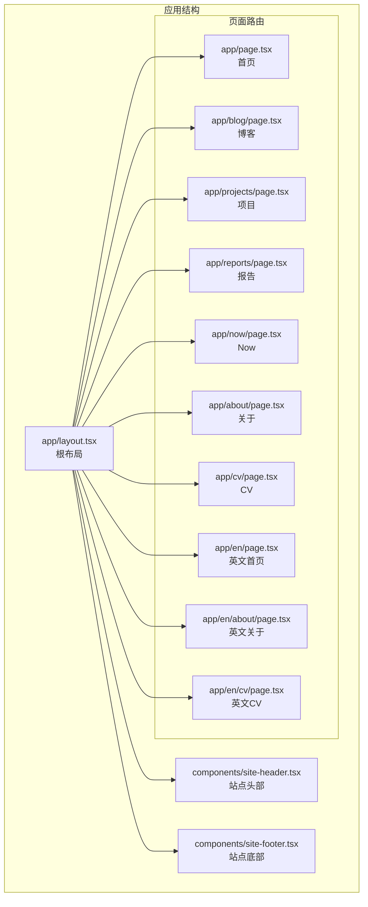
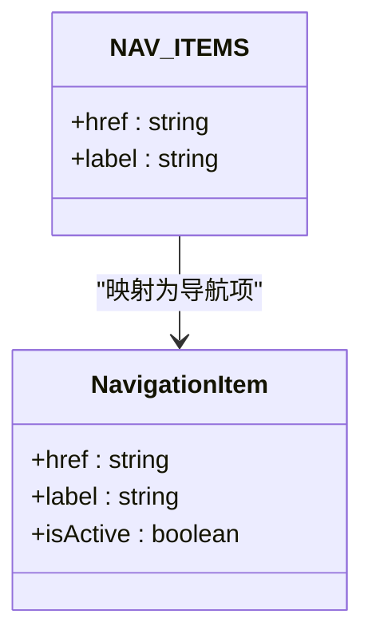
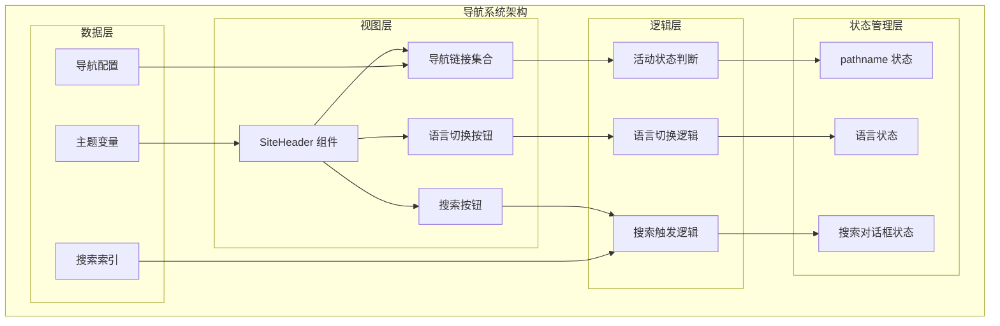
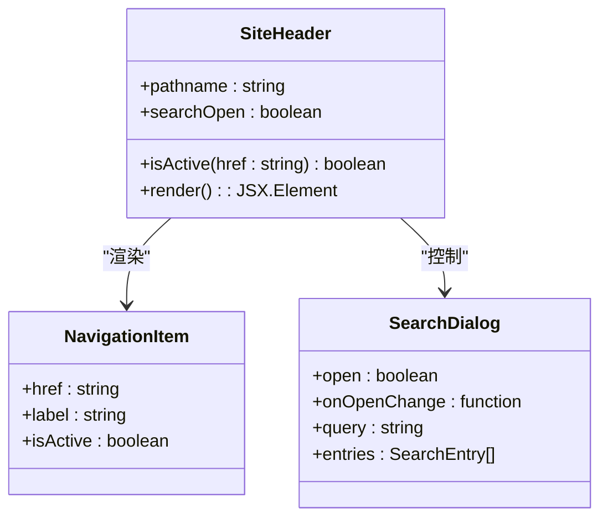
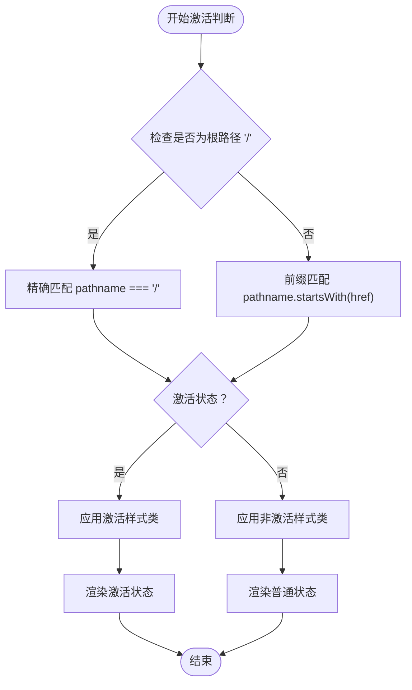
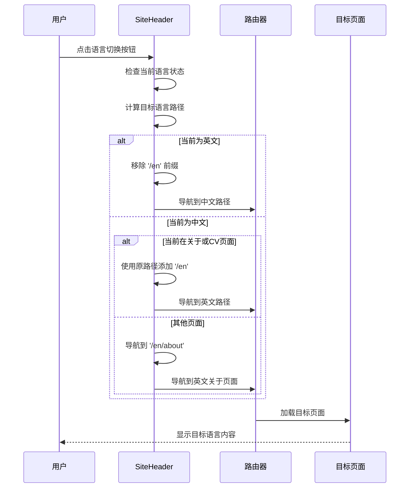
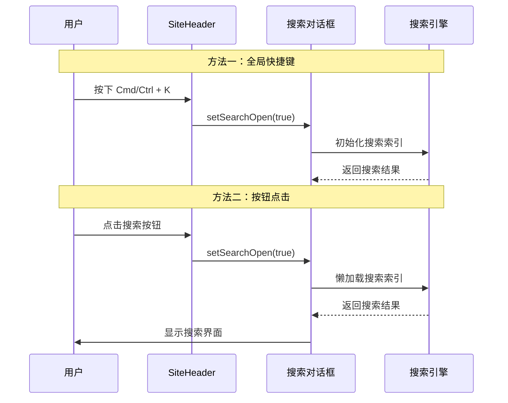
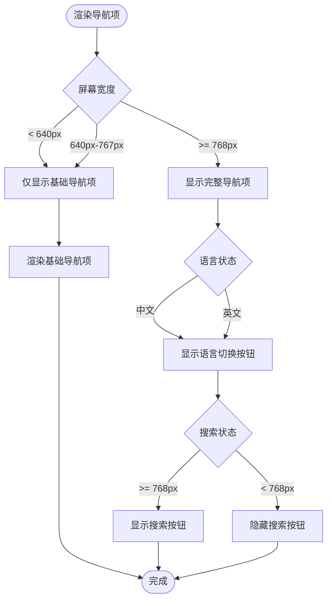
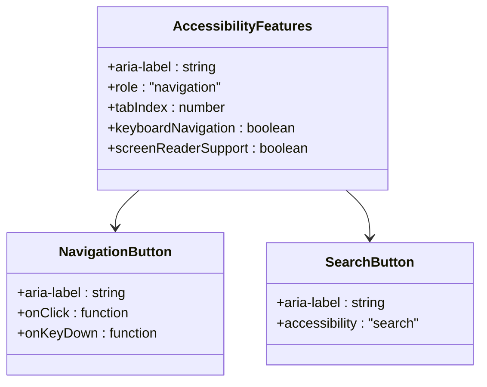
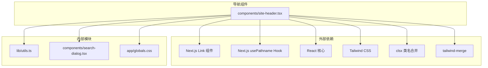

# 导航组件

<cite>
**本文档引用的文件**
- [site-header.tsx](file://components/site-header.tsx)
- [layout.tsx](file://app/layout.tsx)
- [globals.css](file://app/globals.css)
- [utils.ts](file://lib/utils.ts)
- [search-dialog.tsx](file://components/search-dialog.tsx)
- [site-footer.tsx](file://components/site-footer.tsx)
- [page.tsx](file://app/page.tsx)
- [en-about/page.tsx](file://app/en/about/page.tsx)
- [package.json](file://package.json)
</cite>

## 目录
1. [简介](#简介)
2. [项目结构](#项目结构)
3. [核心组件](#核心组件)
4. [架构概览](#架构概览)
5. [详细组件分析](#详细组件分析)
6. [依赖关系分析](#依赖关系分析)
7. [性能考虑](#性能考虑)
8. [故障排除指南](#故障排除指南)
9. [结论](#结论)

## 简介

本项目中的导航组件是一个现代化的响应式导航系统，主要由 `SiteHeader` 组件实现。该组件提供了完整的导航功能，包括导航项配置、活动状态管理、语言切换功能和搜索触发机制。组件采用 Next.js 13+ 的 App Router 架构，充分利用了客户端组件的优势，实现了流畅的用户体验。

导航组件的核心特性包括：
- 动态导航项配置和激活状态判断
- 国际化路由处理（中英文切换）
- 响应式设计实现
- 无障碍访问支持
- 键盘导航支持
- 搜索功能集成

## 项目结构

该项目采用 Next.js App Router 结构，导航组件位于 `components/site-header.tsx`，并通过 `app/layout.tsx` 在整个应用中统一使用。

**图表来源**
- [layout.tsx:46-56](file://app/layout.tsx#L46-L56)
- [site-header.tsx:35-98](file://components/site-header.tsx#L35-L98)

**章节来源**
- [layout.tsx:1-57](file://app/layout.tsx#L1-L57)
- [site-header.tsx:1-103](file://components/site-header.tsx#L1-L103)

## 核心组件

### SiteHeader 组件概述

`SiteHeader` 是导航系统的核心组件，负责渲染整个导航栏并管理所有导航相关的状态和逻辑。

#### 主要功能特性

1. **导航项配置**：通过常量数组 `NAV_ITEMS` 定义所有导航链接
2. **活动状态管理**：使用 `usePathname` 实现精确的导航激活判断
3. **语言切换**：智能的语言环境切换逻辑
4. **搜索集成**：集成全局搜索对话框
5. **响应式设计**：基于断点的移动端适配

#### 导航项配置

**图表来源**
- [site-header.tsx:9-17](file://components/site-header.tsx#L9-L17)

**章节来源**
- [site-header.tsx:9-17](file://components/site-header.tsx#L9-L17)

## 架构概览

导航组件采用分层架构设计，确保了良好的可维护性和扩展性。

**图表来源**
- [site-header.tsx:19-102](file://components/site-header.tsx#L19-L102)
- [search-dialog.tsx:28-155](file://components/search-dialog.tsx#L28-L155)

## 详细组件分析

### SiteHeader 组件深度解析

#### 组件结构

**图表来源**
- [site-header.tsx:19-102](file://components/site-header.tsx#L19-L102)

#### 导航激活判断逻辑

导航激活判断是组件的核心功能之一，采用了精确的路径匹配算法：

**图表来源**
- [site-header.tsx:23-24](file://components/site-header.tsx#L23-L24)

#### 语言切换功能实现

语言切换功能提供了智能的中英文切换逻辑：

**图表来源**
- [site-header.tsx:26-31](file://components/site-header.tsx#L26-L31)

#### 搜索触发机制

搜索功能通过全局快捷键和按钮点击两种方式触发：

**图表来源**
- [site-header.tsx:72-76](file://components/site-header.tsx#L72-L76)
- [search-dialog.tsx:42-55](file://components/search-dialog.tsx#L42-L55)

**章节来源**
- [site-header.tsx:19-102](file://components/site-header.tsx#L19-L102)
- [search-dialog.tsx:28-155](file://components/search-dialog.tsx#L28-L155)

### 响应式设计实现

导航组件采用了多层次的响应式设计策略：

#### 断点策略

| 断点 | 最小宽度 | 显示元素 |
|------|----------|----------|
| 默认 | 0px | 基础导航项 |
| sm | 640px | 语言切换按钮 |
| md | 768px | 搜索按钮 |

#### 响应式导航项渲染

**图表来源**
- [site-header.tsx:47-96](file://components/site-header.tsx#L47-L96)

**章节来源**
- [site-header.tsx:35-98](file://components/site-header.tsx#L35-L98)

### 无障碍访问支持

导航组件充分考虑了无障碍访问需求：

#### 键盘导航支持

- **Tab 导航**：支持标准的 Tab 键导航顺序
- **Enter/Space**：支持键盘激活导航项
- **Esc 键**：搜索对话框的关闭快捷键

#### 屏幕阅读器支持

- **aria-label**：为图标按钮提供语义化描述
- **语义化 HTML**：使用正确的 HTML 结构
- **颜色对比度**：确保足够的视觉对比度

#### 无障碍属性配置

**图表来源**
- [site-header.tsx:68-76](file://components/site-header.tsx#L68-L76)

**章节来源**
- [site-header.tsx:68-76](file://components/site-header.tsx#L68-L76)

## 依赖关系分析

导航组件的依赖关系相对简洁，主要依赖于 Next.js 的客户端组件特性和外部库。

**图表来源**
- [site-header.tsx:3-7](file://components/site-header.tsx#L3-L7)
- [utils.ts:1-6](file://lib/utils.ts#L1-L6)
- [package.json:14-33](file://package.json#L14-L33)

**章节来源**
- [site-header.tsx:1-103](file://components/site-header.tsx#L1-L103)
- [utils.ts:1-24](file://lib/utils.ts#L1-L24)
- [package.json:1-48](file://package.json#L1-L48)

## 性能考虑

### 渲染优化

1. **懒加载搜索索引**：搜索功能仅在首次打开时加载索引数据
2. **条件渲染**：根据屏幕尺寸动态显示/隐藏元素
3. **记忆化计算**：使用 `useMemo` 优化搜索结果计算

### 内存管理

1. **事件监听器清理**：键盘事件监听器在组件卸载时自动清理
2. **状态最小化**：仅维护必要的状态信息
3. **无副作用渲染**：避免在渲染过程中产生副作用

### 性能监控建议

- 监控导航项的重渲染频率
- 观察搜索索引加载的性能影响
- 检查响应式断点的触发频率

## 故障排除指南

### 常见问题及解决方案

#### 导航激活状态不正确

**问题症状**：导航项在某些路径下无法正确高亮

**可能原因**：
1. 路径匹配逻辑错误
2. 动态路由参数导致的路径变化
3. 国际化路由前缀干扰

**解决方法**：
1. 检查 `isActive` 函数的实现逻辑
2. 验证路由配置是否正确
3. 确认国际化前缀处理逻辑

#### 搜索功能异常

**问题症状**：搜索对话框无法打开或搜索结果为空

**可能原因**：
1. 搜索索引文件未生成
2. 网络请求失败
3. 浏览器兼容性问题

**解决方法**：
1. 确认构建脚本已执行
2. 检查 `/search-index.json` 文件是否存在
3. 测试不同浏览器的兼容性

#### 语言切换失效

**问题症状**：语言切换按钮点击无效

**可能原因**：
1. 路由配置不完整
2. 页面缺失对应的国际化版本
3. 路径计算逻辑错误

**解决方法**：
1. 检查所有页面的国际化路由配置
2. 验证语言切换逻辑的路径计算
3. 确认目标页面的存在性

**章节来源**
- [site-header.tsx:23-31](file://components/site-header.tsx#L23-L31)
- [search-dialog.tsx:33-40](file://components/search-dialog.tsx#L33-L40)

## 结论

导航组件展现了现代前端开发的最佳实践，通过精心设计的架构和实现细节，提供了优秀的用户体验。组件的主要优势包括：

1. **模块化设计**：清晰的职责分离和组件边界
2. **响应式实现**：完善的移动端适配策略
3. **国际化支持**：灵活的多语言路由处理
4. **无障碍访问**：全面的可访问性支持
5. **性能优化**：合理的性能考虑和优化策略

该组件为类似项目提供了优秀的参考模板，展示了如何在 Next.js 生态系统中构建高质量的导航系统。通过本文档的详细分析，开发者可以深入理解组件的设计思路和实现细节，并在此基础上进行定制和扩展。