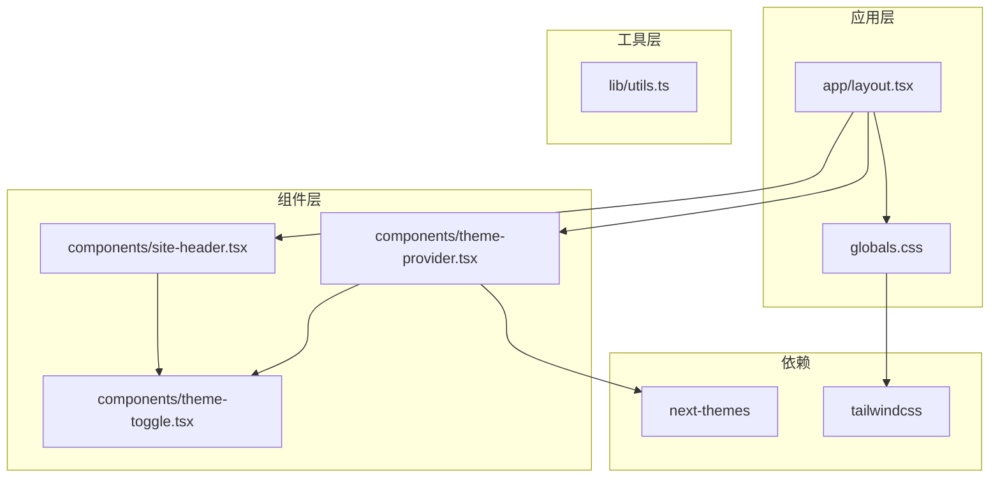
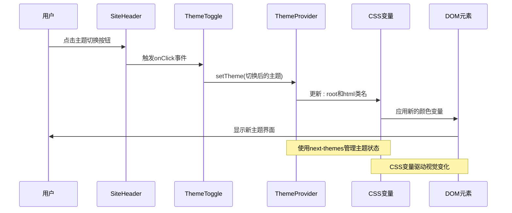
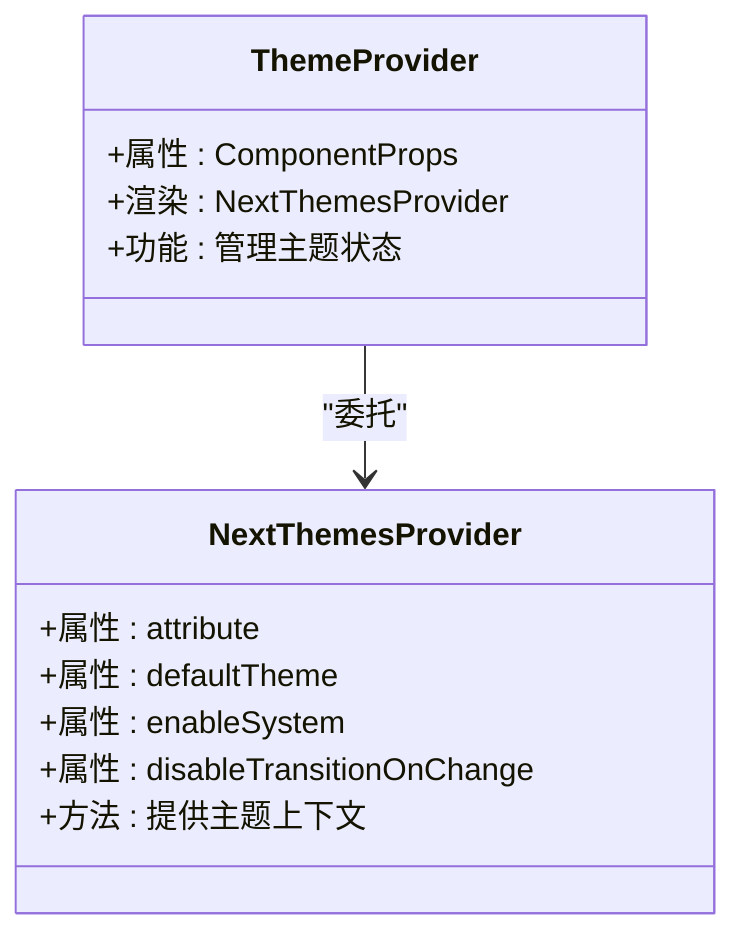
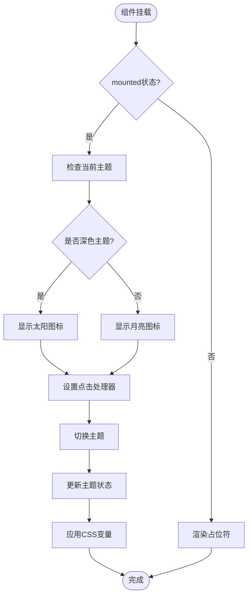
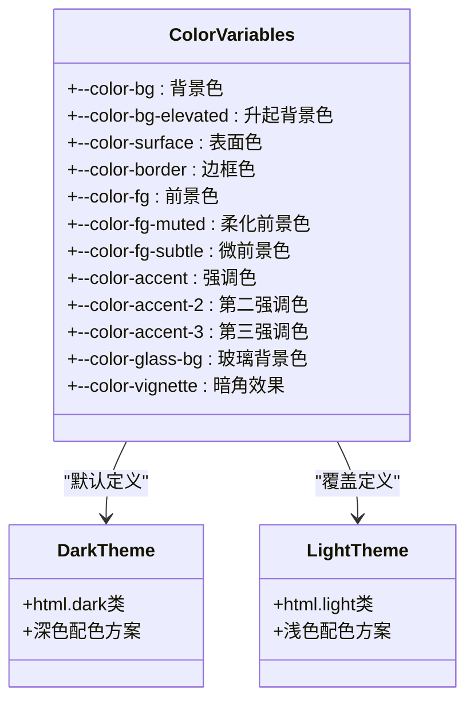

# 主题切换系统

<cite>
**本文档引用的文件**
- [components/theme-provider.tsx](file://components/theme-provider.tsx)
- [components/theme-toggle.tsx](file://components/theme-toggle.tsx)
- [app/layout.tsx](file://app/layout.tsx)
- [app/globals.css](file://app/globals.css)
- [components/site-header.tsx](file://components/site-header.tsx)
- [lib/utils.ts](file://lib/utils.ts)
- [package.json](file://package.json)
- [README.md](file://README.md)
</cite>

## 目录
1. [简介](#简介)
2. [项目结构](#项目结构)
3. [核心组件](#核心组件)
4. [架构概览](#架构概览)
5. [详细组件分析](#详细组件分析)
6. [依赖关系分析](#依赖关系分析)
7. [性能考虑](#性能考虑)
8. [故障排除指南](#故障排除指南)
9. [结论](#结论)

## 简介

这是一个基于 Next.js 16 和 React 19 构建的个人网站主题切换系统。该系统实现了完整的深色/浅色主题切换功能，采用现代化的设计理念和最佳实践。系统使用 `next-themes` 库提供主题管理，通过 CSS 变量实现主题切换，并结合 Tailwind CSS 提供响应式设计支持。

该主题切换系统具有以下特点：
- 基于 CSS 变量的主题切换机制
- 支持深色模式和浅色模式两种主题
- 无闪烁的水合处理
- 响应式设计支持
- 无障碍访问优化
- 性能友好的实现方式

## 项目结构

该项目采用 Next.js App Router 结构，主题切换系统主要分布在以下几个关键文件中：



**图表来源**
- [app/layout.tsx:47-64](file://app/layout.tsx#L47-L64)
- [components/theme-provider.tsx:1-9](file://components/theme-provider.tsx#L1-L9)
- [components/theme-toggle.tsx:1-73](file://components/theme-toggle.tsx#L1-L73)

**章节来源**
- [README.md:122-135](file://README.md#L122-L135)
- [package.json:14-34](file://package.json#L14-L34)

## 核心组件

### 主题提供者 (ThemeProvider)

主题提供者是整个主题系统的核心组件，负责管理主题状态和提供主题上下文给子组件。

**章节来源**
- [components/theme-provider.tsx:1-9](file://components/theme-provider.tsx#L1-L9)
- [app/layout.tsx:51-60](file://app/layout.tsx#L51-L60)

### 主题切换器 (ThemeToggle)

主题切换器是一个交互式按钮组件，允许用户在深色和浅色主题之间进行切换。

**章节来源**
- [components/theme-toggle.tsx:1-73](file://components/theme-toggle.tsx#L1-L73)

### 全局样式 (globals.css)

全局样式文件定义了主题相关的 CSS 变量和样式规则，是主题切换的基础。

**章节来源**
- [app/globals.css:1-307](file://app/globals.css#L1-L307)

## 架构概览

主题切换系统采用分层架构设计，确保各组件职责清晰且相互独立：



**图表来源**
- [components/site-header.tsx:73](file://components/site-header.tsx#L73)
- [components/theme-toggle.tsx:24-30](file://components/theme-toggle.tsx#L24-L30)
- [app/layout.tsx:51-60](file://app/layout.tsx#L51-L60)

## 详细组件分析

### ThemeProvider 组件分析

ThemeProvider 是一个轻量级的包装组件，直接委托给 next-themes 的 ThemeProvider：



**图表来源**
- [components/theme-provider.tsx:6-8](file://components/theme-provider.tsx#L6-L8)
- [app/layout.tsx:51-56](file://app/layout.tsx#L51-L56)

**章节来源**
- [components/theme-provider.tsx:1-9](file://components/theme-provider.tsx#L1-L9)
- [app/layout.tsx:51-60](file://app/layout.tsx#L51-L60)

### ThemeToggle 组件分析

ThemeToggle 组件实现了完整的主题切换逻辑，包括水合处理和无障碍支持：



**图表来源**
- [components/theme-toggle.tsx:9-72](file://components/theme-toggle.tsx#L9-L72)

**章节来源**
- [components/theme-toggle.tsx:1-73](file://components/theme-toggle.tsx#L1-L73)

### CSS 变量系统分析

系统使用 CSS 变量实现主题切换，定义了完整的颜色系统：



**图表来源**
- [app/globals.css:8-28](file://app/globals.css#L8-L28)
- [app/globals.css:30-52](file://app/globals.css#L30-L52)

**章节来源**
- [app/globals.css:1-307](file://app/globals.css#L1-L307)

### SiteHeader 集成分析

SiteHeader 组件集成了主题切换器，提供了完整的导航体验：

**章节来源**
- [components/site-header.tsx:1-105](file://components/site-header.tsx#L1-L105)

## 依赖关系分析

主题切换系统依赖于多个关键库和工具：

```mermaid
graph LR
subgraph "运行时依赖"
NextThemes[next-themes ^0.4.6]
Tailwind[tailwindcss ^4.0.0]
React[react ^19.0.0]
Next[Next.js ^16.0.0]
end
subgraph "开发依赖"
PostCSS[postcss ^8.5.0]
TailwindPlugin[@tailwindcss/typography ^0.5.16]
TypeScript[typescript ^5.7.0]
end
subgraph "应用组件"
ThemeProvider[ThemeProvider]
ThemeToggle[ThemeToggle]
SiteHeader[SiteHeader]
end
ThemeProvider --> NextThemes
ThemeToggle --> NextThemes
SiteHeader --> ThemeToggle
ThemeProvider --> Tailwind
ThemeToggle --> Tailwind
SiteHeader --> Tailwind
```

**图表来源**
- [package.json:14-34](file://package.json#L14-L34)
- [package.json:35-46](file://package.json#L35-L46)

**章节来源**
- [package.json:1-48](file://package.json#L1-L48)

## 性能考虑

主题切换系统在设计时充分考虑了性能因素：

### 水合优化
- 使用 mounted 状态避免水合闪烁
- 占位符元素确保布局稳定性
- 禁用过渡动画以提升初始加载性能

### CSS 变量优势
- 零 JavaScript 运行时开销
- 浏览器原生支持的快速切换
- 减少 DOM 操作次数

### 响应式设计
- 移动端优先的交互设计
- 触摸友好的按钮尺寸
- 无障碍访问支持

## 故障排除指南

### 常见问题及解决方案

**问题1：主题切换无效**
- 检查 ThemeProvider 的配置参数
- 确认 CSS 变量正确应用
- 验证浏览器兼容性

**问题2：水合闪烁**
- 确保 mounted 状态正确设置
- 检查占位符元素的使用
- 验证 SSR 和 CSR 的一致性

**问题3：样式不生效**
- 检查 CSS 变量的定义顺序
- 确认 Tailwind 配置正确
- 验证主题类名的应用

**章节来源**
- [components/theme-toggle.tsx:13-19](file://components/theme-toggle.tsx#L13-L19)
- [app/layout.tsx:51-56](file://app/layout.tsx#L51-L56)

## 结论

该主题切换系统展现了现代前端开发的最佳实践：

### 设计优势
- **简洁性**：最小化的代码实现复杂功能
- **可维护性**：清晰的组件分离和职责划分
- **性能**：基于 CSS 变量的高效切换机制
- **用户体验**：流畅的过渡动画和无障碍支持

### 技术亮点
- 采用 next-themes 库提供的成熟解决方案
- 使用 CSS 变量实现真正的主题切换
- 集成 Tailwind CSS 提供一致的样式系统
- 实现了完整的水合处理策略

### 扩展建议
- 可以添加自定义主题支持
- 考虑添加主题持久化存储
- 可以实现动态主题生成算法
- 考虑添加主题预览功能

该系统为个人网站和其他类似项目提供了一个可靠、高性能的主题切换解决方案，值得在生产环境中使用和参考。