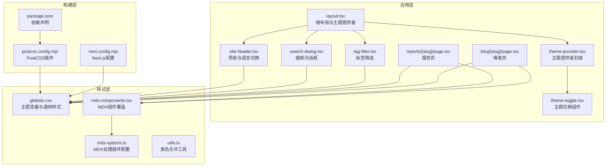
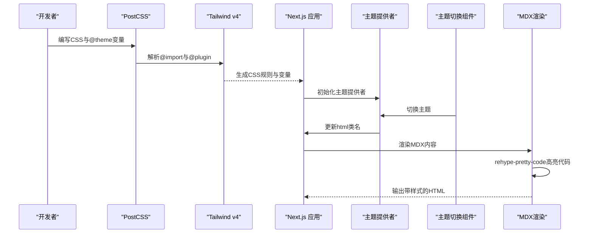
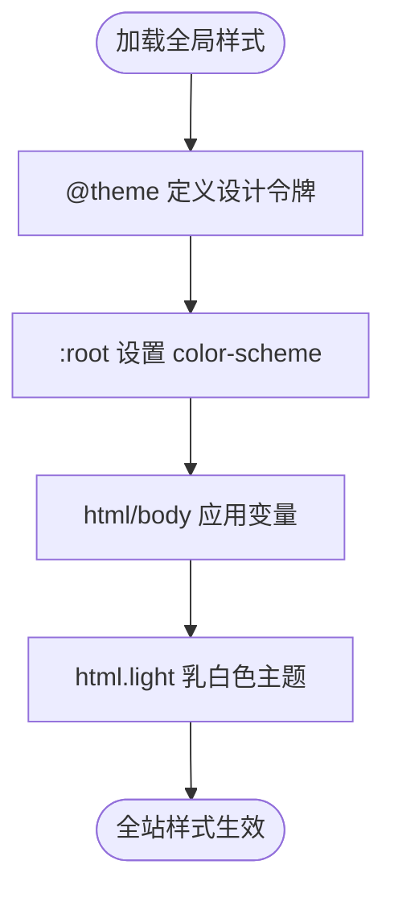
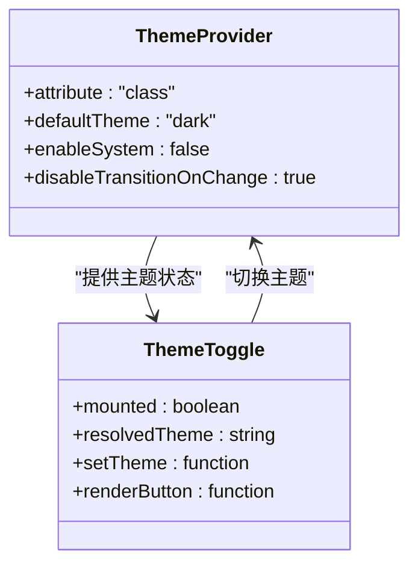
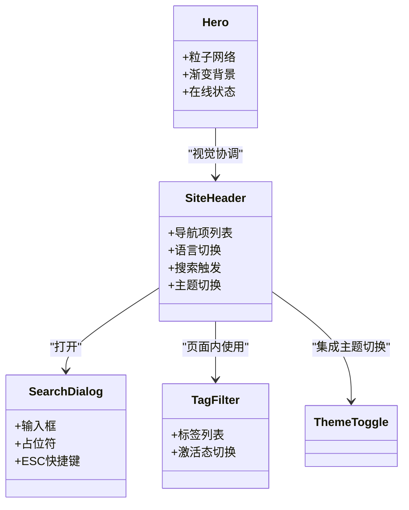
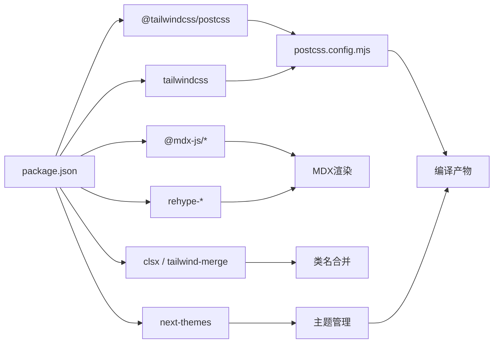

# 样式与主题系统

<cite>
**本文引用的文件**
- [app/globals.css](file://app/globals.css)
- [app/layout.tsx](file://app/layout.tsx)
- [components/theme-provider.tsx](file://components/theme-provider.tsx)
- [components/theme-toggle.tsx](file://components/theme-toggle.tsx)
- [components/site-header.tsx](file://components/site-header.tsx)
- [components/search-dialog.tsx](file://components/search-dialog.tsx)
- [components/tag-filter.tsx](file://components/tag-filter.tsx)
- [components/hero.tsx](file://components/hero.tsx)
- [mdx-components.tsx](file://mdx-components.tsx)
- [lib/mdx-options.ts](file://lib/mdx-options.ts)
- [lib/utils.ts](file://lib/utils.ts)
- [postcss.config.mjs](file://postcss.config.mjs)
- [package.json](file://package.json)
- [next.config.mjs](file://next.config.mjs)
- [app/blog/[slug]/page.tsx](file://app/blog/%5bslug%5d/page.tsx)
- [app/reports/[slug]/page.tsx](file://app/reports/%5bslug%5d/page.tsx)
- [public/reports/e1-045-tools-distribution/index.html](file://public/reports/e1-045-tools-distribution/index.html)
</cite>

## 更新摘要
**所做更改**
- 新增主题切换功能的完整实现文档
- 更新主题系统架构说明，包含 next-themes 集成
- 添加主题切换组件的技术细节和实现原理
- 更新导航栏集成主题切换按钮的说明
- 完善主题变量映射和过渡动画效果的描述
- 增强 MDX 组件在不同主题下的样式表现说明

## 目录
1. [简介](#简介)
2. [项目结构](#项目结构)
3. [核心组件](#核心组件)
4. [架构总览](#架构总览)
5. [详细组件分析](#详细组件分析)
6. [依赖关系分析](#依赖关系分析)
7. [性能考量](#性能考量)
8. [故障排查指南](#故障排查指南)
9. [结论](#结论)
10. [附录](#附录)

## 简介
本项目采用基于 Tailwind CSS v4 的设计系统，结合 PostCSS 插件链路与 MDX 内容渲染，构建统一的样式与主题体系。系统通过 CSS 自定义属性实现主题变量管理，支持深色模式与浅色模式的切换与过渡；在 MDX 内容侧，通过 rehype-pretty-code 提供代码高亮，配合自定义组件覆盖链接样式；同时利用 glassmorphism、渐变边框等视觉效果提升交互体验。

**更新** 新增了完整的主题切换功能，通过 next-themes 实现智能主题管理，支持用户手动切换和系统偏好检测。

## 项目结构
样式与主题系统的关键文件分布如下：
- 全局样式与主题变量：app/globals.css
- 应用根布局与主题提供者：app/layout.tsx
- 主题提供者封装：components/theme-provider.tsx
- 主题切换组件：components/theme-toggle.tsx
- 组件内样式与变量引用：components/site-header.tsx、components/search-dialog.tsx、components/tag-filter.tsx、components/hero.tsx
- MDX 组件与选项：mdx-components.tsx、lib/mdx-options.ts
- 工具函数与类名合并：lib/utils.ts
- 构建工具链：postcss.config.mjs、package.json、next.config.mjs
- 独立报告页面中的内联样式示例：public/reports/e1-045-tools-distribution/index.html



**图表来源**
- [app/layout.tsx:47-60](file://app/layout.tsx#L47-L60)
- [components/theme-provider.tsx:6-8](file://components/theme-provider.tsx#L6-L8)
- [components/theme-toggle.tsx:9-72](file://components/theme-toggle.tsx#L9-L72)
- [app/globals.css:1-278](file://app/globals.css#L1-L278)
- [mdx-components.tsx:5-30](file://mdx-components.tsx#L5-L30)
- [lib/mdx-options.ts:12-19](file://lib/mdx-options.ts#L12-L19)
- [postcss.config.mjs:1-6](file://postcss.config.mjs#L1-L6)
- [next.config.mjs:7-16](file://next.config.mjs#L7-L16)
- [package.json:25](file://package.json#L25)

**章节来源**
- [app/globals.css:1-278](file://app/globals.css#L1-L278)
- [app/layout.tsx:47-60](file://app/layout.tsx#L47-L60)
- [components/theme-provider.tsx:6-8](file://components/theme-provider.tsx#L6-L8)
- [components/theme-toggle.tsx:9-72](file://components/theme-toggle.tsx#L9-L72)
- [postcss.config.mjs:1-6](file://postcss.config.mjs#L1-L6)
- [package.json:25](file://package.json#L25)
- [next.config.mjs:7-16](file://next.config.mjs#L7-L16)

## 核心组件
- 主题变量与基础样式：通过 @theme 声明颜色、字体等变量，并在全局选择器中应用，确保全站一致的主题语义。
- 主题提供者：使用 next-themes 提供主题状态管理，支持系统偏好检测和用户手动切换。
- 主题切换组件：实现智能的主题切换按钮，根据当前主题显示相应的图标和提示信息。
- 导航与交互组件：导航栏、搜索对话框、标签筛选等组件均直接引用主题变量，保证视觉一致性。
- MDX 内容样式：通过 useMDXComponents 覆盖默认链接样式，通过 rehype-pretty-code 提供代码高亮与行号、高亮片段等增强。
- 构建与工具链：PostCSS 插件负责编译 Tailwind v4，Next.js 配置支持静态导出与图片优化。

**章节来源**
- [app/globals.css:4-21](file://app/globals.css#L4-L21)
- [components/theme-provider.tsx:6-8](file://components/theme-provider.tsx#L6-L8)
- [components/theme-toggle.tsx:6-72](file://components/theme-toggle.tsx#L6-L72)
- [components/site-header.tsx:35-98](file://components/site-header.tsx#L35-L98)
- [components/search-dialog.tsx:84-121](file://components/search-dialog.tsx#L84-L121)
- [components/tag-filter.tsx:22-52](file://components/tag-filter.tsx#L22-L52)
- [mdx-components.tsx:5-30](file://mdx-components.tsx#L5-L30)
- [lib/mdx-options.ts:6-10](file://lib/mdx-options.ts#L6-L10)

## 架构总览
Tailwind CSS v4 在本项目中的工作流如下：
- 开发时，PostCSS 插件将 @import "tailwindcss" 与 @plugin "@tailwindcss/typography" 编译为实际的 CSS 规则。
- 应用启动时，根布局在 html 上设置主题提供者，组件通过 CSS 变量读取当前主题值。
- 主题切换时，next-themes 更新 html 的 class 属性，触发表单变量切换。
- MDX 渲染时，通过 rehype-pretty-code 对代码块进行高亮与美化，并应用主题变量以适配深色/浅色模式。



**图表来源**
- [postcss.config.mjs:1-6](file://postcss.config.mjs#L1-L6)
- [app/globals.css:1-2](file://app/globals.css#L1-L2)
- [app/layout.tsx:51-60](file://app/layout.tsx#L51-L60)
- [components/theme-provider.tsx:6-8](file://components/theme-provider.tsx#L6-L8)
- [components/theme-toggle.tsx:23-30](file://components/theme-toggle.tsx#L23-L30)
- [lib/mdx-options.ts:12-19](file://lib/mdx-options.ts#L12-L19)

## 详细组件分析

### 主题变量与颜色系统
- 设计令牌：通过 @theme 定义背景、表面、边框、前景、强调色等变量，以及无衬线与等宽字体变量。
- 主题标记：:root 设置 color-scheme: dark，确保浏览器与系统级主题感知。
- 全局应用：html/body 使用变量绑定背景、文字与字体族，保证基础层级的一致性。
- 乳白色主题：新增 html.light 主题，提供温暖的奶油色调，强调色在暖色背景下保持可读性。



**图表来源**
- [app/globals.css:4-28](file://app/globals.css#L4-L28)
- [app/globals.css:30-52](file://app/globals.css#L30-L52)
- [app/globals.css:54-61](file://app/globals.css#L54-L61)

**章节来源**
- [app/globals.css:4-28](file://app/globals.css#L4-L28)
- [app/globals.css:30-52](file://app/globals.css#L30-L52)
- [app/globals.css:54-61](file://app/globals.css#L54-L61)

### 主题提供者与主题切换机制
- 主题提供者封装：通过 ThemeProvider 组件包装 next-themes，提供统一的主题状态管理。
- 主题切换组件：实现智能的主题切换逻辑，根据当前主题显示太阳或月亮图标，提供无障碍标签和标题。
- 水合保护：使用 mounted 状态避免服务器端渲染与客户端渲染的不一致问题。
- 主题持久化：通过 next-themes 的存储机制保存用户偏好的主题设置。



**图表来源**
- [components/theme-provider.tsx:6-8](file://components/theme-provider.tsx#L6-L8)
- [components/theme-toggle.tsx:9-72](file://components/theme-toggle.tsx#L9-L72)
- [app/layout.tsx:51-56](file://app/layout.tsx#L51-L56)

**章节来源**
- [components/theme-provider.tsx:6-8](file://components/theme-provider.tsx#L6-L8)
- [components/theme-toggle.tsx:6-72](file://components/theme-toggle.tsx#L6-L72)
- [app/layout.tsx:51-56](file://app/layout.tsx#L51-L56)

### 导航与交互组件的样式继承
- 导航栏：使用变量控制边框、背景、前景与强调色，实现悬停与激活状态的动态变化。集成主题切换按钮。
- 搜索对话框：采用玻璃模糊与渐变边框，输入框占位符与快捷键文本使用变量保持一致。
- 标签筛选：按钮状态根据是否激活切换边框与强调色，体现可访问性与反馈。
- 英雄区域：粒子网络动画与渐变边框效果，在不同主题下保持视觉一致性。



**图表来源**
- [components/site-header.tsx:19-102](file://components/site-header.tsx#L19-L102)
- [components/search-dialog.tsx:84-121](file://components/search-dialog.tsx#L84-L121)
- [components/tag-filter.tsx:22-52](file://components/tag-filter.tsx#L22-L52)
- [components/hero.tsx:136-224](file://components/hero.tsx#L136-L224)

**章节来源**
- [components/site-header.tsx:35-98](file://components/site-header.tsx#L35-L98)
- [components/search-dialog.tsx:91-121](file://components/search-dialog.tsx#L91-L121)
- [components/tag-filter.tsx:22-52](file://components/tag-filter.tsx#L22-L52)
- [components/hero.tsx:136-224](file://components/hero.tsx#L136-L224)

### MDX 组件样式定制
- 链接样式：useMDXComponents 将内部链接替换为 Next.js Link，外部链接新开窗口并添加强调色与下划线。
- 代码高亮：mdx-options 配置 rehype-pretty-code，使用深色/浅色主题，禁用背景保留，提供行号与高亮片段。
- Prose 样式：通过 prose-custom 与 prose-invert 覆盖段落、标题、代码块等元素的颜色与间距，适配深色模式。
- 主题适配：代码块在不同主题下保持一致的视觉效果，强调色随主题变化而变化。

```mermaid
sequenceDiagram
participant Page as "MDX页面"
participant Comp as "useMDXComponents"
participant Opt as "mdx-options"
participant Code as "rehype-pretty-code"
Page->>Comp : 注入自定义组件
Comp-->>Page : 返回覆盖后的组件映射
Page->>Opt : 传入MDX选项
Opt->>Code : 配置主题与行为
Code-->>Page : 输出高亮后的代码块
```

**图表来源**
- [mdx-components.tsx:5-30](file://mdx-components.tsx#L5-L30)
- [lib/mdx-options.ts:6-10](file://lib/mdx-options.ts#L6-L10)
- [lib/mdx-options.ts:12-19](file://lib/mdx-options.ts#L12-L19)

**章节来源**
- [mdx-components.tsx:5-30](file://mdx-components.tsx#L5-L30)
- [lib/mdx-options.ts:6-10](file://lib/mdx-options.ts#L6-L10)
- [app/blog/[slug]/page.tsx:83-L91](file://app/blog/%5bslug%5d/page.tsx#L83-L91)
- [app/reports/[slug]/page.tsx:97-L105](file://app/reports/%5bslug%5d/page.tsx#L97-L105)

### 独立报告页面中的内联样式示例
- 报告页通过 iframe 嵌入独立 HTML，内联样式使用变量与占位符颜色，展示如何在静态输出环境中复用主题语义。
- 表格、指标卡与堆叠条形图等组件通过内联样式实现响应式布局与对比度控制。

**章节来源**
- [public/reports/e1-045-tools-distribution/index.html:45-97](file://public/reports/e1-045-tools-distribution/index.html#L45-L97)
- [public/reports/e1-045-tools-distribution/index.html:91-143](file://public/reports/e1-045-tools-distribution/index.html#L91-L143)

## 依赖关系分析
- 构建依赖：Tailwind CSS v4 与 Typography 插件通过 PostCSS 插件链路编译；Next.js 配置支持静态导出与图片优化。
- 运行时依赖：MDX 渲染需要 remark-gfm、rehype-slug、rehype-autolink-headings、rehype-pretty-code；组件样式合并使用 clsx 与 tailwind-merge。
- 主题依赖：next-themes 提供主题状态管理，支持系统偏好检测和用户手动切换。



**图表来源**
- [package.json:14-46](file://package.json#L14-L46)
- [package.json:25](file://package.json#L25)
- [postcss.config.mjs:1-6](file://postcss.config.mjs#L1-L6)

**章节来源**
- [package.json:14-46](file://package.json#L14-L46)
- [package.json:25](file://package.json#L25)
- [postcss.config.mjs:1-6](file://postcss.config.mjs#L1-L6)
- [next.config.mjs:7-16](file://next.config.mjs#L7-L16)

## 性能考量
- 静态导出：Next.js 配置为静态导出，减少运行时开销，适合 GitHub Pages 部署。
- 图片优化：未启用 CDN，但开启 unoptimized 以适配静态托管环境。
- 样式体积：通过 @plugin "@tailwindcss/typography" 与按需变量使用，避免引入不必要的样式。
- 动画与模糊：玻璃模糊与渐变边框使用变量与过渡，尽量减少重排与重绘。
- 主题切换性能：使用水合保护避免闪烁，禁用过渡动画以提升切换速度。

**章节来源**
- [next.config.mjs:7-16](file://next.config.mjs#L7-L16)
- [app/globals.css:112-117](file://app/globals.css#L112-L117)
- [app/globals.css:83-109](file://app/globals.css#L83-L109)
- [app/layout.tsx:55](file://app/layout.tsx#L55)

## 故障排查指南
- MDX 链接样式异常：检查 useMDXComponents 是否正确注入，确认内部/外部链接分支逻辑。
- 代码高亮不生效：核对 mdx-options 中 rehype-pretty-code 的主题与默认语言配置，确保插件顺序正确。
- 变量未生效：确认 @theme 变量已在全局样式中定义，且组件选择器正确引用变量。
- 主题切换失效：检查 ThemeProvider 配置，确认 next-themes 版本兼容性，验证 mounted 状态处理。
- 水合闪烁：确认 ThemeToggle 组件的 mounted 状态检查逻辑，避免服务器端渲染差异。
- 打印样式问题：检查打印媒体查询是否覆盖了关键颜色与背景，避免在打印时出现不可读的对比度。

**章节来源**
- [mdx-components.tsx:5-30](file://mdx-components.tsx#L5-L30)
- [lib/mdx-options.ts:12-19](file://lib/mdx-options.ts#L12-L19)
- [app/globals.css:4-21](file://app/globals.css#L4-L21)
- [components/theme-toggle.tsx:13-19](file://components/theme-toggle.tsx#L13-L19)
- [app/layout.tsx:51-56](file://app/layout.tsx#L51-L56)
- [app/globals.css:230-277](file://app/globals.css#L230-L277)

## 结论
本项目以 Tailwind CSS v4 为核心，结合 PostCSS 插件链路与 MDX 内容渲染，构建了统一、可维护的设计系统。通过 CSS 变量实现主题语义化与跨组件一致性，借助 rehype-pretty-code 提升代码可读性，配合 glassmorphism 与渐变边框增强交互体验。新增的主题切换功能通过 next-themes 实现智能主题管理，支持用户手动切换和系统偏好检测，进一步提升了用户体验。静态导出配置使部署与维护成本降低，适合个人站点与知识库场景。

## 附录
- 类名合并工具：使用 clsx 与 tailwind-merge 合并多个条件类名，避免冲突并减小产物体积。
- 响应式断点：通过 Tailwind v4 默认断点与组件内条件类名组合，实现移动端优先的布局策略。
- 设计令牌管理：集中于 @theme，便于在全局范围内统一调整品牌色与语义色。
- 主题系统最佳实践：合理使用 CSS 变量、避免过度嵌套、保持主题切换的流畅性。

**章节来源**
- [lib/utils.ts:4-6](file://lib/utils.ts#L4-L6)
- [app/globals.css:16-20](file://app/globals.css#L16-L20)
- [components/theme-toggle.tsx:23-30](file://components/theme-toggle.tsx#L23-L30)