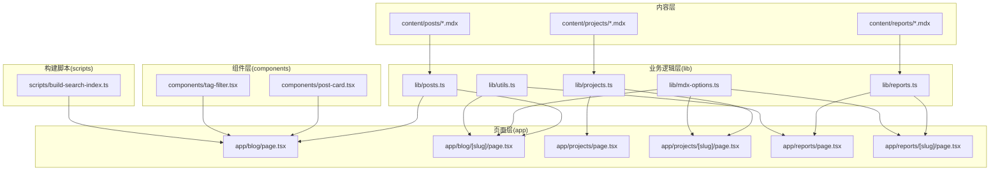
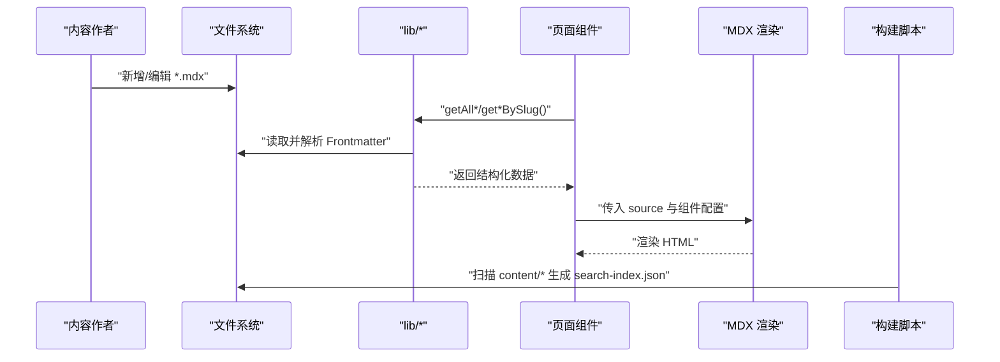
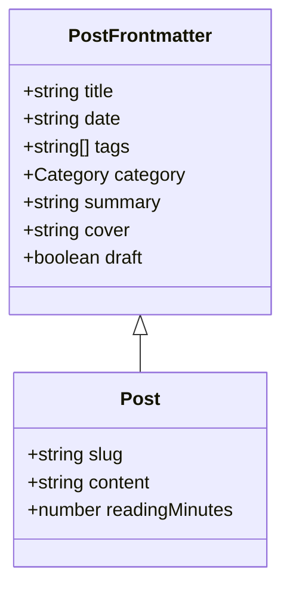
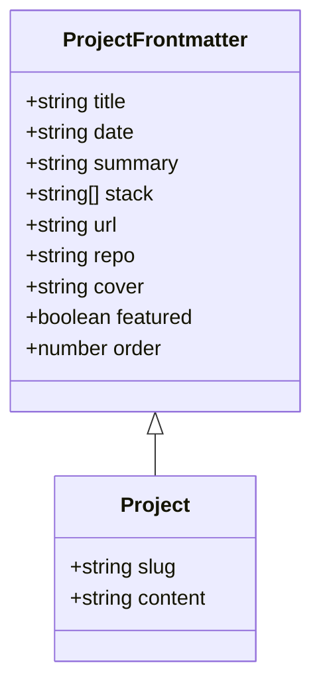
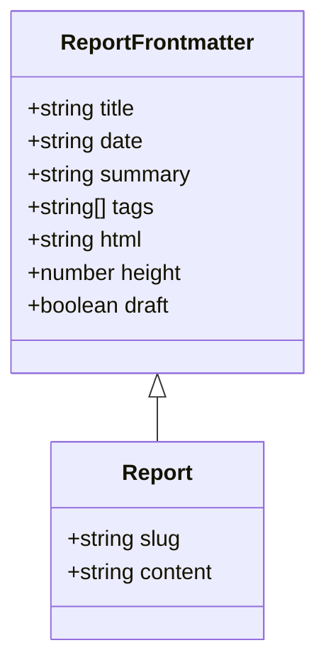
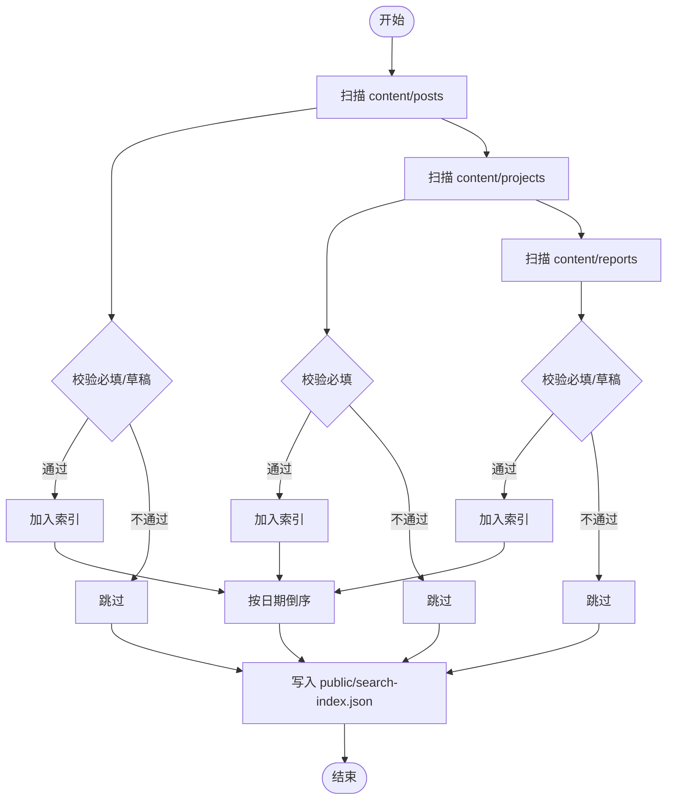
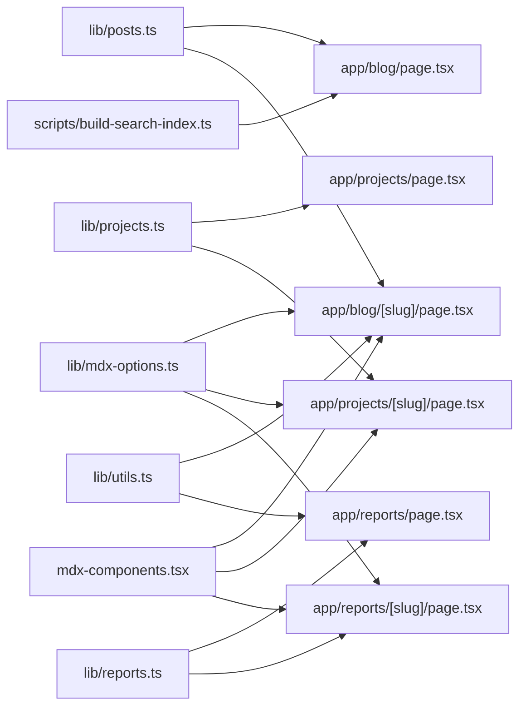

# 内容管理系统

<cite>
**本文引用的文件**
- [README.md](file://README.md)
- [lib/posts.ts](file://lib/posts.ts)
- [lib/projects.ts](file://lib/projects.ts)
- [lib/reports.ts](file://lib/reports.ts)
- [lib/mdx-options.ts](file://lib/mdx-options.ts)
- [mdx-components.tsx](file://mdx-components.tsx)
- [lib/utils.ts](file://lib/utils.ts)
- [content/projects/example-project.mdx](file://content/projects/example-project.mdx)
- [content/reports/2026-05-13-e1-045-tools-distribution.mdx](file://content/reports/2026-05-13-e1-045-tools-distribution.mdx)
- [app/blog/page.tsx](file://app/blog/page.tsx)
- [app/projects/page.tsx](file://app/projects/page.tsx)
- [app/reports/page.tsx](file://app/reports/page.tsx)
- [app/blog/[slug]/page.tsx](file://app/blog/[slug]/page.tsx)
- [app/projects/[slug]/page.tsx](file://app/projects/[slug]/page.tsx)
- [app/reports/[slug]/page.tsx](file://app/reports/[slug]/page.tsx)
- [components/post-card.tsx](file://components/post-card.tsx)
- [components/tag-filter.tsx](file://components/tag-filter.tsx)
- [scripts/build-search-index.ts](file://scripts/build-search-index.ts)
</cite>

## 目录
1. [简介](#简介)
2. [项目结构](#项目结构)
3. [核心组件](#核心组件)
4. [架构总览](#架构总览)
5. [详细组件分析](#详细组件分析)
6. [依赖分析](#依赖分析)
7. [性能考虑](#性能考虑)
8. [故障排查指南](#故障排查指南)
9. [结论](#结论)
10. [附录](#附录)

## 简介
本文件面向内容创作者与开发者，系统性说明基于 MDX 的内容组织方式与管理流程。内容涵盖三类内容形态：博客文章、项目档案、评测报告；解释 Frontmatter 元数据结构与作用；阐述内容读取、解析、排序与过滤机制；给出最佳实践与模板示例；并说明搜索索引构建与发布流程。

## 项目结构
- 内容目录 content 下按类型分层存放 MDX 文件，分别用于博客、项目、评测报告三类内容。
- lib 目录封装内容读取、解析与聚合逻辑，提供统一接口给页面组件使用。
- app 目录采用 Next.js App Router，各路由页面负责渲染列表与详情页。
- scripts 目录包含构建期脚本，用于生成搜索索引。
- components 提供通用 UI 组件，如文章卡片、标签筛选器等。

图表来源
- [lib/posts.ts:1-98](file://lib/posts.ts#L1-L98)
- [lib/projects.ts:1-64](file://lib/projects.ts#L1-L64)
- [lib/reports.ts:1-60](file://lib/reports.ts#L1-L60)
- [lib/mdx-options.ts:1-20](file://lib/mdx-options.ts#L1-L20)
- [lib/utils.ts:1-24](file://lib/utils.ts#L1-L24)
- [app/blog/page.tsx:1-28](file://app/blog/page.tsx#L1-L28)
- [app/blog/[slug]/page.tsx](file://app/blog/[slug]/page.tsx#L1-L98)
- [app/projects/page.tsx:1-96](file://app/projects/page.tsx#L1-L96)
- [app/projects/[slug]/page.tsx](file://app/projects/[slug]/page.tsx#L1-L105)
- [app/reports/page.tsx:1-76](file://app/reports/page.tsx#L1-L76)
- [app/reports/[slug]/page.tsx](file://app/reports/[slug]/page.tsx#L1-L109)
- [components/post-card.tsx:1-81](file://components/post-card.tsx#L1-L81)
- [components/tag-filter.tsx:1-77](file://components/tag-filter.tsx#L1-L77)
- [scripts/build-search-index.ts:1-95](file://scripts/build-search-index.ts#L1-L95)

章节来源
- [README.md:1-150](file://README.md#L1-L150)

## 核心组件
- 内容读取与解析
  - 博客：从 content/posts 读取，使用 gray-matter 解析 Frontmatter，过滤草稿，按日期倒序。
  - 项目：从 content/projects 读取，解析必要字段，支持 featured 与 order 排序。
  - 评测：从 content/reports 读取，解析必要字段，支持草稿过滤与高度控制。
- MDX 渲染配置
  - remark-gfm、rehype-slug、rehype-autolink-headings、rehype-pretty-code 等插件统一配置。
  - 自定义 MDX 组件：内部链接转为 Next.js Link，外部链接新开窗口并加安全属性。
- 工具函数
  - 日期格式化、阅读时长计算（中英文混合文本估算）。
- 搜索索引
  - 构建期扫描三类内容，生成统一的 JSON 索引，供前端搜索使用。

章节来源
- [lib/posts.ts:1-98](file://lib/posts.ts#L1-L98)
- [lib/projects.ts:1-64](file://lib/projects.ts#L1-L64)
- [lib/reports.ts:1-60](file://lib/reports.ts#L1-L60)
- [lib/mdx-options.ts:1-20](file://lib/mdx-options.ts#L1-L20)
- [mdx-components.tsx:1-31](file://mdx-components.tsx#L1-L31)
- [lib/utils.ts:1-24](file://lib/utils.ts#L1-L24)
- [scripts/build-search-index.ts:1-95](file://scripts/build-search-index.ts#L1-L95)

## 架构总览
系统采用“内容即数据”的设计：内容以 MDX 文件形式存放在 content 目录，运行时通过 lib 层读取与解析，App Router 页面负责渲染列表与详情，组件层提供交互体验，构建脚本负责生成搜索索引。

图表来源
- [lib/posts.ts:60-75](file://lib/posts.ts#L60-L75)
- [lib/projects.ts:24-26](file://lib/projects.ts#L24-L26)
- [lib/reports.ts:57-59](file://lib/reports.ts#L57-L59)
- [app/blog/[slug]/page.tsx](file://app/blog/[slug]/page.tsx#L38-L97)
- [app/projects/[slug]/page.tsx](file://app/projects/[slug]/page.tsx#L29-L104)
- [app/reports/[slug]/page.tsx](file://app/reports/[slug]/page.tsx#L30-L108)
- [scripts/build-search-index.ts:29-94](file://scripts/build-search-index.ts#L29-L94)

## 详细组件分析

### 博客内容（posts）
- 数据模型
  - 前端模型包含 slug、title、date、tags、category、summary、cover、content、readingMinutes。
  - 读取时校验必填项，跳过草稿，日期统一为字符串 ISO 时间。
- 列表与详情
  - 列表页聚合全部文章并按日期倒序，提供标签筛选。
  - 详情页生成静态参数，渲染 MDX 内容，输出 Open Graph 元信息。
- 交互与展示
  - 文章卡片按分类着色，显示阅读时长与标签；标签筛选器支持客户端过滤。

图表来源
- [lib/posts.ts:8-22](file://lib/posts.ts#L8-L22)

章节来源
- [lib/posts.ts:1-98](file://lib/posts.ts#L1-L98)
- [app/blog/page.tsx:1-28](file://app/blog/page.tsx#L1-L28)
- [app/blog/[slug]/page.tsx](file://app/blog/[slug]/page.tsx#L1-L98)
- [components/post-card.tsx:1-81](file://components/post-card.tsx#L1-L81)
- [components/tag-filter.tsx:1-77](file://components/tag-filter.tsx#L1-L77)

### 项目档案（projects）
- 数据模型
  - 前端模型包含 slug、title、date、summary、stack、url、repo、cover、featured、order、content。
  - 排序优先级：featured 优先，其次 order，最后按日期倒序。
- 列表与详情
  - 列表页展示卡片，支持技术栈标签与外链按钮。
  - 详情页渲染 MDX 内容，输出基础 SEO 元信息。

图表来源
- [lib/projects.ts:5-20](file://lib/projects.ts#L5-L20)

章节来源
- [lib/projects.ts:1-64](file://lib/projects.ts#L1-L64)
- [app/projects/page.tsx:1-96](file://app/projects/page.tsx#L1-L96)
- [app/projects/[slug]/page.tsx](file://app/projects/[slug]/page.tsx#L1-L105)
- [content/projects/example-project.mdx:1-23](file://content/projects/example-project.mdx#L1-L23)

### 评测报告（reports）
- 数据模型
  - 前端模型包含 slug、title、date、summary、tags、html、height、content。
  - 支持草稿过滤与 iframe 嵌入（html 字段指向 public 下的独立 HTML）。
- 列表与详情
  - 列表页展示报告卡片，支持标签与交互标记。
  - 详情页优先加载 iframe，再渲染 MDX 注解文本。

图表来源
- [lib/reports.ts:5-18](file://lib/reports.ts#L5-L18)

章节来源
- [lib/reports.ts:1-60](file://lib/reports.ts#L1-L60)
- [app/reports/page.tsx:1-76](file://app/reports/page.tsx#L1-L76)
- [app/reports/[slug]/page.tsx](file://app/reports/[slug]/page.tsx#L1-L109)
- [content/reports/2026-05-13-e1-045-tools-distribution.mdx:1-30](file://content/reports/2026-05-13-e1-045-tools-distribution.mdx#L1-L30)

### MDX 渲染与组件
- 插件配置
  - 支持 GitHub 风格表格、标题锚点、代码高亮（浅/深主题）。
- 组件覆盖
  - 将内部链接替换为 Next.js Link，外部链接新开窗口并设置安全属性，提升可访问性与安全性。

章节来源
- [lib/mdx-options.ts:1-20](file://lib/mdx-options.ts#L1-L20)
- [mdx-components.tsx:1-31](file://mdx-components.tsx#L1-L31)

### 搜索索引构建
- 构建策略
  - 扫描三类内容目录，过滤草稿或缺失必填项的条目，统一输出 JSON，包含标题、摘要、标签、分类、slug、日期与类型。
- 使用场景
  - 列表页与全局搜索使用该索引进行查询与排序。

图表来源
- [scripts/build-search-index.ts:29-94](file://scripts/build-search-index.ts#L29-L94)

章节来源
- [scripts/build-search-index.ts:1-95](file://scripts/build-search-index.ts#L1-L95)

## 依赖分析
- 模块耦合
  - 页面组件仅依赖 lib 层提供的聚合函数，降低对文件系统细节的耦合。
  - MDX 渲染依赖统一的插件配置与组件覆盖，保证跨页面一致性。
- 外部依赖
  - gray-matter 解析 Frontmatter；next-mdx-remote/rsc 渲染 MDX；Fuse.js 在前端消费搜索索引。
- 潜在风险
  - 草稿开关与必填项校验需保持一致，避免运行时异常。
  - 评测报告的 iframe 路径需与 public 结构匹配，否则无法加载。

图表来源
- [lib/posts.ts:1-98](file://lib/posts.ts#L1-L98)
- [lib/projects.ts:1-64](file://lib/projects.ts#L1-L64)
- [lib/reports.ts:1-60](file://lib/reports.ts#L1-L60)
- [lib/mdx-options.ts:1-20](file://lib/mdx-options.ts#L1-L20)
- [mdx-components.tsx:1-31](file://mdx-components.tsx#L1-L31)
- [lib/utils.ts:1-24](file://lib/utils.ts#L1-L24)
- [scripts/build-search-index.ts:1-95](file://scripts/build-search-index.ts#L1-L95)
- [app/blog/page.tsx:1-28](file://app/blog/page.tsx#L1-L28)
- [app/blog/[slug]/page.tsx](file://app/blog/[slug]/page.tsx#L1-L98)
- [app/projects/page.tsx:1-96](file://app/projects/page.tsx#L1-L96)
- [app/projects/[slug]/page.tsx](file://app/projects/[slug]/page.tsx#L1-L105)
- [app/reports/page.tsx:1-76](file://app/reports/page.tsx#L1-L76)
- [app/reports/[slug]/page.tsx](file://app/reports/[slug]/page.tsx#L1-L109)

## 性能考虑
- 静态生成与预渲染
  - 列表页与详情页均使用静态生成，减少运行时 IO 与解析开销。
- 本地化处理
  - 代码高亮与标题锚点在构建期完成，运行时仅渲染最终 HTML。
- 搜索索引
  - 构建期一次性生成 JSON，前端使用轻量算法检索，避免运行时复杂计算。
- 排序与过滤
  - 列表页在服务端完成排序与过滤，客户端交互仅做 UI 动画与状态切换。

## 故障排查指南
- 常见问题
  - Frontmatter 缺失必填项：博客与评测会在读取时跳过并打印警告；请补齐 title、date 或设置 draft: false。
  - 项目缺少 title：读取时直接跳过，确保 title 存在。
  - 评测报告 iframe 无法加载：确认 html 字段与 public 下路径一致，且已构建生成对应静态资源。
  - 标签筛选无效：确认搜索索引已更新，或检查构建钩子是否执行。
- 调试建议
  - 在本地运行构建脚本，观察 public/search-index.json 是否生成。
  - 在页面组件中临时输出数据结构，定位解析阶段的问题。
  - 使用浏览器开发者工具检查 MDX 渲染后的 DOM 与 iframe 加载状态。

章节来源
- [lib/posts.ts:39-43](file://lib/posts.ts#L39-L43)
- [lib/reports.ts:28-32](file://lib/reports.ts#L28-L32)
- [lib/projects.ts:39-39](file://lib/projects.ts#L39-L39)
- [scripts/build-search-index.ts:90-94](file://scripts/build-search-index.ts#L90-L94)

## 结论
本系统以 MDX 为核心，结合统一的 Frontmatter 规范与 lib 层抽象，实现了博客、项目、评测三类内容的一致化管理与渲染。通过构建期索引与静态生成，兼顾了内容创作的灵活性与前端性能。遵循本文的命名约定、元数据配置与最佳实践，可高效地维护与扩展内容体系。

## 附录

### 内容类型与元数据规范
- 博客文章（content/posts/*.mdx）
  - 必填：title、date
  - 常用：tags、category、summary、cover、draft
  - 排序：按 date 倒序
- 项目档案（content/projects/*.mdx）
  - 必填：title
  - 常用：date、summary、stack、url、repo、cover、featured、order
  - 排序：featured 优先，其次 order，最后 date
- 评测报告（content/reports/*.mdx）
  - 必填：title、date
  - 常用：summary、tags、html、height、draft
  - 渲染：优先 iframe，再渲染 MDX 注解

章节来源
- [lib/posts.ts:8-16](file://lib/posts.ts#L8-L16)
- [lib/projects.ts:5-15](file://lib/projects.ts#L5-L15)
- [lib/reports.ts:5-13](file://lib/reports.ts#L5-L13)
- [content/projects/example-project.mdx:1-23](file://content/projects/example-project.mdx#L1-L23)
- [content/reports/2026-05-13-e1-045-tools-distribution.mdx:1-30](file://content/reports/2026-05-13-e1-045-tools-distribution.mdx#L1-L30)

### 文件命名约定
- 博客文章：YYYY-MM-DD-slug.mdx
- 项目档案：slug.mdx
- 评测报告：YYYY-MM-DD-slug.mdx

章节来源
- [README.md:43-86](file://README.md#L43-L86)

### 内容创作最佳实践
- 元数据配置
  - 必填项优先：博客与评测务必填写 title、date；项目务必填写 title。
  - 草稿管理：写作期间设置 draft: true，完成后改为 false。
  - 标签与分类：统一使用固定集合，便于筛选与索引。
- 内容结构设计
  - 列表页摘要：在 summary 中提供精炼概述，利于 SEO 与搜索结果。
  - 详情页结构：使用层级标题组织内容，配合代码块与图片提升可读性。
- MDX 组件
  - 使用自定义组件覆盖，确保内外链行为一致。
  - 代码高亮：利用默认语言与行号高亮增强可读性。
- 评测报告
  - 将交互式 HTML 放置于 public/reports/<slug>/index.html，Frontmatter 中指定 html 与 height。
  - 保持标题与摘要与 iframe 内容一致，便于用户预期管理。

章节来源
- [lib/mdx-options.ts:6-10](file://lib/mdx-options.ts#L6-L10)
- [mdx-components.tsx:7-27](file://mdx-components.tsx#L7-L27)
- [app/reports/[slug]/page.tsx](file://app/reports/[slug]/page.tsx#L86-L94)

### 读取、解析、排序与过滤机制
- 读取与解析
  - 统一使用 gray-matter 解析 Frontmatter，读取 UTF-8 内容。
- 排序
  - 博客与评测：按 date 倒序。
  - 项目：featured > order > date。
- 过滤
  - 草稿过滤：draft: true 的条目不参与列表与索引。
  - 必填校验：缺失 title/date 的条目跳过。
- 搜索
  - 构建期生成索引，包含 title、summary、tags、category、slug、date、type，前端按需检索。

章节来源
- [lib/posts.ts:60-66](file://lib/posts.ts#L60-L66)
- [lib/projects.ts:56-60](file://lib/projects.ts#L56-L60)
- [lib/reports.ts:46-54](file://lib/reports.ts#L46-L54)
- [scripts/build-search-index.ts:32-47](file://scripts/build-search-index.ts#L32-L47)
- [scripts/build-search-index.ts:50-65](file://scripts/build-search-index.ts#L50-L65)
- [scripts/build-search-index.ts:68-83](file://scripts/build-search-index.ts#L68-L83)

### 版本管理与发布流程
- 本地开发
  - 安装依赖、启动开发服务器、构建静态产物、类型检查。
- 搜索索引
  - predev/prebuild 钩子自动执行构建脚本，生成 public/search-index.json。
- 部署
  - 推送至 main 分支触发 GitHub Actions，部署至 GitHub Pages。
  - 若使用子路径仓库，需在 next.config.mjs 中配置 basePath 与 assetPrefix。

章节来源
- [README.md:31-101](file://README.md#L31-L101)
- [scripts/build-search-index.ts:90-94](file://scripts/build-search-index.ts#L90-L94)