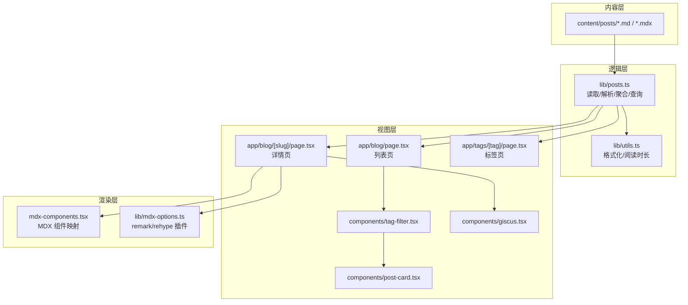
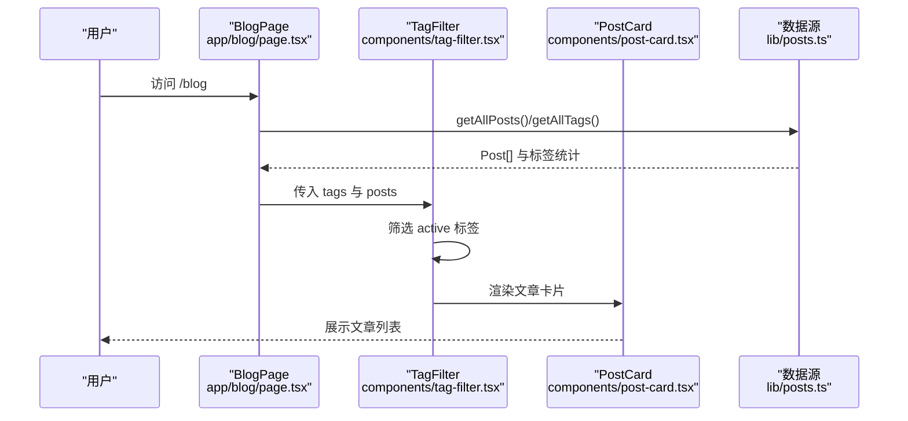
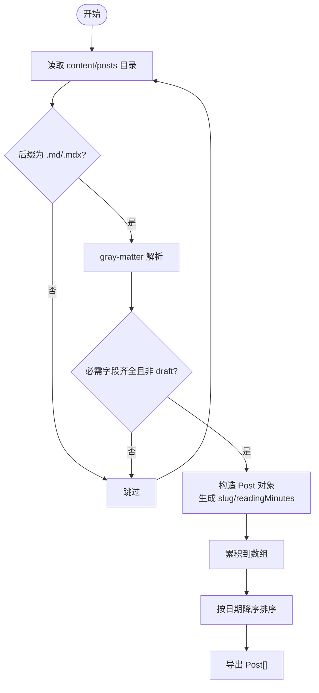
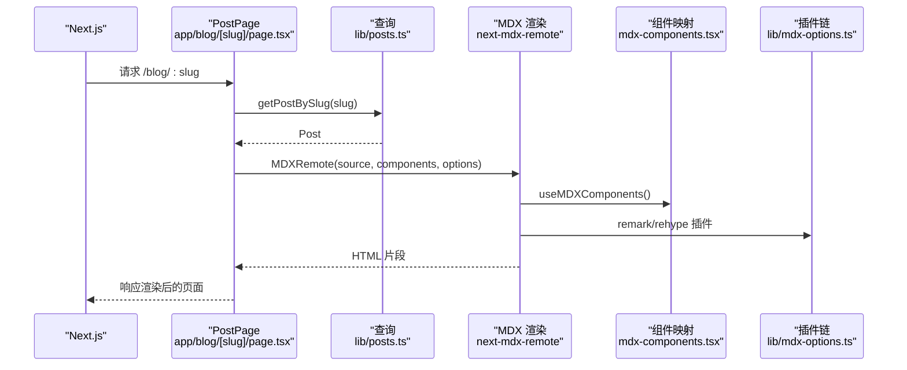
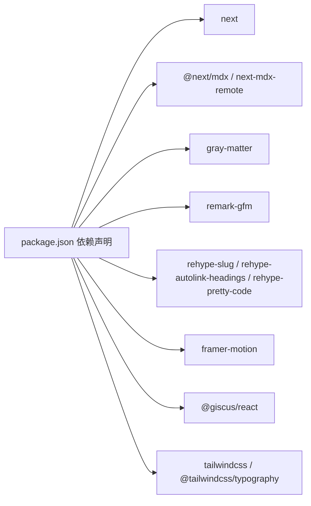

# 博客系统

<cite>
**本文引用的文件**
- [app/blog/page.tsx](file://app/blog/page.tsx)
- [app/blog/[slug]/page.tsx](file://app/blog/[slug]/page.tsx)
- [app/tags/[tag]/page.tsx](file://app/tags/[tag]/page.tsx)
- [lib/posts.ts](file://lib/posts.ts)
- [lib/utils.ts](file://lib/utils.ts)
- [lib/mdx-options.ts](file://lib/mdx-options.ts)
- [components/post-card.tsx](file://components/post-card.tsx)
- [components/tag-filter.tsx](file://components/tag-filter.tsx)
- [components/giscus.tsx](file://components/giscus.tsx)
- [mdx-components.tsx](file://mdx-components.tsx)
- [package.json](file://package.json)
</cite>

## 目录
1. [简介](#简介)
2. [项目结构](#项目结构)
3. [核心组件](#核心组件)
4. [架构总览](#架构总览)
5. [组件详解](#组件详解)
6. [依赖关系分析](#依赖关系分析)
7. [性能考量](#性能考量)
8. [故障排查指南](#故障排查指南)
9. [结论](#结论)
10. [附录：内容创作指南与模板](#附录内容创作指南与模板)

## 简介
本博客系统基于 Next.js App Router 构建，采用 MDX 内容驱动的方式组织文章。内容以 MD/MDX 文件形式存放在 content/posts 目录中，通过 Frontmatter 声明元数据（标题、日期、标签、分类、摘要等），运行时由服务端读取、解析、排序与过滤，并渲染为文章列表与详情页。系统支持按标签筛选、阅读时长计算、代码高亮、自动目录锚点等现代化功能。

## 项目结构
- 内容层：content/posts 下存放文章 MD/MDX 文件；Frontmatter 定义元数据。
- 逻辑层：lib/posts.ts 负责读取、解析、聚合与查询；lib/utils.ts 提供通用工具函数。
- 视图层：app/blog 与 app/blog/[slug] 实现列表与详情页；components 提供卡片、筛选器、评论区等 UI 组件。
- 渲染层：mdx-components.tsx 注入 MDX 组件映射；lib/mdx-options.ts 配置 remark/rehype 插件链。

图表来源
- [lib/posts.ts:1-98](file://lib/posts.ts#L1-L98)
- [lib/utils.ts:1-24](file://lib/utils.ts#L1-L24)
- [app/blog/page.tsx:1-28](file://app/blog/page.tsx#L1-L28)
- [app/blog/[slug]/page.tsx:1-98](file://app/blog/[slug]/page.tsx#L1-L98)
- [app/tags/[tag]/page.tsx:1-58](file://app/tags/[tag]/page.tsx#L1-L58)
- [components/post-card.tsx:1-81](file://components/post-card.tsx#L1-L81)
- [components/tag-filter.tsx:1-77](file://components/tag-filter.tsx#L1-L77)
- [components/giscus.tsx:1-37](file://components/giscus.tsx#L1-L37)
- [mdx-components.tsx:1-31](file://mdx-components.tsx#L1-L31)
- [lib/mdx-options.ts:1-20](file://lib/mdx-options.ts#L1-L20)

章节来源
- [app/blog/page.tsx:1-28](file://app/blog/page.tsx#L1-L28)
- [app/blog/[slug]/page.tsx:1-98](file://app/blog/[slug]/page.tsx#L1-L98)
- [app/tags/[tag]/page.tsx:1-58](file://app/tags/[tag]/page.tsx#L1-L58)
- [lib/posts.ts:1-98](file://lib/posts.ts#L1-L98)
- [lib/utils.ts:1-24](file://lib/utils.ts#L1-L24)
- [lib/mdx-options.ts:1-20](file://lib/mdx-options.ts#L1-L20)
- [components/post-card.tsx:1-81](file://components/post-card.tsx#L1-L81)
- [components/tag-filter.tsx:1-77](file://components/tag-filter.tsx#L1-L77)
- [components/giscus.tsx:1-37](file://components/giscus.tsx#L1-L37)
- [mdx-components.tsx:1-31](file://mdx-components.tsx#L1-L31)
- [package.json:1-48](file://package.json#L1-L48)

## 核心组件
- 文章模型与读取
  - PostFrontmatter：定义 Frontmatter 字段（标题、日期、标签、分类、摘要、封面、草稿）。
  - Post：在 Frontmatter 基础上扩展 slug、content、readingMinutes。
  - getAllPosts/getPostBySlug/getAllTags/getPostsByTag/getAllCategories：提供统一的数据访问接口。
- 工具函数
  - formatDate：本地化日期格式化。
  - readingTime：中英混合文本的阅读时长估算。
- MDX 渲染
  - mdx-options：配置 remarkGfm、rehypeSlug、rehypeAutolinkHeadings、rehypePrettyCode。
  - mdx-components：统一处理内外链样式与行为。
- 列表与详情
  - app/blog/page.tsx：加载全部文章与标签，渲染筛选器与卡片网格。
  - app/blog/[slug]/page.tsx：静态生成参数、动态元数据、渲染 MDX 内容与评论区。
  - app/tags/[tag]/page.tsx：按标签筛选并展示文章卡片。
- 可视化组件
  - components/post-card.tsx：文章卡片，含分类徽标、日期、阅读时长、摘要与标签云。
  - components/tag-filter.tsx：标签筛选器，支持全量与单标签切换。
  - components/giscus.tsx：评论区组件，按环境变量配置启用或提示。

章节来源
- [lib/posts.ts:8-22](file://lib/posts.ts#L8-L22)
- [lib/posts.ts:60-98](file://lib/posts.ts#L60-L98)
- [lib/utils.ts:8-23](file://lib/utils.ts#L8-L23)
- [lib/mdx-options.ts:12-19](file://lib/mdx-options.ts#L12-L19)
- [mdx-components.tsx:5-29](file://mdx-components.tsx#L5-L29)
- [app/blog/page.tsx:11-27](file://app/blog/page.tsx#L11-L27)
- [app/blog/[slug]/page.tsx:38-97](file://app/blog/[slug]/page.tsx#L38-L97)
- [app/tags/[tag]/page.tsx:26-57](file://app/tags/[tag]/page.tsx#L26-L57)
- [components/post-card.tsx:20-80](file://components/post-card.tsx#L20-L80)
- [components/tag-filter.tsx:14-76](file://components/tag-filter.tsx#L14-L76)
- [components/giscus.tsx:10-36](file://components/giscus.tsx#L10-L36)

## 架构总览
系统采用“内容即数据”的架构：内容以 MD/MDX 文件存在，构建期或运行时读取并解析为 Post 对象，再由页面组件消费。MDX 内容通过 next-mdx-remote 在服务器端渲染，结合 remark/rehype 插件实现表格、标题锚点与代码高亮。

图表来源
- [app/blog/page.tsx:11-27](file://app/blog/page.tsx#L11-L27)
- [components/tag-filter.tsx:14-76](file://components/tag-filter.tsx#L14-L76)
- [components/post-card.tsx:20-80](file://components/post-card.tsx#L20-L80)
- [lib/posts.ts:60-98](file://lib/posts.ts#L60-L98)

## 组件详解

### 数据模型与读取流程
- 模型定义
  - PostFrontmatter：title、date、tags[]、category、summary、cover、draft。
  - Post：在 Frontmatter 上扩展 slug、content、readingMinutes。
- 读取与解析
  - 读取 content/posts 目录下 .md/.mdx 文件，使用 gray-matter 解析 Frontmatter 与正文。
  - 忽略缺失必要字段或标记为 draft 的文章。
  - 生成 slug 并计算阅读时长。
- 排序与过滤
  - 默认按日期降序排列。
  - 支持按标签与分类聚合统计。

图表来源
- [lib/posts.ts:24-66](file://lib/posts.ts#L24-L66)
- [lib/utils.ts:17-23](file://lib/utils.ts#L17-L23)

章节来源
- [lib/posts.ts:8-22](file://lib/posts.ts#L8-L22)
- [lib/posts.ts:26-66](file://lib/posts.ts#L26-L66)
- [lib/utils.ts:17-23](file://lib/utils.ts#L17-L23)

### 文章列表页（app/blog/page.tsx）
- 功能要点
  - 读取全部文章与标签，渲染标题、数量信息与标签筛选器。
  - 使用 TagFilter 实现全量与按标签筛选，配合 PostCard 展示卡片网格。
- 性能特性
  - 列表页仅做聚合与渲染，不进行复杂计算，开销低。

章节来源
- [app/blog/page.tsx:11-27](file://app/blog/page.tsx#L11-L27)
- [components/tag-filter.tsx:14-76](file://components/tag-filter.tsx#L14-L76)
- [components/post-card.tsx:20-80](file://components/post-card.tsx#L20-L80)

### 文章详情页（app/blog/[slug]/page.tsx）
- 功能要点
  - 静态生成路由参数（generateStaticParams），提升 SEO 与性能。
  - 动态生成页面元数据（generateMetadata），包含 Open Graph 字段。
  - 使用 next-mdx-remote 渲染 MDX 内容，注入 mdxComponents 与 mdxOptions。
  - 提供“返回博客”导航与评论区（Giscus）。
- MDX 渲染管线
  - remarkGfm：支持 GitHub 风格表格等。
  - rehypeSlug + rehypeAutolinkHeadings：为标题生成锚点并包裹链接。
  - rehypePrettyCode：代码块高亮，支持深浅主题切换。

图表来源
- [app/blog/[slug]/page.tsx:38-97](file://app/blog/[slug]/page.tsx#L38-L97)
- [lib/posts.ts:68-75](file://lib/posts.ts#L68-L75)
- [mdx-components.tsx:5-29](file://mdx-components.tsx#L5-L29)
- [lib/mdx-options.ts:12-19](file://lib/mdx-options.ts#L12-L19)

章节来源
- [app/blog/[slug]/page.tsx:13-36](file://app/blog/[slug]/page.tsx#L13-L36)
- [app/blog/[slug]/page.tsx:38-97](file://app/blog/[slug]/page.tsx#L38-L97)
- [lib/posts.ts:68-75](file://lib/posts.ts#L68-L75)
- [mdx-components.tsx:5-29](file://mdx-components.tsx#L5-L29)
- [lib/mdx-options.ts:12-19](file://lib/mdx-options.ts#L12-L19)

### 标签页（app/tags/[tag]/page.tsx）
- 功能要点
  - 静态生成标签参数，动态生成页面元数据。
  - 按标签筛选文章并渲染卡片网格。
- 注意事项
  - 若无匹配文章则返回 404。

章节来源
- [app/tags/[tag]/page.tsx:9-24](file://app/tags/[tag]/page.tsx#L9-L24)
- [app/tags/[tag]/page.tsx:26-57](file://app/tags/[tag]/page.tsx#L26-L57)
- [lib/posts.ts:87-89](file://lib/posts.ts#L87-L89)

### 文章卡片组件（components/post-card.tsx）
- 功能要点
  - 分类徽标与颜色映射（技术/复盘/日常）。
  - 显示日期、阅读时长、标题、摘要与标签云（最多 4 个）。
  - 鼠标悬停的径向光晕效果与轻微上浮动画。
- 自定义建议
  - 可通过 CSS 变量调整配色与间距。
  - 如需显示封面图，可在 PostFrontmatter 中添加 cover 字段并在组件中渲染。

章节来源
- [components/post-card.tsx:8-18](file://components/post-card.tsx#L8-L18)
- [components/post-card.tsx:20-80](file://components/post-card.tsx#L20-L80)
- [lib/utils.ts:8-15](file://lib/utils.ts#L8-L15)

### 标签筛选器（components/tag-filter.tsx）
- 功能要点
  - 渲染标签按钮（含计数），支持点击切换 active 状态。
  - 使用 Framer Motion 实现筛选切换时的过渡动画。
- 行为说明
  - active 为 null 表示全量；active 为具体标签名表示按该标签过滤。

章节来源
- [components/tag-filter.tsx:14-76](file://components/tag-filter.tsx#L14-L76)

### 评论区组件（components/giscus.tsx）
- 功能要点
  - 通过 NEXT_PUBLIC_GISCUS_* 环境变量判断是否启用。
  - 未配置时提示如何设置；已配置时以暗色主题渲染。
- 集成建议
  - 在详情页中直接引入，无需额外逻辑。

章节来源
- [components/giscus.tsx:10-36](file://components/giscus.tsx#L10-L36)

## 依赖关系分析
- 运行时依赖
  - next、@next/mdx、next-mdx-remote：SSR 渲染 MDX。
  - gray-matter：解析 Frontmatter。
  - remark-gfm、rehype-slug、rehype-autolink-headings、rehype-pretty-code：增强 Markdown/MDX 渲染。
  - framer-motion：动画与交互。
  - @giscus/react：评论区。
- 开发依赖
  - tailwindcss、@tailwindcss/typography：样式与排版。
  - typescript、tsx：类型检查与脚本执行。

图表来源
- [package.json:14-33](file://package.json#L14-L33)

章节来源
- [package.json:14-33](file://package.json#L14-L33)

## 性能考量
- 静态生成参数
  - 列表页与标签页均使用 generateStaticParams，减少运行时 IO。
- 本地化与缓存
  - formatDate 与 readingTime 为纯函数，避免重复计算。
- 渲染优化
  - MDX 插件链在服务器端执行，客户端仅接收最终 HTML。
- 建议
  - 大量文章时可考虑分页或懒加载。
  - 代码高亮主题可预热以降低首屏闪烁。

[本节为通用指导，不涉及具体文件分析]

## 故障排查指南
- 文章未显示
  - 检查 content/posts 是否存在对应文件，且 Frontmatter 包含 title 与 date。
  - 确认未标记 draft。
- 标签筛选无效
  - 确认标签大小写与拼写一致；标签页会按解码后的值匹配。
- MDX 渲染异常
  - 确认 mdxOptions 与 mdx-components 正确导入；检查 remark/rehype 插件版本兼容性。
- 评论区不可用
  - 检查 .env.local 中 NEXT_PUBLIC_GISCUS_* 是否正确配置。

章节来源
- [lib/posts.ts:39-43](file://lib/posts.ts#L39-L43)
- [app/tags/[tag]/page.tsx:28-30](file://app/tags/[tag]/page.tsx#L28-L30)
- [components/giscus.tsx:10-19](file://components/giscus.tsx#L10-L19)

## 结论
本博客系统以简洁清晰的分层架构实现了内容驱动的文章管理：内容层（MD/MDX）、逻辑层（数据聚合与查询）、视图层（页面与组件）、渲染层（MDX 插件链）。通过统一的 Post 模型与 Frontmatter 规范，内容创作者可以专注于写作；通过标签与分类体系，读者可高效检索与浏览。系统具备良好的扩展性，便于后续增加封面图、分页、搜索索引等功能。

[本节为总结性内容，不涉及具体文件分析]

## 附录：内容创作指南与模板

### 文件命名规范
- 建议采用“YYYY-MM-DD-title.mdx”格式，便于按时间排序与识别。
- 示例路径参考：content/posts/YYYY-MM-DD-title.mdx。

章节来源
- [app/blog/[slug]/page.tsx:13-15](file://app/blog/[slug]/page.tsx#L13-L15)

### Frontmatter 字段说明
- 必填字段
  - title：文章标题。
  - date：发布日期（字符串或日期对象，最终统一为 ISO 字符串）。
- 可选字段
  - tags：字符串数组，用于标签筛选与聚合。
  - category：分类，支持 tech、retro、life。
  - summary：摘要，用于列表页预览与 SEO。
  - cover：封面图地址（如需展示封面图，可在组件中扩展）。
  - draft：布尔值，标记为草稿时将被忽略。

章节来源
- [lib/posts.ts:8-22](file://lib/posts.ts#L8-L22)
- [lib/posts.ts:39-43](file://lib/posts.ts#L39-L43)

### 内容结构设计最佳实践
- 标题层级：使用 H1 作为主标题，H2/H3 组织章节。
- 代码块：尽量指定语言以便高亮；避免过长单行代码。
- 链接：内部链接使用相对路径，外部链接使用绝对 URL。
- 图片：建议放置于 public 目录并使用绝对路径引用。

[本节为通用指导，不涉及具体文件分析]

### 文章卡片自定义选项
- 分类徽标与颜色：通过 CATEGORY_LABEL 与 CATEGORY_COLOR 映射调整文案与配色。
- 标签显示数量：当前限制最多 4 个，可在组件中调整 slice 参数。
- 交互效果：卡片支持悬停上浮与径向光晕，可按需修改动画参数。

章节来源
- [components/post-card.tsx:8-18](file://components/post-card.tsx#L8-L18)
- [components/post-card.tsx:66-76](file://components/post-card.tsx#L66-L76)

### 实用模板与示例
- Frontmatter 模板
  - title: ""
  - date: ""
  - tags: []
  - category: "tech"
  - summary: ""
  - cover: ""
  - draft: false
- MDX 内容模板
  - 使用 H2/H3 组织章节，合理插入代码块与图片。
  - 在需要时添加脚注或表格，系统已内置 GFM 支持。

[本节为通用指导，不涉及具体文件分析]