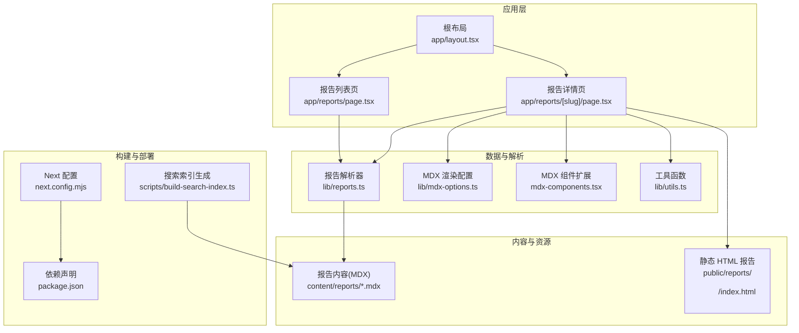
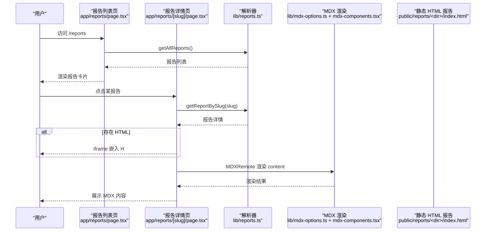
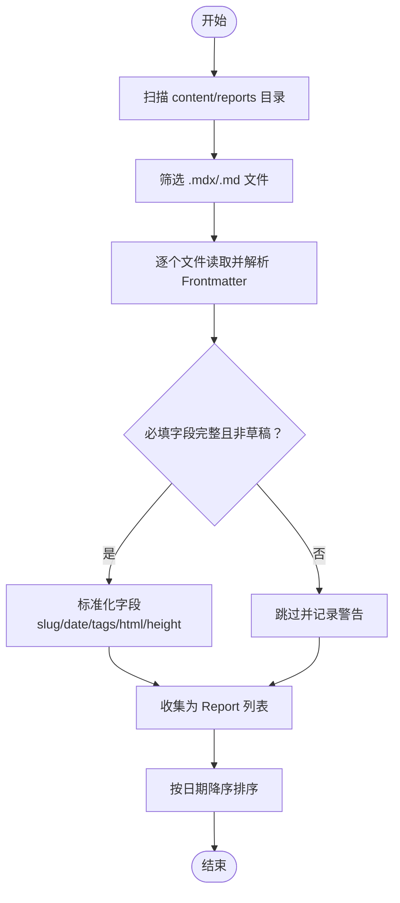
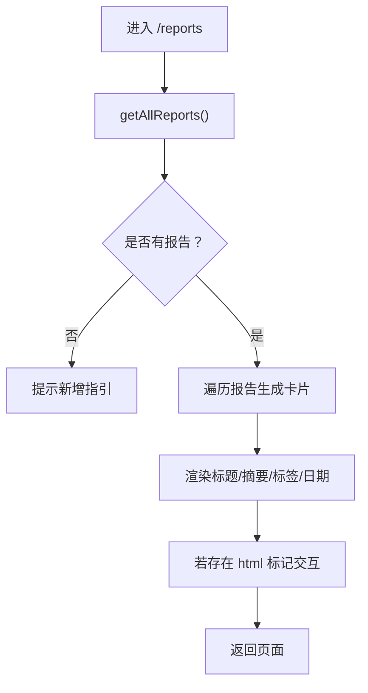
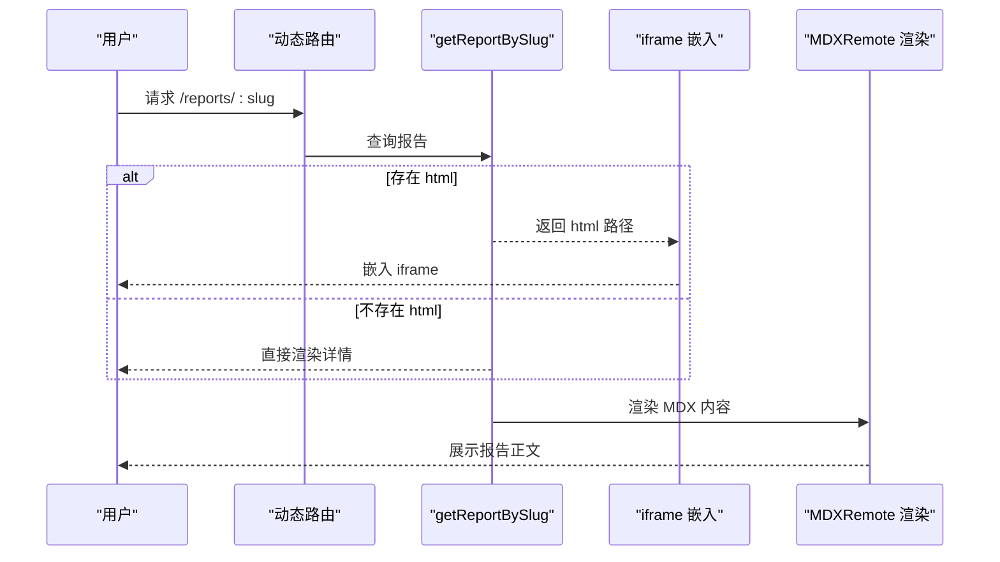
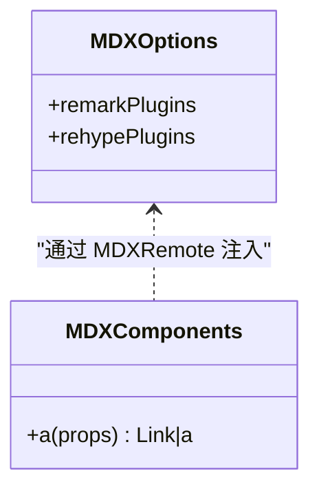
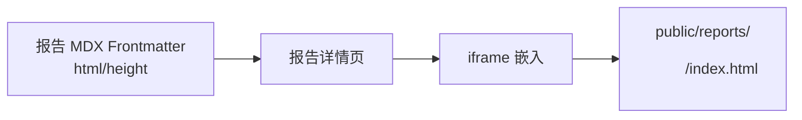
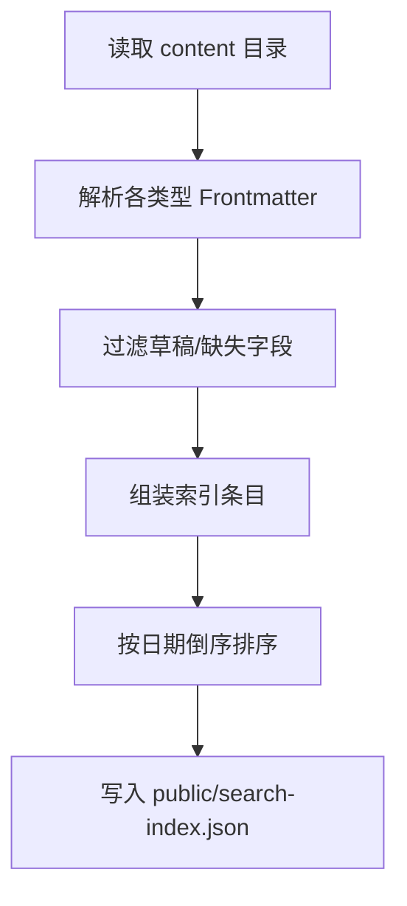
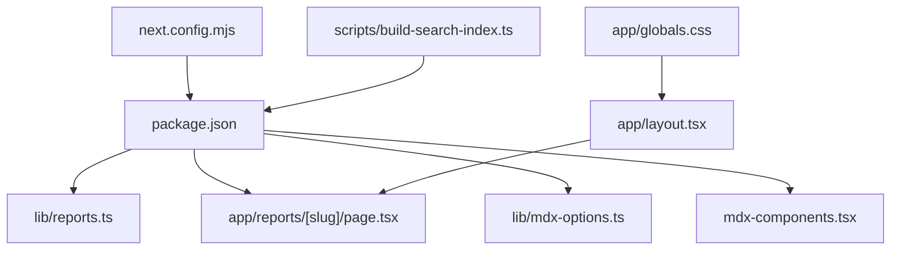
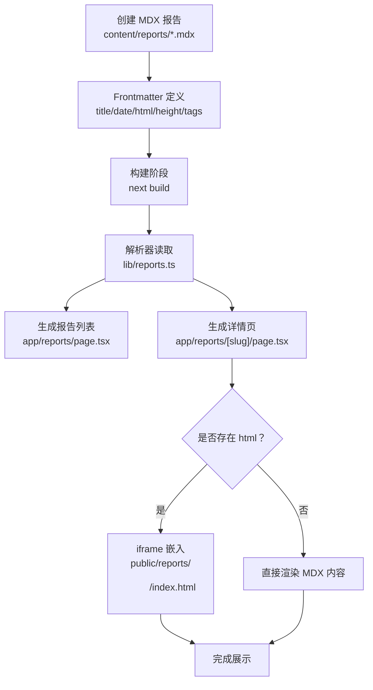

# 评测报告系统

<cite>
**本文引用的文件**
- [app/reports/page.tsx](file://app/reports/page.tsx)
- [app/reports/[slug]/page.tsx](file://app/reports/%5Bslug%5D/page.tsx)
- [lib/reports.ts](file://lib/reports.ts)
- [content/reports/2026-05-13-e1-045-tools-distribution.mdx](file://content/reports/2026-05-13-e1-045-tools-distribution.mdx)
- [public/reports/e1-045-tools-distribution/index.html](file://public/reports/e1-045-tools-distribution/index.html)
- [lib/mdx-options.ts](file://lib/mdx-options.ts)
- [mdx-components.tsx](file://mdx-components.tsx)
- [lib/utils.ts](file://lib/utils.ts)
- [next.config.mjs](file://next.config.mjs)
- [package.json](file://package.json)
- [scripts/build-search-index.ts](file://scripts/build-search-index.ts)
- [app/layout.tsx](file://app/layout.tsx)
- [app/globals.css](file://app/globals.css)
</cite>

## 目录
1. [简介](#简介)
2. [项目结构](#项目结构)
3. [核心组件](#核心组件)
4. [架构总览](#架构总览)
5. [组件详解](#组件详解)
6. [依赖关系分析](#依赖关系分析)
7. [性能考量](#性能考量)
8. [故障排查指南](#故障排查指南)
9. [结论](#结论)
10. [附录](#附录)

## 简介
本项目是一个以 Next.js 构建的评测报告系统，支持两类内容形态：
- 文档型报告：基于 MDX 的富文本报告，使用 Markdown 语法与组件化渲染，支持表格、代码高亮、自动标题锚点等。
- 可视化报告：独立的 HTML 页面，内嵌交互式看板或图表，通过 iframe 嵌入到报告详情页中。

系统通过静态导出构建，便于部署到任意静态托管服务；同时提供搜索索引生成脚本，统一收录报告、文章与项目的检索入口。

## 项目结构
- 应用层路由与页面
  - 报告列表页：app/reports/page.tsx
  - 报告详情页：app/reports/[slug]/page.tsx
- 数据与解析
  - 报告解析器：lib/reports.ts
  - MDX 渲染配置：lib/mdx-options.ts
  - MDX 组件扩展：mdx-components.tsx
  - 工具函数：lib/utils.ts
- 内容与资源
  - 报告内容：content/reports/*.mdx
  - 静态 HTML 报告：public/reports/<目录>/index.html
- 构建与部署
  - Next 配置：next.config.mjs（静态导出）
  - 依赖声明：package.json
  - 搜索索引生成：scripts/build-search-index.ts
- 样式与主题
  - 全局样式：app/globals.css
  - 布局包装：app/layout.tsx

**图示来源**
- [app/reports/page.tsx:1-76](file://app/reports/page.tsx#L1-L76)
- [app/reports/[slug]/page.tsx](file://app/reports/%5Bslug%5D/page.tsx#L1-L109)
- [lib/reports.ts:1-60](file://lib/reports.ts#L1-L60)
- [lib/mdx-options.ts:1-20](file://lib/mdx-options.ts#L1-L20)
- [mdx-components.tsx:1-31](file://mdx-components.tsx#L1-L31)
- [lib/utils.ts:1-24](file://lib/utils.ts#L1-L24)
- [next.config.mjs:1-19](file://next.config.mjs#L1-L19)
- [package.json:1-48](file://package.json#L1-L48)
- [scripts/build-search-index.ts:1-95](file://scripts/build-search-index.ts#L1-L95)
- [app/layout.tsx:1-57](file://app/layout.tsx#L1-L57)

**章节来源**
- [app/reports/page.tsx:1-76](file://app/reports/page.tsx#L1-L76)
- [app/reports/[slug]/page.tsx](file://app/reports/%5Bslug%5D/page.tsx#L1-L109)
- [lib/reports.ts:1-60](file://lib/reports.ts#L1-L60)
- [lib/mdx-options.ts:1-20](file://lib/mdx-options.ts#L1-L20)
- [mdx-components.tsx:1-31](file://mdx-components.tsx#L1-L31)
- [lib/utils.ts:1-24](file://lib/utils.ts#L1-L24)
- [next.config.mjs:1-19](file://next.config.mjs#L1-L19)
- [package.json:1-48](file://package.json#L1-L48)
- [scripts/build-search-index.ts:1-95](file://scripts/build-search-index.ts#L1-L95)
- [app/layout.tsx:1-57](file://app/layout.tsx#L1-L57)

## 核心组件
- 报告解析器（lib/reports.ts）
  - 负责扫描 content/reports 目录，读取 .mdx/.md 文件，解析 YAML Frontmatter，过滤草稿，生成标准化 Report 对象（含 slug、title、date、summary、tags、html、height、content）。
- 报告列表页（app/reports/page.tsx）
  - 调用 getAllReports 获取报告列表，渲染卡片式列表，支持标签云、日期格式化、交互式 HTML 标记。
- 报告详情页（app/reports/[slug]/page.tsx）
  - 动态路由生成静态参数，根据 slug 查找报告；若存在 html 字段则通过 iframe 嵌入静态 HTML 报告；使用 next-mdx-remote 渲染 MDX 内容，注入自定义组件与渲染选项。
- MDX 渲染配置（lib/mdx-options.ts）
  - 集成 remark-gfm、rehype-slug、rehype-autolink-headings、rehype-pretty-code，提供代码高亮与标题锚点。
- MDX 组件扩展（mdx-components.tsx）
  - 自定义 a 标签行为：内部链接使用 Next.js Link，外部链接新开窗口并添加安全属性。
- 工具函数（lib/utils.ts）
  - 提供日期格式化与阅读时长估算。
- 搜索索引生成（scripts/build-search-index.ts）
  - 扫描 posts、projects、reports 三类内容，提取标题、摘要、标签、分类、日期、类型，输出 public/search-index.json。
- 构建配置（next.config.mjs）
  - 开启静态导出（export），关闭图片优化，启用严格模式，固定工作区根目录。

**章节来源**
- [lib/reports.ts:1-60](file://lib/reports.ts#L1-L60)
- [app/reports/page.tsx:1-76](file://app/reports/page.tsx#L1-L76)
- [app/reports/[slug]/page.tsx](file://app/reports/%5Bslug%5D/page.tsx#L1-L109)
- [lib/mdx-options.ts:1-20](file://lib/mdx-options.ts#L1-L20)
- [mdx-components.tsx:1-31](file://mdx-components.tsx#L1-L31)
- [lib/utils.ts:1-24](file://lib/utils.ts#L1-L24)
- [scripts/build-search-index.ts:1-95](file://scripts/build-search-index.ts#L1-L95)
- [next.config.mjs:1-19](file://next.config.mjs#L1-L19)

## 架构总览
系统采用“静态内容 + 静态导出”的架构：
- 内容侧：MDX 报告与独立 HTML 报告分别存放于 content 与 public。
- 渲染侧：Next.js 在构建期生成静态页面，运行期通过 RSC 与 SSR 渲染报告详情页。
- 展示侧：详情页通过 iframe 嵌入 HTML 报告，MDX 内容通过 next-mdx-remote 渲染。

**图示来源**
- [app/reports/page.tsx:1-76](file://app/reports/page.tsx#L1-L76)
- [app/reports/[slug]/page.tsx](file://app/reports/%5Bslug%5D/page.tsx#L1-L109)
- [lib/reports.ts:1-60](file://lib/reports.ts#L1-L60)
- [lib/mdx-options.ts:1-20](file://lib/mdx-options.ts#L1-L20)
- [mdx-components.tsx:1-31](file://mdx-components.tsx#L1-L31)
- [public/reports/e1-045-tools-distribution/index.html:1-229](file://public/reports/e1-045-tools-distribution/index.html#L1-L229)

## 组件详解

### 报告解析器（lib/reports.ts）
- 输入：content/reports 下的 .mdx/.md 文件
- 输出：标准化 Report 列表（排序依据日期降序）
- 关键逻辑
  - 使用 gray-matter 解析 YAML Frontmatter
  - 必填字段校验（title、date），草稿过滤（draft）
  - slug 生成、日期规范化、默认值填充（tags、html、height、content）
  - 过滤非 MD/MDX 文件，读取 UTF-8 内容

**图示来源**
- [lib/reports.ts:1-60](file://lib/reports.ts#L1-L60)

**章节来源**
- [lib/reports.ts:1-60](file://lib/reports.ts#L1-L60)

### 报告列表页（app/reports/page.tsx）
- 功能要点
  - 调用 getAllReports 获取报告
  - 渲染卡片网格，显示标题、摘要、标签、日期
  - 若报告声明了 html 字段，则标记“交互”
  - 无报告时提示如何新增

**图示来源**
- [app/reports/page.tsx:1-76](file://app/reports/page.tsx#L1-L76)
- [lib/reports.ts:1-60](file://lib/reports.ts#L1-L60)
- [lib/utils.ts:1-24](file://lib/utils.ts#L1-L24)

**章节来源**
- [app/reports/page.tsx:1-76](file://app/reports/page.tsx#L1-L76)
- [lib/reports.ts:1-60](file://lib/reports.ts#L1-L60)
- [lib/utils.ts:1-24](file://lib/utils.ts#L1-L24)

### 报告详情页（app/reports/[slug]/page.tsx）
- 动态路由与元数据
  - generateStaticParams 基于 getAllReports 生成静态参数
  - generateMetadata 基于报告 Frontmatter 生成 SEO 元信息
- 内容渲染
  - 若存在 html 字段，渲染 iframe 嵌入静态 HTML 报告（支持高度自定义）
  - 使用 next-mdx-remote 渲染 content，注入 useMDXComponents 与 mdxOptions
- 导航与样式
  - 返回列表页链接
  - 标题、摘要、标签展示
  - 响应式与暗色主题适配

**图示来源**
- [app/reports/[slug]/page.tsx](file://app/reports/%5Bslug%5D/page.tsx#L1-L109)
- [lib/reports.ts:1-60](file://lib/reports.ts#L1-L60)
- [lib/mdx-options.ts:1-20](file://lib/mdx-options.ts#L1-L20)
- [mdx-components.tsx:1-31](file://mdx-components.tsx#L1-L31)

**章节来源**
- [app/reports/[slug]/page.tsx](file://app/reports/%5Bslug%5D/page.tsx#L1-L109)
- [lib/reports.ts:1-60](file://lib/reports.ts#L1-L60)
- [lib/mdx-options.ts:1-20](file://lib/mdx-options.ts#L1-L20)
- [mdx-components.tsx:1-31](file://mdx-components.tsx#L1-L31)

### MDX 渲染与组件扩展
- 渲染管线
  - remark-gfm：支持 GitHub 风格表格等
  - rehype-slug + rehype-autolink-headings：自动生成标题 ID 并添加锚点
  - rehype-pretty-code：代码块高亮（深浅主题、行号、高亮行/字符）
- 组件扩展
  - a 标签：内部链接使用 Next.js Link，外部链接新窗口并加安全属性

**图示来源**
- [lib/mdx-options.ts:1-20](file://lib/mdx-options.ts#L1-L20)
- [mdx-components.tsx:1-31](file://mdx-components.tsx#L1-L31)

**章节来源**
- [lib/mdx-options.ts:1-20](file://lib/mdx-options.ts#L1-L20)
- [mdx-components.tsx:1-31](file://mdx-components.tsx#L1-L31)

### 静态 HTML 报告与 iframe 嵌入
- 报告文件组织
  - public/reports/<目录>/index.html 为独立 HTML 报告入口
  - MDX Frontmatter 中通过 html 指向该路径，height 可选控制 iframe 高度
- 嵌入策略
  - 详情页检测 report.html 是否存在，存在则渲染 iframe
  - 支持懒加载与响应式高度（可通过 height 字段覆盖默认值）

**图示来源**
- [content/reports/2026-05-13-e1-045-tools-distribution.mdx:1-30](file://content/reports/2026-05-13-e1-045-tools-distribution.mdx#L1-L30)
- [app/reports/[slug]/page.tsx](file://app/reports/%5Bslug%5D/page.tsx#L85-L95)
- [public/reports/e1-045-tools-distribution/index.html:1-229](file://public/reports/e1-045-tools-distribution/index.html#L1-L229)

**章节来源**
- [content/reports/2026-05-13-e1-045-tools-distribution.mdx:1-30](file://content/reports/2026-05-13-e1-045-tools-distribution.mdx#L1-L30)
- [app/reports/[slug]/page.tsx](file://app/reports/%5Bslug%5D/page.tsx#L85-L95)
- [public/reports/e1-045-tools-distribution/index.html:1-229](file://public/reports/e1-045-tools-distribution/index.html#L1-L229)

### 搜索索引与统一检索
- 索引范围：posts、projects、reports 三类内容
- 索引字段：title、summary、tags、category、slug、date、type
- 输出位置：public/search-index.json
- 触发时机：构建前后钩子自动执行

**图示来源**
- [scripts/build-search-index.ts:1-95](file://scripts/build-search-index.ts#L1-L95)

**章节来源**
- [scripts/build-search-index.ts:1-95](file://scripts/build-search-index.ts#L1-L95)

## 依赖关系分析
- 构建与运行
  - next.config.mjs 开启静态导出，禁用图片优化，提升部署兼容性
  - package.json 声明 MDX、rehype、remark 生态依赖
- 内容与渲染
  - lib/reports.ts 依赖 gray-matter 读取 Frontmatter
  - app/reports/[slug]/page.tsx 依赖 next-mdx-remote、mdx-components、mdx-options
- 样式与主题
  - app/globals.css 定义暗色主题变量与 MDX 渲染样式
  - app/layout.tsx 包裹全局样式与站点头部/尾部

**图示来源**
- [next.config.mjs:1-19](file://next.config.mjs#L1-L19)
- [package.json:1-48](file://package.json#L1-L48)
- [lib/reports.ts:1-60](file://lib/reports.ts#L1-L60)
- [app/reports/[slug]/page.tsx](file://app/reports/%5Bslug%5D/page.tsx#L1-L109)
- [lib/mdx-options.ts:1-20](file://lib/mdx-options.ts#L1-L20)
- [mdx-components.tsx:1-31](file://mdx-components.tsx#L1-L31)
- [scripts/build-search-index.ts:1-95](file://scripts/build-search-index.ts#L1-L95)
- [app/globals.css:1-278](file://app/globals.css#L1-L278)
- [app/layout.tsx:1-57](file://app/layout.tsx#L1-L57)

**章节来源**
- [next.config.mjs:1-19](file://next.config.mjs#L1-L19)
- [package.json:1-48](file://package.json#L1-L48)
- [lib/reports.ts:1-60](file://lib/reports.ts#L1-L60)
- [app/reports/[slug]/page.tsx](file://app/reports/%5Bslug%5D/page.tsx#L1-L109)
- [lib/mdx-options.ts:1-20](file://lib/mdx-options.ts#L1-L20)
- [mdx-components.tsx:1-31](file://mdx-components.tsx#L1-L31)
- [scripts/build-search-index.ts:1-95](file://scripts/build-search-index.ts#L1-L95)
- [app/globals.css:1-278](file://app/globals.css#L1-L278)
- [app/layout.tsx:1-57](file://app/layout.tsx#L1-L57)

## 性能考量
- 静态导出与预构建
  - 使用 next export，减少运行时开销，利于 CDN 加速与零成本部署
- MDX 渲染优化
  - 合理使用代码高亮与标题锚点，避免过度复杂渲染
- HTML 报告加载
  - iframe 懒加载与合理高度设置，避免首屏阻塞
- 构建脚本
  - 搜索索引生成在构建前后自动执行，避免重复计算

[本节为通用建议，无需特定文件引用]

## 故障排查指南
- 报告未出现在列表
  - 检查 content/reports 下是否为 .mdx/.md 文件，Frontmatter 是否包含 title 与 date
  - 草稿（draft=true）不会被收录
  - 参考：[lib/reports.ts:1-60](file://lib/reports.ts#L1-L60)
- 详情页 404
  - 确认 slug 是否与文件名一致（不含扩展名）
  - 参考：[app/reports/[slug]/page.tsx](file://app/reports/%5Bslug%5D/page.tsx#L1-L109)
- HTML 报告未嵌入
  - 确认 MDX Frontmatter 中 html 字段指向 public 下的正确路径
  - 如需调整高度，可在 Frontmatter 中设置 height
  - 参考：
    - [content/reports/2026-05-13-e1-045-tools-distribution.mdx:1-30](file://content/reports/2026-05-13-e1-045-tools-distribution.mdx#L1-L30)
    - [app/reports/[slug]/page.tsx](file://app/reports/%5Bslug%5D/page.tsx#L85-L95)
- MDX 渲染异常
  - 检查 mdx-options 与 mdx-components 是否正确注入
  - 参考：
    - [lib/mdx-options.ts:1-20](file://lib/mdx-options.ts#L1-L20)
    - [mdx-components.tsx:1-31](file://mdx-components.tsx#L1-L31)
- 搜索索引为空
  - 确认构建脚本已执行，检查 public/search-index.json 是否生成
  - 参考：[scripts/build-search-index.ts:1-95](file://scripts/build-search-index.ts#L1-L95)

**章节来源**
- [lib/reports.ts:1-60](file://lib/reports.ts#L1-L60)
- [app/reports/[slug]/page.tsx](file://app/reports/%5Bslug%5D/page.tsx#L1-L109)
- [content/reports/2026-05-13-e1-045-tools-distribution.mdx:1-30](file://content/reports/2026-05-13-e1-045-tools-distribution.mdx#L1-L30)
- [lib/mdx-options.ts:1-20](file://lib/mdx-options.ts#L1-L20)
- [mdx-components.tsx:1-31](file://mdx-components.tsx#L1-L31)
- [scripts/build-search-index.ts:1-95](file://scripts/build-search-index.ts#L1-L95)

## 结论
本评测报告系统通过清晰的内容与渲染分离、静态导出与 iframe 嵌入相结合的方式，实现了“文档型报告 + 可视化报告”的统一发布与展示。其核心优势在于：
- 内容创作门槛低：仅需编写 MDX 或准备独立 HTML
- 展示灵活：支持纯文本报告与交互式看板无缝衔接
- 部署简单：静态导出，适合任意静态托管
- 搜索一体化：统一索引，便于跨内容类型检索

[本节为总结，无需特定文件引用]

## 附录

### 报告 MDX Frontmatter 字段说明
- title：报告标题（必填）
- date：发布日期（必填）
- summary：摘要（可选）
- tags：标签数组（可选）
- html：静态 HTML 报告路径（可选）
- height：iframe 高度（可选，默认 800）
- draft：草稿标记（可选）

参考文件：
- [content/reports/2026-05-13-e1-045-tools-distribution.mdx:1-30](file://content/reports/2026-05-13-e1-045-tools-distribution.mdx#L1-L30)
- [lib/reports.ts:1-60](file://lib/reports.ts#L1-L60)

**章节来源**
- [content/reports/2026-05-13-e1-045-tools-distribution.mdx:1-30](file://content/reports/2026-05-13-e1-045-tools-distribution.mdx#L1-L30)
- [lib/reports.ts:1-60](file://lib/reports.ts#L1-L60)

### 静态 HTML 报告文件处理机制
- 文件位置：public/reports/<目录>/index.html
- 嵌入方式：详情页检测 html 字段后，通过 iframe src 引入
- 高度控制：Frontmatter 中 height 可覆盖默认高度
- 示例参考：[public/reports/e1-045-tools-distribution/index.html:1-229](file://public/reports/e1-045-tools-distribution/index.html#L1-L229)

**章节来源**
- [app/reports/[slug]/page.tsx](file://app/reports/%5Bslug%5D/page.tsx#L85-L95)
- [public/reports/e1-045-tools-distribution/index.html:1-229](file://public/reports/e1-045-tools-distribution/index.html#L1-L229)

### 读取、解析与展示流程（端到端）

**图示来源**
- [lib/reports.ts:1-60](file://lib/reports.ts#L1-L60)
- [app/reports/page.tsx:1-76](file://app/reports/page.tsx#L1-L76)
- [app/reports/[slug]/page.tsx](file://app/reports/%5Bslug%5D/page.tsx#L1-L109)
- [public/reports/e1-045-tools-distribution/index.html:1-229](file://public/reports/e1-045-tools-distribution/index.html#L1-L229)

### 报告列表页与详情页实现要点
- 列表页
  - 使用 getAllReports 获取并排序
  - 渲染卡片、标签、日期、交互标记
  - 参考：[app/reports/page.tsx:1-76](file://app/reports/page.tsx#L1-L76)
- 详情页
  - 动态路由 + 静态参数生成
  - generateMetadata 基于 Frontmatter
  - iframe 嵌入 + MDX 渲染
  - 参考：[app/reports/[slug]/page.tsx](file://app/reports/%5Bslug%5D/page.tsx#L1-L109)

**章节来源**
- [app/reports/page.tsx:1-76](file://app/reports/page.tsx#L1-L76)
- [app/reports/[slug]/page.tsx](file://app/reports/%5Bslug%5D/page.tsx#L1-L109)

### 部署与访问机制
- 构建产物：next export 生成静态站点
- 访问路径
  - 列表页：/reports
  - 详情页：/reports/:slug
  - HTML 报告：/reports/<dir>/index.html
- 参考：
  - [next.config.mjs:1-19](file://next.config.mjs#L1-L19)
  - [package.json:1-48](file://package.json#L1-L48)

**章节来源**
- [next.config.mjs:1-19](file://next.config.mjs#L1-L19)
- [package.json:1-48](file://package.json#L1-L48)

### 创作指南与最佳实践
- 报告结构设计
  - 使用清晰的标题层级与段落分隔
  - 在 MDX 中插入必要的说明与注释
- 数据可视化集成
  - 将 HTML 报告置于 public/reports/<目录>/index.html
  - 在 MDX Frontmatter 中声明 html 与 height
- 交互式图表嵌入
  - 通过 iframe 嵌入第三方可视化库或自研看板
  - 控制 iframe 高度以适配不同屏幕尺寸
- 搜索与发现
  - 为报告添加 tags 与 summary，提升搜索可见性
  - 构建时自动生成 public/search-index.json

[本节为通用指导，无需特定文件引用]