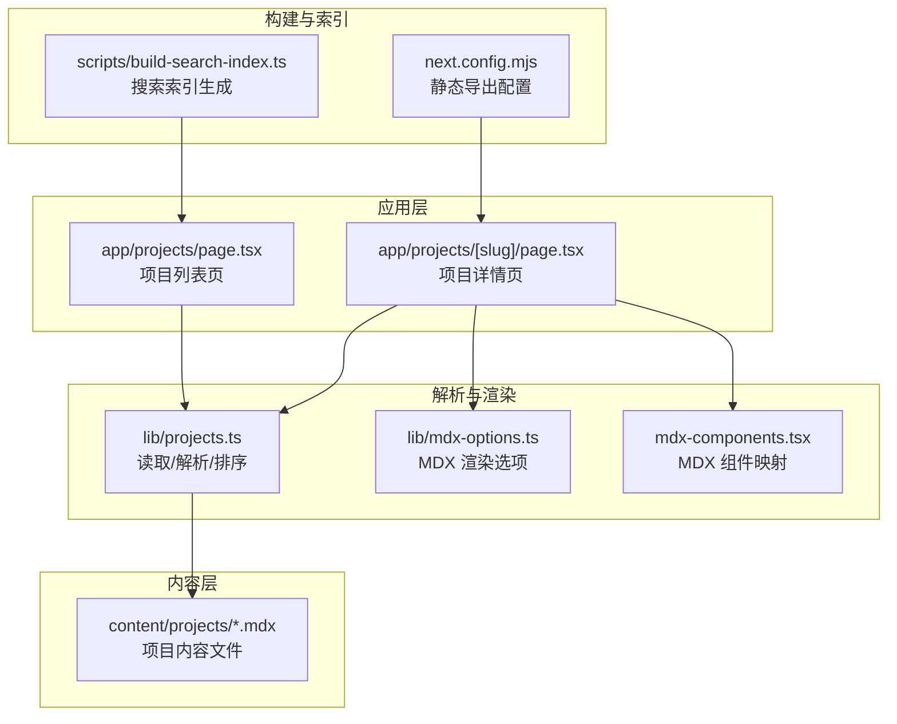
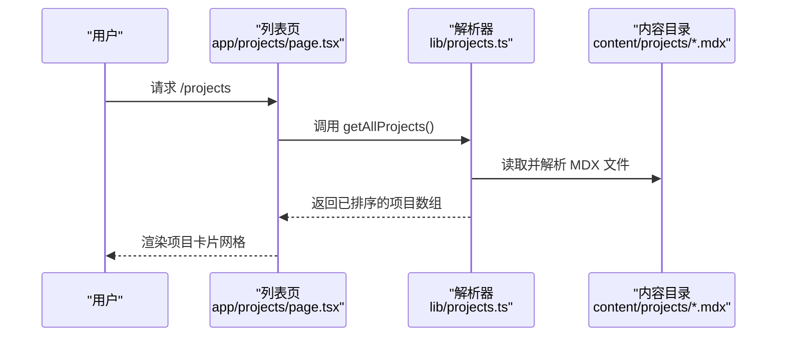
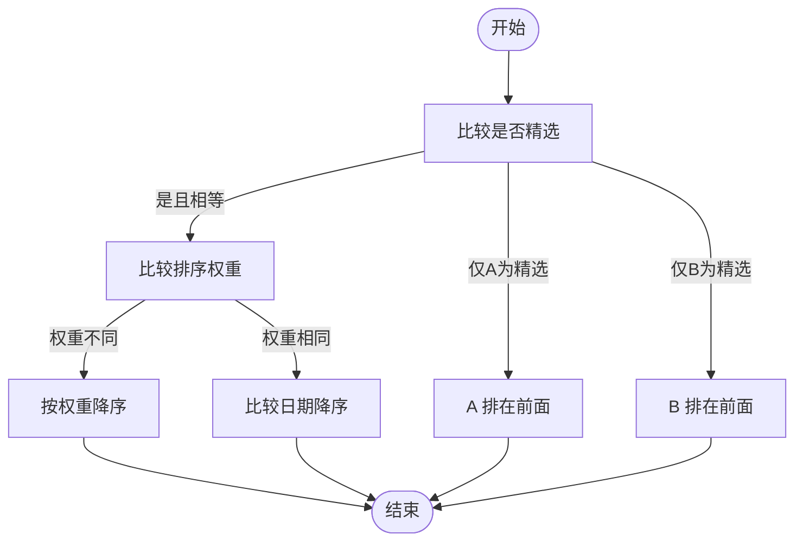
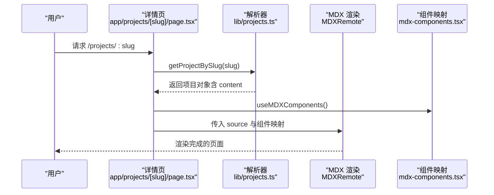

# 项目档案系统

<cite>
**本文引用的文件**
- [lib/projects.ts](file://lib/projects.ts)
- [content/projects/example-project.mdx](file://content/projects/example-project.mdx)
- [app/projects/page.tsx](file://app/projects/page.tsx)
- [app/projects/[slug]/page.tsx](file://app/projects/[slug]/page.tsx)
- [lib/mdx-options.ts](file://lib/mdx-options.ts)
- [mdx-components.tsx](file://mdx-components.tsx)
- [scripts/build-search-index.ts](file://scripts/build-search-index.ts)
- [package.json](file://package.json)
- [next.config.mjs](file://next.config.mjs)
- [lib/utils.ts](file://lib/utils.ts)
- [components/tag-filter.tsx](file://components/tag-filter.tsx)
</cite>

## 目录
1. [简介](#简介)
2. [项目结构](#项目结构)
3. [核心组件](#核心组件)
4. [架构总览](#架构总览)
5. [详细组件分析](#详细组件分析)
6. [依赖分析](#依赖分析)
7. [性能考虑](#性能考虑)
8. [故障排查指南](#故障排查指南)
9. [结论](#结论)
10. [附录](#附录)

## 简介
本文件系统性梳理项目档案（Projects）模块的设计与实现，覆盖以下方面：
- 项目 MDX 文件的格式规范与 Frontmatter 元数据结构
- 项目分类与排序规则
- 项目读取、解析与展示机制
- 项目列表页与详情页的实现细节
- 内容创作标准流程与模板建议
- 版本管理与更新策略
- 实用创作模板与最佳实践

## 项目结构
项目档案系统围绕 Next.js App Router 的动态路由与服务端渲染能力构建，采用“内容即数据”的设计：所有项目以 MDX 文件形式存放在 content 目录中，运行时通过灰度解析（gray-matter）提取 Frontmatter 元数据与正文内容，随后使用 MDX Remote 在客户端渲染。

图表来源
- [app/projects/page.tsx:1-96](file://app/projects/page.tsx#L1-L96)
- [app/projects/[slug]/page.tsx](file://app/projects/[slug]/page.tsx#L1-L105)
- [lib/projects.ts:1-64](file://lib/projects.ts#L1-L64)
- [lib/mdx-options.ts:1-20](file://lib/mdx-options.ts#L1-L20)
- [mdx-components.tsx:1-31](file://mdx-components.tsx#L1-L31)
- [next.config.mjs:1-19](file://next.config.mjs#L1-L19)
- [scripts/build-search-index.ts:1-95](file://scripts/build-search-index.ts#L1-L95)

章节来源
- [app/projects/page.tsx:1-96](file://app/projects/page.tsx#L1-L96)
- [app/projects/[slug]/page.tsx](file://app/projects/[slug]/page.tsx#L1-L105)
- [lib/projects.ts:1-64](file://lib/projects.ts#L1-L64)
- [lib/mdx-options.ts:1-20](file://lib/mdx-options.ts#L1-L20)
- [mdx-components.tsx:1-31](file://mdx-components.tsx#L1-L31)
- [next.config.mjs:1-19](file://next.config.mjs#L1-L19)
- [scripts/build-search-index.ts:1-95](file://scripts/build-search-index.ts#L1-L95)

## 核心组件
- 项目数据模型与解析器
  - 数据模型：包含标题、日期、摘要、技术栈、链接、封面、是否精选、排序优先级等字段；同时派生出 slug 与 content 字段。
  - 解析器：从 content/projects 目录读取 .mdx/.md 文件，使用 gray-matter 提取 Frontmatter 与正文，过滤无效条目后统一返回。
- 列表页与详情页
  - 列表页：展示精选标记、标题、摘要、技术栈标签、外链按钮等；支持空态提示。
  - 详情页：基于 MDX Remote 渲染正文，支持内部链接自动转为 Next.js Link，外部链接新开窗口；支持生成静态参数与页面元信息。
- MDX 渲染管线
  - 使用 remark-gfm、rehype-slug、rehype-autolink-headings、rehype-pretty-code 等插件，提供代码高亮与标题锚点。
- 搜索索引
  - 构建阶段聚合 posts/projects/reports 的 Frontmatter 信息，输出 public/search-index.json，供前端搜索使用。

章节来源
- [lib/projects.ts:5-20](file://lib/projects.ts#L5-L20)
- [lib/projects.ts:28-63](file://lib/projects.ts#L28-L63)
- [app/projects/page.tsx:10-95](file://app/projects/page.tsx#L10-L95)
- [app/projects/[slug]/page.tsx](file://app/projects/[slug]/page.tsx#L29-L104)
- [lib/mdx-options.ts:12-19](file://lib/mdx-options.ts#L12-L19)
- [mdx-components.tsx:5-29](file://mdx-components.tsx#L5-L29)
- [scripts/build-search-index.ts:29-88](file://scripts/build-search-index.ts#L29-L88)

## 架构总览
项目档案系统遵循“内容驱动”的架构：内容文件作为单一事实来源，解析器负责标准化数据，页面组件负责展示与交互，构建脚本负责生成静态资源与索引。

图表来源
- [app/projects/page.tsx:10-11](file://app/projects/page.tsx#L10-L11)
- [lib/projects.ts:28-63](file://lib/projects.ts#L28-L63)

章节来源
- [app/projects/page.tsx:10-11](file://app/projects/page.tsx#L10-L11)
- [lib/projects.ts:28-63](file://lib/projects.ts#L28-L63)

## 详细组件分析

### 项目 Frontmatter 元数据结构
- 必填字段
  - title：字符串，项目标题
- 常用字段
  - date：字符串或日期，用于排序与展示
  - summary：字符串，项目摘要
  - stack：字符串数组，技术栈标签
  - url：字符串，线上演示地址
  - repo：字符串，源码仓库地址
  - cover：字符串，封面图路径
  - featured：布尔值，是否置顶展示
  - order：数值，排序权重（数值越大越靠前）
- 解析与默认值
  - 解析器会对缺失字段提供默认值，确保渲染稳定性。

章节来源
- [lib/projects.ts:5-20](file://lib/projects.ts#L5-L20)
- [lib/projects.ts:37-53](file://lib/projects.ts#L37-L53)
- [content/projects/example-project.mdx:1-10](file://content/projects/example-project.mdx#L1-L10)

### 项目排序规则
- 排序优先级
  1) 是否精选（featured）：true 优先于 false
  2) 排序权重（order）：数值降序
  3) 日期（date）：降序（新到旧）
- 该规则保证“精选项目”优先展示，其次按自定义权重排列，最后按时间回退。

图表来源
- [lib/projects.ts:56-60](file://lib/projects.ts#L56-L60)

章节来源
- [lib/projects.ts:56-60](file://lib/projects.ts#L56-L60)

### 项目列表页实现细节
- 功能要点
  - 获取全部项目并渲染网格卡片
  - 展示精选徽标、标题、摘要、技术栈标签
  - 可选的外链按钮（演示地址、源码仓库）
  - 空态提示：当无项目时提示放置 .mdx 文件的位置
- 样式与交互
  - 使用 Tailwind CSS 实现响应式网格布局
  - 卡片悬停效果与无障碍访问（aria-label）

章节来源
- [app/projects/page.tsx:10-95](file://app/projects/page.tsx#L10-L95)

### 项目详情页实现细节
- 功能要点
  - 基于 MDX Remote 渲染正文内容
  - 内部链接自动转为 Next.js Link，外部链接新开窗口
  - 支持生成静态参数（SSG），提升 SEO 与性能
  - 动态生成页面元信息（标题、描述）
- MDX 渲染配置
  - 使用 remark-gfm、rehype-slug、rehype-autolink-headings、rehype-pretty-code 插件
  - 代码块主题与语言默认值由配置文件统一管理

图表来源
- [app/projects/[slug]/page.tsx](file://app/projects/[slug]/page.tsx#L29-L104)
- [lib/projects.ts:24-26](file://lib/projects.ts#L24-L26)
- [mdx-components.tsx:5-29](file://mdx-components.tsx#L5-L29)
- [lib/mdx-options.ts:12-19](file://lib/mdx-options.ts#L12-L19)

章节来源
- [app/projects/[slug]/page.tsx](file://app/projects/[slug]/page.tsx#L11-L27)
- [app/projects/[slug]/page.tsx](file://app/projects/[slug]/page.tsx#L29-L104)
- [mdx-components.tsx:5-29](file://mdx-components.tsx#L5-L29)
- [lib/mdx-options.ts:12-19](file://lib/mdx-options.ts#L12-L19)

### MDX 渲染与组件映射
- 插件生态
  - remark-gfm：支持 GitHub 风格表格等
  - rehype-slug：为标题生成锚点
  - rehype-autolink-headings：自动添加标题锚点链接
  - rehype-pretty-code：代码高亮与美化
- 组件映射
  - 将 <a> 标签自动区分内外链：内部链接使用 Next.js Link，外部链接新开窗口并设置安全属性

章节来源
- [lib/mdx-options.ts:1-20](file://lib/mdx-options.ts#L1-L20)
- [mdx-components.tsx:5-29](file://mdx-components.tsx#L5-L29)

### 搜索索引与构建流程
- 索引范围
  - 聚合 posts/projects/reports 的 Frontmatter 信息，生成统一的搜索索引
- 输出位置
  - public/search-index.json，供前端搜索使用
- 触发时机
  - 构建前后钩子（prebuild/dev）自动执行脚本

章节来源
- [scripts/build-search-index.ts:29-88](file://scripts/build-search-index.ts#L29-L88)
- [scripts/build-search-index.ts:90-95](file://scripts/build-search-index.ts#L90-L95)
- [package.json:6-13](file://package.json#L6-L13)

### 构建与部署配置
- 静态导出
  - 使用 next.config.mjs 的 output: 'export'，便于部署至静态托管平台
- 图像优化
  - images.unoptimized: true，适配静态导出场景
- 严格模式
  - reactStrictMode: true，提升开发体验与稳定性

章节来源
- [next.config.mjs:7-16](file://next.config.mjs#L7-L16)

### 辅助工具与通用组件
- 工具函数
  - cn：类名合并（clsx + tailwind-merge）
  - formatDate：本地化日期格式化
  - readingTime：估算阅读时长（中英文混合文本）
- 标签筛选组件（参考）
  - 用于文章模块的标签过滤逻辑，可借鉴其交互模式与动画过渡

章节来源
- [lib/utils.ts:4-23](file://lib/utils.ts#L4-L23)
- [components/tag-filter.tsx:14-76](file://components/tag-filter.tsx#L14-L76)

## 依赖分析
- 运行时依赖
  - next、@next/mdx、next-mdx-remote：App Router 与 MDX 渲染
  - gray-matter：Frontmatter 解析
  - remark-gfm、rehype-*：Markdown/HTML 处理与代码高亮
  - fuse.js：客户端搜索（与构建脚本生成的索引配合）
- 开发依赖
  - typescript、tailwindcss、@types/*：类型与样式支持

章节来源
- [package.json:14-33](file://package.json#L14-L33)

## 性能考虑
- 静态生成与预渲染
  - 列表页与详情页均采用静态生成（SSG），减少首屏延迟
- 构建期索引生成
  - 将搜索索引提前生成，避免运行时计算开销
- MDX 渲染优化
  - 使用轻量插件组合，避免过度处理导致体积膨胀
- 图像与资源
  - 静态导出模式下关闭图像优化，减少复杂度

## 故障排查指南
- 项目未显示在列表页
  - 检查 Frontmatter 是否包含必填字段 title
  - 确认文件扩展名为 .mdx 或 .md，且位于 content/projects/ 目录
- 详情页 404
  - 确认 slug 与文件名一致（不含扩展名）
  - 检查 generateStaticParams 是否正确返回所有 slug
- MDX 内容渲染异常
  - 确认 mdx-components.tsx 中的组件映射未被意外覆盖
  - 检查 mdx-options.ts 的插件配置是否与内容匹配
- 搜索结果为空
  - 确认构建脚本已执行，public/search-index.json 已生成
  - 检查 Frontmatter 字段是否完整（title、date、summary 等）

章节来源
- [lib/projects.ts:37-39](file://lib/projects.ts#L37-L39)
- [app/projects/[slug]/page.tsx](file://app/projects/[slug]/page.tsx#L11-L13)
- [mdx-components.tsx:5-29](file://mdx-components.tsx#L5-L29)
- [lib/mdx-options.ts:12-19](file://lib/mdx-options.ts#L12-L19)
- [scripts/build-search-index.ts:90-95](file://scripts/build-search-index.ts#L90-L95)

## 结论
项目档案系统以简洁的 MDX 内容与标准化的解析流程为核心，结合 Next.js 的现代特性与 MDX 生态，实现了高性能、可维护、可扩展的项目展示方案。通过清晰的 Frontmatter 结构、稳定的排序规则与完善的渲染管线，作者可以专注于内容创作，读者则获得一致、流畅的浏览体验。

## 附录

### 项目 MDX 文件格式规范
- 文件命名
  - 建议使用语义化名称 + 连字符分隔，扩展名为 .mdx
- Frontmatter 字段
  - 必填：title
  - 常用：date、summary、stack、url、repo、cover、featured、order
- 正文内容
  - 支持 Markdown 语法与 MDX 组件
  - 建议包含“解决的问题”“设计要点”“成果与影响”等结构化段落

章节来源
- [content/projects/example-project.mdx:1-23](file://content/projects/example-project.mdx#L1-L23)
- [lib/projects.ts:5-20](file://lib/projects.ts#L5-L20)

### 内容创作标准流程
- 准备阶段
  - 明确项目目标、技术栈与关键成果
- 撰写阶段
  - 填写 Frontmatter，撰写正文，插入必要的图片与链接
- 发布阶段
  - 确保文件放入 content/projects/，执行构建脚本生成索引
  - 预览并检查链接、渲染与排序

### 版本管理与更新策略
- 版本标识
  - 使用 Frontmatter 的 date 字段作为版本/时间戳
- 更新策略
  - 新增项目：提交新的 .mdx 文件
  - 修改项目：更新 Frontmatter 与正文，必要时调整 order 与 featured
  - 删除项目：移除对应文件，清理静态参数与索引

### 创作模板与最佳实践
- 模板结构建议
  - 标题与摘要：简明扼要，突出价值
  - 技术栈：使用短语化标签，便于筛选与检索
  - 链接：提供演示地址与源码仓库，增强可信度
  - 正文：按“问题—方案—成果”组织，辅以截图与数据
- 最佳实践
  - 保持 Frontmatter 字段一致性
  - 控制正文长度，突出重点
  - 使用代码高亮与内联链接，提升可读性
  - 定期更新日期与排序，维持内容新鲜度