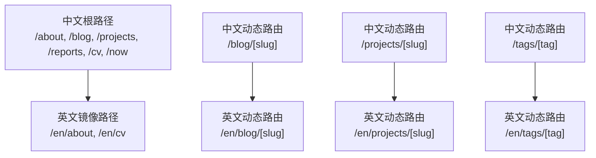
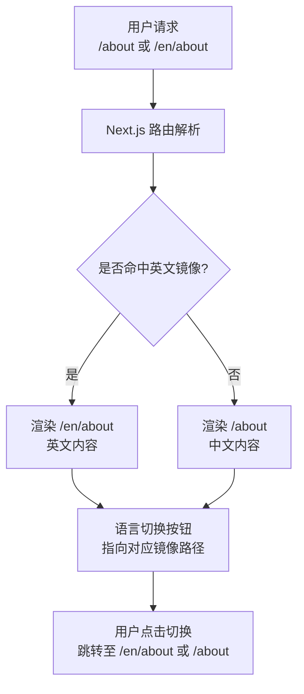
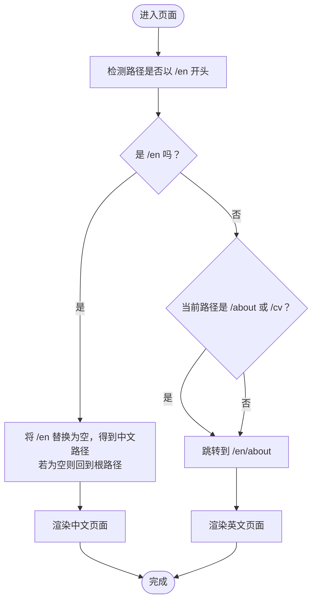
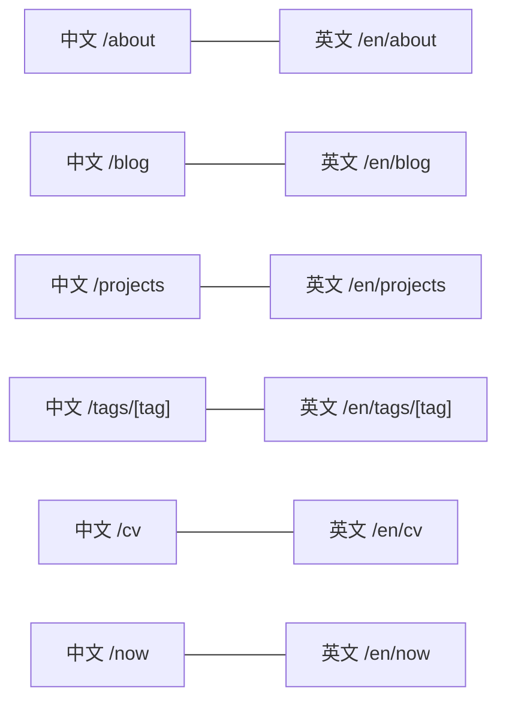
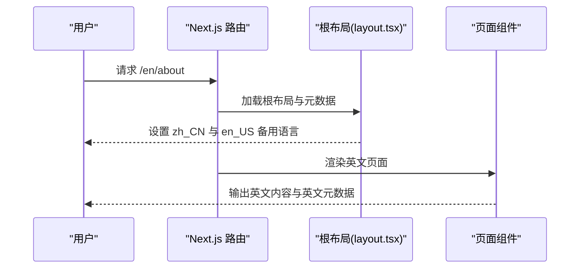
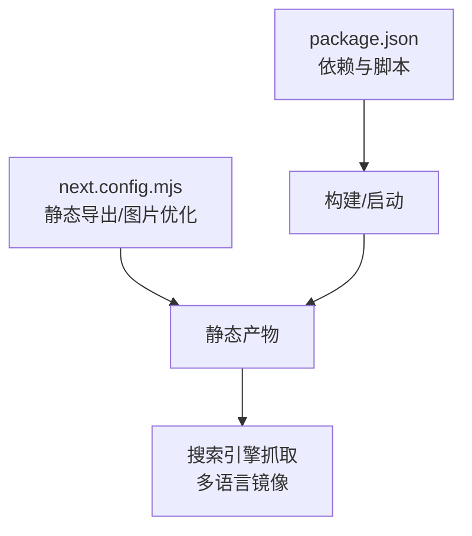

# 国际化系统

<cite>
**本文引用的文件**
- [app/layout.tsx](file://app/layout.tsx)
- [components/site-header.tsx](file://components/site-header.tsx)
- [app/about/page.tsx](file://app/about/page.tsx)
- [app/en/about/page.tsx](file://app/en/about/page.tsx)
- [app/blog/page.tsx](file://app/blog/page.tsx)
- [lib/posts.ts](file://lib/posts.ts)
- [lib/projects.ts](file://lib/projects.ts)
- [lib/utils.ts](file://lib/utils.ts)
- [next.config.mjs](file://next.config.mjs)
- [package.json](file://package.json)
</cite>

## 目录
1. [简介](#简介)
2. [项目结构](#项目结构)
3. [核心组件](#核心组件)
4. [架构总览](#架构总览)
5. [详细组件分析](#详细组件分析)
6. [依赖关系分析](#依赖关系分析)
7. [性能考量](#性能考量)
8. [故障排查指南](#故障排查指南)
9. [结论](#结论)
10. [附录](#附录)

## 简介
本文件系统性梳理 myWebsite 的国际化（中英双语）实现，覆盖以下方面：
- 架构与路由组织：以目录分层的方式实现中英镜像页面，根级默认中文，英文镜像位于 /en 路径下。
- 国际化内容组织：中文页面与英文页面一一对应，通过硬编码的导航与语言切换按钮驱动切换。
- 英文镜像页面创建与同步策略：基于路径映射与静态导出，确保中英页面结构一致。
- 语言切换机制与用户体验：客户端计算当前语言状态，动态生成语言切换链接，保持导航与页内文案一致。
- SEO 影响与优化：通过元数据与 Open Graph 的语言与备用语言设置，提升多语言 SEO 可发现性。
- 测试与验证方法：端到端验证语言切换、镜像页面存在性与内容一致性。

## 项目结构
国际化采用“目录镜像”策略：
- 根路径为中文内容（默认语言），例如 /about、/blog、/projects、/reports、/cv、/now。
- 英文镜像位于 /en 下，例如 /en/about、/en/cv。
- 博客详情页与项目详情页等动态路由也遵循该规则，如 /blog/[slug] 对应 /en/blog/[slug]。

图表来源
- [app/about/page.tsx](file://app/about/page.tsx)
- [app/en/about/page.tsx](file://app/en/about/page.tsx)
- [app/blog/page.tsx](file://app/blog/page.tsx)
- [lib/posts.ts](file://lib/posts.ts)
- [lib/projects.ts](file://lib/projects.ts)

章节来源
- [app/about/page.tsx](file://app/about/page.tsx)
- [app/en/about/page.tsx](file://app/en/about/page.tsx)
- [app/blog/page.tsx](file://app/blog/page.tsx)
- [lib/posts.ts](file://lib/posts.ts)
- [lib/projects.ts](file://lib/projects.ts)

## 核心组件
- 根布局与元数据
  - 根布局设置默认语言为 zh-CN，并在 Open Graph 中声明 zh_CN 为主语言、en_US 为备用语言，有助于搜索引擎识别多语言结构。
  - 页面标题、描述、作者、关键词等均以中文为主，英文镜像通过各自页面单独定义。
- 语言切换组件
  - 导航栏中的语言切换按钮根据当前路径决定目标链接：若当前在 /en，则切换回中文对应路径；否则切换到 /en/about 或 /en/cv 等英文镜像。
  - 切换按钮的可访问性标签根据当前语言显示“切换到中文/英文”，提升无障碍体验。
- 内容页面
  - 中文页面与英文页面结构与文案一一对应，英文页面在导航与页内提供返回中文的链接，反之亦然。
  - 动态路由页面（如博客、项目）在英文镜像下同样提供对应英文内容，保持路径与层级一致。

章节来源
- [app/layout.tsx](file://app/layout.tsx)
- [components/site-header.tsx](file://components/site-header.tsx)
- [app/about/page.tsx](file://app/about/page.tsx)
- [app/en/about/page.tsx](file://app/en/about/page.tsx)

## 架构总览
整体国际化由“静态导出 + 目录镜像 + 客户端切换”构成，构建产物为静态 HTML，便于部署与 SEO。

图表来源
- [components/site-header.tsx](file://components/site-header.tsx)
- [app/about/page.tsx](file://app/about/page.tsx)
- [app/en/about/page.tsx](file://app/en/about/page.tsx)

## 详细组件分析

### 语言切换机制与用户体验
- 切换逻辑
  - 使用客户端路径判断当前是否处于 /en 前缀。
  - 若处于 /en：将 /en 替换为 “” 并回退到中文对应路径，若结果为空则回到根路径。
  - 若不在 /en：针对 /about 与 /cv 页面直接跳转到 /en/about 与 /en/cv；其他页面默认跳转到 /en/about。
- 可访问性与文案
  - 切换按钮的 aria-label 根据当前语言动态设置，提示“切换到中文/英文”。
  - 按钮文案使用小字号中英文标识，兼顾空间与清晰度。
- 导航联动
  - 导航项保持中文，语言切换按钮独立存在，避免破坏中文导航的统一性。

图表来源
- [components/site-header.tsx](file://components/site-header.tsx)

章节来源
- [components/site-header.tsx](file://components/site-header.tsx)

### 中文与英文页面的组织与镜像
- 页面映射
  - 中文：/about、/blog、/projects、/reports、/cv、/now
  - 英文：/en/about、/en/cv
  - 动态路由：/blog/[slug] ↔ /en/blog/[slug]，/projects/[slug] ↔ /en/projects/[slug]，/tags/[tag] ↔ /en/tags/[tag]
- 内容一致性
  - 中英文页面结构与区块顺序一致，英文页面在导航与页内提供返回中文的链接，反之亦然。
  - 动态路由页面通过 slug 与英文镜像路径保持一致，确保搜索引擎可正确索引镜像关系。

图表来源
- [app/about/page.tsx](file://app/about/page.tsx)
- [app/en/about/page.tsx](file://app/en/about/page.tsx)
- [app/blog/page.tsx](file://app/blog/page.tsx)
- [lib/posts.ts](file://lib/posts.ts)
- [lib/projects.ts](file://lib/projects.ts)

章节来源
- [app/about/page.tsx](file://app/about/page.tsx)
- [app/en/about/page.tsx](file://app/en/about/page.tsx)
- [app/blog/page.tsx](file://app/blog/page.tsx)
- [lib/posts.ts](file://lib/posts.ts)
- [lib/projects.ts](file://lib/projects.ts)

### SEO 与元数据策略
- 根布局元数据
  - 默认语言 zh-CN，Open Graph 中设置 locale 为 zh_CN，alternateLocale 为 en_US，明确语言与镜像关系。
  - metadataBase 设定为 https://houpan.dev，确保绝对链接与 canonical 关系清晰。
- 页面级元数据
  - 各页面独立设置 title 与 description，中文页面以中文为主，英文镜像页面以英文为主，避免重复内容问题。
- 动态路由与镜像
  - 动态路由页面（如博客、项目）建议在英文镜像下同样提供英文内容与元数据，保持镜像完整性。

图表来源
- [app/layout.tsx](file://app/layout.tsx)
- [app/en/about/page.tsx](file://app/en/about/page.tsx)

章节来源
- [app/layout.tsx](file://app/layout.tsx)
- [app/en/about/page.tsx](file://app/en/about/page.tsx)

### 内容创作与维护指南
- 内容组织
  - 所有新页面需同时提供中文与英文版本，保持路径与结构一致。
  - 动态路由页面（博客、项目）需在 /en 下建立同名路由，并确保 slug 与内容一一对应。
- 翻译流程
  - 以中文为源语言，英文翻译时保持术语与结构一致，避免直译导致的歧义。
  - 在英文页面中保留中文返回链接，增强互操作性。
- 一致性保证
  - 统一使用相同的区块顺序与标题层级，减少维护成本。
  - 对日期格式、阅读时长等工具函数进行本地化适配（如日期格式化函数已固定为 zh-CN）。

章节来源
- [lib/utils.ts](file://lib/utils.ts)
- [lib/posts.ts](file://lib/posts.ts)
- [lib/projects.ts](file://lib/projects.ts)

## 依赖关系分析
- 构建配置
  - Next.js 配置启用静态导出（export），并开启尾斜杠与图片未优化策略，适合静态托管与 SEO。
- 依赖生态
  - 使用 Next.js 16、MDX 相关依赖用于内容渲染，无额外国际化库，降低复杂度。
- 运行时与构建脚本
  - 构建前执行搜索索引脚本，确保内容可被检索，与国际化页面共同提升可发现性。

图表来源
- [next.config.mjs](file://next.config.mjs)
- [package.json](file://package.json)

章节来源
- [next.config.mjs](file://next.config.mjs)
- [package.json](file://package.json)

## 性能考量
- 静态导出优势
  - 产物为静态 HTML，无需运行时渲染，首屏加载快，利于 SEO 与 CDN 缓存。
- 资源体积控制
  - 图片未优化策略适用于静态站点，避免不必要的图像处理开销。
- 路由与导航
  - 客户端仅做简单路径判断与链接生成，不引入重型国际化库，保持轻量。

## 故障排查指南
- 语言切换无效
  - 检查导航栏语言切换按钮的路径生成逻辑，确认当前路径是否正确识别 /en 前缀。
  - 确认英文镜像页面是否存在，例如 /en/about 是否存在。
- 镜像页面缺失
  - 新增页面需同步创建中英文版本，确保路径与结构一致。
- SEO 问题
  - 确认根布局与页面级元数据的语言设置正确，Open Graph 的 alternateLocale 与实际镜像路径匹配。
  - 检查 metadataBase 是否为 https://houpan.dev，避免相对链接导致的索引问题。

章节来源
- [components/site-header.tsx](file://components/site-header.tsx)
- [app/layout.tsx](file://app/layout.tsx)

## 结论
本项目采用“目录镜像 + 客户端切换”的轻量化国际化方案，通过静态导出与清晰的路径映射，实现了中英双语内容的高效维护与发布。配合完善的 SEO 元数据与镜像策略，能够在不引入复杂国际化库的前提下，满足多语言用户需求并提升搜索引擎可见性。

## 附录
- 测试与验证清单
  - 端到端验证：从中文页面点击“EN”切换到英文页面，再点击“中文版本”返回中文页面。
  - 镜像完整性：确认 /about、/blog、/projects、/reports、/cv、/now 均有对应的 /en 版本。
  - 动态路由：访问 /blog/[slug] 与 /projects/[slug]，确认英文镜像路径与内容一致。
  - SEO 校验：检查页面元数据与 Open Graph 设置，确认 zh_CN 与 en_US 的镜像关系正确。
- 维护建议
  - 新增页面时同步创建中英文版本，避免遗漏。
  - 保持导航与页内链接的一致性，确保用户在任一语言下都能顺畅浏览。