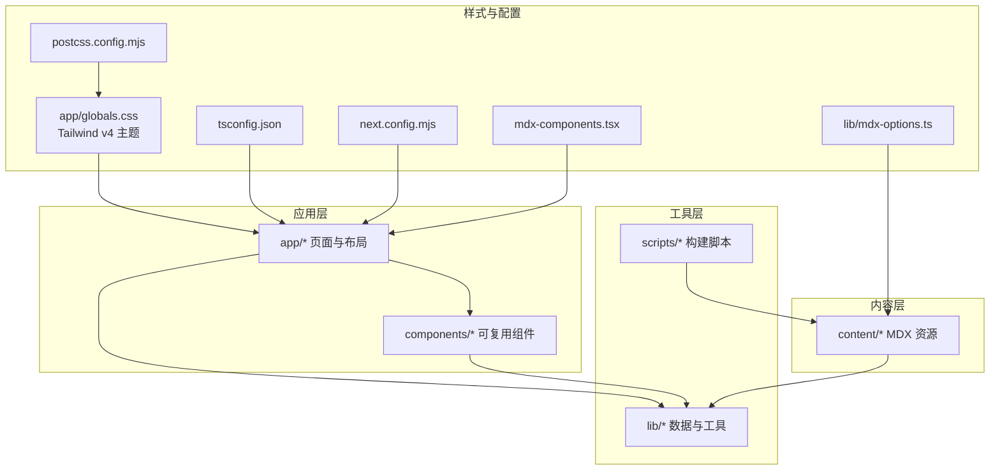
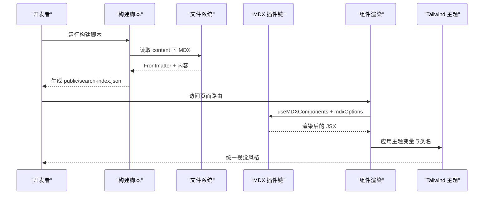
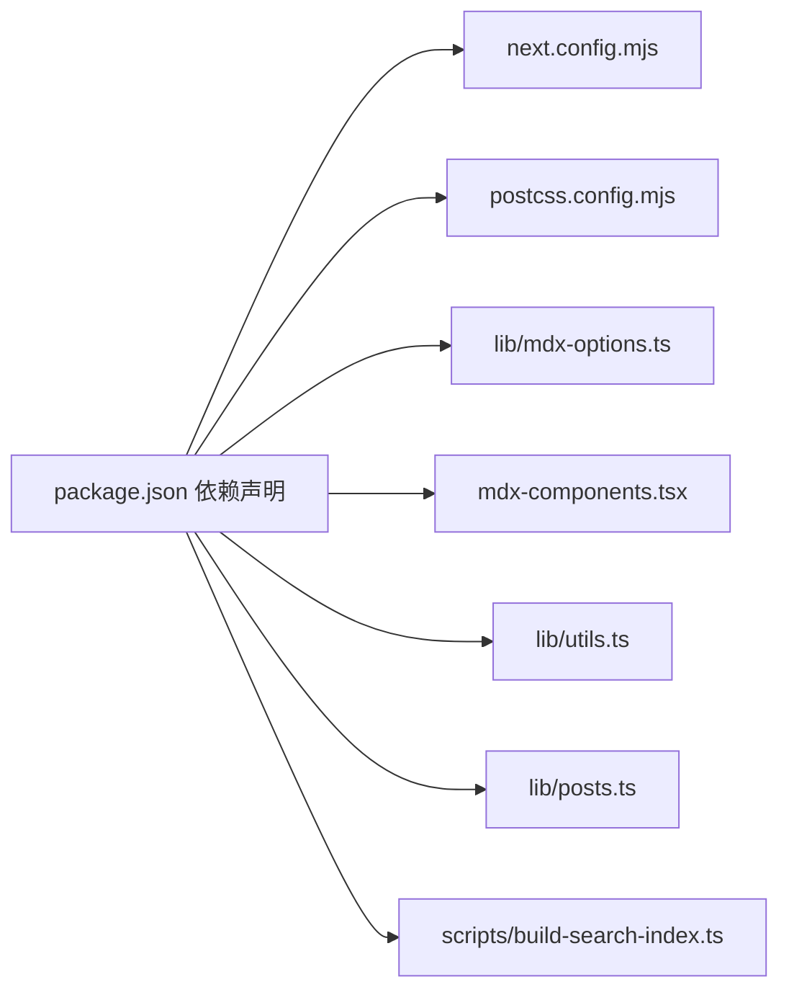

# 代码规范

<cite>
**本文引用的文件**
- [package.json](file://package.json)
- [tsconfig.json](file://tsconfig.json)
- [next.config.mjs](file://next.config.mjs)
- [postcss.config.mjs](file://postcss.config.mjs)
- [mdx-components.tsx](file://mdx-components.tsx)
- [lib/mdx-options.ts](file://lib/mdx-options.ts)
- [app/layout.tsx](file://app/layout.tsx)
- [app/globals.css](file://app/globals.css)
- [components/site-header.tsx](file://components/site-header.tsx)
- [components/site-footer.tsx](file://components/site-footer.tsx)
- [components/hero.tsx](file://components/hero.tsx)
- [components/post-card.tsx](file://components/post-card.tsx)
- [lib/utils.ts](file://lib/utils.ts)
- [lib/posts.ts](file://lib/posts.ts)
- [content/projects/example-project.mdx](file://content/projects/example-project.mdx)
- [content/reports/2026-05-13-e1-045-tools-distribution.mdx](file://content/reports/2026-05-13-e1-045-tools-distribution.mdx)
- [scripts/build-search-index.ts](file://scripts/build-search-index.ts)
</cite>

## 目录
1. [简介](#简介)
2. [项目结构](#项目结构)
3. [核心组件](#核心组件)
4. [架构总览](#架构总览)
5. [详细组件分析](#详细组件分析)
6. [依赖分析](#依赖分析)
7. [性能考虑](#性能考虑)
8. [故障排查指南](#故障排查指南)
9. [结论](#结论)
10. [附录](#附录)

## 简介
本指南面向 myWebsite 项目，提供从 TypeScript 编码规范、React 组件开发标准、Tailwind CSS 样式与设计令牌使用、MDX 内容编写风格，到代码格式化、Lint 规则与自动化检查的完整落地实践。内容基于仓库现有实现进行提炼与扩展，确保新老成员都能快速达成一致的工程实践。

## 项目结构
项目采用 Next.js App Router 结构，核心目录与职责如下：
- app：页面路由与全局布局
- components：可复用 UI 组件
- lib：数据访问与通用工具
- content：MDX 内容资源
- scripts：构建期脚本（如搜索索引）
- 样式：通过 Tailwind v4 主题变量集中管理
- 配置：TypeScript、Next.js、PostCSS、MDX 插件等

图表来源
- [app/layout.tsx:1-57](file://app/layout.tsx#L1-L57)
- [app/globals.css:1-278](file://app/globals.css#L1-L278)
- [lib/mdx-options.ts:1-20](file://lib/mdx-options.ts#L1-L20)
- [mdx-components.tsx:1-31](file://mdx-components.tsx#L1-L31)
- [lib/posts.ts:1-98](file://lib/posts.ts#L1-L98)
- [scripts/build-search-index.ts:1-95](file://scripts/build-search-index.ts#L1-L95)

章节来源
- [package.json:1-48](file://package.json#L1-L48)
- [tsconfig.json:1-45](file://tsconfig.json#L1-L45)
- [next.config.mjs:1-19](file://next.config.mjs#L1-L19)
- [postcss.config.mjs:1-6](file://postcss.config.mjs#L1-L6)

## 核心组件
- 布局与元数据：根布局负责站点元信息与全局样式注入，确保统一的主题与 SEO 配置。
- 导航与页脚：导航组件处理语言切换、活动状态与搜索入口；页脚提供版权与外部链接。
- 卡片与画布：文章卡片组件展示标题、摘要、标签与阅读时长；Hero 组件使用 Canvas 实现粒子动画与交互高光。
- MDX 渲染：通过 MDX 组件工厂与插件选项，统一内外链样式与代码块美化。
- 工具函数：类名合并、日期格式化、阅读时长计算；内容解析：灰机解析 Frontmatter，聚合标签与分类。

章节来源
- [app/layout.tsx:1-57](file://app/layout.tsx#L1-L57)
- [components/site-header.tsx:1-103](file://components/site-header.tsx#L1-L103)
- [components/site-footer.tsx:1-40](file://components/site-footer.tsx#L1-L40)
- [components/post-card.tsx:1-81](file://components/post-card.tsx#L1-L81)
- [components/hero.tsx:1-227](file://components/hero.tsx#L1-L227)
- [lib/utils.ts:1-24](file://lib/utils.ts#L1-L24)
- [lib/posts.ts:1-98](file://lib/posts.ts#L1-L98)
- [mdx-components.tsx:1-31](file://mdx-components.tsx#L1-L31)
- [lib/mdx-options.ts:1-20](file://lib/mdx-options.ts#L1-L20)

## 架构总览
整体由“内容 → 解析 → 渲染 → 样式”的流水线构成。构建期脚本生成搜索索引；运行时通过 MDX 插件链渲染内容；Tailwind v4 主题变量驱动视觉系统。

图表来源
- [scripts/build-search-index.ts:1-95](file://scripts/build-search-index.ts#L1-L95)
- [lib/mdx-options.ts:1-20](file://lib/mdx-options.ts#L1-L20)
- [mdx-components.tsx:1-31](file://mdx-components.tsx#L1-L31)
- [app/globals.css:1-278](file://app/globals.css#L1-L278)

## 详细组件分析

### TypeScript 编码规范与类型定义最佳实践
- 严格模式与无 emit：启用严格类型检查，禁止编译输出，配合独立的类型检查脚本。
- 路径别名：通过路径映射简化导入，避免相对路径过深。
- 类型导出：对跨模块共享的数据结构（如 Post、Category）进行明确的接口与类型导出，便于消费端约束。
- 工具函数类型：对输入输出进行明确约束，例如日期格式化与阅读时长计算，保证调用方契约清晰。

章节来源
- [tsconfig.json:1-45](file://tsconfig.json#L1-L45)
- [lib/posts.ts:1-98](file://lib/posts.ts#L1-L98)
- [lib/utils.ts:1-24](file://lib/utils.ts#L1-L24)

### React 组件开发编码标准
- 文件命名：组件文件使用帕斯卡命名，页面路由以小写命名，保持目录与文件名一致。
- 组件结构：优先使用函数组件与 Hooks；将副作用逻辑隔离在独立 Hook 或组件内部；合理拆分展示与容器逻辑。
- 样式与主题：统一使用主题变量与 Tailwind 类，避免内联样式；必要时通过工具函数合并类名。
- 可访问性：为交互元素提供语义化标签与 aria 属性；为键盘可访问性留出空间。
- 国际化：在导航中提供语言切换逻辑，确保路由与文案适配多语言场景。

章节来源
- [components/site-header.tsx:1-103](file://components/site-header.tsx#L1-L103)
- [components/site-footer.tsx:1-40](file://components/site-footer.tsx#L1-L40)
- [components/hero.tsx:1-227](file://components/hero.tsx#L1-L227)
- [components/post-card.tsx:1-81](file://components/post-card.tsx#L1-L81)
- [app/layout.tsx:1-57](file://app/layout.tsx#L1-L57)

### Hooks 使用规范
- 状态管理：使用 useState 管理本地 UI 状态；useEffect 管理副作用与清理；useRef 获取 DOM 引用。
- 动画与交互：结合 Framer Motion 提供流畅过渡；鼠标事件中使用 useMotionValue/useMotionTemplate 实现高光效果。
- 生命周期：在组件卸载时清理定时器、事件监听与动画帧，防止内存泄漏。

章节来源
- [components/hero.tsx:1-227](file://components/hero.tsx#L1-L227)
- [components/post-card.tsx:1-81](file://components/post-card.tsx#L1-L81)

### Tailwind CSS 样式编写与设计令牌使用
- 设计令牌：通过 CSS 自定义属性集中管理颜色、字体与层级，确保主题一致性与可维护性。
- 组件样式：优先使用主题变量与 Tailwind 工具类组合，避免硬编码颜色值；必要时通过工具函数合并类名。
- 代码块与排版：利用 rehype-pretty-code 与 typography 插件提升代码与正文可读性。
- 打印样式：为 CV 页面提供打印样式，确保输出整洁。

章节来源
- [app/globals.css:1-278](file://app/globals.css#L1-L278)
- [lib/mdx-options.ts:1-20](file://lib/mdx-options.ts#L1-L20)

### MDX 内容编写风格与组件使用规范
- Frontmatter：统一字段（标题、日期、摘要、标签、分类、草稿标记等），确保内容解析一致性。
- 内链与外链：通过 MDX 组件工厂自动区分内外链，统一外链打开方式与样式。
- 代码块：借助插件链实现主题化高亮、行号与选中高亮，提升阅读体验。
- 结构化内容：报告类内容建议按“概览—方法—发现—细节”组织，便于读者快速定位重点。

章节来源
- [mdx-components.tsx:1-31](file://mdx-components.tsx#L1-L31)
- [lib/mdx-options.ts:1-20](file://lib/mdx-options.ts#L1-L20)
- [content/projects/example-project.mdx:1-23](file://content/projects/example-project.mdx#L1-L23)
- [content/reports/2026-05-13-e1-045-tools-distribution.mdx:1-30](file://content/reports/2026-05-13-e1-045-tools-distribution.mdx#L1-L30)

### 代码格式化、Lint 规则与自动化检查
- 类型检查：通过独立脚本执行类型检查，避免与构建流程耦合。
- 构建脚本：在开发与构建前自动执行搜索索引生成，确保内容变更同步生效。
- 静态导出：Next.js 配置为静态导出，便于部署至 GitHub Pages。

章节来源
- [package.json:1-48](file://package.json#L1-L48)
- [scripts/build-search-index.ts:1-95](file://scripts/build-search-index.ts#L1-L95)
- [next.config.mjs:1-19](file://next.config.mjs#L1-L19)

## 依赖分析
- 运行时依赖：Next.js、React、MDX 生态、Framer Motion、Fuse.js、Gray Matter、Tailwind Merge、clsx 等。
- 开发依赖：Tailwind v4、PostCSS、TypeScript、tsx 等。
- 构建期：通过脚本读取 content 目录，生成搜索索引并写入 public。

图表来源
- [package.json:1-48](file://package.json#L1-L48)
- [next.config.mjs:1-19](file://next.config.mjs#L1-L19)
- [postcss.config.mjs:1-6](file://postcss.config.mjs#L1-L6)
- [lib/mdx-options.ts:1-20](file://lib/mdx-options.ts#L1-L20)
- [mdx-components.tsx:1-31](file://mdx-components.tsx#L1-L31)
- [lib/utils.ts:1-24](file://lib/utils.ts#L1-L24)
- [lib/posts.ts:1-98](file://lib/posts.ts#L1-L98)
- [scripts/build-search-index.ts:1-95](file://scripts/build-search-index.ts#L1-L95)

章节来源
- [package.json:1-48](file://package.json#L1-L48)

## 性能考虑
- 静态导出与图片优化：启用静态导出与未优化图片策略，减少运行时开销。
- 动画与画布：在组件卸载时清理动画帧与事件监听，避免后台持续计算。
- 搜索索引：构建期生成索引，客户端仅做查询，降低首屏负担。
- 样式体积：通过主题变量与工具类减少重复样式，避免过度嵌套。

章节来源
- [next.config.mjs:1-19](file://next.config.mjs#L1-L19)
- [components/hero.tsx:1-227](file://components/hero.tsx#L1-L227)
- [scripts/build-search-index.ts:1-95](file://scripts/build-search-index.ts#L1-L95)

## 故障排查指南
- 类型错误：使用类型检查脚本定位问题，逐项修正类型断言与接口定义。
- MDX 渲染异常：检查 MDX 组件工厂与插件配置，确认内外链处理与代码块主题是否正确。
- 样式不生效：核对主题变量是否在全局样式中定义，Tailwind 插件是否正确加载。
- 搜索结果为空：确认构建脚本已执行且 public/search-index.json 存在，字段与 Frontmatter 一致。

章节来源
- [package.json:1-48](file://package.json#L1-L48)
- [mdx-components.tsx:1-31](file://mdx-components.tsx#L1-L31)
- [lib/mdx-options.ts:1-20](file://lib/mdx-options.ts#L1-L20)
- [app/globals.css:1-278](file://app/globals.css#L1-L278)
- [scripts/build-search-index.ts:1-95](file://scripts/build-search-index.ts#L1-L95)

## 结论
本规范以现有实现为基础，围绕类型安全、组件结构、样式体系与内容生态形成闭环。遵循上述约定可显著提升代码一致性、可维护性与开发效率，同时保障站点在多语言、多内容形态下的稳定呈现。

## 附录
- Next.js 配置：静态导出、图片优化、严格模式与 Turbopack 根路径固定。
- PostCSS 配置：Tailwind v4 插件加载。
- MDX 插件链：GFM、标题锚点、代码高亮与主题选择。
- 构建脚本：统一读取 content 下 MDX，生成搜索索引。

章节来源
- [next.config.mjs:1-19](file://next.config.mjs#L1-L19)
- [postcss.config.mjs:1-6](file://postcss.config.mjs#L1-L6)
- [lib/mdx-options.ts:1-20](file://lib/mdx-options.ts#L1-L20)
- [scripts/build-search-index.ts:1-95](file://scripts/build-search-index.ts#L1-L95)