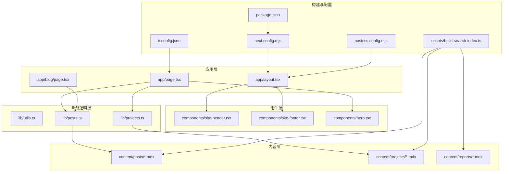
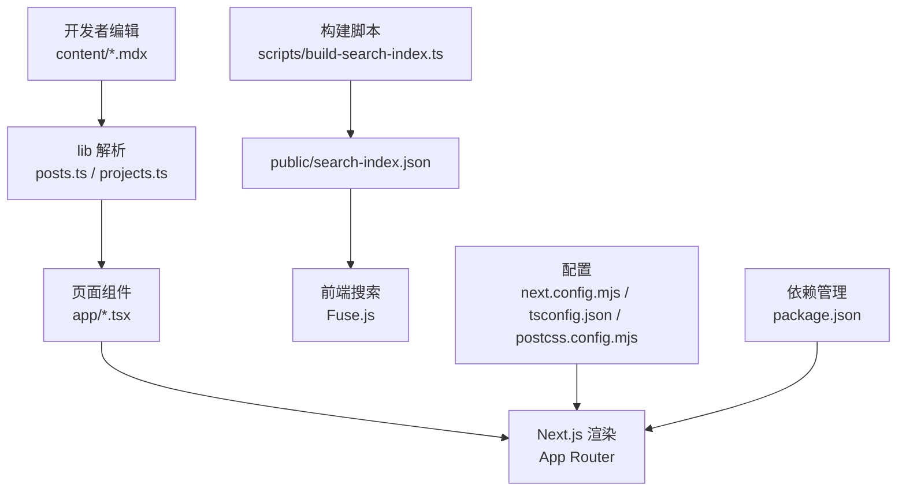
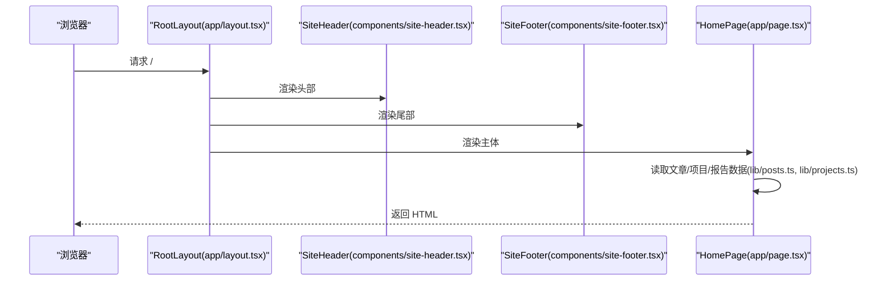
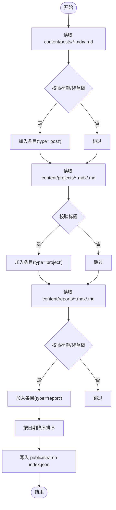
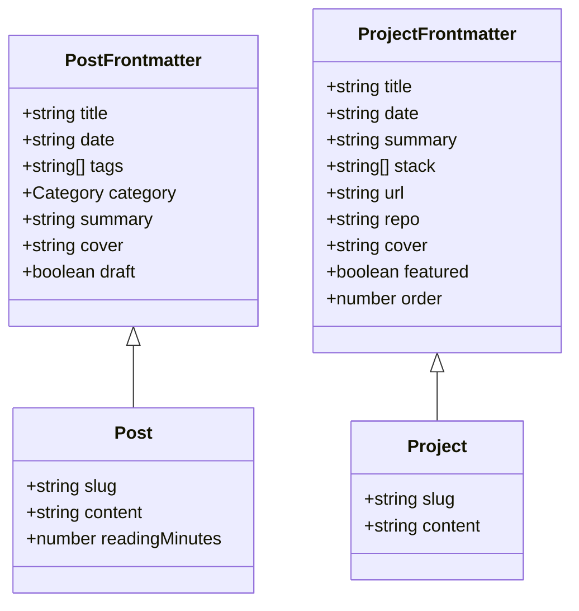
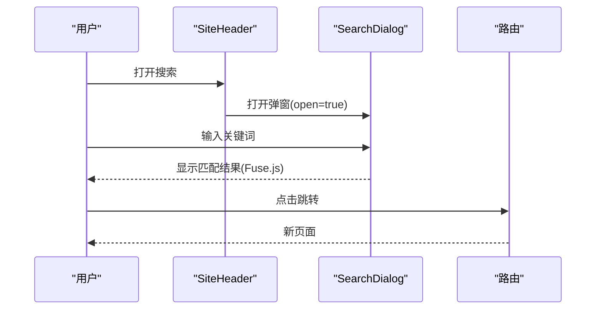
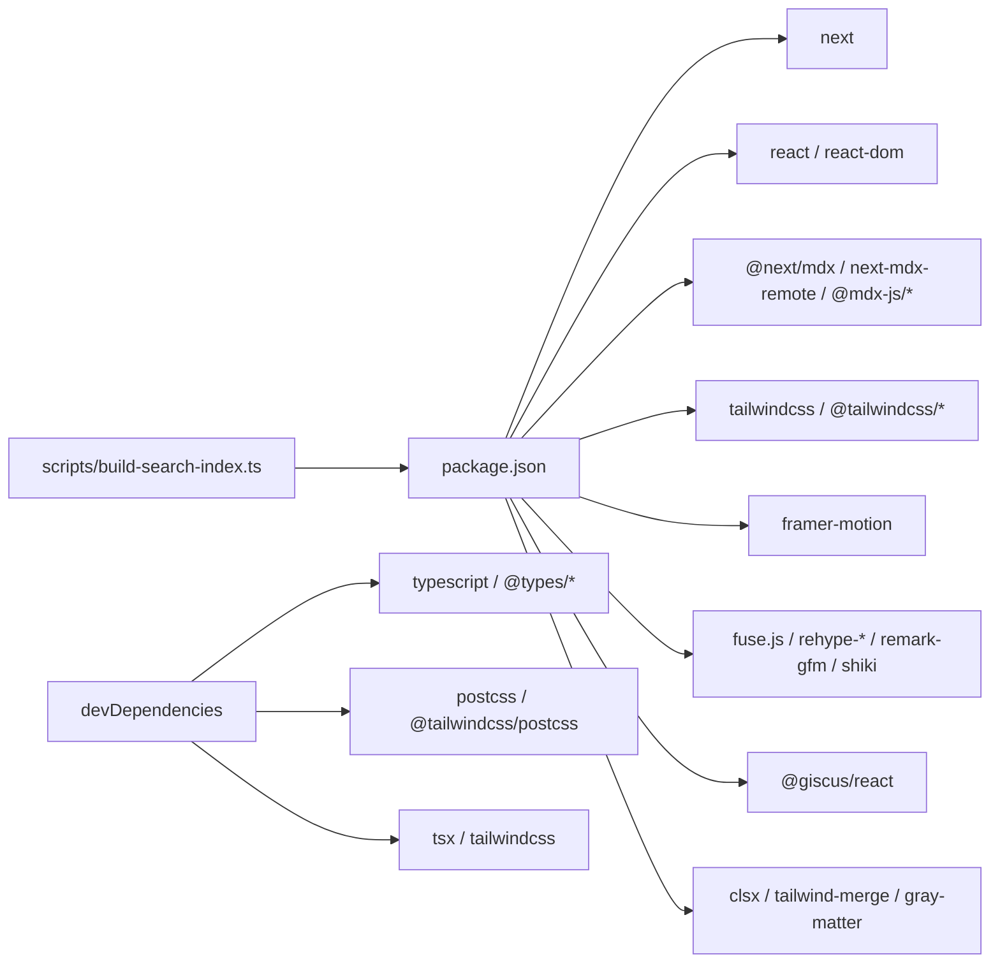

# 开发指南

<cite>
**本文引用的文件**
- [package.json](file://package.json)
- [README.md](file://README.md)
- [next.config.mjs](file://next.config.mjs)
- [tsconfig.json](file://tsconfig.json)
- [postcss.config.mjs](file://postcss.config.mjs)
- [app/layout.tsx](file://app/layout.tsx)
- [app/page.tsx](file://app/page.tsx)
- [app/blog/page.tsx](file://app/blog/page.tsx)
- [lib/utils.ts](file://lib/utils.ts)
- [lib/posts.ts](file://lib/posts.ts)
- [lib/projects.ts](file://lib/projects.ts)
- [components/site-header.tsx](file://components/site-header.tsx)
- [components/site-footer.tsx](file://components/site-footer.tsx)
- [components/hero.tsx](file://components/hero.tsx)
- [scripts/build-search-index.ts](file://scripts/build-search-index.ts)
</cite>

## 目录
1. [简介](#简介)
2. [项目结构](#项目结构)
3. [核心组件](#核心组件)
4. [架构总览](#架构总览)
5. [详细组件分析](#详细组件分析)
6. [依赖分析](#依赖分析)
7. [性能考虑](#性能考虑)
8. [故障排除指南](#故障排除指南)
9. [结论](#结论)
10. [附录](#附录)

## 简介
本指南面向希望参与 myWebsite 项目开发的开发者，覆盖本地环境搭建、开发工作流、调试与故障排除、代码规范与最佳实践、测试与质量保障以及开发工具推荐。项目基于 Next.js 16 App Router、React 19、TypeScript，采用 Tailwind v4、MDX、Fuse.js 搜索、Giscus 评论等技术栈，并通过 GitHub Actions 自动化部署至 GitHub Pages。

## 项目结构
项目采用“特性驱动”的目录组织方式，核心模块如下：
- app：Next.js App Router 路由与页面
- components：通用 UI 组件
- content：MDX 内容（文章、项目、报告）
- lib：业务逻辑（文章、项目、报告、工具函数）
- public：静态资源与构建期生成的搜索索引
- scripts：构建期脚本（如搜索索引生成）
- 配置文件：next.config.mjs、tsconfig.json、postcss.config.mjs、package.json

图表来源
- [app/layout.tsx:1-57](file://app/layout.tsx#L1-L57)
- [app/page.tsx:1-157](file://app/page.tsx#L1-L157)
- [app/blog/page.tsx:1-28](file://app/blog/page.tsx#L1-L28)
- [lib/posts.ts:1-98](file://lib/posts.ts#L1-L98)
- [lib/projects.ts:1-64](file://lib/projects.ts#L1-L64)
- [components/site-header.tsx:1-103](file://components/site-header.tsx#L1-L103)
- [components/site-footer.tsx:1-40](file://components/site-footer.tsx#L1-L40)
- [components/hero.tsx:1-227](file://components/hero.tsx#L1-L227)
- [scripts/build-search-index.ts:1-95](file://scripts/build-search-index.ts#L1-L95)
- [next.config.mjs:1-19](file://next.config.mjs#L1-L19)
- [tsconfig.json:1-45](file://tsconfig.json#L1-L45)
- [postcss.config.mjs:1-6](file://postcss.config.mjs#L1-L6)
- [package.json:1-48](file://package.json#L1-L48)

章节来源
- [README.md:122-135](file://README.md#L122-L135)

## 核心组件
- 应用布局与元数据：定义站点标题、描述、Open Graph、Twitter 卡片等，并包裹全局样式与头部/尾部组件。
- 主页：聚合 Hero、Now 条、精选项目、最新文章、最新报告。
- 博客页：列出所有文章并支持标签筛选。
- 业务逻辑：统一从 content 目录读取 MDX，解析 Frontmatter，生成文章、项目、报告数据结构。
- 搜索索引：构建期扫描 content 下的 posts、projects、reports，生成 public/search-index.json，供前端搜索使用。
- 组件：导航头、页脚、英雄区（含粒子动画与标签轮播）、文章卡片、标签过滤器等。

章节来源
- [app/layout.tsx:1-57](file://app/layout.tsx#L1-L57)
- [app/page.tsx:1-157](file://app/page.tsx#L1-L157)
- [app/blog/page.tsx:1-28](file://app/blog/page.tsx#L1-L28)
- [lib/utils.ts:1-24](file://lib/utils.ts#L1-L24)
- [lib/posts.ts:1-98](file://lib/posts.ts#L1-L98)
- [lib/projects.ts:1-64](file://lib/projects.ts#L1-L64)
- [components/site-header.tsx:1-103](file://components/site-header.tsx#L1-L103)
- [components/site-footer.tsx:1-40](file://components/site-footer.tsx#L1-L40)
- [components/hero.tsx:1-227](file://components/hero.tsx#L1-L227)
- [scripts/build-search-index.ts:1-95](file://scripts/build-search-index.ts#L1-L95)

## 架构总览
系统采用“内容即数据”的架构：内容以 MDX 形式存储在 content 目录，运行时通过 lib 层解析并渲染；构建期通过脚本生成搜索索引；Next.js 16 App Router 提供路由与页面渲染；Tailwind v4 负责样式；Fuse.js 实现前端搜索；Giscus 提供评论能力。

图表来源
- [lib/posts.ts:1-98](file://lib/posts.ts#L1-L98)
- [lib/projects.ts:1-64](file://lib/projects.ts#L1-L64)
- [scripts/build-search-index.ts:1-95](file://scripts/build-search-index.ts#L1-L95)
- [next.config.mjs:1-19](file://next.config.mjs#L1-L19)
- [tsconfig.json:1-45](file://tsconfig.json#L1-L45)
- [postcss.config.mjs:1-6](file://postcss.config.mjs#L1-L6)
- [package.json:1-48](file://package.json#L1-L48)

## 详细组件分析

### 页面与布局
- 应用布局负责注入全局样式、设置元数据、挂载头部与尾部组件。
- 主页聚合多个区块：Hero、Now 条、精选项目、最新文章、最新报告；使用工具函数格式化日期与计算阅读时长。
- 博客页展示文章列表与标签过滤器，标签数据来自 lib 层。

图表来源
- [app/layout.tsx:1-57](file://app/layout.tsx#L1-L57)
- [components/site-header.tsx:1-103](file://components/site-header.tsx#L1-L103)
- [components/site-footer.tsx:1-40](file://components/site-footer.tsx#L1-L40)
- [app/page.tsx:1-157](file://app/page.tsx#L1-L157)
- [lib/posts.ts:1-98](file://lib/posts.ts#L1-L98)
- [lib/projects.ts:1-64](file://lib/projects.ts#L1-L64)

章节来源
- [app/layout.tsx:1-57](file://app/layout.tsx#L1-L57)
- [app/page.tsx:1-157](file://app/page.tsx#L1-L157)
- [app/blog/page.tsx:1-28](file://app/blog/page.tsx#L1-L28)

### 搜索索引构建流程
构建脚本在 predev/prebuild 阶段执行，扫描 content 下的 posts、projects、reports，过滤草稿与必填字段，生成统一的搜索条目并写入 public/search-index.json。

图表来源
- [scripts/build-search-index.ts:1-95](file://scripts/build-search-index.ts#L1-L95)

章节来源
- [scripts/build-search-index.ts:1-95](file://scripts/build-search-index.ts#L1-L95)

### 文章与项目数据模型
- 文章 Frontmatter 支持标题、日期、标签、分类、摘要、封面、草稿等字段；运行时计算阅读时长。
- 项目 Frontmatter 支持标题、日期、摘要、技术栈、链接、仓库、封面、精选与排序等字段；按精选优先、order 倒序、日期倒序排序。

图表来源
- [lib/posts.ts:8-22](file://lib/posts.ts#L8-L22)
- [lib/projects.ts:5-20](file://lib/projects.ts#L5-L20)

章节来源
- [lib/posts.ts:1-98](file://lib/posts.ts#L1-L98)
- [lib/projects.ts:1-64](file://lib/projects.ts#L1-L64)

### 组件交互与状态
- 导航头根据当前路径高亮活动项，支持中英文切换与搜索弹窗。
- 英文镜像路由仅对 about/cv 或首页生效，其余路径切换到 /en/about。
- Hero 组件包含粒子动画与标签轮播，Canvas 动画在客户端运行。

图表来源
- [components/site-header.tsx:1-103](file://components/site-header.tsx#L1-L103)

章节来源
- [components/site-header.tsx:1-103](file://components/site-header.tsx#L1-L103)
- [components/hero.tsx:1-227](file://components/hero.tsx#L1-L227)

## 依赖分析
- 运行时依赖：Next.js、React、MDX 生态、Tailwind、Framer Motion、Fuse.js、Giscus、Shiki 等。
- 开发依赖：Tailwind 插件、TypeScript、PostCSS、tsx 等。
- 构建脚本：通过 predev/prebuild 钩子自动执行搜索索引生成。

图表来源
- [package.json:1-48](file://package.json#L1-L48)
- [scripts/build-search-index.ts:1-95](file://scripts/build-search-index.ts#L1-L95)

章节来源
- [package.json:1-48](file://package.json#L1-L48)
- [postcss.config.mjs:1-6](file://postcss.config.mjs#L1-L6)
- [tsconfig.json:1-45](file://tsconfig.json#L1-L45)

## 性能考虑
- 静态导出：next.config.mjs 设置 output 为 export，配合 trailingSlash 与图片未优化配置，适合 GitHub Pages。
- 构建期生成搜索索引：减少运行时 IO 与解析成本，提升搜索响应速度。
- 组件懒加载与动画：Hero 使用 Canvas 动画，建议在移动端谨慎启用或降低粒子密度。
- 资源体积控制：Tailwind v4 与 CSS 变量减少重复样式，合理拆分组件避免单文件过大。
- 类型检查：通过 typecheck 脚本在本地提前发现类型问题，减少运行时错误。

章节来源
- [next.config.mjs:1-19](file://next.config.mjs#L1-L19)
- [scripts/build-search-index.ts:1-95](file://scripts/build-search-index.ts#L1-L95)
- [package.json:12-12](file://package.json#L12-L12)

## 故障排除指南
- 本地无法启动
  - 确认已安装 pnpm 并执行安装依赖与启动命令。
  - 若 predev/prebuild 报错，检查 scripts/build-search-index.ts 是否能正确读取 content 下的 MDX 文件。
- 搜索无结果
  - 确认 public/search-index.json 是否存在且包含条目；若缺失，删除后重新执行构建钩子。
- 文章/项目未显示
  - 检查 Frontmatter 是否包含必要字段（文章需 title、date，非 draft）；项目需 title。
  - 确认文件扩展名为 .mdx 或 .md。
- 评论不显示
  - 未配置 Giscus 时会显示提示文字，不影响页面渲染；按 README 步骤配置后生效。
- 部署异常
  - 用户主页仓库需命名为 <username>.github.io；项目仓库需在 next.config.mjs 中配置 basePath/assetPrefix。
- 类型错误
  - 执行 typecheck 脚本定位问题；确保 tsconfig.json 的 strict/noEmit 等选项符合预期。

章节来源
- [README.md:31-42](file://README.md#L31-L42)
- [README.md:103-121](file://README.md#L103-L121)
- [README.md:88-102](file://README.md#L88-L102)
- [scripts/build-search-index.ts:29-88](file://scripts/build-search-index.ts#L29-L88)
- [lib/posts.ts:33-58](file://lib/posts.ts#L33-L58)
- [lib/projects.ts:34-54](file://lib/projects.ts#L34-L54)
- [package.json:12-12](file://package.json#L12-L12)
- [tsconfig.json:11-12](file://tsconfig.json#L11-L12)

## 结论
本指南提供了从环境搭建到开发、调试、测试与部署的完整路径。遵循内容即数据的设计理念与构建期索引生成机制，可确保站点在 GitHub Pages 上稳定运行。建议在新增内容与组件时，严格遵守 Frontmatter 规范与类型约束，保持一致的开发与命名约定。

## 附录

### 本地开发环境搭建
- 安装依赖：使用 pnpm 安装。
- 启动开发服务器：执行 dev 脚本，访问 http://localhost:3000。
- 构建产物：执行 build 脚本，输出静态文件至 out/。
- 类型检查：执行 typecheck 脚本进行类型验证。

章节来源
- [README.md:31-38](file://README.md#L31-L38)
- [package.json:6-12](file://package.json#L6-L12)

### 开发工作流程
- 新增文章：在 content/posts/ 创建 YYYY-MM-DD-slug.mdx，填写 Frontmatter 并编写正文。
- 新增项目：在 content/projects/ 创建 <slug>.mdx，填写项目 Frontmatter。
- 新增报告：在 content/reports/ 创建 <slug>.mdx，支持交互式内容与 public/reports/<slug>/index.html。
- 组件开发：在 components/ 新建或修改组件，注意使用 cn 工具类合并样式。
- 功能扩展：在 lib/ 新增数据处理逻辑，必要时更新 scripts/build-search-index.ts 以纳入搜索索引。

章节来源
- [README.md:43-87](file://README.md#L43-L87)
- [lib/utils.ts:4-6](file://lib/utils.ts#L4-L6)

### 调试技巧与最佳实践
- 使用 Next.js Strict Mode 与 React DevTools 检查组件树与渲染性能。
- 在本地 .env.local 配置 Giscus 变量以便预览评论。
- 使用 typecheck 与 ESLint（如启用）在提交前进行静态检查。
- 控制日志输出，避免在生产构建中打印调试信息。

章节来源
- [next.config.mjs:11-11](file://next.config.mjs#L11-L11)
- [README.md:112-121](file://README.md#L112-L121)
- [package.json:35-46](file://package.json#L35-L46)

### 测试与质量保证
- 单元测试：针对 lib 层函数（如日期格式化、阅读时长计算）编写测试。
- 端到端测试：使用 Playwright/Cypress 对关键页面（首页、博客、项目、报告）进行回归测试。
- 类型安全：保持 tsconfig.json 的严格模式，确保所有组件与函数具备明确类型。
- 构建验证：每次变更后执行 build 与 typecheck，确保静态导出可用且无类型错误。

章节来源
- [tsconfig.json:11-11](file://tsconfig.json#L11-L11)
- [package.json:12-12](file://package.json#L12-L12)

### 开发工具推荐
- 包管理：pnpm（锁定文件与工作区友好）。
- 编辑器：VS Code（Tailwind IntelliSense、ES7+ React Snippets、TypeScript TSServer）。
- 浏览器：Chrome DevTools（性能、网络、渲染面板）。
- 任务运行：tsx（直接运行 TS/JS 脚本，如构建索引）。
- 样式：Tailwind v4（CSS-first，结合 CSS 变量与暗色主题）。

章节来源
- [postcss.config.mjs:1-6](file://postcss.config.mjs#L1-L6)
- [package.json:35-46](file://package.json#L35-L46)