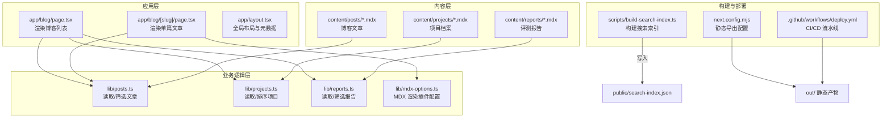
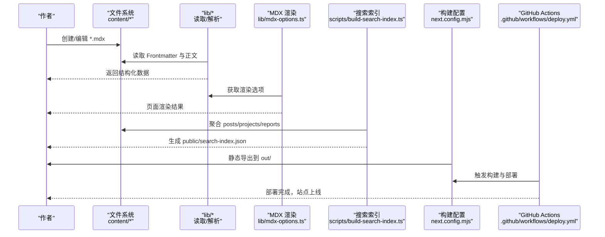
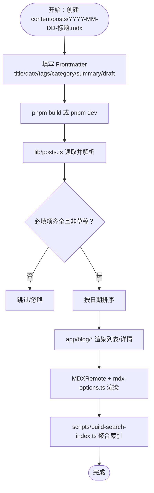
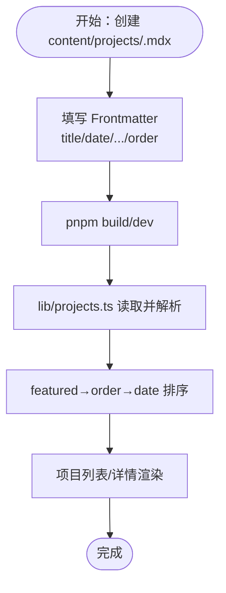
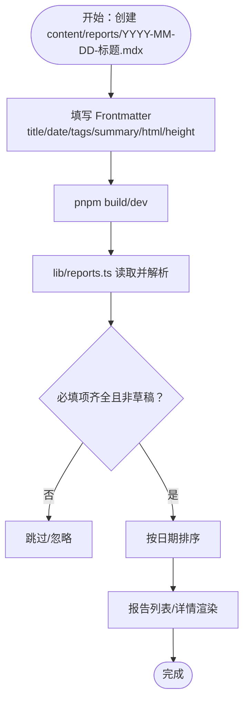
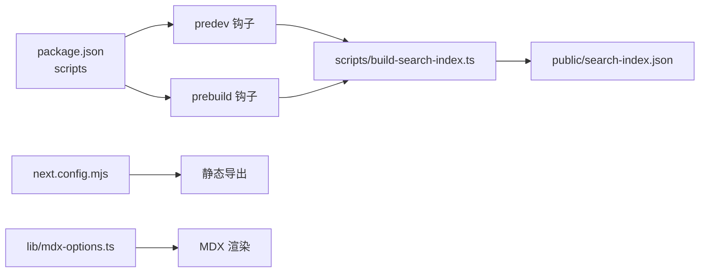

# 开发流程

<cite>
**本文引用的文件**
- [README.md](file://README.md)
- [package.json](file://package.json)
- [next.config.mjs](file://next.config.mjs)
- [.github/workflows/deploy.yml](file://.github/workflows/deploy.yml)
- [scripts/build-search-index.ts](file://scripts/build-search-index.ts)
- [lib/mdx-options.ts](file://lib/mdx-options.ts)
- [lib/posts.ts](file://lib/posts.ts)
- [lib/projects.ts](file://lib/projects.ts)
- [lib/reports.ts](file://lib/reports.ts)
- [content/projects/example-project.mdx](file://content/projects/example-project.mdx)
- [content/reports/2026-05-13-e1-045-tools-distribution.mdx](file://content/reports/2026-05-13-e1-045-tools-distribution.mdx)
- [app/blog/page.tsx](file://app/blog/page.tsx)
- [app/blog/[slug]/page.tsx](file://app/blog/[slug]/page.tsx)
- [components/post-card.tsx](file://components/post-card.tsx)
- [app/layout.tsx](file://app/layout.tsx)
</cite>

## 目录
1. [简介](#简介)
2. [项目结构](#项目结构)
3. [核心组件](#核心组件)
4. [架构总览](#架构总览)
5. [详细组件分析](#详细组件分析)
6. [依赖分析](#依赖分析)
7. [性能考虑](#性能考虑)
8. [故障排查指南](#故障排查指南)
9. [结论](#结论)
10. [附录](#附录)

## 简介
本指南面向“myWebsite”项目的作者与协作者，系统化说明新内容创建流程（博客文章、项目档案、评测报告）、MDX 编写规范与 Frontmatter 元数据配置、内容组织与命名约定、发布前检查清单与质量保证流程，以及内容版本管理与协作开发工作流。目标是让每位贡献者都能以一致的方式产出高质量内容，并确保构建与部署稳定可靠。

## 项目结构
该站点采用 Next.js App Router + 静态导出（output: export）的架构，内容以 MDX 放置于 content 目录，运行时通过 lib 层读取并渲染，构建期生成搜索索引与静态产物，最终部署至 GitHub Pages。

图示来源
- [app/blog/page.tsx:1-28](file://app/blog/page.tsx#L1-L28)
- [app/blog/[slug]/page.tsx](file://app/blog/[slug]/page.tsx#L1-L98)
- [app/layout.tsx:1-57](file://app/layout.tsx#L1-L57)
- [lib/posts.ts:1-98](file://lib/posts.ts#L1-L98)
- [lib/projects.ts:1-64](file://lib/projects.ts#L1-L64)
- [lib/reports.ts:1-60](file://lib/reports.ts#L1-L60)
- [lib/mdx-options.ts:1-20](file://lib/mdx-options.ts#L1-L20)
- [next.config.mjs:1-19](file://next.config.mjs#L1-L19)
- [scripts/build-search-index.ts:1-95](file://scripts/build-search-index.ts#L1-L95)
- [.github/workflows/deploy.yml:1-64](file://.github/workflows/deploy.yml#L1-L64)

章节来源
- [README.md:6-19](file://README.md#L6-L19)
- [next.config.mjs:6-16](file://next.config.mjs#L6-L16)
- [package.json:6-12](file://package.json#L6-L12)

## 核心组件
- 内容读取与筛选
  - 文章：lib/posts.ts 提供 getAllPosts、getPostBySlug、getAllTags、getAllCategories 等接口，负责从 content/posts 中读取并解析 Frontmatter，过滤草稿，按日期排序。
  - 项目：lib/projects.ts 提供 getAllProjects、getProjectBySlug，支持 featured 与 order 排序。
  - 评测：lib/reports.ts 提供 getAllReports、getReportBySlug，支持 tags、html、height 等字段。
- MDX 渲染
  - lib/mdx-options.ts 配置 remark-gfm、rehype-slug、rehype-autolink-headings、rehype-pretty-code 等插件，统一代码块主题与链接行为。
  - app/blog/[slug]/page.tsx 使用 MDXRemote + useMDXComponents 渲染文章内容。
- 搜索索引
  - scripts/build-search-index.ts 在构建前聚合 posts、projects、reports 的必要字段，输出 public/search-index.json，供前端搜索使用。
- 布局与元数据
  - app/layout.tsx 定义站点元信息、OpenGraph/Twitter 等；app/blog/page.tsx 与 app/blog/[slug]/page.tsx 提供页面级元数据与标签过滤。

章节来源
- [lib/posts.ts:60-98](file://lib/posts.ts#L60-L98)
- [lib/projects.ts:28-64](file://lib/projects.ts#L28-L64)
- [lib/reports.ts:46-60](file://lib/reports.ts#L46-L60)
- [lib/mdx-options.ts:12-19](file://lib/mdx-options.ts#L12-L19)
- [app/blog/[slug]/page.tsx](file://app/blog/[slug]/page.tsx#L84-L90)
- [scripts/build-search-index.ts:29-95](file://scripts/build-search-index.ts#L29-L95)
- [app/layout.tsx:9-44](file://app/layout.tsx#L9-L44)
- [app/blog/page.tsx:1-28](file://app/blog/page.tsx#L1-L28)

## 架构总览
下图展示了“新增内容 → 内容读取 → MDX 渲染 → 搜索索引 → 静态导出 → 部署”的完整流程。

图示来源
- [lib/posts.ts:24-66](file://lib/posts.ts#L24-L66)
- [lib/projects.ts:22-63](file://lib/projects.ts#L22-L63)
- [lib/reports.ts:20-55](file://lib/reports.ts#L20-L55)
- [lib/mdx-options.ts:12-19](file://lib/mdx-options.ts#L12-L19)
- [scripts/build-search-index.ts:29-95](file://scripts/build-search-index.ts#L29-L95)
- [next.config.mjs:7-16](file://next.config.mjs#L7-L16)
- [.github/workflows/deploy.yml:18-64](file://.github/workflows/deploy.yml#L18-L64)

## 详细组件分析

### 博客文章：创建与渲染流程
- 创建步骤
  - 在 content/posts/ 下新建 YYYY-MM-DD-标题.mdx（示例见 README.md）。
  - 填写 Frontmatter 必填项：title、date；常用项：tags、category、summary、draft。
  - 正文支持 MDX，可嵌任意 React 组件。
- 渲染与路由
  - 列表页：app/blog/page.tsx 读取全部文章并渲染标签过滤与文章卡片。
  - 详情页：app/blog/[slug]/page.tsx 动态生成静态参数，读取指定文章，设置页面元数据，使用 MDXRemote 渲染正文。
- 数据模型与校验
  - lib/posts.ts 定义 PostFrontmatter 与 Post 结构，缺失必填或 draft=true 将被忽略或跳过。

图示来源
- [README.md:43-67](file://README.md#L43-L67)
- [lib/posts.ts:26-66](file://lib/posts.ts#L26-L66)
- [app/blog/page.tsx:11-27](file://app/blog/page.tsx#L11-L27)
- [app/blog/[slug]/page.tsx](file://app/blog/[slug]/page.tsx#L13-L36)
- [lib/mdx-options.ts:12-19](file://lib/mdx-options.ts#L12-L19)
- [scripts/build-search-index.ts:29-48](file://scripts/build-search-index.ts#L29-L48)

章节来源
- [README.md:43-67](file://README.md#L43-L67)
- [lib/posts.ts:8-22](file://lib/posts.ts#L8-L22)
- [app/blog/page.tsx:1-28](file://app/blog/page.tsx#L1-L28)
- [app/blog/[slug]/page.tsx](file://app/blog/[slug]/page.tsx#L1-L98)
- [lib/mdx-options.ts:1-20](file://lib/mdx-options.ts#L1-L20)

### 项目档案：创建与排序规则
- 创建步骤
  - 在 content/projects/ 下新建 <slug>.mdx。
  - 填写 Frontmatter：title、date、summary、stack、url、repo、cover、featured、order。
- 排序规则
  - featured 优先，其次按 order 降序，最后按 date 降序。
- 渲染
  - 列表页读取 getAllProjects 并排序，详情页通过 slug 匹配。

图示来源
- [README.md:69-86](file://README.md#L69-L86)
- [lib/projects.ts:28-63](file://lib/projects.ts#L28-L63)
- [content/projects/example-project.mdx:1-23](file://content/projects/example-project.mdx#L1-L23)

章节来源
- [README.md:69-86](file://README.md#L69-L86)
- [lib/projects.ts:5-20](file://lib/projects.ts#L5-L20)
- [content/projects/example-project.mdx:1-23](file://content/projects/example-project.mdx#L1-L23)

### 评测报告：HTML 嵌入与元数据
- 创建步骤
  - 在 content/reports/ 下新建 YYYY-MM-DD-标题.mdx。
  - 常用 Frontmatter：title、date、tags、summary、html（指向 public/reports/<slug>/index.html）、height。
- 渲染
  - lib/reports.ts 读取并解析，缺失必填或 draft=true 将被忽略。
  - 列表页与详情页基于 getAllReports 与 getReportBySlug 渲染。

图示来源
- [README.md:13-13](file://README.md#L13-L13)
- [content/reports/2026-05-13-e1-045-tools-distribution.mdx:1-30](file://content/reports/2026-05-13-e1-045-tools-distribution.mdx#L1-L30)
- [lib/reports.ts:22-55](file://lib/reports.ts#L22-L55)

章节来源
- [README.md:13-13](file://README.md#L13-L13)
- [content/reports/2026-05-13-e1-045-tools-distribution.mdx:1-30](file://content/reports/2026-05-13-e1-045-tools-distribution.mdx#L1-L30)
- [lib/reports.ts:5-18](file://lib/reports.ts#L5-L18)

### MDX 编写规范与 Frontmatter 元数据
- MDX 插件与渲染
  - 使用 remark-gfm、rehype-slug、rehype-autolink-headings、rehype-pretty-code（暗/亮主题、默认语言等）。
  - app/blog/[slug]/page.tsx 通过 MDXRemote + mdxOptions 渲染。
- Frontmatter 字段
  - 文章：title、date、tags、category、summary、cover、draft。
  - 项目：title、date、summary、stack、url、repo、cover、featured、order。
  - 评测：title、date、summary、tags、html、height、draft。
- 命名约定
  - 博客：YYYY-MM-DD-标题.mdx；评测：YYYY-MM-DD-标题.mdx；项目：<slug>.mdx。
  - 标题建议使用短横线分隔，避免特殊字符。

章节来源
- [lib/mdx-options.ts:1-20](file://lib/mdx-options.ts#L1-L20)
- [app/blog/[slug]/page.tsx](file://app/blog/[slug]/page.tsx#L84-L90)
- [README.md:48-86](file://README.md#L48-L86)

### 内容组织与命名约定最佳实践
- 目录结构
  - content/posts、content/projects、content/reports 分类清晰，便于检索与维护。
- 标签与分类
  - 固定标签集合用于统一归档与筛选（见 README.md）。
  - 文章 category：tech / retro / life。
- 文件命名
  - 严格遵循“YYYY-MM-DD-标题.mdx”（博客/评测）与“<slug>.mdx”（项目）。
- 草稿机制
  - draft: true 可临时隐藏内容，避免误发布。

章节来源
- [README.md:20-30](file://README.md#L20-L30)
- [lib/posts.ts:39-43](file://lib/posts.ts#L39-L43)
- [lib/reports.ts:32-32](file://lib/reports.ts#L32-L32)

### 发布前检查清单与质量保证
- 内容层面
  - 标题、摘要、标签、分类是否准确完整。
  - 正文是否符合预期，代码块与链接是否正确。
  - 草稿状态确认（如需发布则设为 false）。
- 构建与索引
  - 执行 pnpm build，确保无类型错误与渲染异常。
  - 检查 public/search-index.json 是否生成并包含最新条目。
- 预览与验证
  - 本地 pnpm dev 预览，确认文章/项目/报告页面渲染与交互正常。
  - 验证标签过滤、阅读时长、OpenGraph 元数据等。
- 部署
  - 推送 main 分支触发 .github/workflows/deploy.yml，确认 GitHub Pages 成功部署。

章节来源
- [package.json:6-12](file://package.json#L6-L12)
- [scripts/build-search-index.ts:90-95](file://scripts/build-search-index.ts#L90-L95)
- [app/blog/[slug]/page.tsx](file://app/blog/[slug]/page.tsx#L17-L36)
- [.github/workflows/deploy.yml:18-64](file://.github/workflows/deploy.yml#L18-L64)

### 版本管理与协作开发工作流
- 分支策略
  - 在本地分支进行内容创作与修改，提交后发起 Pull Request 进行审查。
- 提交规范
  - 内容变更应附带简要说明，突出新增/修改的模块（文章/项目/报告）。
- 依赖与脚本
  - 通过 pnpm 管理依赖，predev/prebuild 钩子自动执行搜索索引构建脚本。
- 部署自动化
  - main 分支推送触发 GitHub Actions，自动构建并部署至 GitHub Pages。

章节来源
- [.github/workflows/deploy.yml:1-64](file://.github/workflows/deploy.yml#L1-L64)
- [package.json:6-12](file://package.json#L6-L12)
- [scripts/build-search-index.ts:1-95](file://scripts/build-search-index.ts#L1-L95)

## 依赖分析
- 构建与导出
  - next.config.mjs 设置 output: export，禁用图片优化，启用严格模式。
- 搜索索引
  - scripts/build-search-index.ts 在 predev/prebuild 钩子中运行，聚合三类内容的必要字段。
- MDX 渲染
  - lib/mdx-options.ts 配置插件，app/blog/[slug]/page.tsx 使用 MDXRemote 渲染。
- 依赖与脚本
  - package.json 定义 predev/prebuild 钩子，调用 tsx scripts/build-search-index.ts。

图示来源
- [package.json:6-12](file://package.json#L6-L12)
- [scripts/build-search-index.ts:1-95](file://scripts/build-search-index.ts#L1-L95)
- [next.config.mjs:7-16](file://next.config.mjs#L7-L16)
- [lib/mdx-options.ts:12-19](file://lib/mdx-options.ts#L12-L19)

章节来源
- [package.json:6-12](file://package.json#L6-L12)
- [next.config.mjs:6-16](file://next.config.mjs#L6-L16)
- [scripts/build-search-index.ts:1-95](file://scripts/build-search-index.ts#L1-L95)

## 性能考虑
- 静态导出与无优化图片
  - next.config.mjs 禁用图片优化，减少运行时开销，适合纯静态站点。
- 构建期生成搜索索引
  - 通过 scripts/build-search-index.ts 在构建阶段生成 JSON 索引，避免运行时计算。
- MDX 渲染插件
  - 代码块着色与标题锚点在构建期处理，降低浏览器端负担。

章节来源
- [next.config.mjs:8-10](file://next.config.mjs#L8-L10)
- [scripts/build-search-index.ts:29-95](file://scripts/build-search-index.ts#L29-L95)
- [lib/mdx-options.ts:6-10](file://lib/mdx-options.ts#L6-L10)

## 故障排查指南
- 文章未出现在列表
  - 检查 Frontmatter 是否包含 title 与 date；草稿 draft 是否为 true。
  - 确认文件扩展名为 .mdx 或 .md，且位于 content/posts/。
- 搜索索引为空或不更新
  - 确保 predev/prebuild 钩子已执行；检查 public/search-index.json 是否存在。
- 部署失败
  - 查看 .github/workflows/deploy.yml 的日志，确认 pnpm 安装、构建步骤成功。
  - 若启用 Giscus，确保仓库 Secrets/Variables 中相关变量已配置。

章节来源
- [lib/posts.ts:39-43](file://lib/posts.ts#L39-L43)
- [lib/reports.ts:28-32](file://lib/reports.ts#L28-L32)
- [scripts/build-search-index.ts:90-95](file://scripts/build-search-index.ts#L90-L95)
- [.github/workflows/deploy.yml:32-43](file://.github/workflows/deploy.yml#L32-L43)

## 结论
本指南提供了从内容创建、Frontmatter 规范、渲染与索引、到构建与部署的全流程方法论。遵循命名约定与检查清单，结合自动化脚本与 CI/CD，可显著提升内容生产效率与质量稳定性。建议团队在 PR 审查中重点核对 Frontmatter 完整性、标签一致性与草稿状态，确保每次发布都可追溯、可验证。

## 附录
- 常用命令
  - pnpm install / pnpm dev / pnpm build / pnpm typecheck
- 关键文件定位
  - 内容目录：content/posts、content/projects、content/reports
  - 业务逻辑：lib/posts.ts、lib/projects.ts、lib/reports.ts
  - MDX 配置：lib/mdx-options.ts
  - 搜索索引：scripts/build-search-index.ts
  - 构建配置：next.config.mjs
  - 部署流水线：.github/workflows/deploy.yml