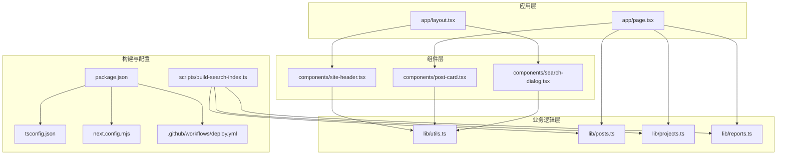
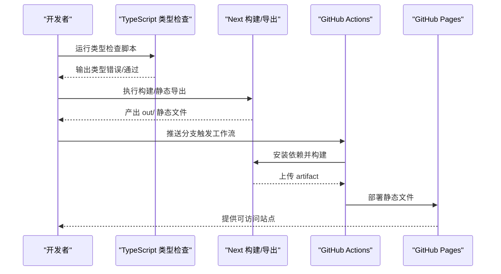
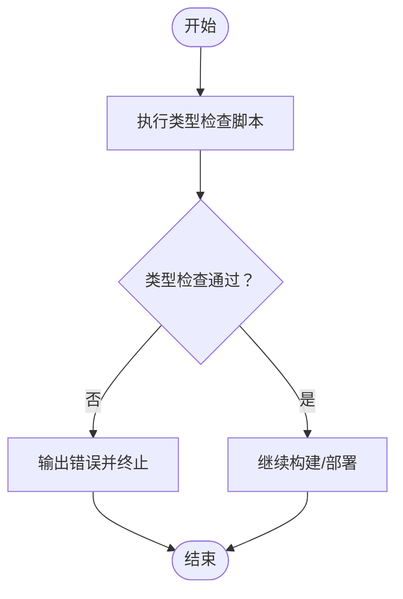
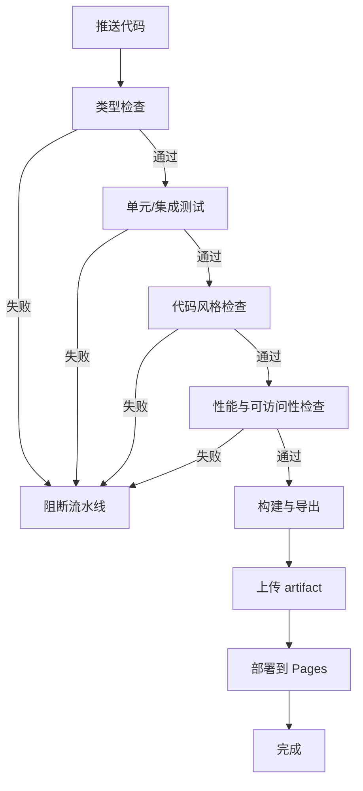
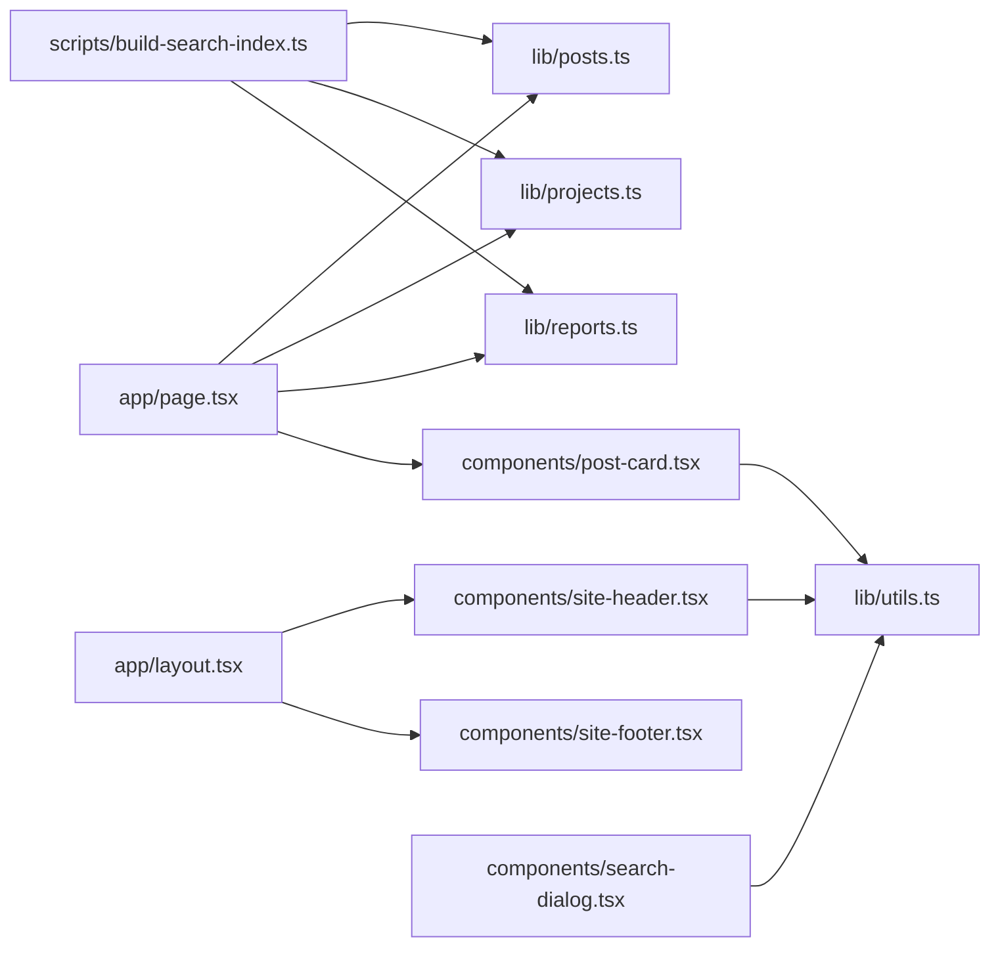

# 测试与质量保证

<cite>
**本文引用的文件**
- [package.json](file://package.json)
- [tsconfig.json](file://tsconfig.json)
- [next.config.mjs](file://next.config.mjs)
- [README.md](file://README.md)
- [.github/workflows/deploy.yml](file://.github/workflows/deploy.yml)
- [components/site-header.tsx](file://components/site-header.tsx)
- [components/post-card.tsx](file://components/post-card.tsx)
- [components/search-dialog.tsx](file://components/search-dialog.tsx)
- [lib/utils.ts](file://lib/utils.ts)
- [lib/posts.ts](file://lib/posts.ts)
- [lib/projects.ts](file://lib/projects.ts)
- [lib/reports.ts](file://lib/reports.ts)
- [scripts/build-search-index.ts](file://scripts/build-search-index.ts)
- [app/layout.tsx](file://app/layout.tsx)
- [app/page.tsx](file://app/page.tsx)
</cite>

## 目录
1. [简介](#简介)
2. [项目结构](#项目结构)
3. [核心组件](#核心组件)
4. [架构总览](#架构总览)
5. [详细组件分析](#详细组件分析)
6. [依赖关系分析](#依赖关系分析)
7. [性能考虑](#性能考虑)
8. [故障排查指南](#故障排查指南)
9. [结论](#结论)
10. [附录](#附录)

## 简介
本指南面向 myWebsite 项目，提供系统化的测试与质量保证实践建议，覆盖以下方面：
- TypeScript 类型检查的配置与运行
- 组件测试与集成测试策略与工具推荐
- 代码质量检查工具的配置与使用
- 性能测试与用户体验测试实施指南
- 持续集成中的质量门禁与自动化测试流程
- 内容质量检查与 SEO 验证方法

本项目采用 Next.js App Router + TypeScript + MDX + Tailwind CSS，静态导出部署至 GitHub Pages。测试与质量保证应围绕类型安全、组件行为、内容一致性、SEO 元数据与构建产物质量展开。

## 项目结构
项目采用功能分层组织：
- 应用层：路由页面与全局布局
- 组件层：可复用 UI 组件
- 业务逻辑层：内容读取与工具函数
- 构建脚本：搜索索引生成
- 配置：TypeScript、Next.js、工作流

图表来源
- [app/layout.tsx:1-57](file://app/layout.tsx#L1-L57)
- [app/page.tsx:1-157](file://app/page.tsx#L1-L157)
- [components/site-header.tsx:1-103](file://components/site-header.tsx#L1-L103)
- [components/post-card.tsx:1-81](file://components/post-card.tsx#L1-L81)
- [components/search-dialog.tsx:1-156](file://components/search-dialog.tsx#L1-L156)
- [lib/utils.ts:1-24](file://lib/utils.ts#L1-L24)
- [lib/posts.ts:1-98](file://lib/posts.ts#L1-L98)
- [lib/projects.ts:1-64](file://lib/projects.ts#L1-L64)
- [lib/reports.ts:1-60](file://lib/reports.ts#L1-L60)
- [scripts/build-search-index.ts:1-95](file://scripts/build-search-index.ts#L1-L95)
- [tsconfig.json:1-45](file://tsconfig.json#L1-L45)
- [next.config.mjs:1-19](file://next.config.mjs#L1-L19)
- [package.json:1-48](file://package.json#L1-L48)
- [.github/workflows/deploy.yml:1-64](file://.github/workflows/deploy.yml#L1-L64)

章节来源
- [README.md:122-135](file://README.md#L122-L135)
- [package.json:6-12](file://package.json#L6-L12)
- [tsconfig.json:1-45](file://tsconfig.json#L1-L45)
- [next.config.mjs:6-16](file://next.config.mjs#L6-L16)

## 核心组件
- 类型检查与构建：通过脚本与配置确保类型安全与构建产物正确性
- 组件职责：
  - 导航与语言切换：site-header
  - 文章卡片与交互：post-card
  - 全局搜索对话框：search-dialog
- 内容读取与工具：
  - posts、projects、reports：统一解析 frontmatter 与内容
  - utils：通用样式合并与日期/阅读时长计算
- 搜索索引：构建期生成，供客户端按需加载

章节来源
- [package.json:12](file://package.json#L12)
- [tsconfig.json:11](file://tsconfig.json#L11)
- [components/site-header.tsx:19-103](file://components/site-header.tsx#L19-L103)
- [components/post-card.tsx:20-81](file://components/post-card.tsx#L20-L81)
- [components/search-dialog.tsx:28-156](file://components/search-dialog.tsx#L28-L156)
- [lib/utils.ts:4-24](file://lib/utils.ts#L4-L24)
- [lib/posts.ts:8-22](file://lib/posts.ts#L8-L22)
- [lib/projects.ts:5-20](file://lib/projects.ts#L5-L20)
- [lib/reports.ts:5-18](file://lib/reports.ts#L5-L18)
- [scripts/build-search-index.ts:29-95](file://scripts/build-search-index.ts#L29-L95)

## 架构总览
下图展示从开发到部署的关键流程，以及质量门禁位置：

图表来源
- [package.json:12](file://package.json#L12)
- [next.config.mjs:8](file://next.config.mjs#L8)
- [.github/workflows/deploy.yml:18-64](file://.github/workflows/deploy.yml#L18-L64)

## 详细组件分析

### 类型系统与类型检查
- 配置要点
  - 严格模式与 noEmit：确保编译阶段发现类型问题
  - bundler 解析与 isolatedModules：适配 Next.js 与 ESM
  - JSX 与增量编译：提升开发体验
- 运行方式
  - 使用脚本命令执行类型检查，失败即中止后续流程

图表来源
- [package.json:12](file://package.json#L12)
- [tsconfig.json:11](file://tsconfig.json#L11)

章节来源
- [package.json:12](file://package.json#L12)
- [tsconfig.json:2-29](file://tsconfig.json#L2-L29)

### 组件测试策略与工具推荐
- 建议采用的工具链
  - 单元测试：vitest（与 jest 生态兼容）
  - 组件测试：@testing-library/react（或 @testing-library/react-hooks）
  - Mock 与环境：jsdom 或 happy-dom
- 测试范围
  - 工具函数：utils 中的 cn、formatDate、readingTime
  - 组件：site-header、post-card、search-dialog 的渲染与交互
  - 数据层：posts、projects、reports 的解析与过滤逻辑
- 测试示例思路（以路径代替具体代码）
  - 工具函数测试：参考 [lib/utils.ts:4-24](file://lib/utils.ts#L4-L24)
  - 组件渲染与交互：参考 [components/site-header.tsx:19-103](file://components/site-header.tsx#L19-L103)、[components/post-card.tsx:20-81](file://components/post-card.tsx#L20-L81)、[components/search-dialog.tsx:28-156](file://components/search-dialog.tsx#L28-L156)
  - 数据层：参考 [lib/posts.ts:60-98](file://lib/posts.ts#L60-L98)、[lib/projects.ts:28-64](file://lib/projects.ts#L28-L64)、[lib/reports.ts:46-60](file://lib/reports.ts#L46-L60)

章节来源
- [lib/utils.ts:4-24](file://lib/utils.ts#L4-L24)
- [components/site-header.tsx:19-103](file://components/site-header.tsx#L19-L103)
- [components/post-card.tsx:20-81](file://components/post-card.tsx#L20-L81)
- [components/search-dialog.tsx:28-156](file://components/search-dialog.tsx#L28-L156)
- [lib/posts.ts:60-98](file://lib/posts.ts#L60-L98)
- [lib/projects.ts:28-64](file://lib/projects.ts#L28-L64)
- [lib/reports.ts:46-60](file://lib/reports.ts#L46-L60)

### 集成测试策略与工具推荐
- 页面级集成测试
  - 使用 Playwright 或 Cypress，对关键页面（首页、文章页、项目页、报告页）进行端到端验证
  - 关注内容加载、导航、搜索、语言切换等关键路径
- 内容与索引
  - 验证搜索索引生成与加载：参考 [scripts/build-search-index.ts:29-95](file://scripts/build-search-index.ts#L29-L95) 与 [components/search-dialog.tsx:33-40](file://components/search-dialog.tsx#L33-L40)
- SEO 元数据
  - 验证页面元信息：参考 [app/layout.tsx:9-44](file://app/layout.tsx#L9-L44)

章节来源
- [scripts/build-search-index.ts:29-95](file://scripts/build-search-index.ts#L29-L95)
- [components/search-dialog.tsx:28-156](file://components/search-dialog.tsx#L28-L156)
- [app/layout.tsx:9-44](file://app/layout.tsx#L9-L44)

### 代码质量检查工具配置与使用
- 推荐工具
  - ESLint + TypeScript 支持（@typescript-eslint）
  - Prettier（统一格式）
  - lint-staged + husky（提交前检查）
- 配置要点
  - 在 tsconfig.json 的严格模式基础上，结合 eslint 规则强化约束
  - 将类型检查与格式化纳入 CI 前置步骤
- 使用建议
  - 在 package.json 中新增 lint 脚本，并在 predev/prebuild 钩子前后运行

章节来源
- [tsconfig.json:11](file://tsconfig.json#L11)
- [package.json:6-12](file://package.json#L6-L12)

### 性能测试与用户体验测试
- 性能指标
  - 首屏加载时间（FCP/LCP）、交互时间（INP）、页面体积
- 工具与方法
  - Lighthouse（CLI 或浏览器扩展）
  - WebPageTest、GTmetrix
  - Next.js Profiling（开发期）
- 用户体验测试
  - 人工可用性测试：导航、搜索、语言切换、移动端适配
  - 键盘可达性与屏幕阅读器支持
- 关键页面关注点
  - 首页内容聚合与懒加载
  - 搜索对话框的响应速度
  - 文章/项目/报告详情页的渲染与交互

章节来源
- [components/search-dialog.tsx:65-82](file://components/search-dialog.tsx#L65-L82)
- [app/page.tsx:14-148](file://app/page.tsx#L14-L148)

### 持续集成中的质量门禁与自动化测试流程
- 当前工作流
  - 触发：push 到 main 或手动触发
  - 步骤：安装依赖、构建（静态导出）、上传 artifact、部署到 GitHub Pages
- 建议的质量门禁
  - 强制类型检查通过
  - 单元测试与集成测试通过
  - 代码风格与格式检查通过
  - Lighthouse 性能阈值（如 LCP ≤ 2.5s）
- CI 改进建议（以路径指引）
  - 在构建前增加类型检查与测试脚本
  - 在部署前增加 SEO 与可访问性检查

图表来源
- [.github/workflows/deploy.yml:18-64](file://.github/workflows/deploy.yml#L18-L64)
- [package.json:12](file://package.json#L12)

章节来源
- [.github/workflows/deploy.yml:1-64](file://.github/workflows/deploy.yml#L1-L64)
- [package.json:6-12](file://package.json#L6-L12)

### 内容质量检查与 SEO 验证
- 内容质量检查
  - Frontmatter 必填字段校验：标题、日期、摘要（用于列表与搜索）
  - Draft 控制：避免草稿发布
  - 标签与分类一致性
- SEO 验证
  - 元描述、关键词、Open Graph、Twitter Card
  - 结构化数据与可访问性标签
- 实施建议
  - 在构建脚本中增加内容校验（可参考搜索索引生成逻辑）
  - 使用 Lighthouse 或第三方 SEO 工具定期扫描

章节来源
- [lib/posts.ts:33-58](file://lib/posts.ts#L33-L58)
- [lib/reports.ts:22-44](file://lib/reports.ts#L22-L44)
- [scripts/build-search-index.ts:29-88](file://scripts/build-search-index.ts#L29-L88)
- [app/layout.tsx:9-44](file://app/layout.tsx#L9-L44)

## 依赖关系分析
- 组件间依赖
  - 页面依赖组件与业务逻辑
  - 组件依赖工具函数与外部库
- 构建与部署依赖
  - Next.js 配置影响导出与图片处理
  - 搜索索引依赖内容目录结构

图表来源
- [app/page.tsx:1-157](file://app/page.tsx#L1-L157)
- [lib/posts.ts:1-98](file://lib/posts.ts#L1-L98)
- [lib/projects.ts:1-64](file://lib/projects.ts#L1-L64)
- [lib/reports.ts:1-60](file://lib/reports.ts#L1-L60)
- [components/post-card.tsx:1-81](file://components/post-card.tsx#L1-L81)
- [components/site-header.tsx:1-103](file://components/site-header.tsx#L1-L103)
- [components/search-dialog.tsx:1-156](file://components/search-dialog.tsx#L1-L156)
- [lib/utils.ts:1-24](file://lib/utils.ts#L1-L24)
- [scripts/build-search-index.ts:1-95](file://scripts/build-search-index.ts#L1-L95)

章节来源
- [app/page.tsx:1-157](file://app/page.tsx#L1-L157)
- [lib/utils.ts:1-24](file://lib/utils.ts#L1-L24)
- [components/search-dialog.tsx:1-156](file://components/search-dialog.tsx#L1-L156)
- [scripts/build-search-index.ts:1-95](file://scripts/build-search-index.ts#L1-L95)

## 性能考虑
- 构建导出与静态资源
  - 使用静态导出减少运行时开销
  - 图片未优化配置需注意体积与加载
- 客户端交互
  - 搜索对话框按需加载索引，避免首屏负担
  - 动画与交互组件需关注帧率与内存占用
- 内容加载
  - 文章/项目/报告列表分页或懒加载策略
  - 阅读时长估算避免过度计算

章节来源
- [next.config.mjs:8-11](file://next.config.mjs#L8-L11)
- [components/search-dialog.tsx:33-40](file://components/search-dialog.tsx#L33-L40)
- [lib/utils.ts:17-23](file://lib/utils.ts#L17-L23)

## 故障排查指南
- 类型错误
  - 使用类型检查脚本定位问题，逐项修复
- 构建失败
  - 检查 Next 配置与导出设置
- 搜索异常
  - 确认搜索索引生成是否成功，客户端请求是否正常
- SEO 问题
  - 校验元数据配置与内容 frontmatter

章节来源
- [package.json:12](file://package.json#L12)
- [next.config.mjs:8-11](file://next.config.mjs#L8-L11)
- [scripts/build-search-index.ts:90-95](file://scripts/build-search-index.ts#L90-L95)
- [app/layout.tsx:9-44](file://app/layout.tsx#L9-L44)

## 结论
本指南基于现有配置与组件结构，提出了覆盖类型安全、组件行为、内容质量与 SEO 的测试与质量保证方案。建议在 CI 中加入类型检查、测试与质量检查作为门禁，并结合性能与可访问性工具形成闭环，持续提升站点稳定性与用户体验。

## 附录
- 开发与构建命令参考
  - 类型检查：参考 [package.json:12](file://package.json#L12)
  - 构建导出：参考 [next.config.mjs:8](file://next.config.mjs#L8)
- 关键实现参考路径
  - 搜索索引生成：参考 [scripts/build-search-index.ts:29-95](file://scripts/build-search-index.ts#L29-L95)
  - 组件交互与状态：参考 [components/search-dialog.tsx:28-156](file://components/search-dialog.tsx#L28-L156)
  - 页面元数据：参考 [app/layout.tsx:9-44](file://app/layout.tsx#L9-L44)