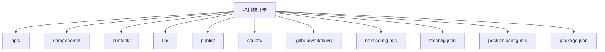
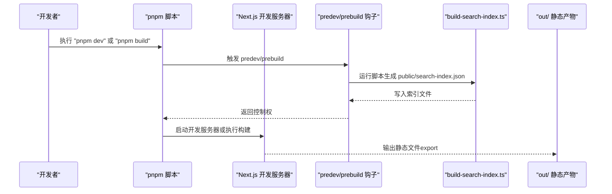
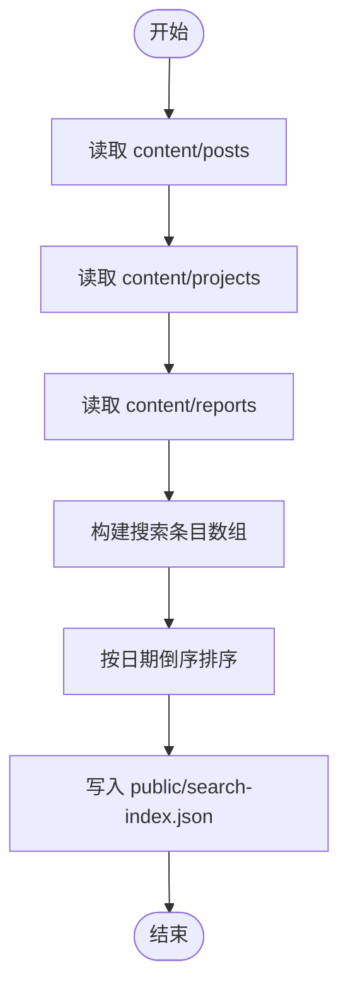
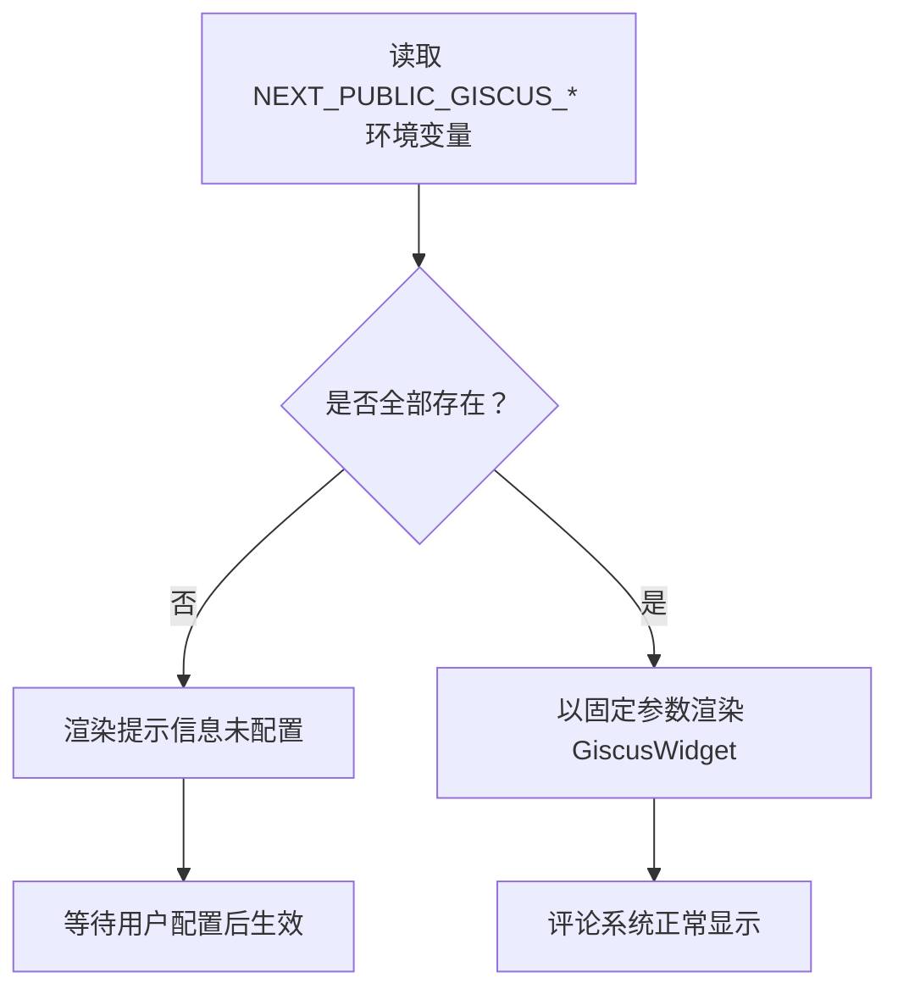
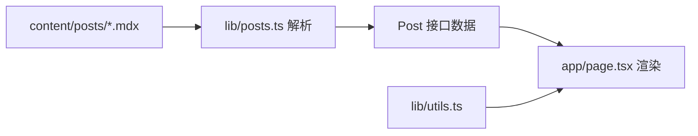
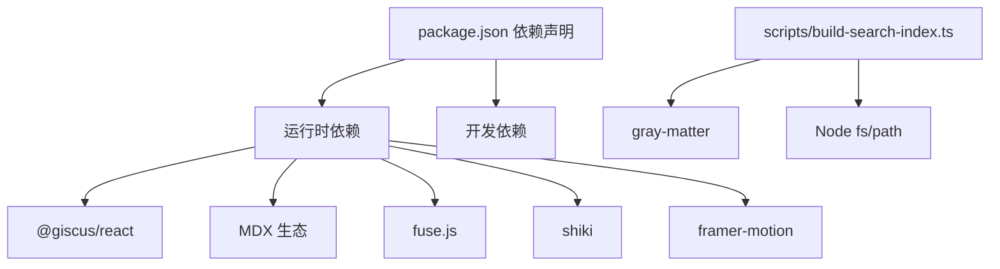

# 环境搭建

<cite>
**本文引用的文件**
- [package.json](file://package.json)
- [README.md](file://README.md)
- [next.config.mjs](file://next.config.mjs)
- [tsconfig.json](file://tsconfig.json)
- [postcss.config.mjs](file://postcss.config.mjs)
- [scripts/build-search-index.ts](file://scripts/build-search-index.ts)
- [components/giscus.tsx](file://components/giscus.tsx)
- [lib/utils.ts](file://lib/utils.ts)
- [lib/posts.ts](file://lib/posts.ts)
- [components/site-header.tsx](file://components/site-header.tsx)
- [components/site-footer.tsx](file://components/site-footer.tsx)
- [app/layout.tsx](file://app/layout.tsx)
- [app/page.tsx](file://app/page.tsx)
</cite>

## 目录
1. [简介](#简介)
2. [项目结构](#项目结构)
3. [核心组件](#核心组件)
4. [架构总览](#架构总览)
5. [详细组件分析](#详细组件分析)
6. [依赖分析](#依赖分析)
7. [性能考虑](#性能考虑)
8. [故障排除指南](#故障排除指南)
9. [结论](#结论)
10. [附录](#附录)

## 简介
本指南面向首次搭建 myWebsite 项目的开发者，目标是帮助你在本地快速完成环境准备、依赖安装、开发服务器启动与配置，并正确设置 Giscus 评论系统所需的环境变量。同时提供常见问题排查思路与开发工具推荐，确保你能顺利进行内容创作与功能迭代。

## 项目结构
该项目基于 Next.js App Router、TypeScript、Tailwind CSS v4 以及 MDX，采用静态导出（export）部署至 GitHub Pages。核心目录职责如下：
- app：Next.js App Router 路由与页面
- components：UI 组件（含 Giscus 评论组件）
- content：MDX 内容（文章、项目、报告）
- lib：业务逻辑（文章、项目、报告、工具函数）
- public：静态资源（构建期生成的搜索索引等）
- scripts：构建期脚本（搜索索引生成）
- .github/workflows：CI/CD 部署工作流

**图示来源**
- [package.json](file://package.json)
- [next.config.mjs](file://next.config.mjs)
- [tsconfig.json](file://tsconfig.json)
- [postcss.config.mjs](file://postcss.config.mjs)

**章节来源**
- [README.md:122-135](file://README.md#L122-L135)

## 核心组件
- 开发与构建脚本：通过 package.json 中的 scripts 定义统一入口，包含 dev、build、start、typecheck 以及 predev/prebuild 钩子。
- Next 配置：next.config.mjs 使用静态导出（export），禁用图片优化，启用严格模式，限制 Turbopack 根目录以避免锁文件干扰。
- 搜索索引：scripts/build-search-index.ts 在构建前后自动生成 public/search-index.json，供前端搜索使用。
- Giscus 评论：components/giscus.tsx 读取 NEXT_PUBLIC_GISCUS_* 环境变量并在未配置时显示提示。
- 工具函数：lib/utils.ts 提供类名合并、日期格式化、阅读时长计算等通用能力。
- 文章数据：lib/posts.ts 读取 content/posts 下的 MDX 文件，解析 Front Matter 并提供查询接口。

**章节来源**
- [package.json:6-13](file://package.json#L6-L13)
- [next.config.mjs:7-16](file://next.config.mjs#L7-L16)
- [scripts/build-search-index.ts:29-88](file://scripts/build-search-index.ts#L29-L88)
- [components/giscus.tsx:5-36](file://components/giscus.tsx#L5-L36)
- [lib/utils.ts:4-24](file://lib/utils.ts#L4-L24)
- [lib/posts.ts:60-98](file://lib/posts.ts#L60-L98)

## 架构总览
下图展示了从本地开发到静态产物的关键流程：开发服务器启动、构建钩子执行、搜索索引生成、静态导出与部署。

**图示来源**
- [package.json:7-12](file://package.json#L7-L12)
- [scripts/build-search-index.ts:90-95](file://scripts/build-search-index.ts#L90-L95)
- [next.config.mjs:8](file://next.config.mjs#L8)

## 详细组件分析

### 环境与依赖安装
- Node.js 版本要求：根据 TypeScript 与 Next.js 的生态要求，建议使用 Node.js LTS（如 18.x 或 20.x）。本项目使用 ES2022 目标与 bundler 模块解析，确保与现代 Node 版本兼容。
- 包管理器：项目使用 pnpm。请先安装 pnpm（参考官方文档），再在项目根目录执行安装命令。
- 安装步骤：
  - 安装依赖：pnpm install
  - 启动开发服务器：pnpm dev
  - 构建静态产物：pnpm build
  - 类型检查：pnpm typecheck
- 依赖说明：
  - 前端框架与运行时：Next.js、React、TypeScript
  - 样式与主题：Tailwind CSS v4、next-themes
  - 内容处理：MDX 生态（@next/mdx、next-mdx-remote、remark-gfm、rehype-*、shiki）
  - 动画与交互：framer-motion、fuse.js（搜索）、@giscus/react（评论）
  - 开发工具：tsx、tailwindcss、postcss 等

**章节来源**
- [README.md:31-42](file://README.md#L31-L42)
- [package.json:14-46](file://package.json#L14-L46)
- [tsconfig.json:3-29](file://tsconfig.json#L3-L29)

### 开发服务器与构建配置
- 开发服务器：pnpm dev 对应 next dev，支持热更新与类型检查。
- 构建流程：pnpm build 对应 next build，结合 next.config.mjs 的 export 配置输出静态文件至 out/。
- 配置要点：
  - output: export（静态导出）
  - trailingSlash: true（末尾斜杠）
  - images.unoptimized: true（禁用自动图片优化）
  - reactStrictMode: true（严格模式）
  - turbopack.root：限定工作区根目录，避免误读父级锁文件

**章节来源**
- [package.json:8-12](file://package.json#L8-L12)
- [next.config.mjs:7-16](file://next.config.mjs#L7-L16)

### 搜索索引生成机制
- 触发时机：predev 与 prebuild 钩子在开发与构建前自动执行脚本。
- 数据来源：遍历 content/posts、content/projects、content/reports，解析 Front Matter，过滤草稿，生成统一结构的条目数组。
- 输出位置：public/search-index.json，供前端使用 Fuse.js 进行客户端搜索。

**图示来源**
- [scripts/build-search-index.ts:17-27](file://scripts/build-search-index.ts#L17-L27)
- [scripts/build-search-index.ts:29-88](file://scripts/build-search-index.ts#L29-L88)
- [scripts/build-search-index.ts:90-95](file://scripts/build-search-index.ts#L90-L95)

**章节来源**
- [scripts/build-search-index.ts:17-88](file://scripts/build-search-index.ts#L17-L88)
- [README.md:40-41](file://README.md#L40-L41)

### Giscus 评论系统配置
- 基本流程：
  1) 在仓库开启 Discussions。
  2) 访问 giscus.app 配置并复制四个值。
  3) 在仓库 Settings → Secrets and variables → Actions → Variables 添加以下变量：
     - GISCUS_REPO
     - GISCUS_REPO_ID
     - GISCUS_CATEGORY
     - GISCUS_CATEGORY_ID
  4) 本地预览时，在项目根创建 .env.local，设置 NEXT_PUBLIC_GISCUS_* 变量。
- 组件行为：
  - 若未配置完整 NEXT_PUBLIC_GISCUS_*，组件将显示提示信息而非加载评论框。
  - 已配置时，组件以指定映射方式、语言、主题等参数渲染评论区。

**图示来源**
- [components/giscus.tsx:5-36](file://components/giscus.tsx#L5-L36)

**章节来源**
- [README.md:103-121](file://README.md#L103-L121)
- [components/giscus.tsx:5-36](file://components/giscus.tsx#L5-L36)

### 内容与数据层
- 文章数据：lib/posts.ts 读取 content/posts，解析 Front Matter，提供获取所有文章、按标签/分类筛选、按 slug 获取等功能。
- 工具函数：lib/utils.ts 提供类名合并、日期格式化、阅读时长估算等。
- 页面集成：app/page.tsx 使用这些接口渲染首页内容区块（精选项目、最新文章、最新报告）。

**图示来源**
- [lib/posts.ts:24-58](file://lib/posts.ts#L24-L58)
- [app/page.tsx:14-148](file://app/page.tsx#L14-L148)
- [lib/utils.ts:4-24](file://lib/utils.ts#L4-L24)

**章节来源**
- [lib/posts.ts:60-98](file://lib/posts.ts#L60-L98)
- [app/page.tsx:14-148](file://app/page.tsx#L14-L148)
- [lib/utils.ts:8-23](file://lib/utils.ts#L8-L23)

### 样式与主题
- PostCSS 配置：使用 @tailwindcss/postcss 插件，配合 Tailwind v4 的 CSS-first 方案。
- 主题：全局暗色主题默认开启（app/layout.tsx）。
- 交互组件：site-header.tsx 提供导航、语言切换与搜索对话框；site-footer.tsx 提供页脚链接。

**章节来源**
- [postcss.config.mjs:1-6](file://postcss.config.mjs#L1-L6)
- [app/layout.tsx:48-56](file://app/layout.tsx#L48-L56)
- [components/site-header.tsx:9-32](file://components/site-header.tsx#L9-L32)
- [components/site-footer.tsx:3-37](file://components/site-footer.tsx#L3-L37)

## 依赖分析
- 运行时依赖：React、Next.js、MDX 生态、@giscus/react、fuse.js、shiki、framer-motion、clsx/tailwind-merge 等。
- 开发依赖：TypeScript、Tailwind CSS v4、PostCSS、tsx、@types/* 等。
- 脚本依赖：gray-matter 用于解析 Front Matter，Node 内置模块用于文件系统操作。

**图示来源**
- [package.json:14-46](file://package.json#L14-L46)
- [scripts/build-search-index.ts:3](file://scripts/build-search-index.ts#L3)

**章节来源**
- [package.json:14-46](file://package.json#L14-L46)
- [scripts/build-search-index.ts:1-3](file://scripts/build-search-index.ts#L1-L3)

## 性能考虑
- 静态导出：next.config.mjs 使用 export，构建后产物可在 GitHub Pages 直接托管，减少运行时开销。
- 图片优化：images.unoptimized: true，避免自动优化带来的额外处理成本。
- 严格模式：reactStrictMode: true，有助于早期发现潜在问题。
- 搜索性能：构建期生成搜索索引，客户端使用轻量算法查询，降低首屏压力。
- 代码分割：Next.js App Router 默认按路由拆分，结合 Tailwind 实用类可减少冗余样式。

**章节来源**
- [next.config.mjs:8-12](file://next.config.mjs#L8-L12)
- [scripts/build-search-index.ts:90-95](file://scripts/build-search-index.ts#L90-L95)

## 故障排除指南
- 依赖安装失败
  - 症状：pnpm install 报错或卡住
  - 排查：确认 pnpm 版本与 Node 版本兼容；清理缓存后重试；检查网络代理；必要时删除 node_modules 与 pnpm-lock.yaml 后重装
- 开发服务器无法启动
  - 症状：pnpm dev 报错或端口占用
  - 排查：确认端口 3000 未被占用；检查 next.config.mjs 与 tsconfig.json 是否有语法错误；重启终端后重试
- 搜索索引为空
  - 症状：搜索无结果
  - 排查：确认 predev/prebuild 钩子已执行；检查 content/posts、content/projects、content/reports 是否存在有效 Front Matter；验证 public/search-index.json 是否生成
- Giscus 未显示
  - 症状：文章页底部仅显示提示
  - 排查：确认 .env.local 中 NEXT_PUBLIC_GISCUS_* 是否完整；确认仓库 Actions 变量是否配置；确保 Discussions 已开启且参数正确
- 构建失败
  - 症状：pnpm build 报错
  - 排查：执行 pnpm typecheck 检查类型；检查 MDX Front Matter 是否缺失必填字段；核对 next.config.mjs 的 export 配置与路径

**章节来源**
- [README.md:31-42](file://README.md#L31-L42)
- [scripts/build-search-index.ts:33-47](file://scripts/build-search-index.ts#L33-L47)
- [components/giscus.tsx:11-19](file://components/giscus.tsx#L11-L19)

## 结论
通过本指南，你可以完成 myWebsite 的环境搭建与日常开发流程。建议优先完成 pnpm 安装、依赖安装与开发服务器启动，随后配置 Giscus 评论系统并验证搜索索引生成。遇到问题时，可依据“故障排除指南”逐项排查。若需进一步定制，可调整 next.config.mjs 与 PostCSS/Tailwind 配置，或扩展 scripts 以满足更复杂的构建需求。

## 附录
- 快速命令清单
  - 安装依赖：pnpm install
  - 启动开发：pnpm dev
  - 构建静态：pnpm build
  - 类型检查：pnpm typecheck
- 推荐开发工具
  - 编辑器：VS Code（安装 TypeScript/Next.js 相关插件）
  - 浏览器：启用开发者工具与网络面板，便于调试构建与请求
  - Git：使用分支与提交信息清晰描述每次改动
- 部署相关
  - 仓库命名：用户名.github.io（根路径）
  - 子路径部署：在 next.config.mjs 中添加 basePath 与 assetPrefix

**章节来源**
- [README.md:88-102](file://README.md#L88-L102)
- [package.json:6-13](file://package.json#L6-L13)