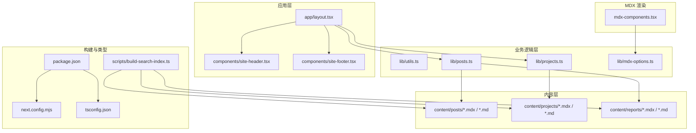
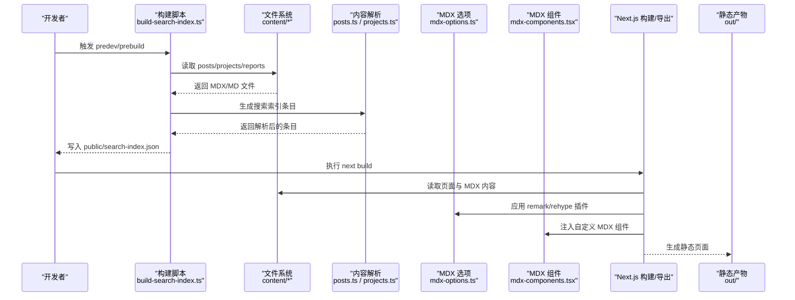
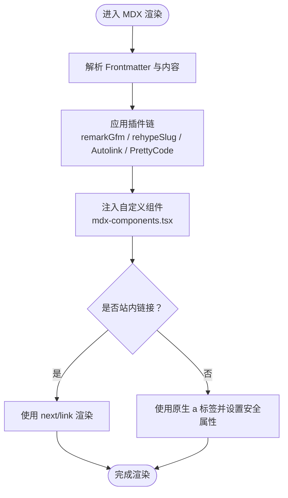
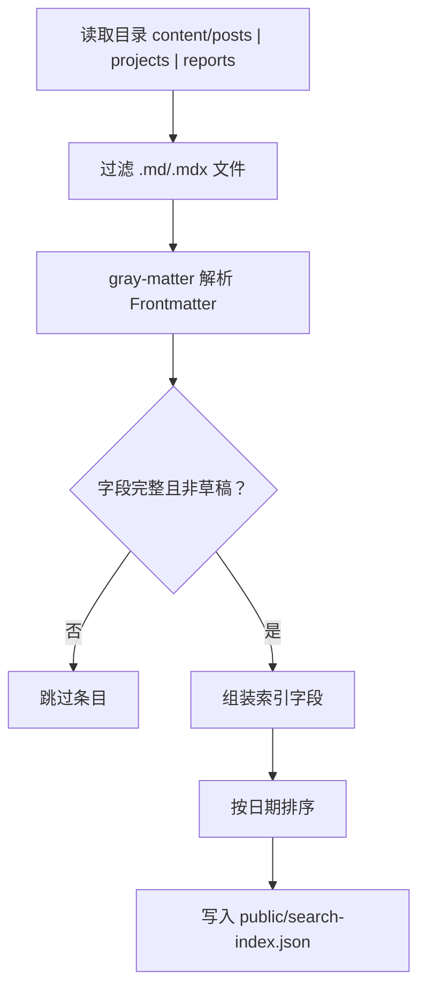
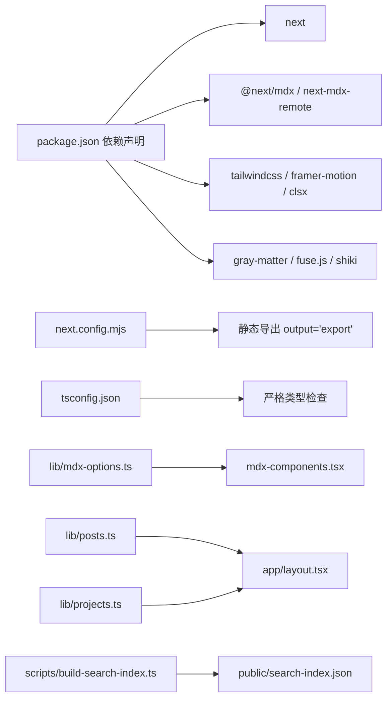

# 调试与故障排除

<cite>
**本文引用的文件**
- [package.json](file://package.json)
- [tsconfig.json](file://tsconfig.json)
- [next.config.mjs](file://next.config.mjs)
- [mdx-components.tsx](file://mdx-components.tsx)
- [lib/mdx-options.ts](file://lib/mdx-options.ts)
- [lib/utils.ts](file://lib/utils.ts)
- [lib/posts.ts](file://lib/posts.ts)
- [lib/projects.ts](file://lib/projects.ts)
- [scripts/build-search-index.ts](file://scripts/build-search-index.ts)
- [app/layout.tsx](file://app/layout.tsx)
- [components/site-header.tsx](file://components/site-header.tsx)
- [components/site-footer.tsx](file://components/site-footer.tsx)
- [content/projects/example-project.mdx](file://content/projects/example-project.mdx)
- [content/reports/2026-05-13-e1-045-tools-distribution.mdx](file://content/reports/2026-05-13-e1-045-tools-distribution.mdx)
</cite>

## 目录
1. [简介](#简介)
2. [项目结构](#项目结构)
3. [核心组件](#核心组件)
4. [架构总览](#架构总览)
5. [详细组件分析](#详细组件分析)
6. [依赖分析](#依赖分析)
7. [性能考虑](#性能考虑)
8. [故障排除指南](#故障排除指南)
9. [结论](#结论)
10. [附录](#附录)

## 简介
本指南面向 myWebsite 项目，聚焦以下调试与排障主题：
- TypeScript 类型检查与错误诊断
- 常见构建错误与解决方案（含 MDX 渲染与静态生成）
- 开发服务器问题排查
- 性能问题诊断与优化建议
- 浏览器兼容性问题处理
- 日志分析与错误追踪技巧

本项目采用 Next.js 16、TypeScript、MDX、Tailwind v4，使用静态导出（export）模式部署至 GitHub Pages；内容由 MDX 文件驱动，配合构建期搜索索引生成。

## 项目结构
- 应用层：app 目录下的页面路由与布局，负责元数据、国际化路径切换与通用头部/底部组件集成。
- 内容层：content 下的 posts、projects、reports，以 MDX/Markdown 文档承载正文与 Frontmatter。
- 业务逻辑层：lib 下的 posts.ts、projects.ts、utils.ts 提供内容读取、解析、格式化与统计。
- MDX 渲染：mdx-components.tsx 提供 MDX 自定义组件注入；lib/mdx-options.ts 配置 remark/rehype 插件链。
- 构建与类型：next.config.mjs 静态导出配置；tsconfig.json 严格类型检查；package.json 提供 typecheck、dev/build 等脚本。
- 搜索索引：scripts/build-search-index.ts 在构建前后生成 public/search-index.json，供前端搜索使用。

图表来源
- [app/layout.tsx:1-57](file://app/layout.tsx#L1-L57)
- [components/site-header.tsx:1-103](file://components/site-header.tsx#L1-L103)
- [components/site-footer.tsx:1-40](file://components/site-footer.tsx#L1-L40)
- [lib/posts.ts:1-98](file://lib/posts.ts#L1-L98)
- [lib/projects.ts:1-64](file://lib/projects.ts#L1-L64)
- [lib/mdx-options.ts:1-20](file://lib/mdx-options.ts#L1-L20)
- [mdx-components.tsx:1-31](file://mdx-components.tsx#L1-L31)
- [scripts/build-search-index.ts:1-95](file://scripts/build-search-index.ts#L1-L95)
- [next.config.mjs:1-19](file://next.config.mjs#L1-L19)
- [tsconfig.json:1-45](file://tsconfig.json#L1-L45)
- [package.json:1-48](file://package.json#L1-L48)

章节来源
- [package.json:1-48](file://package.json#L1-L48)
- [tsconfig.json:1-45](file://tsconfig.json#L1-L45)
- [next.config.mjs:1-19](file://next.config.mjs#L1-L19)
- [lib/mdx-options.ts:1-20](file://lib/mdx-options.ts#L1-L20)
- [mdx-components.tsx:1-31](file://mdx-components.tsx#L1-L31)
- [scripts/build-search-index.ts:1-95](file://scripts/build-search-index.ts#L1-L95)
- [app/layout.tsx:1-57](file://app/layout.tsx#L1-L57)
- [components/site-header.tsx:1-103](file://components/site-header.tsx#L1-L103)
- [components/site-footer.tsx:1-40](file://components/site-footer.tsx#L1-L40)
- [lib/utils.ts:1-24](file://lib/utils.ts#L1-L24)
- [lib/posts.ts:1-98](file://lib/posts.ts#L1-L98)
- [lib/projects.ts:1-64](file://lib/projects.ts#L1-L64)
- [content/projects/example-project.mdx:1-23](file://content/projects/example-project.mdx#L1-L23)
- [content/reports/2026-05-13-e1-045-tools-distribution.mdx:1-30](file://content/reports/2026-05-13-e1-045-tools-distribution.mdx#L1-L30)

## 核心组件
- 类型系统与严格检查
  - tsconfig.json 启用严格模式、隔离模块、增量编译，确保类型安全与快速增量构建。
  - package.json 提供 typecheck 脚本，便于在 CI 或本地统一执行类型检查。
- MDX 渲染管线
  - mdx-components.tsx 注入自定义链接渲染（区分站内/外链），保证导航一致性与可访问性。
  - lib/mdx-options.ts 配置 remarkGfm、rehypeSlug、rehypeAutolinkHeadings、rehypePrettyCode 插件链，实现表格、标题锚点、代码高亮等增强。
- 内容读取与索引
  - lib/posts.ts、lib/projects.ts 从 content 目录读取 MDX/Markdown，解析 gray-matter Frontmatter，过滤草稿并排序。
  - scripts/build-search-index.ts 在构建前后生成 public/search-index.json，供前端搜索使用。
- 静态导出与开发体验
  - next.config.mjs 使用 export 输出，关闭图片优化，开启 reactStrictMode，启用 Turbopack root 指定，提升热更新稳定性。
  - package.json 中 dev/predev/prebuild 钩子自动运行搜索索引构建，避免内容变更后搜索失效。

章节来源
- [tsconfig.json:1-45](file://tsconfig.json#L1-L45)
- [package.json:1-48](file://package.json#L1-L48)
- [mdx-components.tsx:1-31](file://mdx-components.tsx#L1-L31)
- [lib/mdx-options.ts:1-20](file://lib/mdx-options.ts#L1-L20)
- [lib/posts.ts:1-98](file://lib/posts.ts#L1-L98)
- [lib/projects.ts:1-64](file://lib/projects.ts#L1-L64)
- [scripts/build-search-index.ts:1-95](file://scripts/build-search-index.ts#L1-L95)
- [next.config.mjs:1-19](file://next.config.mjs#L1-L19)

## 架构总览
下图展示从内容到渲染的关键流程：内容读取 → Frontmatter 解析 → MDX 渲染 → 页面输出；同时构建期生成搜索索引供客户端查询。

图表来源
- [scripts/build-search-index.ts:1-95](file://scripts/build-search-index.ts#L1-L95)
- [lib/posts.ts:1-98](file://lib/posts.ts#L1-L98)
- [lib/projects.ts:1-64](file://lib/projects.ts#L1-L64)
- [lib/mdx-options.ts:1-20](file://lib/mdx-options.ts#L1-L20)
- [mdx-components.tsx:1-31](file://mdx-components.tsx#L1-L31)
- [next.config.mjs:1-19](file://next.config.mjs#L1-L19)

## 详细组件分析

### MDX 渲染与链接处理
- 自定义链接渲染策略
  - 对站内/外链分别处理：站内使用 next/link，外链使用原生 a 标签并设置安全属性，确保 SPA 导航与外部链接一致。
- MDX 插件链
  - 支持 GFM 表格、标题自动加锚点、代码块高亮主题切换，提升文档可读性与一致性。
- 常见问题定位
  - 若链接点击无反应或外链未新开窗口，优先检查 mdx-components.tsx 的链接分支逻辑与属性透传。
  - 代码高亮异常通常与 rehype-pretty-code 主题或 shiki 配置有关，需核对主题名称与默认语言。

图表来源
- [mdx-components.tsx:1-31](file://mdx-components.tsx#L1-L31)
- [lib/mdx-options.ts:1-20](file://lib/mdx-options.ts#L1-L20)

章节来源
- [mdx-components.tsx:1-31](file://mdx-components.tsx#L1-L31)
- [lib/mdx-options.ts:1-20](file://lib/mdx-options.ts#L1-L20)

### 内容读取与索引生成
- 内容读取
  - posts.ts 与 projects.ts 通过 gray-matter 解析 Frontmatter，过滤缺失必要字段或草稿条目，统一日期格式，计算阅读时长。
- 搜索索引
  - build-search-index.ts 从 posts/projects/reports 读取，构造统一结构，写入 public/search-index.json，供客户端 Fuse.js 查询。
- 常见问题定位
  - 若页面缺少内容或标签为空，检查对应 MDX 文件的 Frontmatter 字段是否齐全。
  - 若搜索结果为空，确认构建脚本已执行且 public/search-index.json 存在。

图表来源
- [lib/posts.ts:1-98](file://lib/posts.ts#L1-L98)
- [lib/projects.ts:1-64](file://lib/projects.ts#L1-L64)
- [scripts/build-search-index.ts:1-95](file://scripts/build-search-index.ts#L1-L95)

章节来源
- [lib/posts.ts:1-98](file://lib/posts.ts#L1-L98)
- [lib/projects.ts:1-64](file://lib/projects.ts#L1-L64)
- [scripts/build-search-index.ts:1-95](file://scripts/build-search-index.ts#L1-L95)

### 布局与国际化路径
- 布局元数据与结构
  - app/layout.tsx 设置站点元信息、语言与全局样式，包裹头部与底部组件。
- 国际化路径切换
  - site-header.tsx 提供语言切换逻辑，根据当前路径决定 /en 与非 /en 的跳转目标，保持导航一致性。
- 常见问题定位
  - 若切换语言后路径异常，检查语言切换计算逻辑与路由前缀处理。
  - 若页面缺少头部/底部，请确认根布局正确包裹子组件。

章节来源
- [app/layout.tsx:1-57](file://app/layout.tsx#L1-L57)
- [components/site-header.tsx:1-103](file://components/site-header.tsx#L1-L103)
- [components/site-footer.tsx:1-40](file://components/site-footer.tsx#L1-L40)

## 依赖分析
- 构建与运行时依赖
  - Next.js 16、@next/mdx、next-mdx-remote、MDX 生态；Tailwind v4、Framer Motion、Fuse.js、Shiki 等。
- 开发依赖
  - TypeScript、TailwindCSS、PostCSS、tsx 等，确保类型安全与构建工具链完善。
- 关键耦合点
  - MDX 渲染强依赖 mdx-options.ts 与 mdx-components.tsx；内容读取依赖 posts.ts/projects.ts；搜索索引依赖 build-search-index.ts。
- 可能的循环依赖
  - 当前文件间为单向数据流：内容 → 解析 → 渲染 → 输出，未发现明显循环依赖。

图表来源
- [package.json:1-48](file://package.json#L1-L48)
- [next.config.mjs:1-19](file://next.config.mjs#L1-L19)
- [tsconfig.json:1-45](file://tsconfig.json#L1-L45)
- [lib/mdx-options.ts:1-20](file://lib/mdx-options.ts#L1-L20)
- [mdx-components.tsx:1-31](file://mdx-components.tsx#L1-L31)
- [lib/posts.ts:1-98](file://lib/posts.ts#L1-L98)
- [lib/projects.ts:1-64](file://lib/projects.ts#L1-L64)
- [scripts/build-search-index.ts:1-95](file://scripts/build-search-index.ts#L1-L95)

章节来源
- [package.json:1-48](file://package.json#L1-L48)
- [next.config.mjs:1-19](file://next.config.mjs#L1-L19)
- [tsconfig.json:1-45](file://tsconfig.json#L1-L45)
- [lib/mdx-options.ts:1-20](file://lib/mdx-options.ts#L1-L20)
- [mdx-components.tsx:1-31](file://mdx-components.tsx#L1-L31)
- [lib/posts.ts:1-98](file://lib/posts.ts#L1-L98)
- [lib/projects.ts:1-64](file://lib/projects.ts#L1-L64)
- [scripts/build-search-index.ts:1-95](file://scripts/build-search-index.ts#L1-L95)

## 性能考虑
- 构建性能
  - 启用增量编译与隔离模块，减少类型检查开销；静态导出避免服务端渲染压力。
  - 将搜索索引构建置于 predev/prebuild 钩子，避免重复构建。
- 运行时性能
  - 使用 Framer Motion 与 Tailwind v4 时注意动画与类名合并，避免过度重绘。
  - 代码高亮仅在需要的页面加载，控制主题与默认语言，减少首屏渲染负担。
- 内容与网络
  - 图片优化关闭（unoptimized），结合静态导出更易部署；如需优化，建议在本地预处理或 CDN 加速。
- 建议
  - 对大型内容列表进行分页或懒加载；对搜索结果使用客户端缓存；对代码块启用按需高亮。

[本节为通用指导，无需列出章节来源]

## 故障排除指南

### TypeScript 类型检查与错误诊断
- 常见症状
  - 编译报错、类型断言频繁、运行时报错。
- 排查步骤
  - 使用统一命令执行类型检查，定位具体文件与行号。
  - 检查 tsconfig.json 的 strict、isolatedModules、incremental 等配置是否符合预期。
  - 若新增类型或接口，确保在相关模块中正确导出与导入。
- 建议
  - 保持类型定义集中管理，避免在多处重复定义；对不确定的值使用类型守卫或可选链。

章节来源
- [tsconfig.json:1-45](file://tsconfig.json#L1-L45)
- [package.json:1-48](file://package.json#L1-L48)

### 构建错误与解决方案
- 静态导出（export）相关
  - 症状：构建后找不到 out 目录或页面 404。
  - 排查：确认 next.config.mjs 的 output 为 export，trailingSlash 是否满足部署要求。
  - 解决：清理 .next/out 缓存目录，重新执行构建。
- MDX 渲染问题
  - 症状：页面空白、链接未生效、代码块未高亮。
  - 排查：检查 mdx-components.tsx 的链接分支与属性透传；核对 mdx-options.ts 的插件配置与主题名称。
  - 解决：修复 Frontmatter 字段；确保 MDX 文件语法正确；更新插件版本并重建。
- 内容缺失或搜索为空
  - 症状：页面无内容、搜索无结果。
  - 排查：确认 content 目录存在对应文件；检查 posts.ts/projects.ts 的读取与过滤逻辑；验证 public/search-index.json 是否生成。
  - 解决：补齐 Frontmatter 必填项；重新运行 predev/prebuild；确认构建脚本权限与路径。

章节来源
- [next.config.mjs:1-19](file://next.config.mjs#L1-L19)
- [mdx-components.tsx:1-31](file://mdx-components.tsx#L1-L31)
- [lib/mdx-options.ts:1-20](file://lib/mdx-options.ts#L1-L20)
- [lib/posts.ts:1-98](file://lib/posts.ts#L1-L98)
- [lib/projects.ts:1-64](file://lib/projects.ts#L1-L64)
- [scripts/build-search-index.ts:1-95](file://scripts/build-search-index.ts#L1-L95)

### 开发服务器问题排查
- 症状：热更新失效、页面不刷新、Turbopack 报错。
- 排查：检查 package.json 的 dev 脚本与 predev 钩子；确认 Turbopack root 指向正确工作区。
- 解决：重启开发服务器；清理 node_modules/.cache；确保 gray-matter、MDX 插件版本兼容。

章节来源
- [package.json:1-48](file://package.json#L1-L48)
- [next.config.mjs:1-19](file://next.config.mjs#L1-L19)

### 性能问题诊断与优化
- 诊断
  - 使用浏览器性能面板观察首屏时间、重绘与回流；检查网络面板的资源加载顺序。
  - 对搜索与内容列表进行分页或虚拟滚动；对代码高亮启用按需加载。
- 优化
  - 减少不必要的类名合并与动画；对大图使用 CDN 或预压缩；避免在渲染路径中进行重型计算。

[本节为通用指导，无需列出章节来源]

### 浏览器兼容性问题
- 常见问题
  - ES 特性不支持、CSS 变量未生效、动画闪烁。
- 处理
  - 检查 tsconfig.json 的 target 与 lib；确保 Tailwind v4 与 PostCSS 配置兼容。
  - 对不支持的特性使用 polyfill 或降级方案；对 CSS 变量在旧版浏览器中提供回退。

章节来源
- [tsconfig.json:1-45](file://tsconfig.json#L1-L45)
- [package.json:1-48](file://package.json#L1-L48)

### 日志分析与错误追踪
- 构建日志
  - 关注搜索索引生成数量与写入路径；关注 MDX 插件执行日志；留意内容解析警告（如草稿跳过）。
- 运行时日志
  - 在组件中添加最小化日志输出，定位路由变化、国际化切换、搜索触发等关键路径。
- 错误追踪
  - 结合浏览器控制台与网络面板，定位资源加载失败、MDX 渲染异常与链接跳转问题。

章节来源
- [scripts/build-search-index.ts:1-95](file://scripts/build-search-index.ts#L1-L95)
- [lib/posts.ts:1-98](file://lib/posts.ts#L1-L98)
- [components/site-header.tsx:1-103](file://components/site-header.tsx#L1-L103)

## 结论
本指南围绕 myWebsite 的类型系统、MDX 渲染、内容读取、静态导出与开发体验，提供了系统性的调试与排障方法。遵循本文的检查清单与优化建议，可显著降低构建与运行时问题的发生概率，并提升开发效率与用户体验。

[本节为总结性内容，无需列出章节来源]

## 附录

### 常用命令与位置参考
- 类型检查：通过 package.json 的 typecheck 脚本执行。
- 开发：dev 脚本自动运行 predev 构建搜索索引。
- 构建：build 脚本执行静态导出；prebuild 同样会生成搜索索引。
- 输出目录：静态导出产物位于 out/，搜索索引位于 public/search-index.json。

章节来源
- [package.json:1-48](file://package.json#L1-L48)
- [next.config.mjs:1-19](file://next.config.mjs#L1-L19)