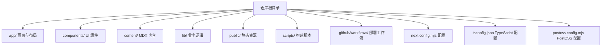
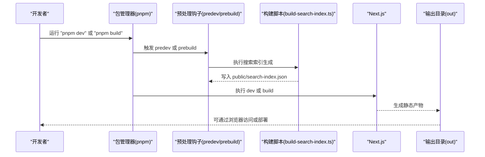
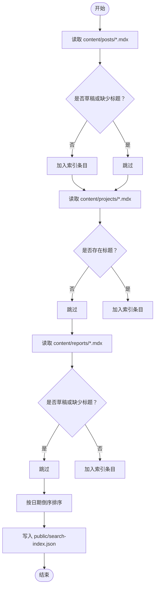

# 快速开始

<cite>
**本文引用的文件**
- [package.json](file://package.json)
- [README.md](file://README.md)
- [next.config.mjs](file://next.config.mjs)
- [tsconfig.json](file://tsconfig.json)
- [postcss.config.mjs](file://postcss.config.mjs)
- [scripts/build-search-index.ts](file://scripts/build-search-index.ts)
- [app/layout.tsx](file://app/layout.tsx)
- [app/page.tsx](file://app/page.tsx)
- [mdx-components.tsx](file://mdx-components.tsx)
- [components/site-header.tsx](file://components/site-header.tsx)
- [app/globals.css](file://app/globals.css)
- [.github/workflows/deploy.yml](file://.github/workflows/deploy.yml)
- [lib/utils.ts](file://lib/utils.ts)
- [content/projects/example-project.mdx](file://content/projects/example-project.mdx)
- [content/reports/2026-05-13-e1-045-tools-distribution.mdx](file://content/reports/2026-05-13-e1-045-tools-distribution.mdx)
</cite>

## 目录
1. [简介](#简介)
2. [项目结构](#项目结构)
3. [核心组件](#核心组件)
4. [架构总览](#架构总览)
5. [详细组件分析](#详细组件分析)
6. [依赖分析](#依赖分析)
7. [性能考虑](#性能考虑)
8. [故障排除指南](#故障排除指南)
9. [结论](#结论)
10. [附录](#附录)

## 简介
本指南面向首次接触 myWebsite 项目的开发者，帮助你在最短时间内完成环境准备、项目克隆、依赖安装与本地开发服务器启动，并掌握常用开发命令（dev、build、typecheck）。文档同时解释项目目录结构与关键配置文件的作用，并提供常见问题的解决方案与部署参考。

## 项目结构
该项目采用 Next.js 16 App Router 结构，内容以 MDX 为主，配合 Tailwind v4 实现样式与主题控制。核心目录与职责概览如下：
- app/：页面路由与布局，包含首页、博客、项目、报告、关于、CV、Now 等页面
- components/：可复用 UI 组件（如导航、页脚、搜索对话框等）
- content/：MDX 内容（文章、项目、报告），不参与 src 源码编译
- lib/：业务逻辑封装（文章、项目、报告聚合与工具函数）
- public/：静态资源与构建期生成的搜索索引
- scripts/：构建期脚本（如搜索索引生成）
- .github/workflows/：GitHub Actions 部署工作流

章节来源
- [README.md:122-135](file://README.md#L122-L135)

## 核心组件
- 开发命令
  - pnpm dev：启动本地开发服务器，默认端口 3000
  - pnpm build：执行静态导出（输出至 out/），用于生产部署
  - pnpm typecheck：执行 TypeScript 类型检查
  - pnpm start：启动已构建的静态站点（生产环境）
- 预处理钩子
  - predev 与 prebuild 在 dev/build 前自动执行搜索索引生成脚本，确保搜索功能可用
- 静态导出配置
  - next.config.mjs 中启用 output: 'export'，并优化图片与严格模式设置
- 样式与主题
  - app/globals.css 使用 Tailwind v4 的 CSS-first 方式定义主题变量与暗色风格
  - mdx-components.tsx 提供 MDX 内部链接的统一处理
- 搜索与内容
  - scripts/build-search-index.ts 从 content/posts、content/projects、content/reports 读取 MDX Front Matter，生成 public/search-index.json
  - components/site-header.tsx 集成搜索对话框，使用 Fuse.js 进行前端检索

章节来源
- [package.json:6-12](file://package.json#L6-L12)
- [package.json:7-12](file://package.json#L7-L12)
- [next.config.mjs:7-16](file://next.config.mjs#L7-L16)
- [app/globals.css:1-278](file://app/globals.css#L1-L278)
- [mdx-components.tsx:1-31](file://mdx-components.tsx#L1-L31)
- [scripts/build-search-index.ts:1-95](file://scripts/build-search-index.ts#L1-L95)
- [components/site-header.tsx:1-103](file://components/site-header.tsx#L1-L103)

## 架构总览
下图展示了本地开发与构建的关键流程：开发命令触发 Next.js 启动或构建，predev/prebuild 钩子先生成搜索索引，随后 Next.js 执行静态导出，最终产物位于 out/。

图表来源
- [package.json:7-12](file://package.json#L7-L12)
- [scripts/build-search-index.ts:90-95](file://scripts/build-search-index.ts#L90-L95)
- [next.config.mjs:8-10](file://next.config.mjs#L8-L10)

章节来源
- [package.json:6-12](file://package.json#L6-L12)
- [scripts/build-search-index.ts:1-95](file://scripts/build-search-index.ts#L1-L95)
- [next.config.mjs:7-16](file://next.config.mjs#L7-L16)

## 详细组件分析

### 开发命令与生命周期
- dev：启动 Next.js 开发服务器，支持热更新与实时错误提示
- build：执行静态导出，生成 out/ 目录，适合托管在 GitHub Pages
- typecheck：对 TypeScript 进行类型检查，避免运行时错误
- start：启动已构建的静态站点，模拟生产环境
- 预处理钩子：predev 与 prebuild 在执行前自动生成搜索索引，无需手动维护

章节来源
- [package.json:6-12](file://package.json#L6-L12)
- [README.md:31-42](file://README.md#L31-L42)

### 静态导出与部署配置
- next.config.mjs
  - output: 'export'：启用静态导出
  - trailingSlash: true：保证链接末尾斜杠一致
  - images: { unoptimized: true }：关闭自动图像优化，适配静态托管
  - reactStrictMode: true：启用严格模式，提升开发体验
  - turbopack.root：限定工作区根，避免误读父级锁文件
- GitHub Actions 部署
  - 使用 pnpm/action-setup@v4 与 actions/setup-node@v4
  - 通过 pnpm install --frozen-lockfile 安装依赖
  - 设置 NEXT_PUBLIC_GISCUS_* 环境变量以启用评论功能
  - 将 out/ 作为 GitHub Pages 的发布工件

章节来源
- [next.config.mjs:7-16](file://next.config.mjs#L7-L16)
- [.github/workflows/deploy.yml:17-64](file://.github/workflows/deploy.yml#L17-L64)

### 搜索索引生成流程
该流程在每次 dev/build 前自动执行，从 content/posts、content/projects、content/reports 读取 MDX Front Matter，过滤 draft 文章，生成按日期倒序的 JSON 索引并写入 public/search-index.json。

图表来源
- [scripts/build-search-index.ts:17-88](file://scripts/build-search-index.ts#L17-L88)
- [scripts/build-search-index.ts:90-95](file://scripts/build-search-index.ts#L90-L95)

章节来源
- [scripts/build-search-index.ts:1-95](file://scripts/build-search-index.ts#L1-L95)

### MDX 组件与内部链接处理
- mdx-components.tsx 提供 useMDXComponents，统一处理 MDX 内部链接与外部链接，内部链接使用 Next.js Link，外部链接使用原生 a 标签并添加安全属性
- app/layout.tsx 定义全局元数据与语言、主题设置，RootLayout 包裹 SiteHeader 与 SiteFooter

章节来源
- [mdx-components.tsx:1-31](file://mdx-components.tsx#L1-L31)
- [app/layout.tsx:1-57](file://app/layout.tsx#L1-L57)

### 首页与内容聚合
- app/page.tsx 调用 lib/posts.ts、lib/projects.ts、lib/reports.ts 获取聚合数据，渲染 Hero、Now 条、精选项目、最新文章与最新报告区域
- lib/utils.ts 提供 cn、formatDate、readingTime 等通用工具函数

章节来源
- [app/page.tsx:1-157](file://app/page.tsx#L1-L157)
- [lib/utils.ts:1-24](file://lib/utils.ts#L1-L24)

### 样式与主题
- app/globals.css 使用 Tailwind v4 的 @theme 定义颜色、字体与暗色主题变量，并提供滚动条、渐变边框、玻璃卡片、代码高亮等样式
- 支持打印样式，便于 CV 页面打印

章节来源
- [app/globals.css:1-278](file://app/globals.css#L1-L278)

### 导航与搜索交互
- components/site-header.tsx 提供导航栏、语言切换（中/EN）、搜索按钮与搜索对话框，支持 Cmd+K 快捷键提示
- 搜索对话框基于 public/search-index.json 与 Fuse.js 实现前端检索

章节来源
- [components/site-header.tsx:1-103](file://components/site-header.tsx#L1-L103)

### 内容创作模板
- 文章：在 content/posts/ 下创建 YYYY-MM-DD-slug.mdx，包含 title、date、tags、category、summary、draft 等 Front Matter
- 项目：在 content/projects/ 下创建 <slug>.mdx，包含 title、date、summary、stack、url、repo、featured、order 等 Front Matter
- 报告：在 content/reports/ 下创建 <slug>.mdx，包含 title、date、tags、summary、html、height 等 Front Matter

章节来源
- [README.md:43-86](file://README.md#L43-L86)
- [content/projects/example-project.mdx:1-23](file://content/projects/example-project.mdx#L1-L23)
- [content/reports/2026-05-13-e1-045-tools-distribution.mdx:1-30](file://content/reports/2026-05-13-e1-045-tools-distribution.mdx#L1-L30)

## 依赖分析
- 运行时依赖
  - Next.js 16、React 19、TypeScript、MDX 生态（@mdx-js、next-mdx-remote、remark-gfm、rehype-*）、UI 动画（framer-motion）、主题（next-themes）、样式（tailwind-merge、clsx）
- 开发依赖
  - Tailwind v4、PostCSS、tsx、TypeScript、类型声明
- 作用
  - 支持 App Router 路由、MDX 渲染、代码高亮、搜索索引、静态导出与部署

章节来源
- [package.json:14-46](file://package.json#L14-L46)

## 性能考虑
- 静态导出：通过 next.config.mjs 的 output: 'export' 与 images.unoptimized: true，减少运行时开销，利于 GitHub Pages 部署
- 严格模式：reactStrictMode: true 提升开发阶段的稳定性
- 搜索索引：构建期生成 JSON 索引，避免运行时解析成本
- 样式体积：Tailwind v4 CSS-first 配置，按需引入插件，减少冗余样式

章节来源
- [next.config.mjs:7-16](file://next.config.mjs#L7-L16)
- [postcss.config.mjs:1-6](file://postcss.config.mjs#L1-L6)

## 故障排除指南
- 无法启动开发服务器
  - 确认 Node.js 版本满足项目需求（Actions 使用 node-version: 22）
  - 确认 pnpm 安装完成且版本兼容（Actions 使用 pnpm/action-setup@v4）
  - 清理缓存后重试：删除 node_modules、pnpm-lock.yaml，重新 pnpm install
- 构建失败或找不到模块
  - 检查 tsconfig.json 的路径别名与模块解析策略
  - 确保所有 MDX 文件 Front Matter 完整（特别是 title、date）
- 搜索结果为空
  - 确认 predev/prebuild 钩子已执行，public/search-index.json 已生成
  - 检查 content/posts、content/projects、content/reports 是否存在有效 MDX 文件
- GitHub Pages 部署 404
  - 确认仓库名为 <your-username>.github.io（根域）
  - 确认分支 main 推送触发了 .github/workflows/deploy.yml
  - 如使用子路径，请在 next.config.mjs 中配置 basePath 与 assetPrefix
- 评论功能未显示
  - 本地预览时在项目根创建 .env.local，设置 NEXT_PUBLIC_GISCUS_* 变量
  - 仓库需开启 Discussions，并在 Giscus 配置中复制对应变量

章节来源
- [.github/workflows/deploy.yml:17-64](file://.github/workflows/deploy.yml#L17-L64)
- [README.md:88-121](file://README.md#L88-L121)

## 结论
通过本快速开始指南，你已经完成了环境准备、项目克隆、依赖安装与本地开发服务器启动，并掌握了 dev、build、typecheck 等常用命令。结合静态导出与 GitHub Actions 部署配置，你可以快速将站点上线。遇到问题时，可依据“故障排除指南”逐项排查。

## 附录
- 常用命令
  - pnpm install：安装依赖
  - pnpm dev：启动本地开发服务器
  - pnpm build：静态导出到 out/
  - pnpm typecheck：TS 类型检查
  - pnpm start：启动已构建的静态站点
- 关键配置文件
  - next.config.mjs：静态导出、图片优化、严格模式与 Turbopack 根
  - tsconfig.json：严格模式、路径别名、插件与包含/排除规则
  - postcss.config.mjs：Tailwind v4 插件配置
  - package.json：脚本与依赖
  - .github/workflows/deploy.yml：CI/CD 部署工作流

章节来源
- [package.json:6-12](file://package.json#L6-L12)
- [next.config.mjs:7-16](file://next.config.mjs#L7-L16)
- [tsconfig.json:1-45](file://tsconfig.json#L1-L45)
- [postcss.config.mjs:1-6](file://postcss.config.mjs#L1-L6)
- [.github/workflows/deploy.yml:17-64](file://.github/workflows/deploy.yml#L17-L64)