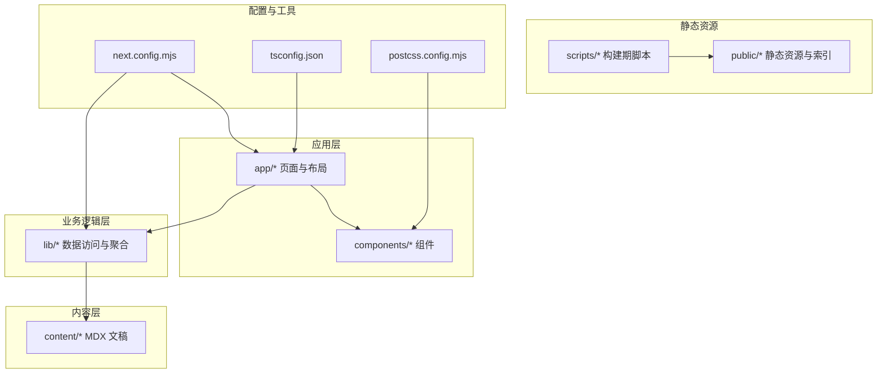
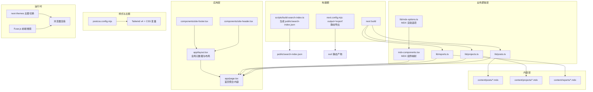
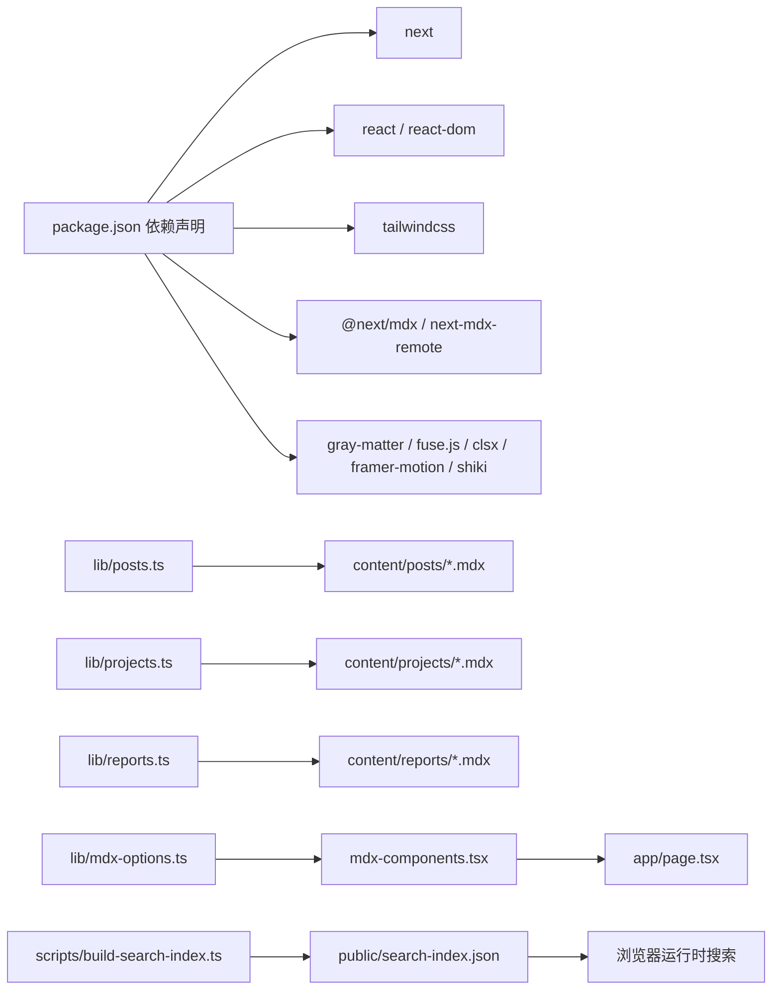

# 技术架构

<cite>
**本文引用的文件**
- [package.json](file://package.json)
- [next.config.mjs](file://next.config.mjs)
- [tsconfig.json](file://tsconfig.json)
- [postcss.config.mjs](file://postcss.config.mjs)
- [README.md](file://README.md)
- [app/layout.tsx](file://app/layout.tsx)
- [app/page.tsx](file://app/page.tsx)
- [lib/mdx-options.ts](file://lib/mdx-options.ts)
- [mdx-components.tsx](file://mdx-components.tsx)
- [scripts/build-search-index.ts](file://scripts/build-search-index.ts)
- [lib/posts.ts](file://lib/posts.ts)
- [lib/projects.ts](file://lib/projects.ts)
- [lib/reports.ts](file://lib/reports.ts)
- [components/site-header.tsx](file://components/site-header.tsx)
- [components/site-footer.tsx](file://components/site-footer.tsx)
</cite>

## 目录
1. [引言](#引言)
2. [项目结构](#项目结构)
3. [核心组件](#核心组件)
4. [架构总览](#架构总览)
5. [详细组件分析](#详细组件分析)
6. [依赖关系分析](#依赖关系分析)
7. [性能考量](#性能考量)
8. [故障排查指南](#故障排查指南)
9. [结论](#结论)
10. [附录](#附录)

## 引言
本项目采用 Next.js 16 App Router 构建，结合 React 19、TypeScript、Tailwind CSS v4 与 MDX，形成“内容驱动”的静态生成站点。通过静态导出（output: export）与 GitHub Pages 部署流水线，实现低成本、高性能的内容发布与全球分发。本文档系统化阐述整体架构、分层设计、静态生成策略、内容管理与样式体系，并给出部署与运维建议。

## 项目结构
项目采用“功能域 + 分层”的组织方式：
- app：Next.js App Router 路由层，包含页面、布局、错误处理等
- components：UI 组件层，可复用的头部、页脚、卡片、对话框等
- content：内容层（MDX 文稿），独立于 src，便于静态扫描与构建
- lib：业务逻辑层（posts/projects/reports 等数据访问与聚合）
- public：静态资源与构建期生成的索引文件
- scripts：构建期工具脚本（如搜索索引生成）
- 配置：next.config.mjs、tsconfig.json、postcss.config.mjs 等

图表来源
- [next.config.mjs:1-19](file://next.config.mjs#L1-L19)
- [tsconfig.json:1-45](file://tsconfig.json#L1-L45)
- [postcss.config.mjs:1-6](file://postcss.config.mjs#L1-L6)

章节来源
- [README.md:122-135](file://README.md#L122-L135)
- [next.config.mjs:1-19](file://next.config.mjs#L1-L19)
- [tsconfig.json:1-45](file://tsconfig.json#L1-L45)
- [postcss.config.mjs:1-6](file://postcss.config.mjs#L1-L6)

## 核心组件
- 路由层：基于 Next.js App Router 的约定式路由，支持动态路由参数与多语言镜像目录
- 组件层：语义化 UI 组件，使用 CSS 变量与 Tailwind v4 实现主题与响应式
- 内容管理层：通过 gray-matter 解析 MDX Front Matter，统一暴露类型安全的数据接口
- 样式层：Tailwind v4 + CSS 变量，配合 PostCSS 插件链实现按需编译与主题切换
- 构建与部署：静态导出 + GitHub Actions，自动化生成搜索索引与发布

章节来源
- [app/layout.tsx:1-57](file://app/layout.tsx#L1-L57)
- [app/page.tsx:1-157](file://app/page.tsx#L1-L157)
- [lib/posts.ts:1-98](file://lib/posts.ts#L1-L98)
- [lib/projects.ts:1-64](file://lib/projects.ts#L1-L64)
- [lib/reports.ts:1-60](file://lib/reports.ts#L1-L60)
- [components/site-header.tsx:1-103](file://components/site-header.tsx#L1-L103)
- [components/site-footer.tsx:1-40](file://components/site-footer.tsx#L1-L40)

## 架构总览
整体架构围绕“内容驱动 + 静态生成”展开，前端渲染与内容解析解耦，构建期完成数据聚合与索引生成，运行时仅负责展示与交互。

图表来源
- [next.config.mjs:1-19](file://next.config.mjs#L1-L19)
- [scripts/build-search-index.ts:1-95](file://scripts/build-search-index.ts#L1-L95)
- [lib/posts.ts:1-98](file://lib/posts.ts#L1-L98)
- [lib/projects.ts:1-64](file://lib/projects.ts#L1-L64)
- [lib/reports.ts:1-60](file://lib/reports.ts#L1-L60)
- [lib/mdx-options.ts:1-20](file://lib/mdx-options.ts#L1-L20)
- [mdx-components.tsx:1-31](file://mdx-components.tsx#L1-L31)
- [app/layout.tsx:1-57](file://app/layout.tsx#L1-L57)
- [app/page.tsx:1-157](file://app/page.tsx#L1-L157)
- [postcss.config.mjs:1-6](file://postcss.config.mjs#L1-L6)

## 详细组件分析

### 路由层与布局
- 全局布局：设置站点元数据、语言、主题与通用结构，所有页面共享
- 首页：聚合精选项目、最新文章、最新报告与 Now 条，使用组件化卡片与链接导航
- 动态路由：博客、项目、报告、标签归档等均通过 App Router 动态段实现
- 多语言镜像：/en 目录作为英文镜像入口，语言切换逻辑在头部组件中实现

章节来源
- [app/layout.tsx:1-57](file://app/layout.tsx#L1-L57)
- [app/page.tsx:1-157](file://app/page.tsx#L1-L157)
- [components/site-header.tsx:1-103](file://components/site-header.tsx#L1-L103)

### 组件层
- SiteHeader：导航、语言切换、搜索弹窗触发
- SiteFooter：版权信息与社交链接
- PostCard：文章卡片组件，用于首页与列表页
- SearchDialog：基于构建期生成的搜索索引进行前端检索

章节来源
- [components/site-header.tsx:1-103](file://components/site-header.tsx#L1-L103)
- [components/site-footer.tsx:1-40](file://components/site-footer.tsx#L1-L40)

### 内容管理层
- Posts：解析 content/posts 下的 MDX，提取 Front Matter 与正文，计算阅读时长，提供按标签与分类筛选
- Projects：解析 content/projects，支持 featured 与排序字段，用于首页精选展示
- Reports：解析 content/reports，支持内嵌 HTML 与高度配置，兼容 public/reports/<slug>/index.html 的外部产物
- MDX 渲染：通过 remark-gfm、rehype-slug、rehype-autolink-headings、rehype-pretty-code（Shiki）实现 Markdown/MDX 的增强渲染

章节来源
- [lib/posts.ts:1-98](file://lib/posts.ts#L1-L98)
- [lib/projects.ts:1-64](file://lib/projects.ts#L1-L64)
- [lib/reports.ts:1-60](file://lib/reports.ts#L1-L60)
- [lib/mdx-options.ts:1-20](file://lib/mdx-options.ts#L1-L20)
- [mdx-components.tsx:1-31](file://mdx-components.tsx#L1-L31)

### 样式层与主题
- Tailwind v4：通过 PostCSS 插件链启用，支持 CSS-first 配置与按需编译
- CSS 变量：通过 app/globals.css 提供主题变量，组件层使用变量实现明暗主题
- 主题切换：next-themes 在客户端控制主题状态，与 CSS 变量联动

章节来源
- [postcss.config.mjs:1-6](file://postcss.config.mjs#L1-L6)
- [app/layout.tsx:1-57](file://app/layout.tsx#L1-L57)

### 搜索与索引
- 构建期生成：scripts/build-search-index.ts 扫描 posts/projects/reports，过滤草稿，生成 public/search-index.json
- 运行时检索：前端使用 Fuse.js 对索引进行模糊匹配与排序，提升搜索体验

章节来源
- [scripts/build-search-index.ts:1-95](file://scripts/build-search-index.ts#L1-L95)

### 静态导出与部署
- 静态导出：next.config.mjs 设置 output: 'export'，生成 out/ 静态产物
- GitHub Pages：README 提供完整部署步骤，含 GitHub Actions 触发与仓库命名要求
- 优化配置：trailingSlash: true、images.unoptimized: true 适配静态托管环境

章节来源
- [next.config.mjs:1-19](file://next.config.mjs#L1-L19)
- [README.md:88-102](file://README.md#L88-L102)

## 依赖关系分析
- 应用层依赖业务逻辑层提供的数据接口，业务逻辑层依赖内容层的 MDX 文件
- MDX 渲染链路：lib/mdx-options.ts 与 mdx-components.tsx 共同定义渲染行为
- 构建期脚本依赖 gray-matter 解析 Front Matter，输出公共索引供运行时使用
- 样式链路：postcss.config.mjs -> Tailwind v4 -> 组件层 CSS 变量

图表来源
- [package.json:14-46](file://package.json#L14-L46)
- [lib/posts.ts:1-98](file://lib/posts.ts#L1-L98)
- [lib/projects.ts:1-64](file://lib/projects.ts#L1-L64)
- [lib/reports.ts:1-60](file://lib/reports.ts#L1-L60)
- [lib/mdx-options.ts:1-20](file://lib/mdx-options.ts#L1-L20)
- [mdx-components.tsx:1-31](file://mdx-components.tsx#L1-L31)
- [scripts/build-search-index.ts:1-95](file://scripts/build-search-index.ts#L1-L95)

章节来源
- [package.json:14-46](file://package.json#L14-L46)

## 性能考量
- 静态导出：减少运行时渲染与服务器成本，适合内容驱动型站点
- 构建期索引：将搜索预计算到构建阶段，降低运行时开销
- 图片优化：unoptimized 配置简化部署，若需 CDN 可调整为受控优化
- 体积控制：Tailwind v4 按需引入与 CSS 变量减少重复样式
- 交互动画：Framer Motion 仅在需要的组件中使用，避免全局性能影响

## 故障排查指南
- 构建失败（找不到内容文件）
  - 检查 content 目录是否存在与权限是否正确
  - 确认 MDX Front Matter 字段完整性（如 title、date）
- 搜索结果为空
  - 确认 predev/prebuild 钩子已执行，public/search-index.json 是否生成
  - 检查草稿字段 draft 是否导致条目被过滤
- 部署后链接或图片 404
  - 确认仓库名为 <username>.github.io 或配置 basePath/assetPrefix
  - 检查 trailingSlash 与静态导出路径一致性
- 主题切换异常
  - 确认 next-themes 与 CSS 变量一致，浏览器未禁用本地存储

章节来源
- [scripts/build-search-index.ts:1-95](file://scripts/build-search-index.ts#L1-L95)
- [lib/posts.ts:1-98](file://lib/posts.ts#L1-L98)
- [lib/reports.ts:1-60](file://lib/reports.ts#L1-L60)
- [next.config.mjs:1-19](file://next.config.mjs#L1-L19)
- [README.md:88-102](file://README.md#L88-L102)

## 结论
本项目以 Next.js 16 App Router 为核心，结合 React 19、TypeScript、Tailwind CSS v4 与 MDX，构建了内容驱动的静态站点。通过静态导出与 GitHub Pages 的组合，实现了低成本、高性能的内容发布。业务逻辑层对内容层进行统一抽象，构建期生成搜索索引，运行时专注于交互与展示。该架构在可维护性、可扩展性与部署便捷性之间取得良好平衡，适合个人知识库、技术博客与作品集类站点。

## 附录
- 技术栈概览
  - 框架：Next.js 16（App Router）+ React 19 + TypeScript
  - 样式：Tailwind CSS v4（CSS-first 配置）
  - 内容：MDX（next-mdx-remote/RSC + remark-gfm + rehype-* + Shiki）
  - 交互：Framer Motion + 自绘粒子 Canvas
  - 搜索：Fuse.js + 构建期 JSON 索引
  - 评论：@giscus/react
  - 部署：GitHub Actions + GitHub Pages

章节来源
- [README.md:137-145](file://README.md#L137-L145)