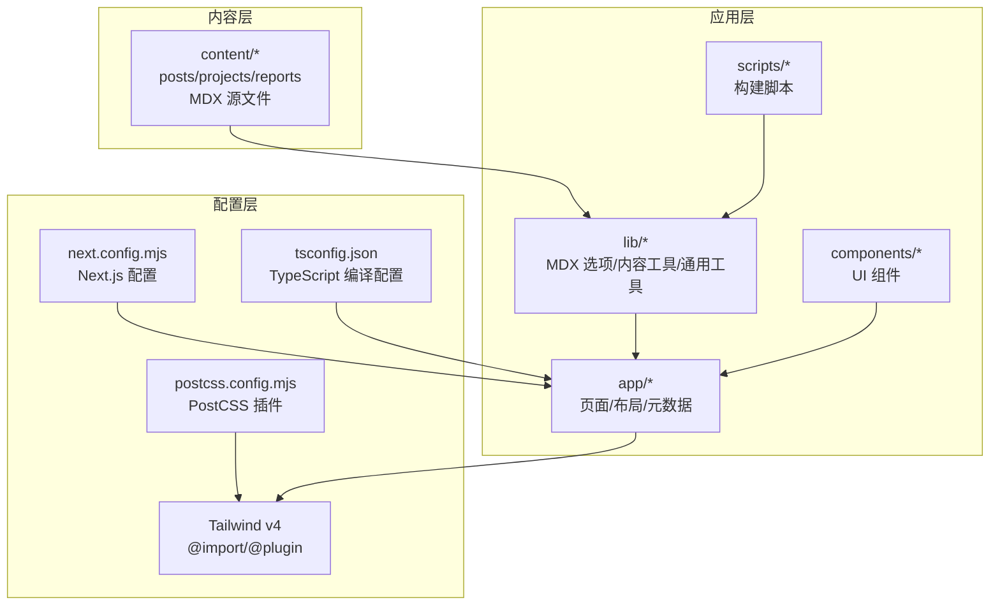
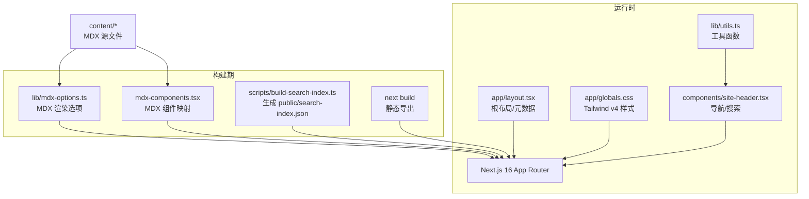
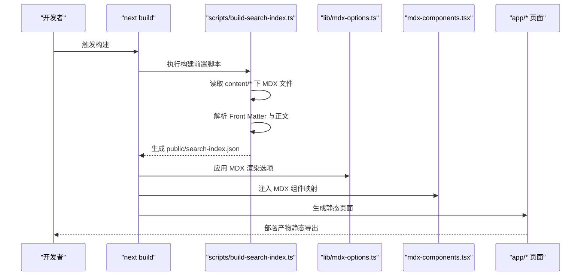
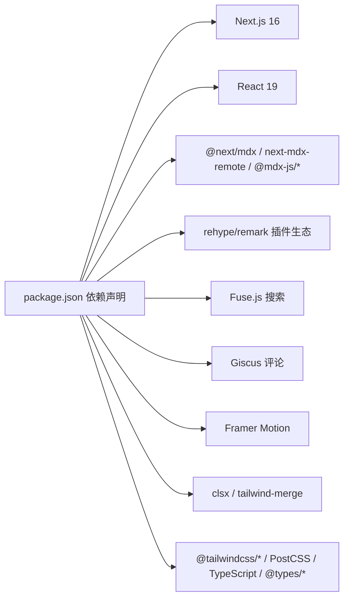

# 技术栈说明

<cite>
**本文引用的文件**
- [package.json](file://package.json)
- [next.config.mjs](file://next.config.mjs)
- [tsconfig.json](file://tsconfig.json)
- [postcss.config.mjs](file://postcss.config.mjs)
- [mdx-components.tsx](file://mdx-components.tsx)
- [lib/mdx-options.ts](file://lib/mdx-options.ts)
- [app/layout.tsx](file://app/layout.tsx)
- [app/globals.css](file://app/globals.css)
- [components/site-header.tsx](file://components/site-header.tsx)
- [lib/utils.ts](file://lib/utils.ts)
- [scripts/build-search-index.ts](file://scripts/build-search-index.ts)
- [content/projects/example-project.mdx](file://content/projects/example-project.mdx)
- [content/reports/2026-05-13-e1-045-tools-distribution.mdx](file://content/reports/2026-05-13-e1-045-tools-distribution.mdx)
</cite>

## 目录
1. [简介](#简介)
2. [项目结构](#项目结构)
3. [核心组件](#核心组件)
4. [架构总览](#架构总览)
5. [详细组件分析](#详细组件分析)
6. [依赖分析](#依赖分析)
7. [性能考量](#性能考量)
8. [故障排查指南](#故障排查指南)
9. [结论](#结论)
10. [附录](#附录)

## 简介
本文件系统化梳理 myWebsite 的技术栈选型与集成方式，重点覆盖以下方面：
- Next.js 16：App Router + 静态导出（Static Export）
- React 19：最新特性与客户端交互
- TypeScript：类型安全保障与开发体验
- Tailwind CSS v4：实用优先的样式体系与暗色主题
- MDX：内容标记语言与组件化内容渲染

文档将从架构、组件、数据流、处理逻辑、集成点与错误处理等维度展开，并提供可视化图示帮助理解。

## 项目结构
项目采用 Next.js 16 App Router 目录组织，结合静态导出与 MDX 内容驱动的页面生成策略。核心目录与职责概览如下：
- app：页面路由、布局、元数据与全局样式入口
- components：UI 组件与交互组件
- content：MDX 内容源文件（文章、项目、报告）
- lib：内容处理、MDX 渲染选项与通用工具
- scripts：构建期任务（如搜索索引生成）
- 根级配置：Next.js、TypeScript、PostCSS、Tailwind v4

图表来源
- [next.config.mjs:1-19](file://next.config.mjs#L1-L19)
- [tsconfig.json:1-45](file://tsconfig.json#L1-L45)
- [postcss.config.mjs:1-6](file://postcss.config.mjs#L1-L6)
- [app/layout.tsx:1-57](file://app/layout.tsx#L1-L57)

章节来源
- [next.config.mjs:1-19](file://next.config.mjs#L1-L19)
- [tsconfig.json:1-45](file://tsconfig.json#L1-L45)
- [postcss.config.mjs:1-6](file://postcss.config.mjs#L1-L6)
- [app/layout.tsx:1-57](file://app/layout.tsx#L1-L57)

## 核心组件
本节聚焦技术栈在项目中的落地位置与职责边界，包括：
- Next.js 16：路由、静态导出、严格模式与 Turbopack 根路径
- React 19：客户端组件、导航与交互
- TypeScript：编译器选项、路径别名与插件
- Tailwind CSS v4：@import 引入、@plugin 使用、暗色主题变量
- MDX：组件映射、渲染选项、内容源文件

章节来源
- [package.json:14-46](file://package.json#L14-L46)
- [next.config.mjs:7-16](file://next.config.mjs#L7-L16)
- [tsconfig.json:2-29](file://tsconfig.json#L2-L29)
- [postcss.config.mjs:1-6](file://postcss.config.mjs#L1-L6)
- [app/globals.css:1-278](file://app/globals.css#L1-L278)
- [mdx-components.tsx:5-30](file://mdx-components.tsx#L5-L30)
- [lib/mdx-options.ts:12-19](file://lib/mdx-options.ts#L12-L19)

## 架构总览
整体架构围绕“静态导出 + 内容驱动”的模式展开：内容通过 MDX 提供，构建期生成搜索索引，运行时以 App Router 页面承载，Tailwind v4 提供样式基础，TypeScript 保障类型安全，React 19 支持客户端交互。

图表来源
- [next.config.mjs:8-10](file://next.config.mjs#L8-L10)
- [scripts/build-search-index.ts:29-95](file://scripts/build-search-index.ts#L29-L95)
- [lib/mdx-options.ts:12-19](file://lib/mdx-options.ts#L12-L19)
- [mdx-components.tsx:5-30](file://mdx-components.tsx#L5-L30)
- [app/layout.tsx:46-56](file://app/layout.tsx#L46-L56)
- [app/globals.css:1-278](file://app/globals.css#L1-L278)
- [components/site-header.tsx:19-102](file://components/site-header.tsx#L19-L102)
- [lib/utils.ts:4-24](file://lib/utils.ts#L4-L24)

## 详细组件分析

### Next.js 16（App Router + 静态导出）
- 静态导出：配置输出为 export，适合部署至静态托管平台（如 GitHub Pages）
- 图片优化：关闭图片优化，配合静态导出
- 严格模式：启用 React 严格模式
- Turbopack 根：限定工作区根，避免锁文件干扰
- 版本与兼容性：Next.js 16 与 React 19 生态协同，确保 App Router 与客户端组件兼容

章节来源
- [next.config.mjs:7-16](file://next.config.mjs#L7-L16)
- [package.json:23-27](file://package.json#L23-L27)

### React 19（最新特性与客户端交互）
- 客户端组件：使用 'use client' 声明客户端上下文
- 导航与状态：usePathname 获取当前路由，useState 管理弹窗状态
- 组件复用：通过工具函数合并类名，统一交互样式

章节来源
- [components/site-header.tsx:1-103](file://components/site-header.tsx#L1-L103)
- [lib/utils.ts:4-6](file://lib/utils.ts#L4-L6)

### TypeScript（类型安全保障）
- 目标与模块：ES2022 + esnext 模块解析
- 严格模式：noEmit、strict、skipLibCheck、isolatedModules
- JSX：react-jsx 编译器插件
- 路径别名：@/* 映射至项目根
- 开发依赖：@types/react、@types/node、@types/react-dom

章节来源
- [tsconfig.json:2-29](file://tsconfig.json#L2-L29)
- [package.json:35-46](file://package.json#L35-L46)

### Tailwind CSS v4（实用优先的样式框架）
- 引入方式：@import "tailwindcss" 与 @plugin "@tailwindcss/typography"
- 主题变量：自定义颜色与字体变量，支持暗色主题
- 动画与装饰：渐变边框、毛玻璃卡片、打字机动画、打印样式
- MDX 排版：针对 rehype-pretty-code 的代码高亮样式

章节来源
- [postcss.config.mjs:1-6](file://postcss.config.mjs#L1-L6)
- [app/globals.css:1-278](file://app/globals.css#L1-L278)

### MDX（内容标记语言）
- 组件映射：useMDXComponents 将链接区分内外部，统一样式
- 渲染选项：remark-gfm、rehype-slug、rehype-autolink-headings、rehype-pretty-code
- 内容源文件：文章、项目、报告三类，带 YAML Front Matter 元数据
- 构建期索引：scripts/build-search-index.ts 读取 MDX 元数据，生成搜索索引

图表来源
- [scripts/build-search-index.ts:29-95](file://scripts/build-search-index.ts#L29-L95)
- [lib/mdx-options.ts:12-19](file://lib/mdx-options.ts#L12-L19)
- [mdx-components.tsx:5-30](file://mdx-components.tsx#L5-L30)
- [next.config.mjs:8-10](file://next.config.mjs#L8-L10)

章节来源
- [mdx-components.tsx:5-30](file://mdx-components.tsx#L5-L30)
- [lib/mdx-options.ts:12-19](file://lib/mdx-options.ts#L12-L19)
- [scripts/build-search-index.ts:29-95](file://scripts/build-search-index.ts#L29-L95)
- [content/projects/example-project.mdx:1-23](file://content/projects/example-project.mdx#L1-L23)
- [content/reports/2026-05-13-e1-045-tools-distribution.mdx:1-30](file://content/reports/2026-05-13-e1-045-tools-distribution.mdx#L1-L30)

## 依赖分析
- 运行时依赖：Next.js 16、React 19、MDX 生态（@next/mdx、next-mdx-remote、@mdx-js/*）、rehype/remark 插件、Fuse.js 搜索、Giscus 评论、Framer Motion 动画、clsx/tailwind-merge
- 开发依赖：Tailwind CSS v4、PostCSS、TypeScript、@types/*、tsx

图表来源
- [package.json:14-46](file://package.json#L14-L46)

章节来源
- [package.json:14-46](file://package.json#L14-L46)

## 性能考量
- 静态导出：减少服务器端负载，提升首屏加载速度
- 严格模式：提前暴露潜在问题，降低运行时风险
- Tailwind v4：按需引入与变量化主题，减少重复样式计算
- MDX 渲染：构建期注入组件映射与渲染选项，运行时保持轻量
- 搜索索引：构建期生成，运行时仅进行本地查询，降低网络请求

## 故障排查指南
- 构建失败（静态导出相关）
  - 检查静态导出配置与图片优化设置
  - 参考：[next.config.mjs:8-10](file://next.config.mjs#L8-L10)
- MDX 渲染异常
  - 确认 Front Matter 字段完整且无拼写错误
  - 确认 mdx-components.tsx 中的链接映射逻辑
  - 参考：[mdx-components.tsx:5-30](file://mdx-components.tsx#L5-L30)
- 搜索功能不可用
  - 确认构建脚本已执行并生成 public/search-index.json
  - 参考：[scripts/build-search-index.ts:90-95](file://scripts/build-search-index.ts#L90-L95)
- 样式不生效或主题异常
  - 确认 Tailwind v4 的 @import 与 @plugin 是否正确加载
  - 参考：[postcss.config.mjs:1-6](file://postcss.config.mjs#L1-L6)，[app/globals.css:1-278](file://app/globals.css#L1-L278)
- TypeScript 报错
  - 检查 tsconfig.json 的严格模式与路径别名配置
  - 参考：[tsconfig.json:2-29](file://tsconfig.json#L2-L29)

章节来源
- [next.config.mjs:8-10](file://next.config.mjs#L8-L10)
- [mdx-components.tsx:5-30](file://mdx-components.tsx#L5-L30)
- [scripts/build-search-index.ts:90-95](file://scripts/build-search-index.ts#L90-L95)
- [postcss.config.mjs:1-6](file://postcss.config.mjs#L1-L6)
- [app/globals.css:1-278](file://app/globals.css#L1-L278)
- [tsconfig.json:2-29](file://tsconfig.json#L2-L29)

## 结论
本项目以 Next.js 16 App Router 为核心，结合 React 19 的客户端能力、TypeScript 的类型安全、Tailwind CSS v4 的实用样式体系与 MDX 的内容表达能力，形成一套“静态导出 + 内容驱动 + 组件化交互”的现代化前端技术栈。其优势在于：
- 构建期增强：MDX 渲染选项与搜索索引生成，显著提升内容可读性与可发现性
- 运行时轻量：静态导出与 Tailwind v4 的变量化主题，保证性能与一致性
- 开发体验：严格的 TypeScript 配置与路径别名，提升可维护性

## 附录
- 版本兼容性提示
  - Next.js 16 与 React 19 的组合在客户端组件与 App Router 上具备良好兼容性
  - Tailwind CSS v4 通过 PostCSS 插件与 @import 方式集成，建议保持与 PostCSS 版本一致
  - MDX 生态（@next/mdx、next-mdx-remote、@mdx-js/*）与 Next.js 16 兼容，注意插件版本对齐