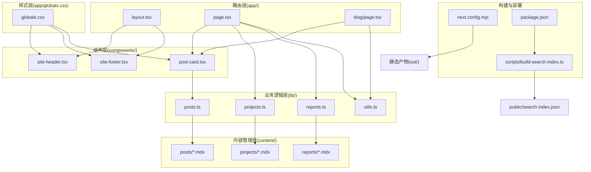
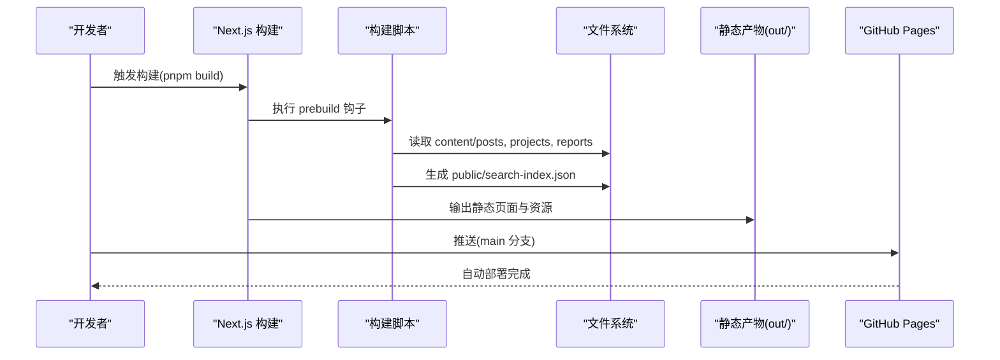
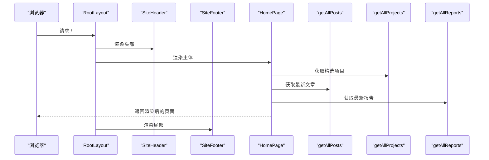
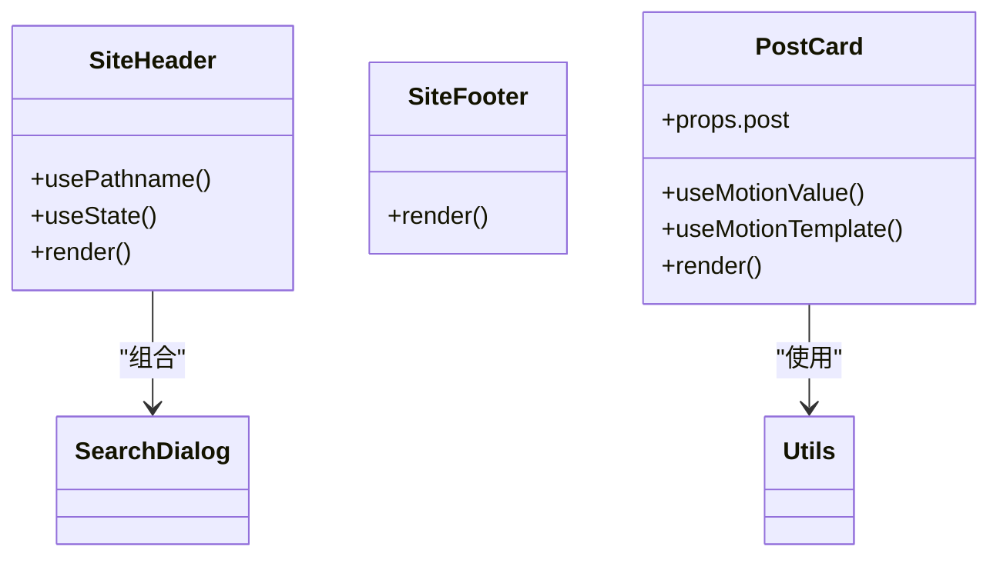
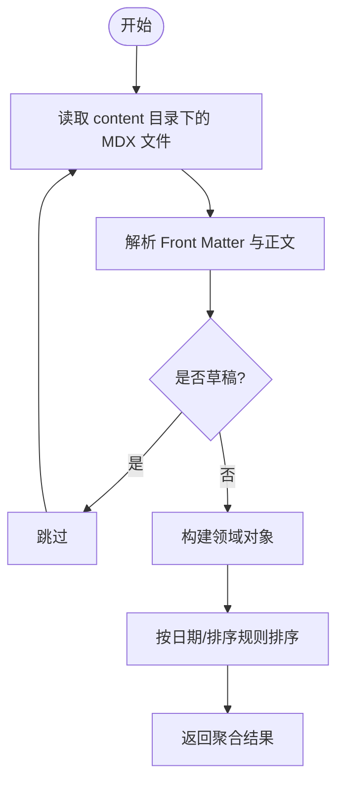
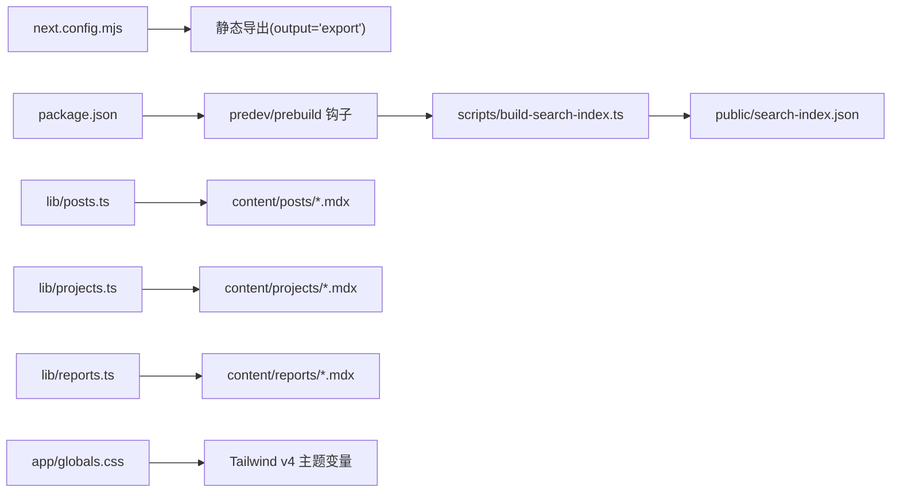

# 整体架构设计

<cite>
**本文引用的文件**
- [README.md](file://README.md)
- [next.config.mjs](file://next.config.mjs)
- [package.json](file://package.json)
- [app/layout.tsx](file://app/layout.tsx)
- [app/page.tsx](file://app/page.tsx)
- [app/blog/page.tsx](file://app/blog/page.tsx)
- [app/globals.css](file://app/globals.css)
- [components/site-header.tsx](file://components/site-header.tsx)
- [components/site-footer.tsx](file://components/site-footer.tsx)
- [components/post-card.tsx](file://components/post-card.tsx)
- [lib/utils.ts](file://lib/utils.ts)
- [lib/posts.ts](file://lib/posts.ts)
- [lib/projects.ts](file://lib/projects.ts)
- [lib/reports.ts](file://lib/reports.ts)
- [scripts/build-search-index.ts](file://scripts/build-search-index.ts)
- [content/projects/example-project.mdx](file://content/projects/example-project.mdx)
- [content/reports/2026-05-13-e1-045-tools-distribution.mdx](file://content/reports/2026-04-13-e1-045-tools-distribution.mdx)
</cite>

## 目录
1. [引言](#引言)
2. [项目结构](#项目结构)
3. [核心组件](#核心组件)
4. [架构总览](#架构总览)
5. [详细组件分析](#详细组件分析)
6. [依赖分析](#依赖分析)
7. [性能考虑](#性能考虑)
8. [故障排查指南](#故障排查指南)
9. [结论](#结论)
10. [附录](#附录)

## 引言
本项目是一个基于 Next.js 16 App Router 的内容驱动型个人站点，采用静态生成（静态导出）策略，内容以 MDX 文档形式存放在 content/ 目录中，通过 lib/ 层的业务逻辑读取并渲染到页面。站点使用 Tailwind v4 进行样式管理，结合 Framer Motion 实现轻量动效，支持构建期生成搜索索引与 GitHub Actions 自动部署至 GitHub Pages。

## 项目结构
项目采用“内容驱动 + 分层架构”的组织方式：
- 路由层（app/）：基于 Next.js App Router 的页面路由与布局，负责页面级元数据、布局与页面渲染入口。
- 组件层（components/）：可复用 UI 组件，包含站点头部、页脚、文章卡片、搜索对话框等。
- 内容管理层（content/）：MDX 内容文件，包含文章、项目、报告三类内容，通过 Front Matter 声明元信息。
- 业务逻辑层（lib/）：封装内容读取、解析、聚合与工具函数，提供统一的数据接口。
- 样式层（app/globals.css）：Tailwind v4 主题变量与全局样式，支持暗色主题与打印样式。
- 构建与部署（next.config.mjs、scripts/、.github/workflows/）：静态导出配置、构建期脚本与自动化部署。

图表来源
- [app/layout.tsx:1-57](file://app/layout.tsx#L1-L57)
- [app/page.tsx:1-157](file://app/page.tsx#L1-L157)
- [app/blog/page.tsx:1-28](file://app/blog/page.tsx#L1-L28)
- [components/site-header.tsx:1-103](file://components/site-header.tsx#L1-L103)
- [components/site-footer.tsx:1-40](file://components/site-footer.tsx#L1-L40)
- [components/post-card.tsx:1-81](file://components/post-card.tsx#L1-L81)
- [lib/utils.ts:1-24](file://lib/utils.ts#L1-L24)
- [lib/posts.ts:1-98](file://lib/posts.ts#L1-L98)
- [lib/projects.ts:1-64](file://lib/projects.ts#L1-L64)
- [lib/reports.ts:1-60](file://lib/reports.ts#L1-L60)
- [app/globals.css:1-278](file://app/globals.css#L1-L278)
- [next.config.mjs:1-19](file://next.config.mjs#L1-L19)
- [package.json:1-48](file://package.json#L1-L48)
- [scripts/build-search-index.ts:1-95](file://scripts/build-search-index.ts#L1-L95)

章节来源
- [README.md:122-135](file://README.md#L122-L135)
- [next.config.mjs:7-16](file://next.config.mjs#L7-L16)
- [package.json:6-13](file://package.json#L6-L13)

## 核心组件
- 路由与布局
  - 根布局负责注入全局样式与站点头部、尾部，设置站点元数据与语言环境。
  - 首页与博客页分别负责聚合精选内容与展示列表。
- 组件系统
  - 站点头部：导航、语言切换、搜索按钮与搜索对话框。
  - 站点尾部：版权与社交链接。
  - 文章卡片：带悬停光晕与阅读时间计算。
- 数据与内容
  - 文章、项目、报告的读取与解析，统一输出为领域对象。
  - 构建期生成搜索索引，供客户端搜索使用。
- 样式与主题
  - Tailwind v4 主题变量定义与暗色主题，配合自定义动画与打印样式。

章节来源
- [app/layout.tsx:9-44](file://app/layout.tsx#L9-L44)
- [app/layout.tsx:46-56](file://app/layout.tsx#L46-L56)
- [app/page.tsx:14-148](file://app/page.tsx#L14-L148)
- [app/blog/page.tsx:6-9](file://app/blog/page.tsx#L6-L9)
- [components/site-header.tsx:19-102](file://components/site-header.tsx#L19-L102)
- [components/site-footer.tsx:3-39](file://components/site-footer.tsx#L3-L39)
- [components/post-card.tsx:20-80](file://components/post-card.tsx#L20-L80)
- [lib/posts.ts:60-66](file://lib/posts.ts#L60-L66)
- [lib/projects.ts:28-63](file://lib/projects.ts#L28-L63)
- [lib/reports.ts:46-55](file://lib/reports.ts#L46-L55)
- [scripts/build-search-index.ts:29-88](file://scripts/build-search-index.ts#L29-L88)
- [app/globals.css:4-21](file://app/globals.css#L4-L21)

## 架构总览
本项目采用“内容驱动 + 静态生成”的架构模式：
- 内容驱动：内容以 MDX 文件存在，通过 Front Matter 声明元信息，lib/ 层统一解析与聚合。
- 分层清晰：路由层仅负责页面渲染与元数据，业务逻辑层封装数据读取与处理，组件层专注 UI 与交互。
- 静态生成：通过 next.config.mjs 的静态导出配置，构建时生成可直接部署的静态产物。
- 搜索与索引：构建期扫描 content/ 下的 MDX 文件，生成 public/search-index.json，客户端使用 Fuse.js 进行搜索。
- 部署自动化：GitHub Actions 在推送时自动构建并部署到 GitHub Pages。

图表来源
- [package.json:7-12](file://package.json#L7-L12)
- [scripts/build-search-index.ts:29-88](file://scripts/build-search-index.ts#L29-L88)
- [next.config.mjs:8](file://next.config.mjs#L8)

章节来源
- [README.md:88-94](file://README.md#L88-L94)
- [next.config.mjs:8](file://next.config.mjs#L8)

## 详细组件分析

### 路由层（app/）
- 根布局
  - 注入全局样式与站点头部、尾部，设置站点元数据与语言环境。
  - 作为所有页面的容器，确保一致的主题与导航体验。
- 首页
  - 调用 lib/ 中的 getAllPosts/getAllProjects/getAllReports 获取精选内容，渲染 Hero、Now 条、精选项目、最新文章与最新报告区块。
- 博客页
  - 展示文章列表与标签筛选器，使用 TagFilter 组件进行筛选。

图表来源
- [app/layout.tsx:46-56](file://app/layout.tsx#L46-L56)
- [app/page.tsx:14-148](file://app/page.tsx#L14-L148)
- [lib/posts.ts:60-66](file://lib/posts.ts#L60-L66)
- [lib/projects.ts:28-63](file://lib/projects.ts#L28-L63)
- [lib/reports.ts:46-55](file://lib/reports.ts#L46-L55)

章节来源
- [app/layout.tsx:9-44](file://app/layout.tsx#L9-L44)
- [app/layout.tsx:46-56](file://app/layout.tsx#L46-L56)
- [app/page.tsx:14-148](file://app/page.tsx#L14-L148)
- [app/blog/page.tsx:11-27](file://app/blog/page.tsx#L11-L27)

### 组件层（components/）
- 站点头部
  - 包含导航项、语言切换逻辑、搜索按钮与搜索对话框。
  - 使用 usePathname 判断当前路由，动态生成英文镜像路径。
- 站点尾部
  - 展示版权信息与外部链接。
- 文章卡片
  - 支持悬停光晕效果与阅读时间计算，根据分类显示不同颜色标签。

图表来源
- [components/site-header.tsx:19-102](file://components/site-header.tsx#L19-L102)
- [components/site-footer.tsx:3-39](file://components/site-footer.tsx#L3-L39)
- [components/post-card.tsx:20-80](file://components/post-card.tsx#L20-L80)
- [lib/utils.ts:8-23](file://lib/utils.ts#L8-L23)

章节来源
- [components/site-header.tsx:19-102](file://components/site-header.tsx#L19-L102)
- [components/site-footer.tsx:3-39](file://components/site-footer.tsx#L3-L39)
- [components/post-card.tsx:20-80](file://components/post-card.tsx#L20-L80)
- [lib/utils.ts:8-23](file://lib/utils.ts#L8-L23)

### 内容管理层（content/）
- 文章（posts/*.mdx）
  - Front Matter 包含标题、日期、标签、分类、摘要、草稿等字段。
- 项目（projects/*.mdx）
  - Front Matter 包含标题、日期、摘要、技术栈、链接、是否精选、排序等字段。
- 报告（reports/*.mdx）
  - Front Matter 包含标题、日期、摘要、标签、内嵌 HTML 路径、高度等字段。

章节来源
- [content/projects/example-project.mdx:1-23](file://content/projects/example-project.mdx#L1-L23)
- [content/reports/2026-05-13-e1-045-tools-distribution.mdx:1-30](file://content/reports/2026-05-13-e1-045-tools-distribution.mdx#L1-L30)

### 业务逻辑层（lib/）
- 工具函数
  - cn：合并与去重 CSS 类名。
  - formatDate：格式化日期。
  - readingTime：估算阅读时长。
- 文章
  - getAllPosts：读取并解析文章，过滤草稿，按日期倒序。
  - getPostBySlug：按 slug 查找文章。
  - getAllTags/getPostsByTag/getAllCategories：标签与分类聚合。
- 项目
  - getAllProjects：读取并解析项目，按精选与 order 排序。
  - getProjectBySlug：按 slug 查找项目。
- 报告
  - getAllReports：读取并解析报告，过滤草稿，按日期倒序。
  - getReportBySlug：按 slug 查找报告。

图表来源
- [lib/posts.ts:26-58](file://lib/posts.ts#L26-L58)
- [lib/projects.ts:28-63](file://lib/projects.ts#L28-L63)
- [lib/reports.ts:22-44](file://lib/reports.ts#L22-L44)

章节来源
- [lib/utils.ts:4-23](file://lib/utils.ts#L4-L23)
- [lib/posts.ts:60-98](file://lib/posts.ts#L60-L98)
- [lib/projects.ts:24-63](file://lib/projects.ts#L24-L63)
- [lib/reports.ts:46-60](file://lib/reports.ts#L46-L60)

### 样式层（app/globals.css）
- 主题变量：定义背景、表面、边框、前景色及强调色等变量。
- 动画与装饰：渐变边框、玻璃卡片、打字机动画、代码高亮样式。
- 打印样式：针对 CV 页面的打印优化，强制浅色背景与去除站点装饰。

章节来源
- [app/globals.css:4-21](file://app/globals.css#L4-L21)
- [app/globals.css:83-117](file://app/globals.css#L83-L117)
- [app/globals.css:152-212](file://app/globals.css#L152-L212)
- [app/globals.css:232-277](file://app/globals.css#L232-L277)

### 搜索与索引（构建期）
- 构建脚本
  - 扫描 content/posts、content/projects、content/reports。
  - 过滤草稿与缺失必要字段的条目。
  - 生成统一的搜索索引数组，按日期倒序，写入 public/search-index.json。
- 客户端使用
  - 通过 Fuse.js 在浏览器端进行全文检索，提升搜索体验。

章节来源
- [scripts/build-search-index.ts:29-88](file://scripts/build-search-index.ts#L29-L88)
- [package.json:7-12](file://package.json#L7-L12)

## 依赖分析
- 配置与构建
  - next.config.mjs：启用静态导出、尾斜杠、图片优化关闭、严格模式与 Turbopack 根目录。
  - package.json：定义 predev/prebuild 钩子，自动执行构建脚本。
- 外部依赖
  - next-mdx-remote、@next/mdx：MDX 渲染与加载。
  - gray-matter：Front Matter 解析。
  - fuse.js：客户端搜索。
  - @giscus/react：评论系统。
  - tailwindcss、@tailwindcss/typography：样式与排版。
  - framer-motion：动效。
  - shiki、rehype-*：代码高亮与链接处理。

图表来源
- [next.config.mjs:7-16](file://next.config.mjs#L7-L16)
- [package.json:6-13](file://package.json#L6-L13)
- [scripts/build-search-index.ts:90-95](file://scripts/build-search-index.ts#L90-L95)
- [lib/posts.ts:24](file://lib/posts.ts#L24)
- [lib/projects.ts:22](file://lib/projects.ts#L22)
- [lib/reports.ts:20](file://lib/reports.ts#L20)
- [app/globals.css:1-3](file://app/globals.css#L1-L3)

章节来源
- [next.config.mjs:7-16](file://next.config.mjs#L7-L16)
- [package.json:14-34](file://package.json#L14-L34)

## 性能考虑
- 静态生成的优势
  - 预渲染静态 HTML，减少运行时计算与服务器压力，提升首屏速度与 SEO 表现。
  - 适合内容驱动站点，内容变更频率低，适合一次性构建。
- 构建期优化
  - 构建脚本集中生成搜索索引，避免运行时 IO 与解析开销。
  - 关闭图片优化与尾斜杠策略，简化部署与缓存。
- 客户端体验
  - 使用轻量动效与 CSS 变量，降低 JS 依赖，保证流畅度。
  - 打印样式优化，便于 CV 页面打印。

## 故障排查指南
- 构建失败或找不到内容
  - 检查 content/ 下的 MDX 文件是否包含必需的 Front Matter 字段（如 title、date）。
  - 确认草稿（draft）字段未误设为 true。
- 搜索无结果
  - 确认 predev/prebuild 钩子已执行，public/search-index.json 是否生成。
  - 检查搜索关键词是否与 Front Matter 中的 title/summary/tags 对齐。
- 部署异常
  - 确认仓库名为 <username>.github.io，分支为 main。
  - 检查 GitHub Actions 工作流是否成功触发与部署。

章节来源
- [lib/posts.ts:39-43](file://lib/posts.ts#L39-L43)
- [lib/reports.ts:28-32](file://lib/reports.ts#L28-L32)
- [scripts/build-search-index.ts:33-34](file://scripts/build-search-index.ts#L33-L34)
- [README.md:88-94](file://README.md#L88-L94)

## 结论
本项目通过“内容驱动 + 分层架构 + 静态生成”的设计，实现了低成本维护、高性能渲染与良好可扩展性的个人站点。内容与代码分离，业务逻辑清晰，组件可复用，样式主题化，构建期生成搜索索引与静态产物，满足长期运营与快速迭代的需求。

## 附录
- 站点结构与用途概览
  - 首页：Hero + Now 条 + 精选项目 + 最新文章 + 最新报告
  - 博客：文章列表与标签筛选
  - 项目：项目档案与案例研究
  - 报告：评测报告与可视化分析
  - 关于与 CV：关于我与一页式简历
  - 英文镜像：/en/about 与 /en/cv

章节来源
- [README.md:8-18](file://README.md#L8-L18)