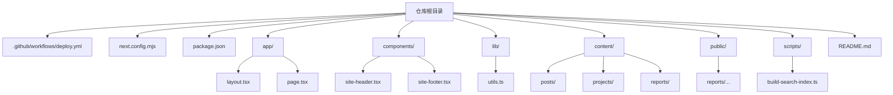
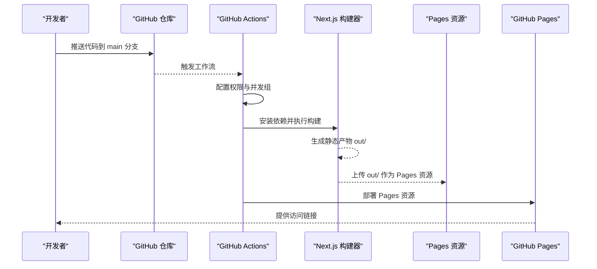
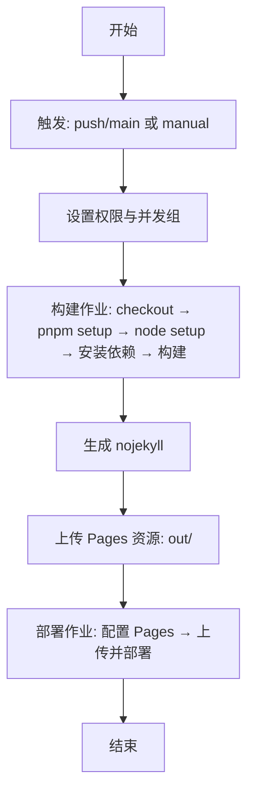
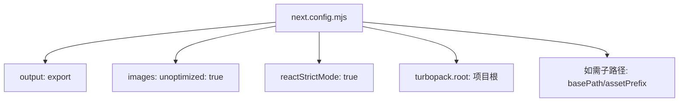
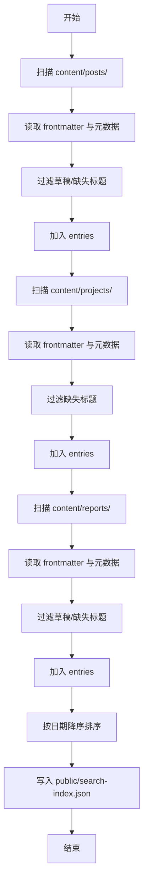
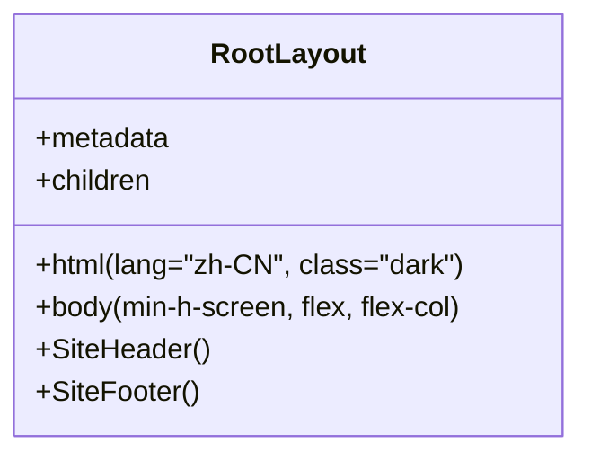
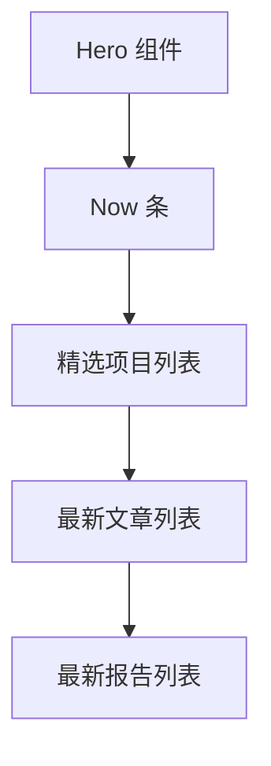
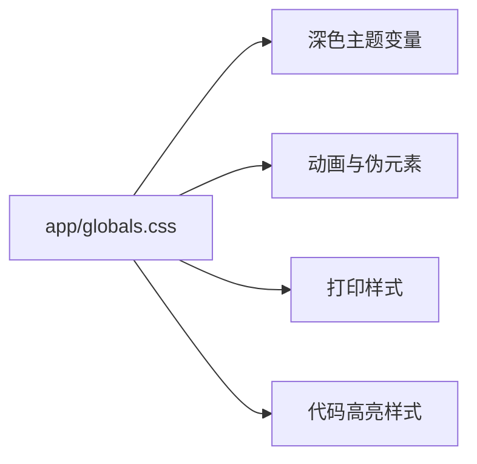
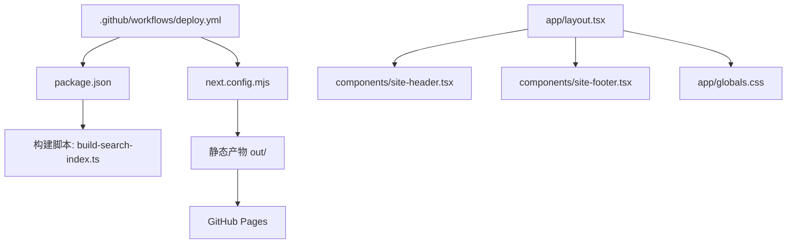

# 部署架构

<cite>
**本文引用的文件**
- [.github/workflows/deploy.yml](file://.github/workflows/deploy.yml)
- [package.json](file://package.json)
- [next.config.mjs](file://next.config.mjs)
- [README.md](file://README.md)
- [scripts/build-search-index.ts](file://scripts/build-search-index.ts)
- [app/layout.tsx](file://app/layout.tsx)
- [app/page.tsx](file://app/page.tsx)
- [lib/utils.ts](file://lib/utils.ts)
- [app/globals.css](file://app/globals.css)
- [components/site-header.tsx](file://components/site-header.tsx)
- [components/site-footer.tsx](file://components/site-footer.tsx)
</cite>

## 目录
1. [简介](#简介)
2. [项目结构](#项目结构)
3. [核心组件](#核心组件)
4. [架构总览](#架构总览)
5. [详细组件分析](#详细组件分析)
6. [依赖关系分析](#依赖关系分析)
7. [性能考量](#性能考量)
8. [故障排除指南](#故障排除指南)
9. [结论](#结论)
10. [附录](#附录)

## 简介
本文件面向 myWebsite 项目，系统性阐述其基于 GitHub Pages 的静态部署策略与 GitHub Actions CI/CD 流水线。文档覆盖从代码提交到静态产物上传与部署的全过程，解释构建优化（图片优化、代码分割、缓存策略）、域名与 HTTPS 配置、CDN 集成思路，并提供故障排除与监控建议，帮助读者快速理解并维护该部署架构。

## 项目结构
该项目采用 Next.js 16 App Router + MDX + Tailwind v4 的技术栈，通过静态导出（export）生成纯静态站点，配合 GitHub Actions 在推送至 main 分支时自动构建并部署到 GitHub Pages。

图表来源
- [README.md:122-135](file://README.md#L122-L135)
- [package.json:1-48](file://package.json#L1-L48)
- [next.config.mjs:1-19](file://next.config.mjs#L1-L19)

章节来源
- [README.md:122-135](file://README.md#L122-L135)
- [package.json:1-48](file://package.json#L1-L48)
- [next.config.mjs:1-19](file://next.config.mjs#L1-L19)

## 核心组件
- GitHub Actions 工作流：定义触发条件、权限、并发控制、构建与部署作业。
- Next.js 配置：启用静态导出、禁用图片优化、严格模式等。
- 构建脚本：在构建前后生成搜索索引，确保前端搜索可用。
- 页面与布局：根布局设置元数据、语言与主题，首页聚合精选内容。
- 样式与组件：全局样式、导航栏与页脚组件，支持暗色主题与打印样式。

章节来源
- [.github/workflows/deploy.yml:1-64](file://.github/workflows/deploy.yml#L1-L64)
- [next.config.mjs:6-16](file://next.config.mjs#L6-L16)
- [scripts/build-search-index.ts:1-95](file://scripts/build-search-index.ts#L1-L95)
- [app/layout.tsx:1-57](file://app/layout.tsx#L1-L57)
- [app/page.tsx:1-157](file://app/page.tsx#L1-L157)
- [app/globals.css:1-278](file://app/globals.css#L1-L278)
- [components/site-header.tsx:1-103](file://components/site-header.tsx#L1-L103)
- [components/site-footer.tsx:1-40](file://components/site-footer.tsx#L1-L40)

## 架构总览
下图展示了从代码提交到 GitHub Pages 部署的端到端流程，包含构建优化、产物打包与上传步骤。

图表来源
- [.github/workflows/deploy.yml:17-64](file://.github/workflows/deploy.yml#L17-L64)
- [next.config.mjs:8](file://next.config.mjs#L8)

## 详细组件分析

### GitHub Actions 工作流
- 触发方式：push 到 main 分支或手动触发。
- 权限：读取内容、写入 Pages、颁发 ID Token。
- 并发控制：同组并发仅保留一个运行实例。
- 作业拆分：build（安装依赖、构建、生成 nojekyll）、deploy（配置 Pages、上传产物、部署）。
- 环境变量：通过仓库变量注入 Giscus 配置以启用评论功能。
- 产物路径：构建输出目录 out/，通过 upload-pages-artifact 上传。

图表来源
- [.github/workflows/deploy.yml:1-64](file://.github/workflows/deploy.yml#L1-L64)

章节来源
- [.github/workflows/deploy.yml:1-64](file://.github/workflows/deploy.yml#L1-L64)

### Next.js 静态导出配置
- 输出模式：静态导出（export），生成纯 HTML/CSS/JS。
- 图片处理：禁用 Next.js 图片优化，使用原生 img 标签。
- 严格模式：启用 React 严格模式。
- 根目录：指定工作区根以避免无关锁文件干扰。
- 路径前缀：若使用子路径部署，需在配置中添加 basePath 与 assetPrefix。

图表来源
- [next.config.mjs:6-16](file://next.config.mjs#L6-L16)
- [README.md:96-101](file://README.md#L96-L101)

章节来源
- [next.config.mjs:6-16](file://next.config.mjs#L6-L16)
- [README.md:96-101](file://README.md#L96-L101)

### 构建前搜索索引生成
- 目标：在构建前生成 public/search-index.json，供前端搜索使用。
- 数据来源：content/posts、content/projects、content/reports 下的 MDX 文件。
- 内容抽取：标题、摘要、标签、分类、日期、slug 等字段。
- 排序规则：按日期降序排列。
- 输出位置：public/search-index.json。

图表来源
- [scripts/build-search-index.ts:17-95](file://scripts/build-search-index.ts#L17-L95)

章节来源
- [scripts/build-search-index.ts:1-95](file://scripts/build-search-index.ts#L1-L95)
- [package.json:6-13](file://package.json#L6-L13)

### 根布局与元数据
- 元信息：站点标题模板、描述、作者、关键词、Open Graph、Twitter 卡片。
- 基础地址：metadataBase 指向 houpan.dev。
- 主题：默认暗色主题。
- 结构：头部导航、主要内容区域、页脚。

图表来源
- [app/layout.tsx:1-57](file://app/layout.tsx#L1-L57)
- [components/site-header.tsx:1-103](file://components/site-header.tsx#L1-L103)
- [components/site-footer.tsx:1-40](file://components/site-footer.tsx#L1-L40)

章节来源
- [app/layout.tsx:1-57](file://app/layout.tsx#L1-L57)
- [components/site-header.tsx:1-103](file://components/site-header.tsx#L1-L103)
- [components/site-footer.tsx:1-40](file://components/site-footer.tsx#L1-L40)

### 首页内容聚合
- 功能：展示 Hero、Now 条、精选项目、最新文章、最新报告。
- 数据来源：lib/posts、lib/projects、lib/reports。
- 交互：卡片悬停效果、链接跳转、空状态提示。

图表来源
- [app/page.tsx:14-157](file://app/page.tsx#L14-L157)
- [lib/utils.ts:8-24](file://lib/utils.ts#L8-L24)

章节来源
- [app/page.tsx:1-157](file://app/page.tsx#L1-L157)
- [lib/utils.ts:1-24](file://lib/utils.ts#L1-L24)

### 样式与主题
- 主题：深色为主，自定义变量颜色与字体。
- 动画：渐变边框、发光卡片、打字机光标。
- 打印样式：CV 页面打印时去除站点装饰，强制浅色背景。
- 代码高亮：rehype-pretty-code 样式覆盖。

图表来源
- [app/globals.css:1-278](file://app/globals.css#L1-L278)

章节来源
- [app/globals.css:1-278](file://app/globals.css#L1-L278)

## 依赖关系分析
- 工作流依赖：Actions 步骤依赖 Node.js 与 pnpm 缓存；构建依赖 Next.js 导出模式；部署依赖 Pages 资源上传。
- 构建脚本依赖：MDX frontmatter 解析与文件系统读写。
- 页面依赖：组件库与工具函数，样式依赖 Tailwind v4 插件。
- 配置依赖：Next.js 静态导出配置影响产物结构与路径前缀。

图表来源
- [.github/workflows/deploy.yml:17-64](file://.github/workflows/deploy.yml#L17-L64)
- [next.config.mjs:6-16](file://next.config.mjs#L6-L16)
- [package.json:6-13](file://package.json#L6-L13)
- [scripts/build-search-index.ts:1-95](file://scripts/build-search-index.ts#L1-L95)
- [app/layout.tsx:1-57](file://app/layout.tsx#L1-L57)
- [components/site-header.tsx:1-103](file://components/site-header.tsx#L1-L103)
- [components/site-footer.tsx:1-40](file://components/site-footer.tsx#L1-L40)
- [app/globals.css:1-278](file://app/globals.css#L1-L278)

章节来源
- [.github/workflows/deploy.yml:17-64](file://.github/workflows/deploy.yml#L17-L64)
- [next.config.mjs:6-16](file://next.config.mjs#L6-L16)
- [package.json:6-13](file://package.json#L6-L13)
- [scripts/build-search-index.ts:1-95](file://scripts/build-search-index.ts#L1-L95)
- [app/layout.tsx:1-57](file://app/layout.tsx#L1-L57)
- [components/site-header.tsx:1-103](file://components/site-header.tsx#L1-L103)
- [components/site-footer.tsx:1-40](file://components/site-footer.tsx#L1-L40)
- [app/globals.css:1-278](file://app/globals.css#L1-L278)

## 性能考量
- 图片优化
  - 当前配置禁用 Next.js 图片优化，使用原生 img 标签。若需进一步优化，可在构建阶段引入外部工具链（如压缩、WebP 转换、懒加载）并在 CI 中集成。
  - 若未来启用图片优化，需同步调整静态导出路径与资源前缀。
- 代码分割
  - Next.js 默认按路由进行代码分割，静态导出会保留分块结构。建议保持组件拆分合理，避免单页过大。
- 缓存策略
  - GitHub Pages 默认缓存策略较弱。可通过以下方式增强：
    - 使用自定义域名并结合 CDN（如 Cloudflare）实现边缘缓存与压缩。
    - 在静态产物中加入版本化文件名或哈希，利用浏览器缓存。
    - 对 CSS/JS 设置较长缓存时间，对 HTML 设置较短缓存时间。
- 资源体积
  - 控制第三方依赖大小，合并与裁剪不必要的模块。
  - 将大体积资源（如视频、PDF）移至外部存储或 CDN。
- 构建时间
  - 利用 pnpm 缓存与 Actions 缓存，减少重复安装与编译时间。
  - 将耗时任务（如搜索索引生成）放在 predev/prebuild 钩子中，避免重复执行。

[本节为通用性能建议，不直接分析具体文件，故无“章节来源”]

## 故障排除指南
- 构建失败
  - 检查 Node.js 版本与 pnpm 版本是否匹配工作流配置。
  - 确认 package.json 中的构建脚本与 predev/prebuild 钩子已正确执行。
  - 查看构建日志中的依赖安装与构建命令输出。
- 404 页面
  - 确保生成了 out/404.html 或 out/404/index.html。
  - 检查 next.config.mjs 中 trailingSlash 配置与静态导出路径。
- 图片不显示
  - 当前配置禁用了 Next.js 图片优化，请确认使用原生 img 标签且路径正确。
  - 如需启用图片优化，需调整配置并验证静态导出产物。
- 域名与 HTTPS
  - 使用用户主站仓库（用户名.github.io）可直接获得 https://用户名.github.io/。
  - 若使用子路径部署，需在 next.config.mjs 中设置 basePath 与 assetPrefix。
- CDN 集成
  - 建议使用 Cloudflare 等 CDN，开启压缩、缓存与安全策略。
  - 将自定义域名指向 CDN，再由 CDN 回源到 GitHub Pages。
- Giscus 评论
  - 在仓库 Settings → Secrets and variables → Actions → Variables 中配置 GISCUS_* 变量。
  - 本地开发时可在 .env.local 中设置 NEXT_PUBLIC_GISCUS_* 变量。
- 日志与监控
  - 在 Actions 工作流中启用更详细的日志输出。
  - 使用 GitHub Pages 的部署日志与状态面板进行问题定位。

章节来源
- [.github/workflows/deploy.yml:35-43](file://.github/workflows/deploy.yml#L35-L43)
- [README.md:88-121](file://README.md#L88-L121)
- [next.config.mjs:8-10](file://next.config.mjs#L8-L10)

## 结论
本项目采用“静态导出 + GitHub Actions + GitHub Pages”的轻量级部署方案，具备快速迭代与低成本运维的优势。通过合理的构建优化、明确的路径前缀配置与可选的 CDN 集成，可在保证性能的同时提升用户体验。建议在生产环境中逐步引入 CDN 与缓存策略，并完善监控与回滚机制。

[本节为总结性内容，不直接分析具体文件，故无“章节来源”]

## 附录
- 快速参考
  - 构建命令：pnpm build
  - 开发命令：pnpm dev
  - 类型检查：pnpm typecheck
  - 预构建钩子：predev/prebuild 自动执行搜索索引生成
- 相关文件
  - 工作流：.github/workflows/deploy.yml
  - 配置：next.config.mjs
  - 包管理：package.json
  - 文档：README.md

[本节为概览性内容，不直接分析具体文件，故无“章节来源”]