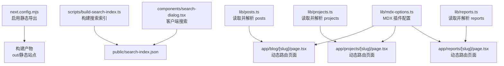
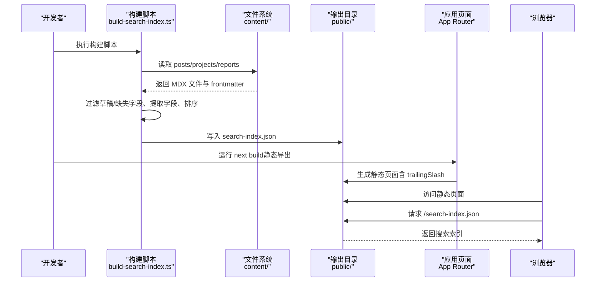
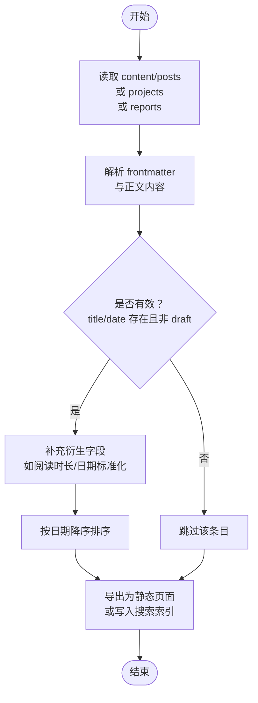
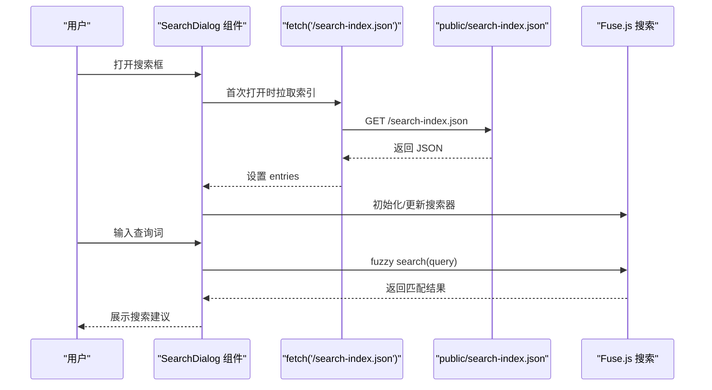
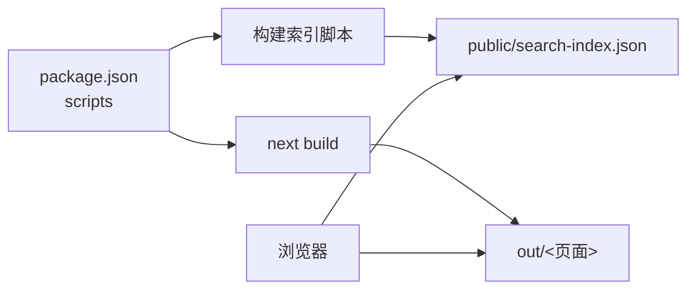

# 静态生成策略

<cite>
**本文引用的文件**
- [next.config.mjs](file://next.config.mjs)
- [package.json](file://package.json)
- [scripts/build-search-index.ts](file://scripts/build-search-index.ts)
- [lib/mdx-options.ts](file://lib/mdx-options.ts)
- [lib/posts.ts](file://lib/posts.ts)
- [lib/projects.ts](file://lib/projects.ts)
- [lib/reports.ts](file://lib/reports.ts)
- [app/blog/[slug]/page.tsx](file://app/blog/[slug]/page.tsx)
- [app/layout.tsx](file://app/layout.tsx)
- [app/page.tsx](file://app/page.tsx)
- [components/search-dialog.tsx](file://components/search-dialog.tsx)
- [public/search-index.json](file://public/search-index.json)
</cite>

## 目录
1. [简介](#简介)
2. [项目结构](#项目结构)
3. [核心组件](#核心组件)
4. [架构总览](#架构总览)
5. [详细组件分析](#详细组件分析)
6. [依赖关系分析](#依赖关系分析)
7. [性能考量](#性能考量)
8. [故障排查指南](#故障排查指南)
9. [结论](#结论)
10. [附录](#附录)

## 简介
本文件面向 myWebsite 项目的静态生成策略，围绕以下目标展开：  
- 解释静态导出配置 output: 'export' 的作用与优势  
- 描述从 MDX 内容到静态 HTML 的完整转换链路（文件系统读取、内容解析、数据处理、页面生成）  
- 解释搜索索引的构建机制与缓存策略  
- 分析静态生成对性能、SEO 与部署的影响  

## 项目结构
该项目采用 Next.js App Router 与静态导出模式，核心目录与职责如下：  
- app/*：页面路由与页面逻辑（App Router 路径段路由与动态路由）
- content/*：MDX 内容源文件（posts、projects、reports）
- lib/*：内容读取、解析与工具函数（posts.ts、projects.ts、reports.ts、mdx-options.ts）
- scripts/*：构建脚本（构建搜索索引）
- public/*：静态资源输出目录（包含构建产物与搜索索引）
- next.config.mjs：Next.js 构建配置（启用静态导出）

图表来源
- [next.config.mjs:1-19](file://next.config.mjs#L1-L19)
- [scripts/build-search-index.ts:1-95](file://scripts/build-search-index.ts#L1-L95)
- [lib/posts.ts:1-98](file://lib/posts.ts#L1-L98)
- [lib/projects.ts:1-64](file://lib/projects.ts#L1-L64)
- [lib/reports.ts:1-60](file://lib/reports.ts#L1-L60)
- [app/blog/[slug]/page.tsx:1-98](file://app/blog/[slug]/page.tsx#L1-L98)
- [components/search-dialog.tsx:1-156](file://components/search-dialog.tsx#L1-L156)

章节来源
- [next.config.mjs:1-19](file://next.config.mjs#L1-L19)
- [package.json:1-48](file://package.json#L1-L48)

## 核心组件
- 静态导出配置：通过 next.config.mjs 中的 output: 'export'，使构建产物为可直接部署的静态站点，无需运行时服务端渲染或边缘执行。
- MDX 内容解析：使用 gray-matter 提取 frontmatter，结合 mdx-options 中的 remark/rehype 插件进行语法高亮与链接增强。
- 动态路由页面：在 App Router 中，通过 generateStaticParams 生成静态页面参数，确保每个 slug 对应的页面在构建时即被预渲染。
- 搜索索引：构建脚本扫描 content 下的 posts/projects/reports，过滤有效条目并排序，输出至 public/search-index.json，供客户端按需加载。

章节来源
- [next.config.mjs:7-16](file://next.config.mjs#L7-L16)
- [lib/mdx-options.ts:1-20](file://lib/mdx-options.ts#L1-L20)
- [app/blog/[slug]/page.tsx:13-15](file://app/blog/[slug]/page.tsx#L13-L15)
- [scripts/build-search-index.ts:29-88](file://scripts/build-search-index.ts#L29-L88)

## 架构总览
下图展示了从内容源到静态页面与搜索索引的整体流程：

图表来源
- [scripts/build-search-index.ts:17-88](file://scripts/build-search-index.ts#L17-L88)
- [lib/posts.ts:24-66](file://lib/posts.ts#L24-L66)
- [lib/projects.ts:22-63](file://lib/projects.ts#L22-L63)
- [lib/reports.ts:20-55](file://lib/reports.ts#L20-L55)
- [next.config.mjs:8](file://next.config.mjs#L8)

## 详细组件分析

### 静态导出配置与优势
- 配置要点
  - output: 'export'：构建后生成 out/ 目录，包含所有静态 HTML、资源与入口。
  - trailingSlash: true：保证路径带尾随斜杠，利于静态托管与 SEO。
  - images.unoptimized: true：禁用自动图像优化，避免运行时开销，适配静态托管。
- 优势
  - 部署简单：直接将 out/ 上传至静态托管（如 GitHub Pages）。
  - 性能稳定：无 SSR/边缘执行，首屏与后续导航延迟可控。
  - 成本低：无需服务器或云函数实例。

章节来源
- [next.config.mjs:7-16](file://next.config.mjs#L7-L16)

### MDX 内容解析与页面生成
- 文件系统读取
  - posts.ts、projects.ts、reports.ts 分别读取对应目录下的 .md/.mdx 文件，使用 gray-matter 解析 frontmatter。
  - 对 posts 与 reports，要求存在 title 与 date；draft 字段为真则跳过。
- 数据处理
  - posts.ts 计算阅读时长；统一日期为 ISO 字符串；按日期降序排序。
  - projects.ts 根据 featured、order、date 排序；默认空数组与空字符串兜底。
  - reports.ts 支持自定义高度与内嵌 HTML 字段，其余字段与 posts 类似处理。
- 页面生成
  - app/blog/[slug]/page.tsx 使用 generateStaticParams 基于 getAllPosts 生成静态参数，确保每个文章 slug 在构建时生成独立页面。
  - 使用 MDXRemote 结合 mdxOptions 将 content 渲染为 HTML，配合自定义组件与主题化代码块。
  - generateMetadata 动态生成 Open Graph 等元信息，提升分享体验。

图表来源
- [lib/posts.ts:26-66](file://lib/posts.ts#L26-L66)
- [lib/projects.ts:28-63](file://lib/projects.ts#L28-L63)
- [lib/reports.ts:22-55](file://lib/reports.ts#L22-L55)
- [app/blog/[slug]/page.tsx:13-15](file://app/blog/[slug]/page.tsx#L13-L15)

章节来源
- [lib/posts.ts:1-98](file://lib/posts.ts#L1-L98)
- [lib/projects.ts:1-64](file://lib/projects.ts#L1-L64)
- [lib/reports.ts:1-60](file://lib/reports.ts#L1-L60)
- [app/blog/[slug]/page.tsx:1-98](file://app/blog/[slug]/page.tsx#L1-L98)
- [lib/mdx-options.ts:1-20](file://lib/mdx-options.ts#L1-L20)

### 搜索索引构建与缓存策略
- 构建机制
  - 构建脚本遍历 content/posts、content/projects、content/reports，过滤无效条目，组装统一的 SearchEntry 列表。
  - 按日期倒序排序，输出到 public/search-index.json。
- 缓存策略
  - 客户端首次打开搜索框时才请求 /search-index.json，避免不必要的网络开销。
  - 使用 Fuse.js 在客户端侧进行模糊匹配，支持标题、摘要、标签加权与阈值控制。
  - 搜索结果限制数量，减少 DOM 与内存压力。
- 运行时集成
  - public/search-index.json 作为静态资源由静态托管直接提供，零运行时逻辑。

图表来源
- [scripts/build-search-index.ts:29-88](file://scripts/build-search-index.ts#L29-L88)
- [components/search-dialog.tsx:33-82](file://components/search-dialog.tsx#L33-L82)
- [public/search-index.json:1-1](file://public/search-index.json#L1-L1)

章节来源
- [scripts/build-search-index.ts:1-95](file://scripts/build-search-index.ts#L1-L95)
- [components/search-dialog.tsx:1-156](file://components/search-dialog.tsx#L1-L156)
- [public/search-index.json:1-1](file://public/search-index.json#L1-L1)

### 页面布局与元信息
- 根布局与全局样式
  - app/layout.tsx 定义站点级元信息（标题模板、描述、关键词、Open Graph、Twitter 卡片等），并包裹全局样式。
- 首页聚合
  - app/page.tsx 调用 lib/posts.ts、lib/projects.ts、lib/reports.ts 获取精选内容，用于首页展示。

章节来源
- [app/layout.tsx:1-57](file://app/layout.tsx#L1-L57)
- [app/page.tsx:1-157](file://app/page.tsx#L1-L157)

## 依赖关系分析
- 构建阶段
  - package.json 中 prebuild/predev 脚本在构建前执行构建搜索索引脚本，确保 public/search-index.json 最新。
  - next build 触发静态导出，生成 out/。
- 运行阶段
  - 浏览器访问静态页面时，按需请求 public/search-index.json，实现轻量搜索体验。

图表来源
- [package.json:6-12](file://package.json#L6-L12)
- [next.config.mjs:8](file://next.config.mjs#L8)

章节来源
- [package.json:1-48](file://package.json#L1-L48)
- [next.config.mjs:1-19](file://next.config.mjs#L1-L19)

## 性能考量
- 静态导出的优势
  - 零运行时 SSR/边缘执行，首屏与交互延迟低，适合以内容为主的个人站点。
  - trailingSlash 与 unoptimized 图像配置降低运行时计算与网络重定向成本。
- 内容加载优化
  - 搜索索引按需加载，避免首屏阻塞。
  - 客户端搜索限制返回条数，控制 DOM 与内存占用。
- SEO 友好
  - generateMetadata 自动生成 Open Graph、时间线与标签等结构化信息，提升社交分享质量。
  - 静态 HTML 易于搜索引擎抓取与索引。

## 故障排查指南
- 搜索框无结果或“索引尚未生成”
  - 检查 public/search-index.json 是否存在且非空。
  - 确认构建脚本已执行，且未被 CI 忽略。
- 页面 404 或动态路由未生成
  - 确认 generateStaticParams 返回的参数列表包含目标 slug。
  - 检查内容文件是否满足 required frontmatter（title、date），draft 为真会被跳过。
- 图片未显示或尺寸异常
  - images.unoptimized: true 已禁用自动优化，确保图片路径正确且托管可用。
- 构建失败或输出目录为空
  - 确认 content 目录存在且包含合法的 .md/.mdx 文件。
  - 检查 Node 版本与依赖安装是否一致。

章节来源
- [components/search-dialog.tsx:33-40](file://components/search-dialog.tsx#L33-L40)
- [app/blog/[slug]/page.tsx:13-15](file://app/blog/[slug]/page.tsx#L13-L15)
- [lib/posts.ts:39-43](file://lib/posts.ts#L39-L43)
- [next.config.mjs:10](file://next.config.mjs#L10)

## 结论
本项目通过静态导出与构建期索引生成，实现了高性能、易部署、SEO 友好的内容站点。MDX 内容在构建期完成解析与渲染，动态路由页面在构建时预生成，搜索功能通过客户端懒加载与本地模糊匹配实现低开销体验。整体方案适合个人技术博客、作品集与知识库类站点的长期维护与低成本托管。

## 附录
- 关键实现路径参考
  - 静态导出配置：[next.config.mjs:7-16](file://next.config.mjs#L7-L16)
  - 构建脚本与索引输出：[scripts/build-search-index.ts:29-88](file://scripts/build-search-index.ts#L29-L88)
  - MDX 插件配置：[lib/mdx-options.ts:12-19](file://lib/mdx-options.ts#L12-L19)
  - 文章动态路由与元信息：[app/blog/[slug]/page.tsx:13-36](file://app/blog/[slug]/page.tsx#L13-L36)
  - 首页内容聚合：[app/page.tsx:14-148](file://app/page.tsx#L14-L148)
  - 客户端搜索对话框：[components/search-dialog.tsx:28-82](file://components/search-dialog.tsx#L28-L82)
  - 搜索索引样例：[public/search-index.json:1-1](file://public/search-index.json#L1-L1)