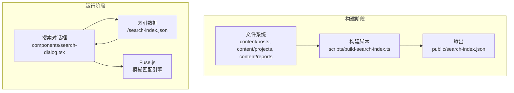
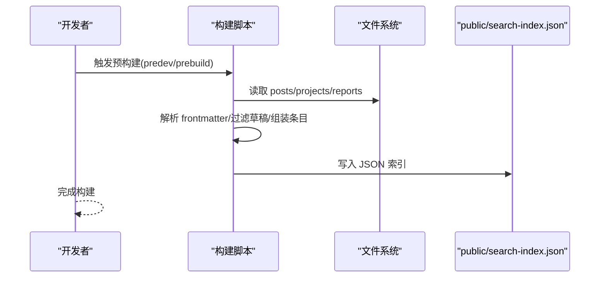
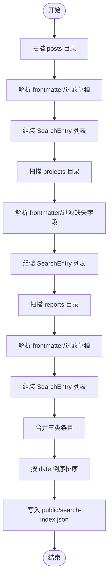
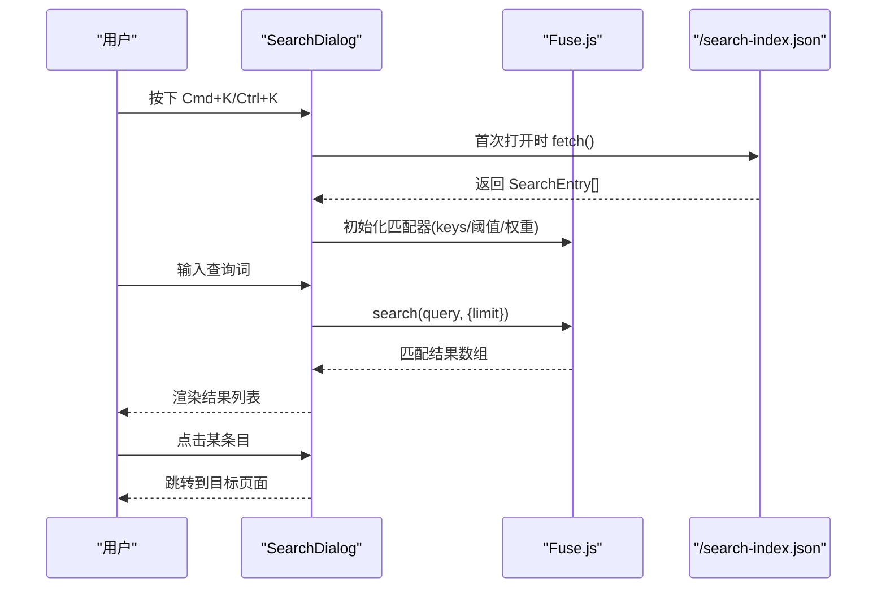
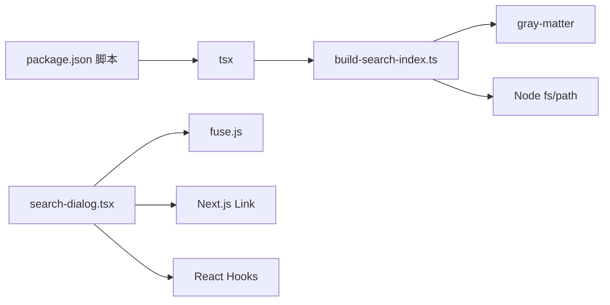

# 搜索系统

<cite>
**本文引用的文件**
- [scripts/build-search-index.ts](file://scripts/build-search-index.ts)
- [components/search-dialog.tsx](file://components/search-dialog.tsx)
- [lib/posts.ts](file://lib/posts.ts)
- [lib/projects.ts](file://lib/projects.ts)
- [lib/reports.ts](file://lib/reports.ts)
- [package.json](file://package.json)
- [app/layout.tsx](file://app/layout.tsx)
- [lib/utils.ts](file://lib/utils.ts)
</cite>

## 目录
1. [简介](#简介)
2. [项目结构](#项目结构)
3. [核心组件](#核心组件)
4. [架构总览](#架构总览)
5. [详细组件分析](#详细组件分析)
6. [依赖分析](#依赖分析)
7. [性能考量](#性能考量)
8. [故障排查指南](#故障排查指南)
9. [结论](#结论)
10. [附录](#附录)

## 简介
本文件面向 myWebsite 的搜索系统，系统采用“构建期生成索引 + 客户端模糊查询”的架构，使用 Fuse.js 实现基于权重的模糊匹配。搜索范围覆盖博客文章、项目与报告三类内容；索引由构建脚本从 Markdown 内容中抽取元信息生成，运行时通过键盘快捷键打开搜索对话框，输入即查，无需网络请求或服务端计算。

## 项目结构
- 构建脚本：scripts/build-search-index.ts 负责扫描 content 下的 posts、projects、reports，解析 frontmatter，生成 public/search-index.json。
- 前端组件：components/search-dialog.tsx 提供全局快捷键、输入框、结果列表与链接跳转。
- 内容库：lib/posts.ts、lib/projects.ts、lib/reports.ts 提供内容读取与解析能力（与搜索索引互补）。
- 任务编排：package.json 中 predev 与 prebuild 脚本在开发与构建前自动执行构建脚本。
- 页面布局：app/layout.tsx 定义站点元数据与页面骨架，确保搜索对话框可挂载于顶层。

图表来源
- [scripts/build-search-index.ts:1-95](file://scripts/build-search-index.ts#L1-L95)
- [components/search-dialog.tsx:1-156](file://components/search-dialog.tsx#L1-L156)
- [package.json:6-13](file://package.json#L6-L13)

章节来源
- [scripts/build-search-index.ts:1-95](file://scripts/build-search-index.ts#L1-L95)
- [components/search-dialog.tsx:1-156](file://components/search-dialog.tsx#L1-L156)
- [package.json:6-13](file://package.json#L6-L13)

## 核心组件
- 搜索索引构建器：读取三类内容目录，解析 frontmatter，过滤草稿与缺失必要字段的内容，组装统一的 SearchEntry 结构，按日期倒序后写入 public/search-index.json。
- 搜索对话框：首次打开时惰性加载索引，使用 Fuse.js 对标题、摘要、标签进行加权匹配，支持 Cmd/Ctrl+K 打开、Esc 关闭、输入即查、限制结果数量与长度。
- 内容库：posts.ts、projects.ts、reports.ts 提供内容读取与解析，用于页面渲染与导航，与搜索索引互为补充。

章节来源
- [scripts/build-search-index.ts:29-88](file://scripts/build-search-index.ts#L29-L88)
- [components/search-dialog.tsx:28-82](file://components/search-dialog.tsx#L28-L82)
- [lib/posts.ts:60-66](file://lib/posts.ts#L60-L66)
- [lib/projects.ts:28-63](file://lib/projects.ts#L28-L63)
- [lib/reports.ts:46-55](file://lib/reports.ts#L46-L55)

## 架构总览
搜索系统遵循“构建期生成索引 + 客户端查询”的轻量级架构。构建脚本在本地执行，生成静态 JSON 索引；运行时前端仅负责加载与查询，不涉及服务端逻辑。该设计具备以下优势：
- 无服务端依赖，部署简单；
- 查询延迟低，交互流畅；
- 可扩展性强，新增内容类型只需在构建脚本中追加读取逻辑。

图表来源
- [package.json:6-13](file://package.json#L6-L13)
- [scripts/build-search-index.ts:17-88](file://scripts/build-search-index.ts#L17-L88)

## 详细组件分析

### 搜索索引构建器（build-search-index.ts）
- 输入来源：content/posts、content/projects、content/reports 下的 .md/.mdx 文件。
- 数据抽取：使用 gray-matter 解析 frontmatter，提取 title、summary、tags/stack、category/date 等字段；过滤 draft 或缺少必要字段的内容。
- 数据结构：统一为 SearchEntry，包含 title、summary、tags、category、slug、date、type。
- 排序与输出：按 date 倒序，写入 public/search-index.json。
- 执行时机：通过 package.json 的 predev 与 prebuild 脚本在开发与构建前自动执行。

图表来源
- [scripts/build-search-index.ts:17-94](file://scripts/build-search-index.ts#L17-L94)

章节来源
- [scripts/build-search-index.ts:17-94](file://scripts/build-search-index.ts#L17-L94)
- [package.json:6-13](file://package.json#L6-L13)

### 搜索对话框（search-dialog.tsx）
- 惰性加载：首次打开时通过 fetch 加载 /search-index.json，成功后缓存在组件状态中。
- 快捷键：支持 Cmd+K / Ctrl+K 打开/关闭；Esc 关闭。
- 匹配策略：使用 Fuse.js，keys 包含 title(权重0.5)、summary(权重0.3)、tags(权重0.2)，阈值 threshold=0.4，忽略位置 ignoreLocation=true。
- 结果展示：空查询返回最多 6 条最近内容；有查询时返回最多 8 条匹配项，点击后关闭对话框并跳转至对应路径。
- 路径映射：post→/blog、project→/projects、report→/reports。

图表来源
- [components/search-dialog.tsx:33-82](file://components/search-dialog.tsx#L33-L82)

章节来源
- [components/search-dialog.tsx:28-82](file://components/search-dialog.tsx#L28-L82)

### 内容库（posts.ts、projects.ts、reports.ts）
- posts.ts：定义 PostFrontmatter 与 Post 类型，提供 getAllPosts/getPostBySlug/getAllTags/getAllCategories 等接口，内部同样使用 gray-matter 解析 frontmatter，并过滤 draft。
- projects.ts：定义 ProjectFrontmatter 与 Project 类型，提供 getAllProjects/getProjectBySlug，按 featured/order/date 排序。
- reports.ts：定义 ReportFrontmatter 与 Report 类型，提供 getAllReports/getReportBySlug，按 date 排序。

这些库与搜索索引互补，用于页面渲染与分类筛选，而非直接参与搜索匹配。

章节来源
- [lib/posts.ts:8-22](file://lib/posts.ts#L8-L22)
- [lib/posts.ts:60-66](file://lib/posts.ts#L60-L66)
- [lib/projects.ts:5-20](file://lib/projects.ts#L5-L20)
- [lib/projects.ts:28-63](file://lib/projects.ts#L28-L63)
- [lib/reports.ts:5-18](file://lib/reports.ts#L5-L18)
- [lib/reports.ts:46-55](file://lib/reports.ts#L46-L55)

## 依赖分析
- 构建期依赖
  - gray-matter：解析 MD/MDX frontmatter。
  - Node fs/path：读取文件与拼接路径。
- 运行期依赖
  - fuse.js：模糊匹配与相关性评分。
  - Next.js Link：客户端路由跳转。
  - React Hooks：状态与副作用管理。
- 任务编排
  - package.json scripts：predev 与 prebuild 在开发与构建前自动执行构建脚本。

图表来源
- [package.json:6-13](file://package.json#L6-L13)
- [scripts/build-search-index.ts:1-3](file://scripts/build-search-index.ts#L1-L3)
- [components/search-dialog.tsx:4-5](file://components/search-dialog.tsx#L4-L5)

章节来源
- [package.json:6-13](file://package.json#L6-L13)
- [scripts/build-search-index.ts:1-3](file://scripts/build-search-index.ts#L1-L3)
- [components/search-dialog.tsx:4-5](file://components/search-dialog.tsx#L4-L5)

## 性能考量
- 索引大小控制
  - 仅抽取必要字段（title、summary、tags、category、slug、date、type），避免冗余数据。
  - 通过 limit 控制每次查询返回数量，减少 DOM 渲染压力。
- 匹配性能
  - 使用 keys 权重分配，优先匹配 title，提升命中率与相关性。
  - threshold=0.4 平衡召回与精度，ignoreLocation=true 降低位置敏感度，适合短词与片段检索。
- 惰性加载
  - 首次打开才拉取索引，避免首屏阻塞；已加载则复用内存中的 entries。
- 缓存机制
  - 浏览器默认缓存静态资源；可在服务端设置合适的缓存头以减少重复下载。
  - 建议在 CI 中缓存构建产物，缩短二次构建时间。
- 文本处理
  - 当前未对查询词进行分词或归一化处理；如需支持中文分词或拼音检索，可在构建阶段或查询阶段引入额外处理（例如在构建时生成拼音字段或在查询时预处理查询词）。

[本节为通用性能建议，不直接分析具体文件，故无章节来源]

## 故障排查指南
- 索引为空或未生成
  - 确认构建脚本是否在开发/构建前执行（predev/prebuild）。
  - 检查 content/posts、content/projects、content/reports 是否存在且包含有效 frontmatter。
  - 查看 public/search-index.json 是否存在且非空。
- 搜索无结果
  - 确认搜索对话框已成功加载 /search-index.json。
  - 检查 Fuse.js 配置（keys、threshold、权重）是否合理。
  - 尝试更长或更具体的查询词。
- 键盘快捷键无效
  - 确认在浏览器中打开页面，且未在输入框内触发快捷键。
  - 检查事件监听是否正确绑定与解绑。
- 路由跳转异常
  - 确认 TYPE_TO_PATH 映射与实际路由一致（/blog、/projects、/reports）。
  - 检查 slug 是否与页面路由匹配。

章节来源
- [package.json:6-13](file://package.json#L6-L13)
- [scripts/build-search-index.ts:32-47](file://scripts/build-search-index.ts#L32-L47)
- [components/search-dialog.tsx:17-21](file://components/search-dialog.tsx#L17-L21)
- [components/search-dialog.tsx:42-55](file://components/search-dialog.tsx#L42-L55)
- [components/search-dialog.tsx:131-134](file://components/search-dialog.tsx#L131-L134)

## 结论
本搜索系统以“构建期生成 + 客户端查询”为核心，结合 Fuse.js 的加权模糊匹配，实现了快速、简洁且可扩展的站内搜索体验。通过合理的索引结构、权重配置与惰性加载策略，系统在性能与易用性之间取得良好平衡。未来可进一步引入中文分词、拼音检索与结果排序优化等能力，以满足更复杂的检索需求。

[本节为总结性内容，不直接分析具体文件，故无章节来源]

## 附录

### 搜索索引数据结构（SearchEntry）
- 字段说明
  - title：标题
  - summary：摘要
  - tags：标签数组
  - category：分类（如 tech/project/report）
  - slug：路由路径片段
  - date：ISO 字符串格式日期
  - type：内容类型（post/project/report）

章节来源
- [scripts/build-search-index.ts:5-13](file://scripts/build-search-index.ts#L5-L13)
- [components/search-dialog.tsx:7-15](file://components/search-dialog.tsx#L7-L15)

### Fuse.js 配置要点
- keys：title(权重0.5)、summary(权重0.3)、tags(权重0.2)
- threshold：0.4
- ignoreLocation：true
- limit：查询时限制为 8，空查询时显示最近 6 条

章节来源
- [components/search-dialog.tsx:65-77](file://components/search-dialog.tsx#L65-L77)
- [components/search-dialog.tsx:79-82](file://components/search-dialog.tsx#L79-L82)

### 执行脚本与构建流程
- 开发：predev → scripts/build-search-index.ts
- 构建：prebuild → scripts/build-search-index.ts
- 输出：public/search-index.json

章节来源
- [package.json:6-13](file://package.json#L6-L13)
- [scripts/build-search-index.ts:90-94](file://scripts/build-search-index.ts#L90-L94)