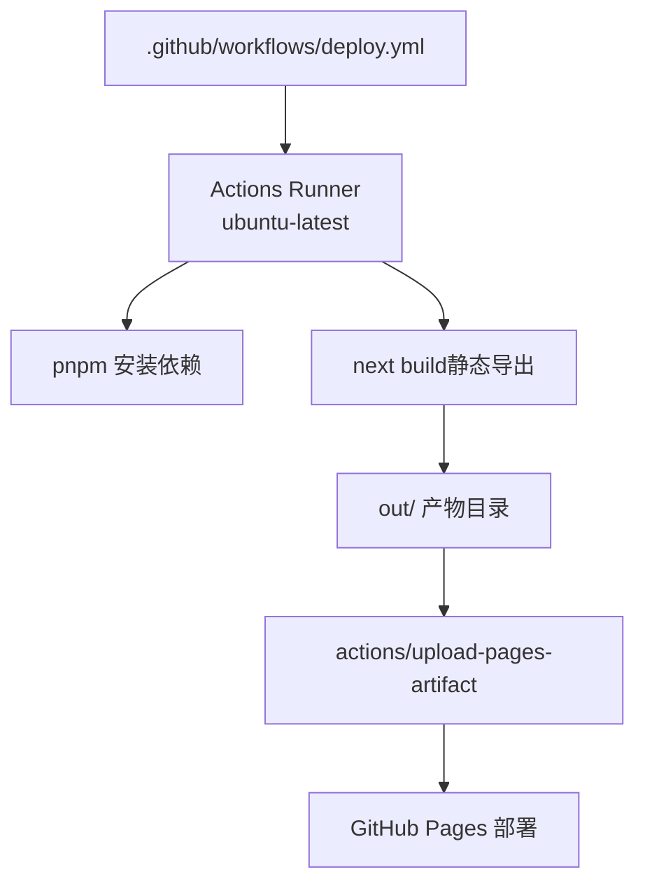
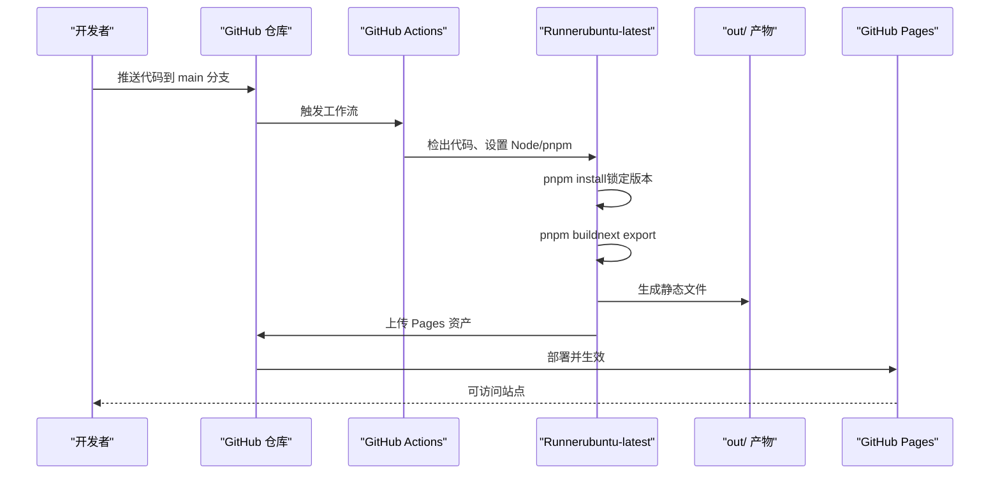
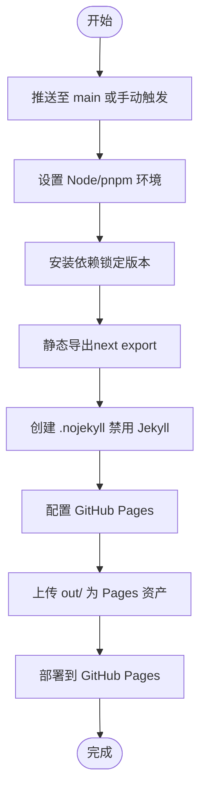
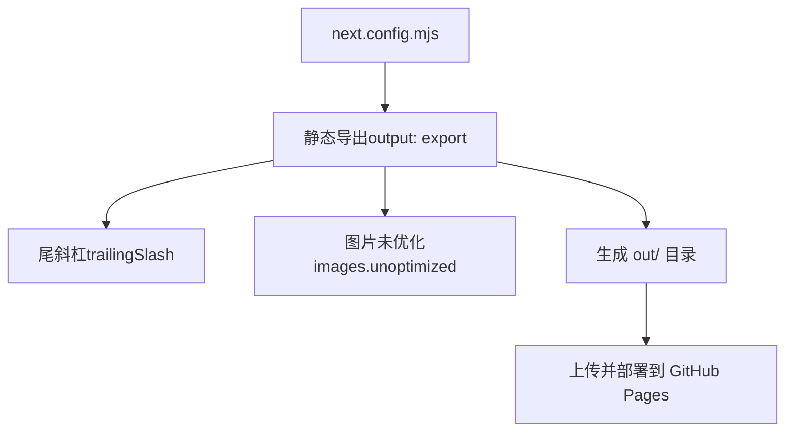
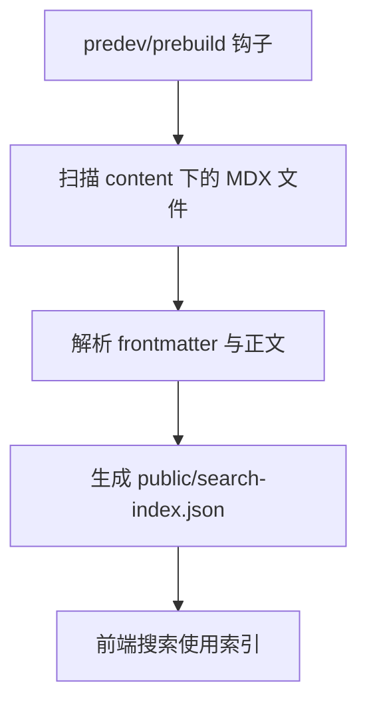
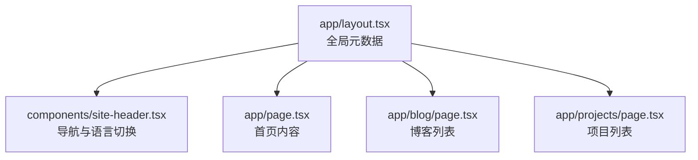
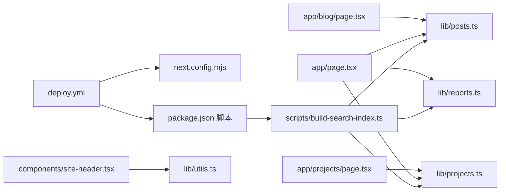

# 部署与 CI/CD

<cite>
**本文引用的文件**
- [.github/workflows/deploy.yml](file://.github/workflows/deploy.yml)
- [package.json](file://package.json)
- [next.config.mjs](file://next.config.mjs)
- [README.md](file://README.md)
- [scripts/build-search-index.ts](file://scripts/build-search-index.ts)
- [lib/utils.ts](file://lib/utils.ts)
- [lib/posts.ts](file://lib/posts.ts)
- [lib/projects.ts](file://lib/projects.ts)
- [lib/reports.ts](file://lib/reports.ts)
- [components/site-header.tsx](file://components/site-header.tsx)
- [components/site-footer.tsx](file://components/site-footer.tsx)
- [app/layout.tsx](file://app/layout.tsx)
- [app/page.tsx](file://app/page.tsx)
- [app/blog/page.tsx](file://app/blog/page.tsx)
- [app/projects/page.tsx](file://app/projects/page.tsx)
</cite>

## 目录
1. [简介](#简介)
2. [项目结构](#项目结构)
3. [核心组件](#核心组件)
4. [架构总览](#架构总览)
5. [详细组件分析](#详细组件分析)
6. [依赖关系分析](#依赖关系分析)
7. [性能考虑](#性能考虑)
8. [故障排除指南](#故障排除指南)
9. [结论](#结论)
10. [附录](#附录)

## 简介
本文件面向 myWebsite 的部署与 CI/CD 实践，聚焦以下目标：
- 基于 GitHub Pages 的静态导出部署流程，覆盖仓库命名、分支与 Pages 源设置、域名绑定建议。
- GitHub Actions 工作流的配置与执行过程解析，包括构建步骤、产物上传与部署环境。
- 静态导出的构建流程与优化策略，涵盖输出模式、图片处理、尾斜杠与 Jekyll 禁用。
- 不同部署场景的配置指南：用户主站与子路径部署（含 basePath 与 assetPrefix）。
- 部署监控与故障排除方法，结合工作流日志与构建产物定位问题。
- 部署安全性与性能优化最佳实践，覆盖缓存、资源压缩与 HTTPS 强制。

## 项目结构
该站点采用 Next.js 16 App Router + 静态导出（next export），通过 GitHub Actions 将 out/ 目录发布到 GitHub Pages。关键目录与文件如下：
- .github/workflows/deploy.yml：CI/CD 工作流定义，负责检出代码、安装依赖、构建静态产物、上传并部署。
- next.config.mjs：静态导出配置，启用 trailingSlash、禁用图片优化、限制 Turbopack 根目录。
- package.json：脚本与依赖，其中 predev/prebuild 钩子会运行构建期脚本以生成搜索索引。
- scripts/build-search-index.ts：构建期脚本，扫描 content/posts、content/projects、content/reports，生成 public/search-index.json。
- app/* 与 components/*：页面与组件，配合静态导出与路由生成。
- lib/*：内容读取与工具函数，支撑页面渲染与搜索索引生成。

**图表来源**
- [.github/workflows/deploy.yml:1-64](file://.github/workflows/deploy.yml#L1-L64)
- [next.config.mjs:1-19](file://next.config.mjs#L1-L19)
- [package.json:1-48](file://package.json#L1-L48)

**章节来源**
- [.github/workflows/deploy.yml:1-64](file://.github/workflows/deploy.yml#L1-L64)
- [next.config.mjs:1-19](file://next.config.mjs#L1-L19)
- [package.json:1-48](file://package.json#L1-L48)
- [README.md:88-101](file://README.md#L88-L101)

## 核心组件
- GitHub Actions 工作流
  - 触发条件：推送至 main 分支或手动触发。
  - 权限：读取内容、写入 Pages、颁发 ID Token。
  - 并发控制：同组并发仅保留一个进行中的作业。
  - 任务拆分：build 与 deploy 两个阶段，deploy 依赖 build 成功。
- 静态导出配置
  - 输出模式：export（静态导出）。
  - 图片处理：unoptimized（跳过自动优化，便于静态托管）。
  - 尾斜杠：trailingSlash=true（利于 GitHub Pages 路由）。
  - Turbopack 根目录：限制以避免误读父级锁文件。
- 构建期脚本
  - 在 predev/prebuild 钩子中运行，扫描 content 下的 MDX 文件，生成 public/search-index.json，供前端搜索使用。
- 页面与布局
  - app/layout.tsx 提供全局元数据与语言设置。
  - app/page.tsx、app/blog/page.tsx、app/projects/page.tsx 展示首页、博客与项目列表等静态内容。

**章节来源**
- [.github/workflows/deploy.yml:1-64](file://.github/workflows/deploy.yml#L1-L64)
- [next.config.mjs:1-19](file://next.config.mjs#L1-L19)
- [scripts/build-search-index.ts:1-95](file://scripts/build-search-index.ts#L1-L95)
- [app/layout.tsx:1-57](file://app/layout.tsx#L1-L57)
- [app/page.tsx:1-157](file://app/page.tsx#L1-L157)
- [app/blog/page.tsx:1-28](file://app/blog/page.tsx#L1-L28)
- [app/projects/page.tsx:1-96](file://app/projects/page.tsx#L1-L96)

## 架构总览
下图展示了从代码提交到 GitHub Pages 生效的端到端流程，包括构建、产物上传与部署。

**图表来源**
- [.github/workflows/deploy.yml:1-64](file://.github/workflows/deploy.yml#L1-L64)
- [next.config.mjs:1-19](file://next.config.mjs#L1-L19)
- [package.json:1-48](file://package.json#L1-L48)

## 详细组件分析

### GitHub Actions 工作流
- 触发与权限
  - on.push.branches 与 workflow_dispatch 控制触发方式。
  - permissions 指定对 contents/pages/id-token 的最小权限。
- 并发与稳定性
  - concurrency.group 使用 pages，避免并发冲突；cancel-in-progress=false 表示串行化部署。
- 构建阶段（build）
  - 使用 pnpm/action-setup 与 actions/setup-node，启用 pnpm 缓存。
  - 执行 pnpm install --frozen-lockfile 保证依赖一致性。
  - 执行 pnpm build，同时注入 Giscus 相关变量（可通过仓库 Secrets/Variables 注入）。
  - 创建 out/.nojekyll 以禁用 GitHub Pages 默认 Jekyll 渲染。
  - 调用 actions/configure-pages 启用 Pages。
  - 上传 out/ 作为 Pages 资产。
- 部署阶段（deploy）
  - 依赖 build 成功后执行。
  - 使用 actions/deploy-pages@v4 部署，environment.url 指向部署输出的页面地址。

**图表来源**
- [.github/workflows/deploy.yml:1-64](file://.github/workflows/deploy.yml#L1-L64)

**章节来源**
- [.github/workflows/deploy.yml:1-64](file://.github/workflows/deploy.yml#L1-L64)

### 静态导出配置与优化
- 输出模式
  - output: export，确保生成纯静态 HTML/CSS/JS，适合 GitHub Pages。
- 路由与链接
  - trailingSlash: true，利于 Pages 对应静态文件。
  - images.unoptimized: true，避免动态优化带来的复杂度，便于静态托管。
- 开发体验
  - turbopack.root 显式指向当前目录，避免误读父级 lockfile。
- 与工作流的关系
  - pnpm build 步骤由工作流执行，生成 out/ 目录供上传与部署。

**图表来源**
- [next.config.mjs:1-19](file://next.config.mjs#L1-L19)
- [.github/workflows/deploy.yml:35-53](file://.github/workflows/deploy.yml#L35-L53)

**章节来源**
- [next.config.mjs:1-19](file://next.config.mjs#L1-L19)
- [.github/workflows/deploy.yml:35-53](file://.github/workflows/deploy.yml#L35-L53)

### 构建期搜索索引生成
- 触发时机
  - package.json 中 predev 与 prebuild 钩子会先运行构建脚本。
- 数据来源
  - 扫描 content/posts、content/projects、content/reports 下的 MDX 文件，提取 frontmatter 与正文。
- 输出位置
  - 生成 public/search-index.json，供前端搜索使用。
- 业务影响
  - 保证首页、博客、项目等页面的搜索功能可用，且索引随内容变化自动更新。

**图表来源**
- [package.json:6-12](file://package.json#L6-L12)
- [scripts/build-search-index.ts:1-95](file://scripts/build-search-index.ts#L1-L95)

**章节来源**
- [package.json:6-12](file://package.json#L6-L12)
- [scripts/build-search-index.ts:1-95](file://scripts/build-search-index.ts#L1-L95)

### 页面与布局（元数据与导航）
- 元数据
  - app/layout.tsx 设置站点标题、描述、Open Graph、Twitter 等元数据，统一在静态导出中生效。
- 导航
  - components/site-header.tsx 提供导航项与语言切换逻辑，支持中英文镜像路径。
- 首页与列表页
  - app/page.tsx 展示精选内容与最近条目。
  - app/blog/page.tsx 与 app/projects/page.tsx 展示文章与项目列表。

**图表来源**
- [app/layout.tsx:1-57](file://app/layout.tsx#L1-L57)
- [components/site-header.tsx:1-103](file://components/site-header.tsx#L1-L103)
- [app/page.tsx:1-157](file://app/page.tsx#L1-L157)
- [app/blog/page.tsx:1-28](file://app/blog/page.tsx#L1-L28)
- [app/projects/page.tsx:1-96](file://app/projects/page.tsx#L1-L96)

**章节来源**
- [app/layout.tsx:1-57](file://app/layout.tsx#L1-L57)
- [components/site-header.tsx:1-103](file://components/site-header.tsx#L1-L103)
- [app/page.tsx:1-157](file://app/page.tsx#L1-L157)
- [app/blog/page.tsx:1-28](file://app/blog/page.tsx#L1-L28)
- [app/projects/page.tsx:1-96](file://app/projects/page.tsx#L1-L96)

## 依赖关系分析
- 工作流对构建配置的依赖
  - 工作流中的 pnpm build 依赖 next.config.mjs 的静态导出配置。
- 构建脚本对内容的依赖
  - scripts/build-search-index.ts 依赖 content/posts、content/projects、content/reports 的 MDX 文件。
- 页面对数据的依赖
  - app/* 页面依赖 lib/* 模块读取内容与生成索引。
- 组件对工具函数的依赖
  - components/* 使用 lib/utils.ts 的工具函数（如日期格式化、类名合并）。

**图表来源**
- [.github/workflows/deploy.yml:1-64](file://.github/workflows/deploy.yml#L1-L64)
- [next.config.mjs:1-19](file://next.config.mjs#L1-L19)
- [package.json:6-12](file://package.json#L6-L12)
- [scripts/build-search-index.ts:1-95](file://scripts/build-search-index.ts#L1-L95)
- [lib/posts.ts:1-98](file://lib/posts.ts#L1-L98)
- [lib/projects.ts:1-64](file://lib/projects.ts#L1-L64)
- [lib/reports.ts:1-60](file://lib/reports.ts#L1-L60)
- [app/page.tsx:1-157](file://app/page.tsx#L1-L157)
- [app/blog/page.tsx:1-28](file://app/blog/page.tsx#L1-L28)
- [app/projects/page.tsx:1-96](file://app/projects/page.tsx#L1-L96)
- [components/site-header.tsx:1-103](file://components/site-header.tsx#L1-L103)
- [lib/utils.ts:1-24](file://lib/utils.ts#L1-L24)

**章节来源**
- [.github/workflows/deploy.yml:1-64](file://.github/workflows/deploy.yml#L1-L64)
- [next.config.mjs:1-19](file://next.config.mjs#L1-L19)
- [package.json:6-12](file://package.json#L6-L12)
- [scripts/build-search-index.ts:1-95](file://scripts/build-search-index.ts#L1-L95)
- [lib/posts.ts:1-98](file://lib/posts.ts#L1-L98)
- [lib/projects.ts:1-64](file://lib/projects.ts#L1-L64)
- [lib/reports.ts:1-60](file://lib/reports.ts#L1-L60)
- [app/page.tsx:1-157](file://app/page.tsx#L1-L157)
- [app/blog/page.tsx:1-28](file://app/blog/page.tsx#L1-L28)
- [app/projects/page.tsx:1-96](file://app/projects/page.tsx#L1-L96)
- [components/site-header.tsx:1-103](file://components/site-header.tsx#L1-L103)
- [lib/utils.ts:1-24](file://lib/utils.ts#L1-L24)

## 性能考虑
- 构建与缓存
  - 使用 pnpm 并启用缓存，减少重复安装时间。
  - 使用 --frozen-lockfile 确保依赖版本一致，避免构建差异。
- 输出与传输
  - 静态导出产物直接上传，避免服务端渲染开销。
  - trailingSlash=true 有助于 Pages 的静态路由匹配。
- 资源优化
  - images.unoptimized=true 简化图片处理，便于静态托管；如需优化可在本地生成或使用 CDN。
- 前端性能
  - 搜索索引在构建期生成，减少运行时计算成本。
  - Tailwind 类名合并与日期格式化等工具函数保持轻量。

**章节来源**
- [.github/workflows/deploy.yml:23-33](file://.github/workflows/deploy.yml#L23-L33)
- [next.config.mjs:8-10](file://next.config.mjs#L8-L10)
- [scripts/build-search-index.ts:90-95](file://scripts/build-search-index.ts#L90-L95)
- [lib/utils.ts:1-24](file://lib/utils.ts#L1-L24)

## 故障排除指南
- 工作流失败
  - 检查 Actions 日志中的依赖安装与构建步骤，确认 pnpm 版本与 Node 版本是否符合工作流配置。
  - 若出现“找不到 out/”或 Pages 未更新，确认已执行创建 .nojekyll 的步骤并成功上传资产。
- 404 或路由异常
  - 确认 trailingSlash=true 与 Pages 的静态文件映射一致。
  - 若使用子路径部署，检查是否正确添加 basePath 与 assetPrefix。
- Giscus 评论未显示
  - 确认已在仓库 Secrets/Variables 中配置 GISCUS_* 变量，并在工作流中注入到构建环境。
- 本地与线上差异
  - 本地开发使用 Next.js 开发服务器，静态导出产物可能因环境变量或内容差异导致不同。
- 搜索索引为空
  - 确认 predev/prebuild 钩子已运行，且 content 下存在有效 MDX 文件。

**章节来源**
- [.github/workflows/deploy.yml:35-53](file://.github/workflows/deploy.yml#L35-L53)
- [README.md:103-120](file://README.md#L103-L120)
- [scripts/build-search-index.ts:17-27](file://scripts/build-search-index.ts#L17-L27)

## 结论
本项目通过“静态导出 + GitHub Actions + GitHub Pages”的组合，实现了稳定、可重复的部署流水线。工作流明确、配置简洁，配合构建期搜索索引与 tailwind 工具函数，兼顾了开发效率与运行性能。遵循本文的部署与优化建议，可进一步提升安全性与可靠性。

## 附录

### GitHub Pages 部署流程与配置
- 仓库命名与 Pages 源
  - 用户主站：仓库名为 <your-username>.github.io，无需 basePath。
  - 项目仓库：使用子路径部署时，在 next.config.mjs 中添加 basePath 与 assetPrefix。
- 触发方式
  - 推送至 main 分支或手动触发工作流。
- 验证
  - 部署完成后，通过 Pages 环境 URL 或自定义域名访问站点。

**章节来源**
- [README.md:88-101](file://README.md#L88-L101)
- [.github/workflows/deploy.yml:3-6](file://.github/workflows/deploy.yml#L3-L6)

### 子路径部署配置指南
- 在 next.config.mjs 中添加 basePath 与 assetPrefix，以适配项目仓库的子路径。
- 确保静态资源与链接使用相对路径，避免硬编码绝对路径。

**章节来源**
- [README.md:96-101](file://README.md#L96-L101)
- [next.config.mjs:8-10](file://next.config.mjs#L8-L10)

### 安全性与合规建议
- 最小权限原则：工作流仅授予必要的 contents/pages/id-token 权限。
- 秘密管理：将 Giscus 等敏感配置放入仓库 Secrets/Variables，并在工作流中显式注入。
- 依赖锁定：使用 --frozen-lockfile 与 pnpm 锁文件，防止依赖漂移。

**章节来源**
- [.github/workflows/deploy.yml:8-11](file://.github/workflows/deploy.yml#L8-L11)
- [README.md:103-120](file://README.md#L103-L120)
- [.github/workflows/deploy.yml:32-33](file://.github/workflows/deploy.yml#L32-L33)