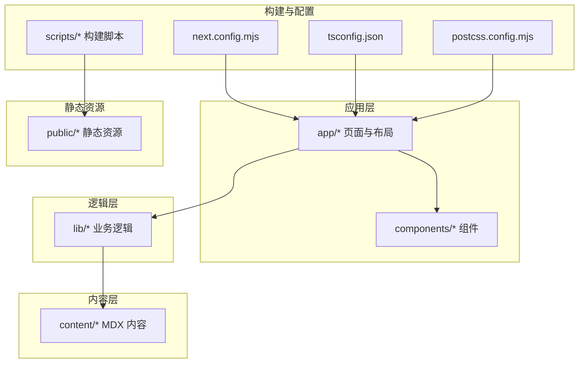
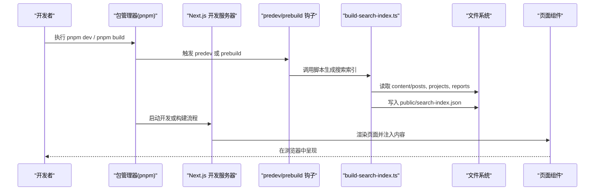
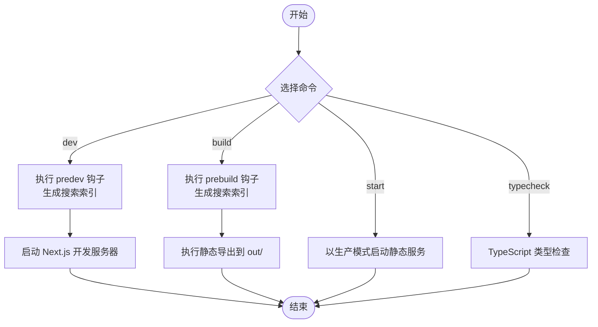
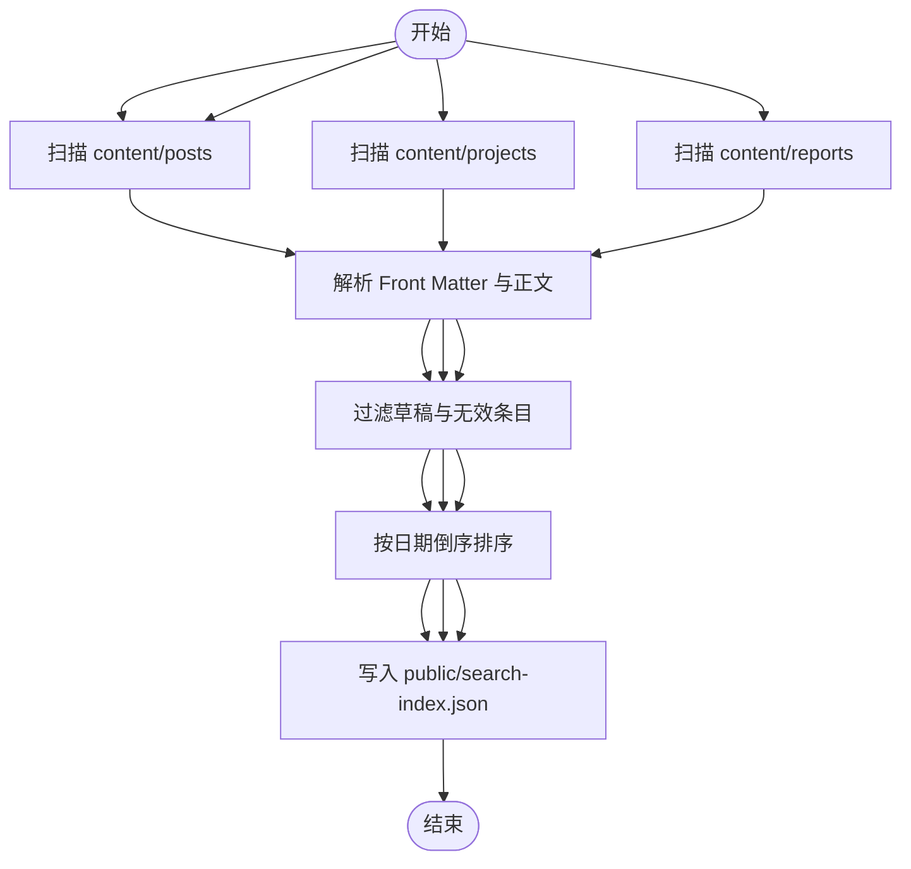
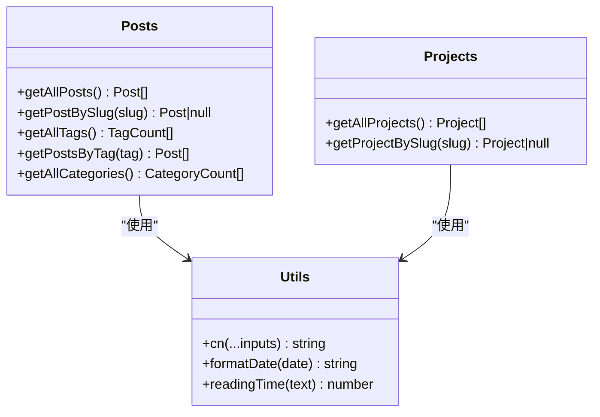
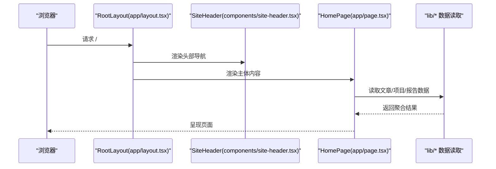
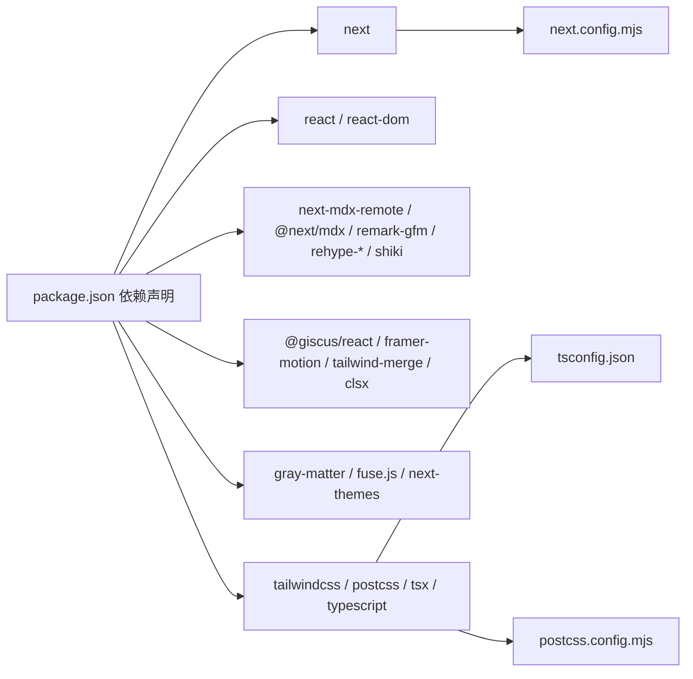

# 快速开始

<cite>
**本文引用的文件**
- [package.json](file://package.json)
- [README.md](file://README.md)
- [next.config.mjs](file://next.config.mjs)
- [tsconfig.json](file://tsconfig.json)
- [postcss.config.mjs](file://postcss.config.mjs)
- [scripts/build-search-index.ts](file://scripts/build-search-index.ts)
- [lib/posts.ts](file://lib/posts.ts)
- [lib/projects.ts](file://lib/projects.ts)
- [lib/utils.ts](file://lib/utils.ts)
- [components/site-header.tsx](file://components/site-header.tsx)
- [app/layout.tsx](file://app/layout.tsx)
- [app/page.tsx](file://app/page.tsx)
- [.github/workflows/deploy.yml](file://.github/workflows/deploy.yml)
</cite>

## 目录
1. [简介](#简介)
2. [项目结构](#项目结构)
3. [核心组件](#核心组件)
4. [架构总览](#架构总览)
5. [详细组件分析](#详细组件分析)
6. [依赖分析](#依赖分析)
7. [性能考虑](#性能考虑)
8. [故障排查指南](#故障排查指南)
9. [结论](#结论)
10. [附录](#附录)

## 简介
本指南面向首次接触 myWebsite 项目的开发者，目标是在最短时间内完成环境准备、项目克隆、依赖安装与本地开发服务器启动，并掌握常用开发命令与验证方法。项目基于 Next.js 16 App Router、TypeScript、Tailwind CSS v4、MDX 与静态导出，适合在本地开发并在 GitHub Pages 上部署。

## 项目结构
- 应用路由位于 app/，采用 Next.js App Router 结构，页面组件通过约定式路由组织。
- 内容采用 MDX 写作，放置于 content/ 下，支持 posts、projects、reports 三类内容。
- 业务逻辑集中在 lib/，负责内容读取、解析与聚合。
- UI 组件位于 components/，如导航、页脚、搜索对话框等。
- 构建期脚本位于 scripts/，例如搜索索引生成。
- 样式通过 Tailwind v4 与 PostCSS 配置启用，全局样式在 app/globals.css 中引入。
- 配置文件包括 next.config.mjs、tsconfig.json、postcss.config.mjs 等。

**图表来源**
- [next.config.mjs:1-19](file://next.config.mjs#L1-L19)
- [tsconfig.json:1-45](file://tsconfig.json#L1-L45)
- [postcss.config.mjs:1-6](file://postcss.config.mjs#L1-L6)
- [lib/posts.ts:1-98](file://lib/posts.ts#L1-L98)
- [lib/projects.ts:1-64](file://lib/projects.ts#L1-L64)
- [scripts/build-search-index.ts:1-95](file://scripts/build-search-index.ts#L1-L95)

**章节来源**
- [README.md:122-135](file://README.md#L122-L135)
- [next.config.mjs:1-19](file://next.config.mjs#L1-L19)
- [tsconfig.json:1-45](file://tsconfig.json#L1-L45)
- [postcss.config.mjs:1-6](file://postcss.config.mjs#L1-L6)

## 核心组件
- 开发命令与脚本
  - pnpm dev：启动开发服务器，默认监听端口为 3000，自动执行 predev 钩子生成搜索索引。
  - pnpm build：执行静态导出，产物输出至 out/，同时执行 prebuild 钩子生成搜索索引。
  - pnpm start：以生产模式启动静态导出后的服务（需先执行 pnpm build）。
  - pnpm typecheck：对 TypeScript 进行类型检查。
- 构建钩子
  - predev 与 prebuild 均调用 scripts/build-search-index.ts，自动生成 public/search-index.json，便于客户端搜索功能。
- 静态导出配置
  - next.config.mjs 设置 output 为 export，启用 trailingSlash，关闭图片优化，开启严格模式与 Turbopack 根目录约束。
- TypeScript 配置
  - 严格模式、禁用 emit、模块解析为 bundler、路径别名 @/* 指向项目根，包含 MDX 组件与 Next 类型。
- PostCSS 与 Tailwind
  - 使用 @tailwindcss/postcss 插件，配合 Tailwind v4 配置实现 CSS-first 样式体系。

**章节来源**
- [package.json:6-12](file://package.json#L6-L12)
- [scripts/build-search-index.ts:1-95](file://scripts/build-search-index.ts#L1-L95)
- [next.config.mjs:7-16](file://next.config.mjs#L7-L16)
- [tsconfig.json:2-29](file://tsconfig.json#L2-L29)
- [postcss.config.mjs:1-6](file://postcss.config.mjs#L1-L6)

## 架构总览
下图展示了从开发命令到页面渲染与内容加载的整体流程，以及构建期搜索索引生成的关键节点。

**图表来源**
- [package.json:6-12](file://package.json#L6-L12)
- [scripts/build-search-index.ts:1-95](file://scripts/build-search-index.ts#L1-L95)
- [app/page.tsx:1-157](file://app/page.tsx#L1-L157)
- [lib/posts.ts:60-66](file://lib/posts.ts#L60-L66)
- [lib/projects.ts:28-63](file://lib/projects.ts#L28-L63)

## 详细组件分析

### 开发命令与工作流
- pnpm dev
  - 启动 Next.js 开发服务器，自动在启动前执行 predev 钩子，确保搜索索引已生成。
  - 适合本地调试与实时预览。
- pnpm build
  - 执行静态导出，产物输出至 out/，同时执行 prebuild 钩子生成搜索索引。
  - 适合在本地预览静态产物或进行部署前检查。
- pnpm start
  - 以生产模式启动静态导出后的服务，需先执行 pnpm build。
- pnpm typecheck
  - 对 TypeScript 进行类型检查，确保代码质量与类型安全。

**图表来源**
- [package.json:6-12](file://package.json#L6-L12)
- [scripts/build-search-index.ts:1-95](file://scripts/build-search-index.ts#L1-L95)
- [next.config.mjs:8-10](file://next.config.mjs#L8-L10)

**章节来源**
- [README.md:31-42](file://README.md#L31-L42)
- [package.json:6-12](file://package.json#L6-L12)

### 搜索索引生成流程
- 脚本扫描 content/posts、content/projects、content/reports 目录下的 MDX 文件。
- 读取 YAML Front Matter，过滤草稿与缺失必要字段的内容。
- 将条目按日期倒序排列，写入 public/search-index.json，供客户端搜索使用。

**图表来源**
- [scripts/build-search-index.ts:17-88](file://scripts/build-search-index.ts#L17-L88)
- [lib/posts.ts:33-58](file://lib/posts.ts#L33-L58)
- [lib/projects.ts:34-54](file://lib/projects.ts#L34-L54)

**章节来源**
- [scripts/build-search-index.ts:1-95](file://scripts/build-search-index.ts#L1-L95)
- [lib/posts.ts:1-98](file://lib/posts.ts#L1-L98)
- [lib/projects.ts:1-64](file://lib/projects.ts#L1-L64)

### 内容读取与聚合
- 文章（posts）
  - 读取 content/posts 下的 MDX 文件，解析 Front Matter，过滤草稿，按日期倒序返回。
  - 提供按标签与分类的聚合查询能力。
- 项目（projects）
  - 读取 content/projects 下的 MDX 文件，解析 Front Matter，按 featured 优先、order 较大优先、日期倒序排序。
- 报告（reports）
  - 读取 content/reports 下的 MDX 文件，解析 Front Matter，过滤草稿，按日期倒序返回。

**图表来源**
- [lib/posts.ts:60-98](file://lib/posts.ts#L60-L98)
- [lib/projects.ts:24-63](file://lib/projects.ts#L24-L63)
- [lib/utils.ts:1-24](file://lib/utils.ts#L1-L24)

**章节来源**
- [lib/posts.ts:1-98](file://lib/posts.ts#L1-L98)
- [lib/projects.ts:1-64](file://lib/projects.ts#L1-L64)
- [lib/utils.ts:1-24](file://lib/utils.ts#L1-L24)

### 页面与布局
- 根布局（app/layout.tsx）
  - 定义站点元数据（标题、描述、Open Graph、Twitter）、语言与深色主题默认开启。
  - 包裹 SiteHeader 与 SiteFooter，形成统一的页面骨架。
- 首页（app/page.tsx）
  - 展示 Hero、Now 条、精选项目、最新文章、最新报告等区块。
  - 通过 lib/posts.ts、lib/projects.ts、lib/reports.ts 获取数据并渲染。

**图表来源**
- [app/layout.tsx:1-57](file://app/layout.tsx#L1-L57)
- [components/site-header.tsx:1-103](file://components/site-header.tsx#L1-L103)
- [app/page.tsx:1-157](file://app/page.tsx#L1-L157)
- [lib/posts.ts:60-66](file://lib/posts.ts#L60-L66)
- [lib/projects.ts:28-63](file://lib/projects.ts#L28-L63)

**章节来源**
- [app/layout.tsx:1-57](file://app/layout.tsx#L1-L57)
- [app/page.tsx:1-157](file://app/page.tsx#L1-L157)
- [components/site-header.tsx:1-103](file://components/site-header.tsx#L1-L103)

## 依赖分析
- 运行时依赖
  - Next.js 16、React 19、TypeScript、MDX 生态（next-mdx-remote、@next/mdx、remark-gfm、rehype-*、shiki）、Tailwind v4、Framer Motion、Fuse.js、@giscus/react 等。
- 开发依赖
  - Tailwind 相关插件、PostCSS、Tailwind CSS v4、tsx、TypeScript。
- 依赖关系特征
  - 项目采用严格类型与模块解析策略，TS 配置启用 bundler 解析与路径别名，提升开发体验与类型安全。
  - Tailwind v4 通过 PostCSS 插件启用，确保样式按需生成。

**图表来源**
- [package.json:14-46](file://package.json#L14-L46)
- [next.config.mjs:1-19](file://next.config.mjs#L1-L19)
- [tsconfig.json:1-45](file://tsconfig.json#L1-L45)
- [postcss.config.mjs:1-6](file://postcss.config.mjs#L1-L6)

**章节来源**
- [package.json:14-46](file://package.json#L14-L46)
- [tsconfig.json:1-45](file://tsconfig.json#L1-L45)
- [postcss.config.mjs:1-6](file://postcss.config.mjs#L1-L6)

## 性能考虑
- 静态导出与尾随斜杠
  - 配置 output 为 export、trailingSlash 为 true，有助于在 GitHub Pages 等静态托管环境中避免路由问题。
- 图片优化关闭
  - images.unoptimized 为 true，减少构建与运行时开销，适合静态站点。
- 严格模式与 Turbopack 根目录
  - reactStrictMode 与 turbopack.root 约束可提升开发稳定性与一致性。
- 构建期生成搜索索引
  - 将搜索计算前置到构建阶段，降低运行时负担，提升客户端交互性能。

**章节来源**
- [next.config.mjs:7-16](file://next.config.mjs#L7-L16)
- [scripts/build-search-index.ts:1-95](file://scripts/build-search-index.ts#L1-L95)

## 故障排查指南
- 无法启动开发服务器
  - 确认 Node.js 版本满足项目需求（建议使用 LTS 版本）。
  - 确认 pnpm 已安装且版本较新，避免锁文件冲突。
  - 清理 node_modules 与 pnpm-lock.yaml 后重新安装依赖。
- 本地无法访问 http://localhost:3000
  - 检查端口是否被占用，或修改 Next.js 端口配置。
  - 确认 predev 钩子执行成功，public/search-index.json 是否生成。
- 构建失败或产物为空
  - 执行 pnpm build 后检查 out/ 是否存在，确认 prebuild 钩子执行。
  - 检查 content/posts、content/projects、content/reports 目录是否存在且命名规范。
- TypeScript 类型错误
  - 执行 pnpm typecheck 排查类型问题，关注路径别名与模块解析配置。
- 部署相关问题
  - 仓库名称需符合 <your-username>.github.io 规范，或在 next.config.mjs 中配置 basePath 与 assetPrefix。
  - 确保 GitHub Actions 已启用，推送 main 分支触发部署流程。

**章节来源**
- [README.md:88-101](file://README.md#L88-L101)
- [package.json:6-12](file://package.json#L6-L12)
- [scripts/build-search-index.ts:90-95](file://scripts/build-search-index.ts#L90-L95)
- [next.config.mjs:8-10](file://next.config.mjs#L8-L10)

## 结论
通过本快速开始指南，您已经完成了环境准备、项目克隆、依赖安装与本地开发服务器启动，并掌握了常用开发命令与验证方法。建议在本地先运行 pnpm dev 预览效果，再执行 pnpm build 验证静态导出产物，最后结合 README 的部署说明完成上线。遇到问题时，可参考“故障排查指南”逐项定位。

## 附录
- 常用命令清单
  - pnpm install：安装依赖
  - pnpm dev：启动开发服务器（自动执行 predev）
  - pnpm build：静态导出（自动执行 prebuild）
  - pnpm start：以生产模式启动静态服务
  - pnpm typecheck：TypeScript 类型检查
- 内容创作指引
  - 在 content/posts、content/projects、content/reports 下新增 .mdx 文件，遵循 Front Matter 字段规范。
- 部署说明
  - 仓库命名为 <your-username>.github.io，启用 GitHub Pages 并使用 GitHub Actions 自动部署。
  - 若使用子路径仓库，需在 next.config.mjs 中配置 basePath 与 assetPrefix。

**章节来源**
- [README.md:31-42](file://README.md#L31-L42)
- [README.md:88-101](file://README.md#L88-L101)
- [README.md:103-121](file://README.md#L103-L121)