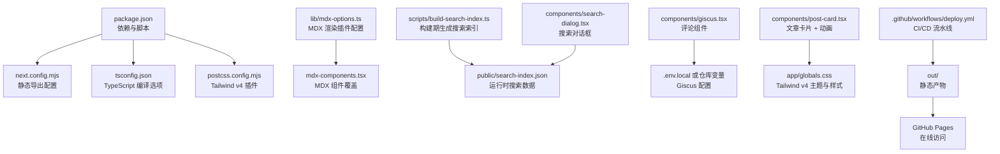
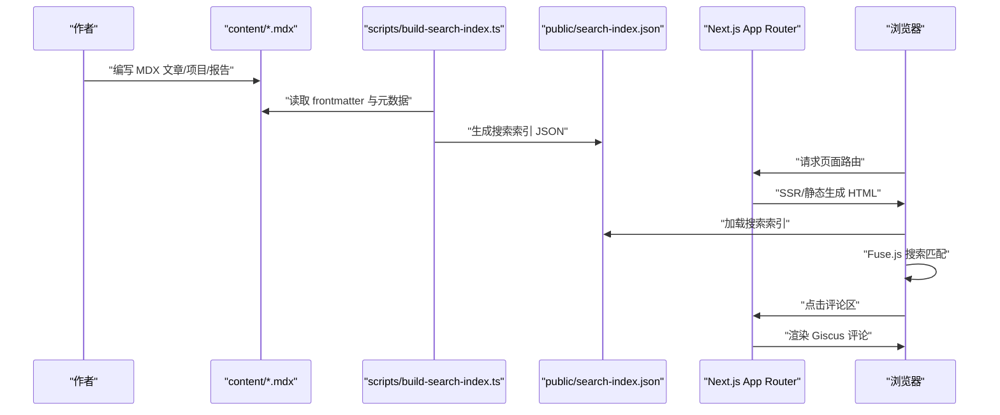
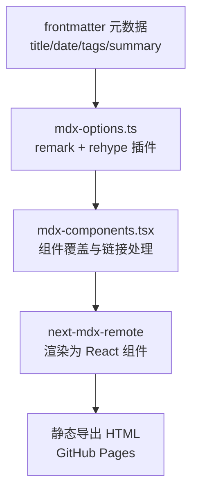
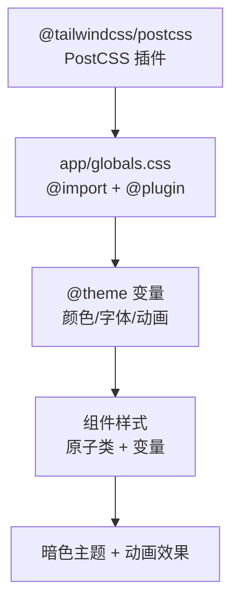
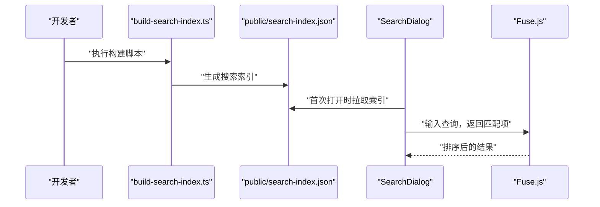
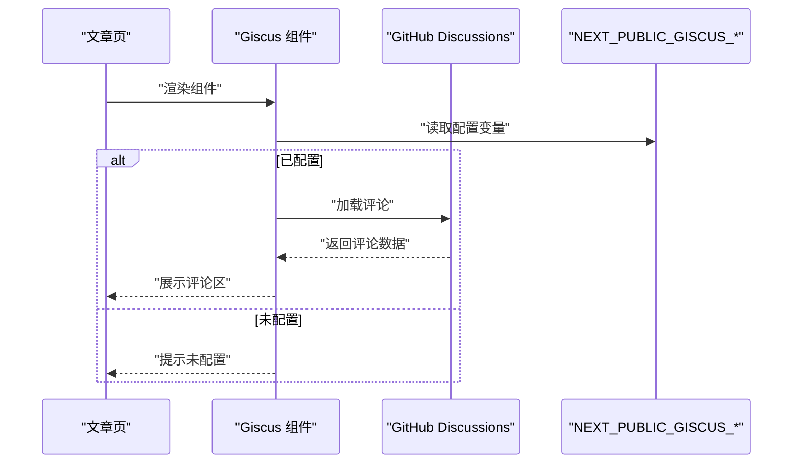
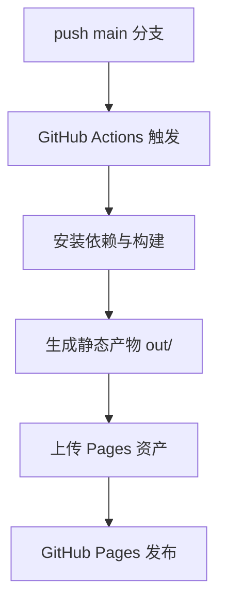
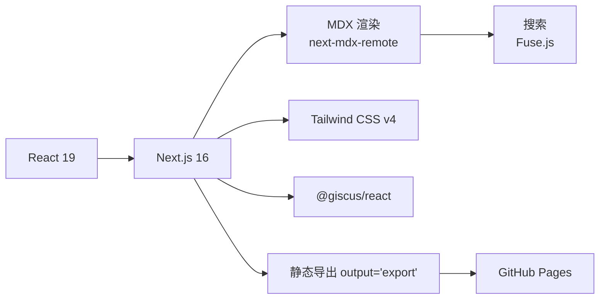

# 技术栈

<cite>
**本文引用的文件**
- [package.json](file://package.json)
- [next.config.mjs](file://next.config.mjs)
- [tsconfig.json](file://tsconfig.json)
- [postcss.config.mjs](file://postcss.config.mjs)
- [README.md](file://README.md)
- [lib/mdx-options.ts](file://lib/mdx-options.ts)
- [mdx-components.tsx](file://mdx-components.tsx)
- [components/giscus.tsx](file://components/giscus.tsx)
- [scripts/build-search-index.ts](file://scripts/build-search-index.ts)
- [app/layout.tsx](file://app/layout.tsx)
- [components/site-header.tsx](file://components/site-header.tsx)
- [components/search-dialog.tsx](file://components/search-dialog.tsx)
- [components/post-card.tsx](file://components/post-card.tsx)
- [app/globals.css](file://app/globals.css)
- [.github/workflows/deploy.yml](file://.github/workflows/deploy.yml)
</cite>

## 目录
1. [简介](#简介)
2. [项目结构](#项目结构)
3. [核心组件](#核心组件)
4. [架构总览](#架构总览)
5. [详细组件分析](#详细组件分析)
6. [依赖关系分析](#依赖关系分析)
7. [性能考虑](#性能考虑)
8. [故障排除指南](#故障排除指南)
9. [结论](#结论)
10. [附录](#附录)

## 简介
本技术栈文档面向 myWebsite 项目，系统性阐述其前端技术选型与实现方式，包括：
- 前端框架与语言：Next.js 16（App Router）、React 19、TypeScript
- 内容创作与渲染：MDX（next-mdx-remote + remark-gfm + rehype-slug + rehype-pretty-code）
- 样式与主题：Tailwind CSS v4（CSS-first 配置，暗色主题）
- 搜索系统：Fuse.js + 构建期生成 JSON 索引
- 评论系统：Giscus（基于 GitHub Discussions）
- 动画与交互：Framer Motion
- 部署方案：GitHub Actions + GitHub Pages（静态导出）

这些技术组合旨在提供高性能、可维护、可扩展且易于协作的个人站点。

## 项目结构
项目采用 Next.js App Router 的目录组织方式，内容以 MDX 形式存放在 content 目录，构建期通过脚本生成搜索索引，最终静态导出至 out/ 并部署到 GitHub Pages。

图表来源
- [package.json:1-48](file://package.json#L1-L48)
- [next.config.mjs:1-19](file://next.config.mjs#L1-L19)
- [tsconfig.json:1-45](file://tsconfig.json#L1-L45)
- [postcss.config.mjs:1-6](file://postcss.config.mjs#L1-L6)
- [lib/mdx-options.ts:1-20](file://lib/mdx-options.ts#L1-L20)
- [mdx-components.tsx:1-31](file://mdx-components.tsx#L1-L31)
- [scripts/build-search-index.ts:1-95](file://scripts/build-search-index.ts#L1-L95)
- [components/giscus.tsx:1-37](file://components/giscus.tsx#L1-L37)
- [components/search-dialog.tsx:1-156](file://components/search-dialog.tsx#L1-L156)
- [components/post-card.tsx:1-81](file://components/post-card.tsx#L1-L81)
- [app/globals.css:1-278](file://app/globals.css#L1-L278)
- [.github/workflows/deploy.yml:1-64](file://.github/workflows/deploy.yml#L1-L64)

章节来源
- [README.md:122-135](file://README.md#L122-L135)
- [package.json:1-48](file://package.json#L1-L48)

## 核心组件
- 框架与语言：Next.js 16（App Router）、React 19、TypeScript（严格模式、ESNext 模块解析）
- 内容系统：MDX（next-mdx-remote + remark-gfm + rehype-slug + rehype-pretty-code）
- 样式系统：Tailwind CSS v4（CSS-first，自定义变量主题）
- 搜索系统：Fuse.js + 构建期生成 JSON 索引
- 评论系统：@giscus/react（基于 GitHub Discussions）
- 动画与交互：Framer Motion（卡片悬停光斑效果）
- 部署：GitHub Actions 静态导出 + GitHub Pages

章节来源
- [README.md:137-145](file://README.md#L137-L145)
- [package.json:14-33](file://package.json#L14-L33)
- [tsconfig.json:2-29](file://tsconfig.json#L2-L29)
- [next.config.mjs:7-16](file://next.config.mjs#L7-L16)
- [postcss.config.mjs:1-6](file://postcss.config.mjs#L1-L6)

## 架构总览
下图展示了从内容创作到页面渲染、搜索与评论的端到端流程，以及构建与部署链路。

图表来源
- [scripts/build-search-index.ts:17-88](file://scripts/build-search-index.ts#L17-L88)
- [components/search-dialog.tsx:33-82](file://components/search-dialog.tsx#L33-L82)
- [components/giscus.tsx:10-36](file://components/giscus.tsx#L10-L36)
- [next.config.mjs:8](file://next.config.mjs#L8)

## 详细组件分析

### MDX 技术栈与应用
- 选择原因
  - 内容与组件混合：MDX 允许在 Markdown 中直接使用 React 组件，便于在文章中内联交互元素或可视化组件。
  - 生态完善：next-mdx-remote 提供 RSC 友好的 SSR/SSG 支持；remark-gfm、rehype-slug、rehype-pretty-code 提供语法高亮、标题锚点等能力。
- 实现要点
  - 渲染配置：通过 mdx-options.ts 注入 remark 与 rehype 插件，并指定暗/亮主题与默认语言。
  - 组件覆盖：mdx-components.tsx 将外部链接替换为内部 Link，保持 SPA 导航体验。
  - 内容来源：content/posts、content/projects、content/reports 下的 .mdx/.md 文件作为数据源。
- 优势
  - 开发体验佳：Markdown 写作 + React 组件复用，适合技术博客与案例展示。
  - SEO 友好：静态导出 + 结构化 frontmatter，利于搜索引擎抓取。

图表来源
- [lib/mdx-options.ts:12-19](file://lib/mdx-options.ts#L12-L19)
- [mdx-components.tsx:5-30](file://mdx-components.tsx#L5-L30)
- [README.md:43-86](file://README.md#L43-L86)

章节来源
- [lib/mdx-options.ts:1-20](file://lib/mdx-options.ts#L1-L20)
- [mdx-components.tsx:1-31](file://mdx-components.tsx#L1-L31)
- [README.md:43-86](file://README.md#L43-L86)

### Tailwind CSS v4 样式解决方案
- 选择原因
  - CSS-first：更贴近传统样式工作流，与现有 CSS 基础兼容。
  - 自定义变量主题：通过 app/globals.css 定义颜色、字体与动画变量，统一暗色风格。
  - 原子类与定制：结合 glass、glow-border 等自定义类，快速实现现代视觉效果。
- 实现要点
  - 主题变量：在 :root 与 @theme 中集中管理颜色与字体族。
  - 组件样式：PostCard、SearchDialog 等组件使用变量与原子类组合。
  - 打印样式：针对 CV 页面提供打印优化，确保可打印性。
- 优势
  - 快速迭代：原子类提升开发效率；变量主题便于全局一致性。
  - 易于维护：样式集中在单一文件，减少重复与冲突。

图表来源
- [postcss.config.mjs:1-6](file://postcss.config.mjs#L1-L6)
- [app/globals.css:1-278](file://app/globals.css#L1-L278)

章节来源
- [postcss.config.mjs:1-6](file://postcss.config.mjs#L1-L6)
- [app/globals.css:1-278](file://app/globals.css#L1-L278)

### 搜索系统：Fuse.js 与构建期索引
- 选择原因
  - 轻量高效：客户端轻量搜索库，支持模糊匹配与权重排序。
  - 构建期生成：避免运行时解析大量内容，提升首屏性能。
- 实现要点
  - 构建脚本：遍历 content/posts、content/projects、content/reports，提取 frontmatter 字段，生成 JSON 并输出到 public/search-index.json。
  - 运行时：SearchDialog 在首次打开时懒加载索引，使用 Fuse.js 进行搜索，支持键盘快捷键（Cmd/Ctrl+K）。
  - 排序与权重：对 title、summary、tags 设置不同权重，保证相关性。
- 优势
  - 体验流畅：无需网络请求即可搜索；支持 ESC 关闭与快捷键。
  - 可扩展：新增字段或内容类型只需修改构建脚本。

图表来源
- [scripts/build-search-index.ts:17-88](file://scripts/build-search-index.ts#L17-L88)
- [components/search-dialog.tsx:33-82](file://components/search-dialog.tsx#L33-L82)

章节来源
- [scripts/build-search-index.ts:1-95](file://scripts/build-search-index.ts#L1-L95)
- [components/search-dialog.tsx:1-156](file://components/search-dialog.tsx#L1-L156)

### 评论系统：Giscus 集成
- 选择原因
  - 基于 Discussions：与 GitHub Issues/Discussions 对接，无需额外数据库。
  - 低耦合：通过 @giscus/react 组件化集成，支持环境变量配置。
- 实现要点
  - 配置：在仓库 Settings → Secrets and variables → Actions → Variables 中设置 NEXT_PUBLIC_GISCUS_* 变量；本地可在 .env.local 中配置。
  - 组件：Giscus.tsx 根据是否配置决定渲染评论区或提示信息。
- 优势
  - 易部署：无需服务端，直接通过 GitHub 数据源。
  - 体验一致：与 GitHub 生态无缝衔接。

图表来源
- [components/giscus.tsx:5-36](file://components/giscus.tsx#L5-L36)
- [README.md:103-121](file://README.md#L103-L121)

章节来源
- [components/giscus.tsx:1-37](file://components/giscus.tsx#L1-L37)
- [README.md:103-121](file://README.md#L103-L121)

### 动画与交互：Framer Motion
- 选择原因
  - 专业动画：提供高性能、易用的动画与手势能力。
- 实现要点
  - PostCard 使用 useMotionValue 与 useMotionTemplate 实现鼠标跟踪的径向光斑效果，增强交互体验。
- 优势
  - 视觉反馈：微交互提升用户感知与可用性。
  - 与 Tailwind 结合：通过原子类与变量主题统一视觉风格。

章节来源
- [components/post-card.tsx:20-79](file://components/post-card.tsx#L20-L79)

### 部署方案：GitHub Actions + GitHub Pages
- 选择原因
  - 静态导出：配合 next.config.mjs 的 output: 'export'，可直接部署到静态托管平台。
  - CI/CD：自动化构建、上传与部署，降低运维成本。
- 实现要点
  - 工作流：安装 pnpm、Node.js，执行 pnpm build，上传 out/ 目录为 Pages 资产。
  - 环境变量：通过仓库变量注入 Giscus 配置，确保评论功能在生产可用。
- 优势
  - 成本低：免费额度满足个人站点需求。
  - 速度快：静态分发，访问稳定。

图表来源
- [.github/workflows/deploy.yml:17-64](file://.github/workflows/deploy.yml#L17-L64)
- [next.config.mjs:8](file://next.config.mjs#L8)

章节来源
- [.github/workflows/deploy.yml:1-64](file://.github/workflows/deploy.yml#L1-L64)
- [README.md:88-101](file://README.md#L88-L101)

## 依赖关系分析
- 框架与语言
  - Next.js 16（App Router）负责路由与静态导出；React 19 提供组件模型；TypeScript 提供类型安全。
- 内容与渲染
  - @next/mdx 与 next-mdx-remote 提供 MDX 渲染；remark-gfm、rehype-slug、rehype-pretty-code 提供 Markdown 增强与代码高亮。
- 样式与主题
  - Tailwind CSS v4 与 PostCSS 插件；app/globals.css 定义主题变量与自定义样式。
- 搜索与评论
  - Fuse.js 用于客户端搜索；@giscus/react 用于评论区。
- 构建与部署
  - scripts/build-search-index.ts 生成搜索索引；GitHub Actions 静态导出并部署。

图表来源
- [package.json:14-33](file://package.json#L14-L33)
- [next.config.mjs:8](file://next.config.mjs#L8)
- [scripts/build-search-index.ts:90-94](file://scripts/build-search-index.ts#L90-L94)
- [.github/workflows/deploy.yml:35-54](file://.github/workflows/deploy.yml#L35-L54)

章节来源
- [package.json:1-48](file://package.json#L1-L48)
- [next.config.mjs:1-19](file://next.config.mjs#L1-L19)

## 性能考虑
- 静态导出：通过 output: 'export' 与 trailingSlash: true，减少运行时开销，提升首屏速度。
- 懒加载搜索索引：SearchDialog 在首次打开时才拉取索引，避免不必要的网络请求。
- 构建期处理：MDX 插件与代码高亮在构建阶段完成，运行时仅需渲染。
- 动画优化：Framer Motion 使用硬件加速属性，保持交互顺滑。
- 样式体积：Tailwind v4 与原子类减少冗余样式，配合变量主题统一维护。

## 故障排除指南
- 搜索无结果或空白
  - 检查 public/search-index.json 是否生成（构建脚本会在 predev/prebuild 阶段执行）。
  - 确认 SearchDialog 是否正确拉取 /search-index.json。
- 评论区为空
  - 确认仓库已开启 Discussions。
  - 检查仓库变量 NEXT_PUBLIC_GISCUS_* 是否配置正确；本地可在 .env.local 中设置。
- 部署失败
  - 确认分支为 main，且 Pages 来源设置为 GitHub Actions。
  - 检查工作流日志中的 Node.js/pnpm 版本与缓存配置。
- 样式异常
  - 确认 app/globals.css 已正确引入；Tailwind 插件与 @plugin 配置无误。

章节来源
- [README.md:40-41](file://README.md#L40-L41)
- [README.md:103-121](file://README.md#L103-L121)
- [.github/workflows/deploy.yml:32-33](file://.github/workflows/deploy.yml#L32-L33)

## 结论
myWebsite 的技术栈围绕“内容优先、静态交付、生态友好”展开：Next.js 16 + React 19 + TypeScript 提供稳定高效的前端基础；MDX 与 Tailwind v4 实现高质量内容创作与一致的视觉风格；Fuse.js 与 Giscus 提升搜索与互动体验；GitHub Actions + GitHub Pages 保障低成本、高可靠的部署。该组合兼顾开发效率与用户体验，适合个人技术站点与知识分享场景。

## 附录
- 开发命令
  - 安装依赖：pnpm install
  - 本地开发：pnpm dev（predev 钩子会先生成搜索索引）
  - 构建产物：pnpm build（prebuild 钩子会先生成搜索索引）
  - 类型检查：pnpm typecheck
- 内容规范
  - 在 content/posts、content/projects、content/reports 下新增 .mdx/.md 文件，遵循 frontmatter 字段约定。
- 部署要求
  - 仓库名称建议为 <username>.github.io；若使用子路径，需在 next.config.mjs 中配置 basePath 与 assetPrefix。

章节来源
- [README.md:31-38](file://README.md#L31-L38)
- [README.md:43-86](file://README.md#L43-L86)
- [README.md:88-101](file://README.md#L88-L101)