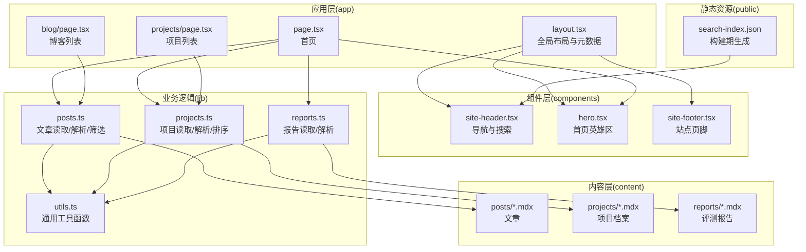
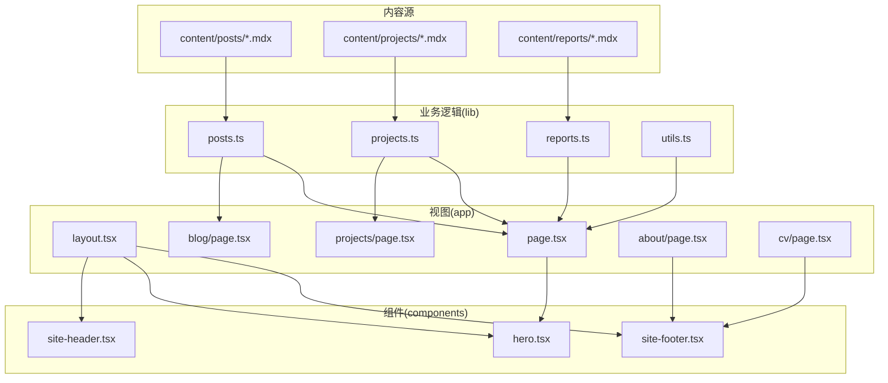
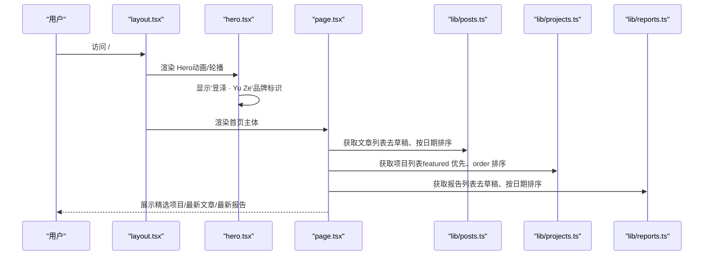
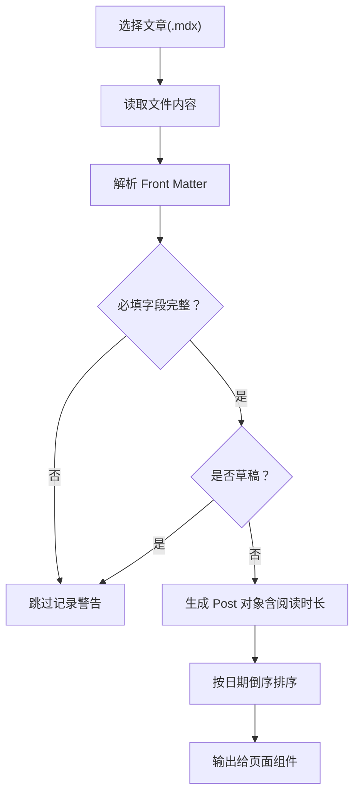
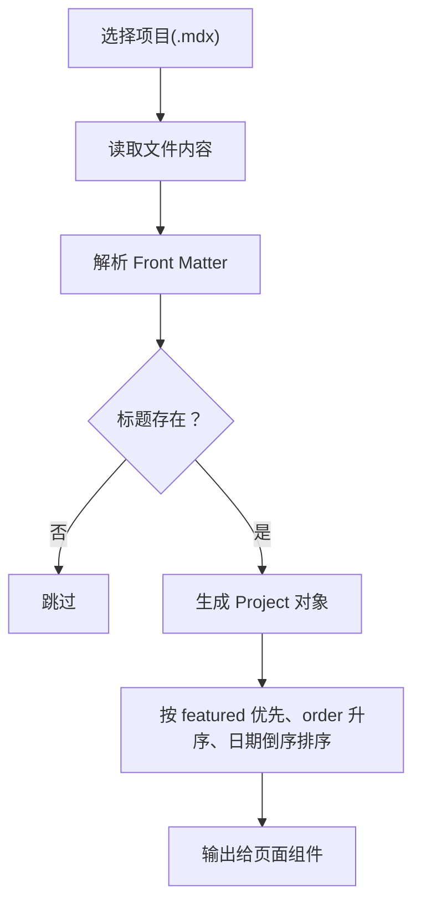
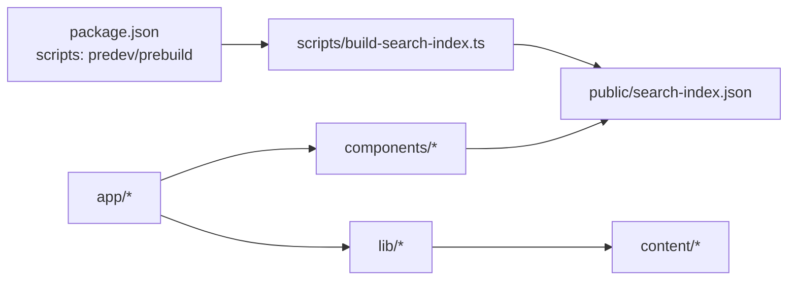

# 项目介绍

<cite>
**本文引用的文件**
- [README.md](file://README.md)
- [package.json](file://package.json)
- [app/layout.tsx](file://app/layout.tsx)
- [app/page.tsx](file://app/page.tsx)
- [lib/utils.ts](file://lib/utils.ts)
- [lib/posts.ts](file://lib/posts.ts)
- [lib/projects.ts](file://lib/projects.ts)
- [lib/reports.ts](file://lib/reports.ts)
- [components/hero.tsx](file://components/hero.tsx)
- [components/site-header.tsx](file://components/site-header.tsx)
- [components/site-footer.tsx](file://components/site-footer.tsx)
- [content/projects/example-project.mdx](file://content/projects/example-project.mdx)
- [content/reports/2026-05-13-e1-045-tools-distribution.mdx](file://content/reports/2026-05-13-e1-045-tools-distribution.mdx)
- [app/blog/page.tsx](file://app/blog/page.tsx)
- [app/projects/page.tsx](file://app/projects/page.tsx)
- [app/about/page.tsx](file://app/about/page.tsx)
- [app/cv/page.tsx](file://app/cv/page.tsx)
- [app/en/about/page.tsx](file://app/en/about/page.tsx)
- [app/en/cv/page.tsx](file://app/en/cv/page.tsx)
</cite>

## 更新摘要
**变更内容**
- 将作者信息从'侯盼 · Hou Pan'统一更新为'昱泽 · Yu Ze'
- 更新全局布局元数据中的作者描述和关键词
- 更新首页Hero区域的作者展示
- 更新站点页脚的版权信息
- 更新关于页面和CV页面中的个人信息
- 更新英文版本页面中的作者信息
- 更新README.md中的项目描述和元数据

## 目录
1. [引言](#引言)
2. [项目结构](#项目结构)
3. [核心组件](#核心组件)
4. [架构总览](#架构总览)
5. [详细组件分析](#详细组件分析)
6. [依赖分析](#依赖分析)
7. [性能考虑](#性能考虑)
8. [故障排查指南](#故障排查指南)
9. [结论](#结论)
10. [附录](#附录)

## 引言
myWebsite 是一个专注于工程笔记、项目档案与技术判断的个人技术博客网站。该项目以"内容驱动"为核心理念，采用静态生成策略，结合 Next.js 16 App Router、MDX、Tailwind v4 等技术栈，实现高性能、可扩展且易于维护的技术站点。网站通过清晰的功能模块划分，帮助读者快速理解作者在 LLM 后训练（SFT、RLHF）、多模态、系统设计等方向的实践与思考。

**更新** 项目现已以'昱泽 · Yu Ze'的品牌身份运营，代表作者在人工智能算法工程领域的专业经验和技能。

## 项目结构
项目采用基于 App Router 的目录组织方式，核心结构如下：
- app：页面路由与布局，包含首页、博客、项目、报告、Now 页面、关于与 CV 等
- components：可复用 UI 组件，如头部导航、英雄区、文章卡片、搜索对话框等
- content：非源代码内容目录，存放 MDX 文章、项目档案与评测报告
- lib：业务逻辑层，负责内容读取、解析与聚合（文章、项目、报告）
- public：静态资源与构建期生成的搜索索引
- scripts：构建期脚本，如搜索索引生成
- 部署：GitHub Actions + GitHub Pages，支持一键自动化部署

**图表来源**
- [app/layout.tsx:1-65](file://app/layout.tsx#L1-L65)
- [app/page.tsx:1-157](file://app/page.tsx#L1-L157)
- [components/site-header.tsx:1-105](file://components/site-header.tsx#L1-L105)
- [components/hero.tsx:1-227](file://components/hero.tsx#L1-L227)
- [components/site-footer.tsx:1-39](file://components/site-footer.tsx#L1-L39)
- [lib/posts.ts:1-98](file://lib/posts.ts#L1-L98)
- [lib/projects.ts:1-64](file://lib/projects.ts#L1-L64)
- [lib/reports.ts:1-60](file://lib/reports.ts#L1-L60)
- [lib/utils.ts:1-24](file://lib/utils.ts#L1-L24)

**章节来源**
- [README.md:122-135](file://README.md#L122-L135)
- [package.json:1-48](file://package.json#L1-L48)

## 核心组件
- 全局布局与元数据：定义站点标题、描述、关键词、Open Graph 与 Twitter 协议，统一页面风格与 SEO 基础信息。元数据中包含'昱泽 · Yu Ze'的个人简介和专业背景。
- 首页：整合 Hero、Now 条、精选项目、最新文章与最新报告，形成"入口枢纽"，便于访客快速浏览核心内容。
- 导航与搜索：提供中英语言切换、主导航、快捷搜索（Cmd+K）与搜索对话框，提升内容发现效率。
- 文章系统：基于 MDX 的内容管理，支持 Front Matter、标签、分类、阅读时长计算与草稿过滤。
- 项目系统：项目档案以卡片形式呈现，支持技术栈标签、链接与精选排序。
- 报告系统：评测报告与可视化分析，支持内嵌 HTML 与自定义高度，兼容独立页面与站点内嵌。
- 站点页脚：显示版权信息和社交链接，体现'昱泽 · Yu Ze'的品牌标识。

**章节来源**
- [app/layout.tsx:1-65](file://app/layout.tsx#L1-L65)
- [app/page.tsx:1-157](file://app/page.tsx#L1-L157)
- [components/site-header.tsx:1-105](file://components/site-header.tsx#L1-L105)
- [components/hero.tsx:1-227](file://components/hero.tsx#L1-L227)
- [components/site-footer.tsx:1-39](file://components/site-footer.tsx#L1-L39)
- [lib/posts.ts:1-98](file://lib/posts.ts#L1-L98)
- [lib/projects.ts:1-64](file://lib/projects.ts#L1-L64)
- [lib/reports.ts:1-60](file://lib/reports.ts#L1-L60)

## 架构总览
该站点采用"内容驱动 + 静态生成"的架构策略：
- 内容层：MDX 文件作为内容源，通过 Front Matter 描述元信息，正文支持 React 组件嵌入。
- 业务层：lib 层封装内容读取、解析、排序与筛选逻辑，统一输出给页面组件。
- 视图层：Next.js App Router 提供页面路由与组件渲染，Tailwind 实现一致的视觉风格。
- 部署层：构建期生成静态产物与搜索索引，部署至 GitHub Pages，实现零运行时成本与极佳性能。

**图表来源**
- [lib/posts.ts:1-98](file://lib/posts.ts#L1-L98)
- [lib/projects.ts:1-64](file://lib/projects.ts#L1-L64)
- [lib/reports.ts:1-60](file://lib/reports.ts#L1-L60)
- [lib/utils.ts:1-24](file://lib/utils.ts#L1-L24)
- [app/layout.tsx:1-65](file://app/layout.tsx#L1-L65)
- [app/page.tsx:1-157](file://app/page.tsx#L1-L157)
- [app/blog/page.tsx:1-28](file://app/blog/page.tsx#L1-L28)
- [app/projects/page.tsx:1-96](file://app/projects/page.tsx#L1-L96)
- [app/about/page.tsx:1-213](file://app/about/page.tsx#L1-L213)
- [app/cv/page.tsx:1-229](file://app/cv/page.tsx#L1-L229)
- [components/site-header.tsx:1-105](file://components/site-header.tsx#L1-L105)
- [components/hero.tsx:1-227](file://components/hero.tsx#L1-L227)
- [components/site-footer.tsx:1-39](file://components/site-footer.tsx#L1-L39)

## 详细组件分析

### 首页与入口枢纽
首页承担"内容入口枢纽"的角色，整合多项内容模块：
- Hero：包含动态标签语轮播与粒子网络动画，营造沉浸式首屏体验。展示'昱泽 · Yu Ze'的个人品牌标识。
- Now 条：以月度为周期的手工更新条目，展示当前关注重点。
- 精选项目：按 featured 与 order 排序，突出代表性作品。
- 最新文章：按日期倒序展示近期内容，配合标签筛选。
- 最新报告：展示可视化分析与交互式报告的入口。

**图表来源**
- [app/layout.tsx:1-65](file://app/layout.tsx#L1-L65)
- [components/hero.tsx:1-227](file://components/hero.tsx#L1-L227)
- [app/page.tsx:1-157](file://app/page.tsx#L1-L157)
- [lib/posts.ts:60-66](file://lib/posts.ts#L60-L66)
- [lib/projects.ts:28-63](file://lib/projects.ts#L28-L63)
- [lib/reports.ts:46-55](file://lib/reports.ts#L46-L55)

**章节来源**
- [app/page.tsx:1-157](file://app/page.tsx#L1-L157)
- [components/hero.tsx:1-227](file://components/hero.tsx#L1-L227)

### 文章系统（博客）
- 内容来源：content/posts 下的 MDX 文件，Front Matter 支持标题、日期、标签、分类、摘要、草稿等字段。
- 数据处理：读取文件、解析 Front Matter、过滤草稿、按日期排序、计算阅读时长。
- 页面展示：博客列表页提供标签筛选与分页基础，文章详情页通过动态路由加载对应内容。

**图表来源**
- [lib/posts.ts:24-58](file://lib/posts.ts#L24-L58)
- [lib/posts.ts:60-66](file://lib/posts.ts#L60-L66)
- [lib/utils.ts:17-23](file://lib/utils.ts#L17-L23)

**章节来源**
- [lib/posts.ts:1-98](file://lib/posts.ts#L1-L98)
- [app/blog/page.tsx:1-28](file://app/blog/page.tsx#L1-L28)

### 项目系统（项目档案）
- 内容来源：content/projects 下的 MDX 文件，Front Matter 支持标题、日期、摘要、技术栈、链接、是否精选与排序等。
- 数据处理：读取文件、解析 Front Matter、按 featured 优先、order 升序、日期倒序综合排序。
- 页面展示：项目卡片列表，支持外部链接与仓库链接，突出 featured 项目。

**图表来源**
- [lib/projects.ts:22-54](file://lib/projects.ts#L22-L54)
- [lib/projects.ts:56-63](file://lib/projects.ts#L56-L63)

**章节来源**
- [lib/projects.ts:1-64](file://lib/projects.ts#L1-L64)
- [app/projects/page.tsx:1-96](file://app/projects/page.tsx#L1-L96)

### 报告系统（评测与可视化）
- 内容来源：content/reports 下的 MDX 文件，Front Matter 支持标题、日期、摘要、标签、内嵌 HTML、高度等。
- 数据处理：读取文件、解析 Front Matter、过滤草稿、按日期排序。
- 页面展示：报告卡片列表，支持内嵌 HTML 与自定义高度，适配交互式可视化分析。

**章节来源**
- [lib/reports.ts:1-60](file://lib/reports.ts#L1-L60)
- [content/reports/2026-05-13-e1-045-tools-distribution.mdx:1-30](file://content/reports/2026-05-13-e1-045-tools-distribution.mdx#L1-L30)

### 导航与搜索
- 导航：提供首页、博客、项目、报告、Now、关于、CV 等入口，支持中英语言切换。
- 搜索：构建期生成搜索索引，客户端使用 Fuse.js 进行本地检索，支持 Cmd+K 快捷键。

**章节来源**
- [components/site-header.tsx:1-105](file://components/site-header.tsx#L1-L105)
- [README.md:40-41](file://README.md#L40-L41)

### 设计理念与静态生成优势
- 内容驱动：以 MDX 为核心，Front Matter 描述元信息，正文可嵌组件，兼顾灵活性与可维护性。
- 静态生成：构建期完成内容解析与索引生成，运行时仅需渲染静态产物，具备低延迟、低成本、高可用特性。
- 主题与交互：深色为主、Cyberpunk 风味，结合 Framer Motion 与 Canvas 动画，提升用户体验。

**章节来源**
- [README.md:3](file://README.md#L3)
- [README.md:137-145](file://README.md#L137-L145)
- [components/hero.tsx:1-227](file://components/hero.tsx#L1-L227)

### 作者信息与品牌展示
- 全局元数据：站点描述包含'昱泽 · Yu Ze'的专业背景，关键词涵盖'LLM'、'post-training'、'SFT'、'RLHF'、'multimodal'等技术领域。
- 首页Hero：明确展示'昱泽 · Yu Ze'的个人品牌标识，营造专业的技术博客形象。
- 站点页脚：版权信息显示'昱泽 · Yu Ze'，体现个人品牌一致性。
- 关于页面：详细介绍作者在阿里巴巴夸克搜索的LLM后训练工程师职位和专业技能。
- CV页面：提供详细的技术简历，涵盖7年AI算法工程经验、多模态对齐、SFT/RLHF等专业领域。

**章节来源**
- [app/layout.tsx:7-45](file://app/layout.tsx#L7-L45)
- [components/hero.tsx:163-167](file://components/hero.tsx#L163-L167)
- [components/site-footer.tsx:10](file://components/site-footer.tsx#L10)
- [app/about/page.tsx:72-92](file://app/about/page.tsx#L72-L92)
- [app/cv/page.tsx:5-9](file://app/cv/page.tsx#L5-L9)

## 依赖分析
- 运行时依赖：Next.js、React、@giscus/react、next-mdx-remote、gray-matter、fuse.js、Tailwind 等。
- 开发依赖：Tailwind、TypeScript、PostCSS、tsx 等。
- 构建流程：predev/prebuild 钩子自动执行搜索索引生成脚本，确保搜索能力始终可用。

**图表来源**
- [package.json:6-12](file://package.json#L6-L12)
- [README.md:40-41](file://README.md#L40-L41)

**章节来源**
- [package.json:1-48](file://package.json#L1-L48)

## 性能考虑
- 静态导出：构建产物直接部署至 GitHub Pages，避免服务器端请求与冷启动开销。
- 搜索优化：构建期生成 JSON 索引，客户端轻量查询，降低首屏压力。
- 图片与动画：合理控制 Hero 动画复杂度与粒子数量，保证在低端设备上仍具流畅体验。
- 代码分割：按路由拆分页面，减少初始包体积。

## 故障排查指南
- 搜索无结果或报错：确认 predev/prebuild 钩子已正确执行，确保 public/search-index.json 存在且最新。
- 文章/项目/报告未显示：检查 Front Matter 是否包含必要字段（如标题、日期），草稿状态会被过滤。
- 部署异常：确认仓库名为 <username>.github.io，Pages 设置为 GitHub Actions，分支为 main。
- 评论功能：若未配置 Giscus，文章页底部会显示提示文字而非报错。
- 品牌信息不一致：检查所有页面中的作者名称是否统一更新为'昱泽 · Yu Ze'。

**章节来源**
- [README.md:40-41](file://README.md#L40-L41)
- [lib/posts.ts:39-43](file://lib/posts.ts#L39-L43)
- [lib/reports.ts:28-32](file://lib/reports.ts#L28-L32)
- [README.md:88-121](file://README.md#L88-L121)

## 结论
myWebsite 以"内容驱动 + 静态生成"为核心策略，围绕工程笔记、项目档案与技术判断三大主题，构建了结构清晰、性能优异、易于维护的个人技术博客网站。通过 MDX 内容管理、组件化 UI、本地搜索与自动化部署，项目既满足作者长期写作与展示的需求，也为读者提供了高效、舒适的阅读体验。

**更新** 项目现已以'昱泽 · Yu Ze'的品牌身份运营，体现了作者在人工智能算法工程领域的专业定位和品牌价值。网站通过统一的视觉设计、专业的技术内容和完善的个人信息展示，建立了清晰的个人品牌标识。

## 附录
- 站点结构与路由概览：首页、博客、项目、报告、Now、关于、CV 以及英文镜像。
- 内容创作规范：Front Matter 字段、命名约定、草稿与发布流程。
- 部署与环境：GitHub Actions、GitHub Pages、子路径部署配置。
- 品牌管理：统一的作者信息、专业术语和视觉元素使用规范。

**章节来源**
- [README.md:6-18](file://README.md#L6-L18)
- [README.md:43-86](file://README.md#L43-L86)
- [README.md:88-101](file://README.md#L88-L101)