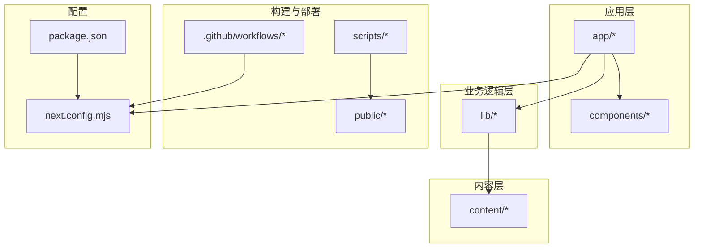
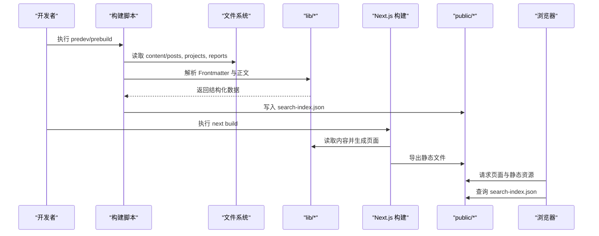
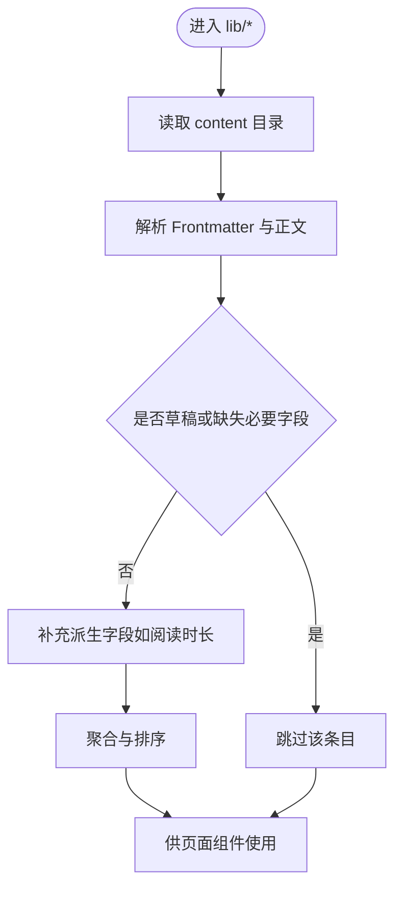
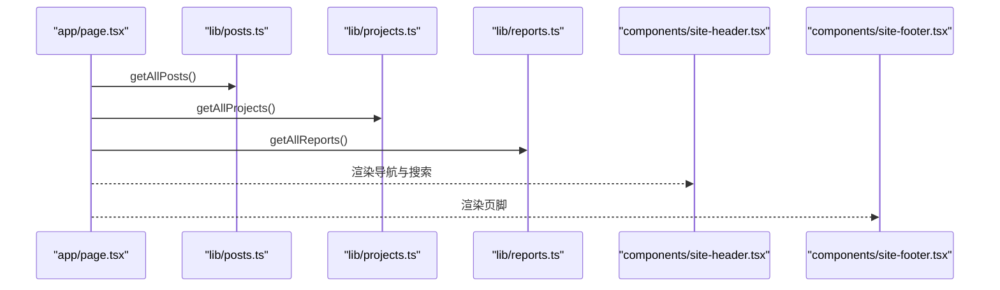
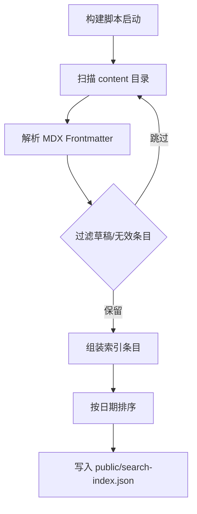
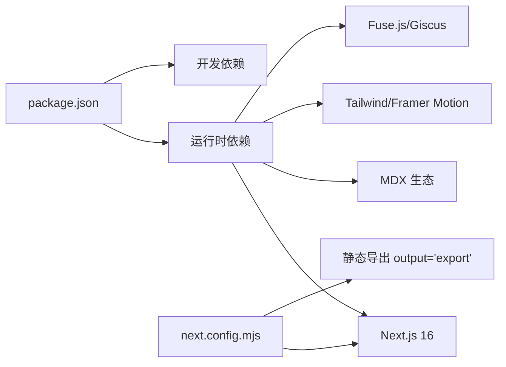

# 项目概述

<cite>
**本文引用的文件**
- [README.md](file://README.md)
- [package.json](file://package.json)
- [next.config.mjs](file://next.config.mjs)
- [app/layout.tsx](file://app/layout.tsx)
- [app/page.tsx](file://app/page.tsx)
- [app/blog/page.tsx](file://app/blog/page.tsx)
- [lib/utils.ts](file://lib/utils.ts)
- [lib/posts.ts](file://lib/posts.ts)
- [lib/projects.ts](file://lib/projects.ts)
- [lib/reports.ts](file://lib/reports.ts)
- [components/site-header.tsx](file://components/site-header.tsx)
- [components/site-footer.tsx](file://components/site-footer.tsx)
- [scripts/build-search-index.ts](file://scripts/build-search-index.ts)
- [content/projects/example-project.mdx](file://content/projects/example-project.mdx)
</cite>

## 目录
1. [引言](#引言)
2. [项目结构](#项目结构)
3. [核心组件](#核心组件)
4. [架构总览](#架构总览)
5. [详细组件分析](#详细组件分析)
6. [依赖关系分析](#依赖关系分析)
7. [性能考量](#性能考量)
8. [故障排查指南](#故障排查指南)
9. [结论](#结论)
10. [附录](#附录)

## 引言
myWebsite 是一个基于 Next.js 16 的个人技术网站，采用 App Router + 静态导出策略，专注于技术博客、项目展示与评测报告的可视化呈现。项目通过 MDX 内容驱动，结合 Tailwind v4 样式系统、Fuse.js 搜索、Giscus 评论等现代化技术栈，实现内容创作与前端渲染的高效协同。网站支持中英双语路由与主题切换，具备良好的 SEO 与可访问性。

## 项目结构
项目采用“按功能域划分”的目录组织方式，核心目录与职责如下：
- app/: Next.js App Router 路由入口，包含页面、布局、国际化镜像与错误处理
- components/: 可复用 UI 组件，如导航、页脚、文章卡片、搜索对话框等
- content/: 内容区，存放 MDX 文章、项目档案与评测报告，遵循约定式命名与 Frontmatter 元数据
- lib/: 业务逻辑层，封装内容读取、解析与聚合（文章、项目、报告）
- public/: 静态资源与构建产物，包含搜索索引与交互式报告的 HTML 输出
- scripts/: 构建期脚本，负责生成搜索索引
- .github/workflows/: GitHub Actions 部署工作流
- 根级配置：package.json、next.config.mjs、tsconfig.json、postcss.config.mjs 等

图表来源
- [package.json:1-48](file://package.json#L1-L48)
- [next.config.mjs:1-19](file://next.config.mjs#L1-L19)

章节来源
- [README.md:122-135](file://README.md#L122-L135)

## 核心组件
- 内容驱动架构
  - 文章、项目、报告均以 MDX 文件形式存放在 content 目录，统一通过 lib 层读取与解析，Frontmatter 提供元数据（标题、日期、标签、摘要等）
  - 通过 scripts/build-search-index.ts 在构建期生成 public/search-index.json，实现客户端即时搜索
- 静态生成策略
  - next.config.mjs 设置 output 为 export，启用静态导出，适合部署至 GitHub Pages 等静态托管平台
  - predev/prebuild 钩子自动执行搜索索引构建，确保开发与生产环境一致
- 主题与国际化
  - app/layout.tsx 提供全局元数据与语言设置，支持中英双语路由（/en/*）
  - components/site-header.tsx 实现导航、搜索与语言切换
- 页面与路由
  - app/page.tsx 作为首页，聚合精选项目、最新文章与最新报告
  - app/blog/page.tsx 提供文章列表与标签筛选
  - 动态路由 [slug] 支持文章、项目、报告详情页

章节来源
- [lib/posts.ts:1-98](file://lib/posts.ts#L1-L98)
- [lib/projects.ts:1-64](file://lib/projects.ts#L1-L64)
- [lib/reports.ts:1-60](file://lib/reports.ts#L1-L60)
- [scripts/build-search-index.ts:1-95](file://scripts/build-search-index.ts#L1-L95)
- [next.config.mjs:6-16](file://next.config.mjs#L6-L16)
- [app/layout.tsx:1-57](file://app/layout.tsx#L1-L57)
- [app/page.tsx:1-157](file://app/page.tsx#L1-L157)
- [app/blog/page.tsx:1-28](file://app/blog/page.tsx#L1-L28)
- [components/site-header.tsx:1-103](file://components/site-header.tsx#L1-L103)

## 架构总览
下图展示了从内容到页面渲染的关键流程：内容读取 → 数据聚合 → 静态导出 → 搜索索引 → 前端交互。

图表来源
- [scripts/build-search-index.ts:29-95](file://scripts/build-search-index.ts#L29-L95)
- [lib/posts.ts:60-66](file://lib/posts.ts#L60-L66)
- [lib/projects.ts:28-63](file://lib/projects.ts#L28-L63)
- [lib/reports.ts:46-55](file://lib/reports.ts#L46-L55)
- [next.config.mjs:8-10](file://next.config.mjs#L8-L10)

## 详细组件分析

### 内容读取与聚合（lib 层）
- posts.ts
  - 读取 content/posts 下的 MDX/MD 文件，解析 Frontmatter，过滤草稿，按日期倒序排列
  - 提供获取全部文章、按标签筛选、按分类统计等能力
- projects.ts
  - 读取 content/projects，解析 Frontmatter，支持 featured 与 order 排序
- reports.ts
  - 读取 content/reports，解析 Frontmatter，支持草稿过滤与日期排序
- utils.ts
  - 提供 cn（类名合并）、日期格式化、阅读时长计算等通用工具

图表来源
- [lib/posts.ts:24-58](file://lib/posts.ts#L24-L58)
- [lib/projects.ts:22-54](file://lib/projects.ts#L22-L54)
- [lib/reports.ts:22-44](file://lib/reports.ts#L22-L44)
- [lib/utils.ts:8-23](file://lib/utils.ts#L8-L23)

章节来源
- [lib/posts.ts:1-98](file://lib/posts.ts#L1-L98)
- [lib/projects.ts:1-64](file://lib/projects.ts#L1-L64)
- [lib/reports.ts:1-60](file://lib/reports.ts#L1-L60)
- [lib/utils.ts:1-24](file://lib/utils.ts#L1-L24)

### 首页与页面渲染（app 层）
- app/page.tsx
  - 调用 lib 获取精选项目、最新文章与最新报告，渲染 Hero、Now 条、精选项目网格、文章列表与报告区块
- app/blog/page.tsx
  - 渲染博客列表页，提供标签筛选与数量统计
- app/layout.tsx
  - 提供全局元数据、语言与主题设置，包裹 SiteHeader 与 SiteFooter

图表来源
- [app/page.tsx:14-148](file://app/page.tsx#L14-L148)
- [app/blog/page.tsx:11-27](file://app/blog/page.tsx#L11-L27)
- [app/layout.tsx:46-56](file://app/layout.tsx#L46-L56)
- [components/site-header.tsx:19-102](file://components/site-header.tsx#L19-L102)
- [components/site-footer.tsx:3-39](file://components/site-footer.tsx#L3-L39)

章节来源
- [app/page.tsx:1-157](file://app/page.tsx#L1-L157)
- [app/blog/page.tsx:1-28](file://app/blog/page.tsx#L1-L28)
- [app/layout.tsx:1-57](file://app/layout.tsx#L1-L57)
- [components/site-header.tsx:1-103](file://components/site-header.tsx#L1-L103)
- [components/site-footer.tsx:1-40](file://components/site-footer.tsx#L1-L40)

### 搜索与索引（scripts 与 public）
- scripts/build-search-index.ts
  - 遍历 content/posts、content/projects、content/reports，提取 title、summary、tags、category、slug、date 等字段，生成 search-index.json
- public/search-index.json
  - 构建期生成，客户端通过 Fuse.js 进行本地搜索

图表来源
- [scripts/build-search-index.ts:29-95](file://scripts/build-search-index.ts#L29-L95)

章节来源
- [scripts/build-search-index.ts:1-95](file://scripts/build-search-index.ts#L1-L95)

### 示例内容（content）
- content/projects/example-project.mdx
  - 展示了项目档案的 Frontmatter 字段与基本结构，便于新增项目条目

章节来源
- [content/projects/example-project.mdx:1-23](file://content/projects/example-project.mdx#L1-L23)

## 依赖关系分析
- 构建与运行时依赖
  - Next.js 16、React 19、TypeScript、Tailwind v4、MDX（next-mdx-remote + remark-gfm + rehype-* + Shiki）
  - 搜索：Fuse.js；评论：@giscus/react；主题：next-themes；工具：clsx、tailwind-merge
- 开发与构建工具
  - PostCSS、TailwindCSS、tsx、类型声明等
- 配置
  - next.config.mjs：静态导出、图片优化关闭、严格模式、Turbopack 根目录锁定
  - package.json：predev/prebuild 钩子自动执行搜索索引构建

图表来源
- [package.json:14-46](file://package.json#L14-L46)
- [next.config.mjs:7-16](file://next.config.mjs#L7-L16)

章节来源
- [package.json:1-48](file://package.json#L1-L48)
- [next.config.mjs:1-19](file://next.config.mjs#L1-L19)

## 性能考量
- 静态导出与缓存
  - 使用 output='export' 将页面预渲染为静态 HTML，减少运行时开销，利于 CDN 缓存与首屏加载
- 构建期索引
  - 搜索索引在构建期生成，避免运行时解析与计算，提升搜索响应速度
- 图片与主题
  - 关闭图片优化（unoptimized: true）简化部署，配合静态导出更稳定
- 代码分割与懒加载
  - App Router 默认按路由分块，建议保持组件拆分与动态导入以优化首屏
- 类名合并
  - 使用 cn/twMerge 合并 Tailwind 类，避免重复与冲突，减小 CSS 体积

## 故障排查指南
- 搜索结果为空
  - 确认 predev/prebuild 钩子已执行，public/search-index.json 是否存在且非空
  - 检查 content 下 MDX 文件的 Frontmatter 是否包含必需字段（如 title、date）
- 页面空白或构建失败
  - 检查 next.config.mjs 的静态导出配置与 images.unoptimized 设置
  - 确认所有动态路由参数（如 [slug]）在 lib 层有对应解析逻辑
- 国际化链接异常
  - 确认 /en/* 路由映射与语言切换逻辑正确，避免路径拼接错误
- 评论功能不可用
  - 若未配置 Giscus，页面会显示提示而非报错；需按 README 步骤配置仓库与变量

章节来源
- [scripts/build-search-index.ts:90-95](file://scripts/build-search-index.ts#L90-L95)
- [next.config.mjs:8-10](file://next.config.mjs#L8-L10)
- [README.md:103-121](file://README.md#L103-L121)

## 结论
myWebsite 以内容驱动为核心，结合 Next.js 16 的 App Router 与静态导出能力，构建了一个高性能、可扩展的个人技术站点。通过 MDX 内容管理、构建期搜索索引与现代化 UI 组件，项目在易用性与可维护性之间取得良好平衡。对于初学者，可直接参考 README 的快速开始与内容模板；对于有经验的开发者，可在 lib 层扩展数据模型、在 components 层增强交互体验，并利用 GitHub Actions 实现自动化部署。

## 附录
- 快速开始
  - 安装依赖：使用包管理器安装项目依赖
  - 本地开发：启动开发服务器，访问本地预览
  - 构建与预览：执行静态导出，查看 out/ 产物
  - 类型检查：运行类型检查命令
- 写作与发布
  - 在 content/posts、content/projects、content/reports 中新增 MDX 文件，按模板填写 Frontmatter
  - 通过 predev/prebuild 钩子自动生成搜索索引
- 部署
  - 将仓库命名为 <username>.github.io，启用 GitHub Pages 并选择 GitHub Actions 作为源
  - 推送 main 分支触发工作流，约两分钟内完成部署

章节来源
- [README.md:31-42](file://README.md#L31-L42)
- [README.md:88-102](file://README.md#L88-L102)
- [package.json:6-12](file://package.json#L6-L12)