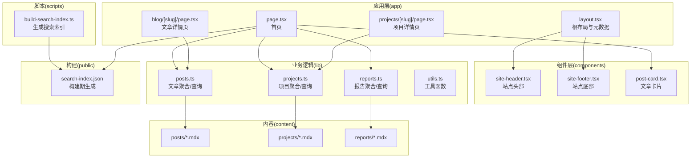
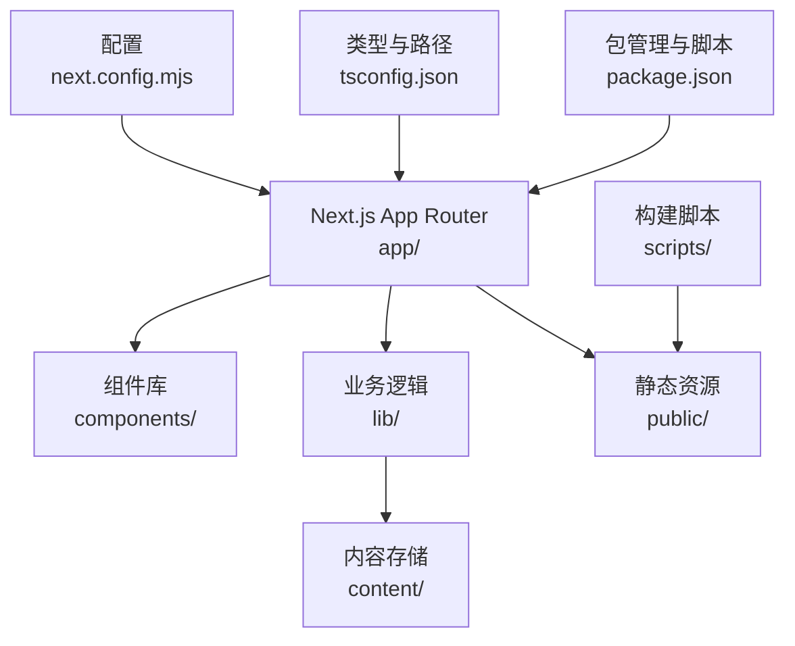
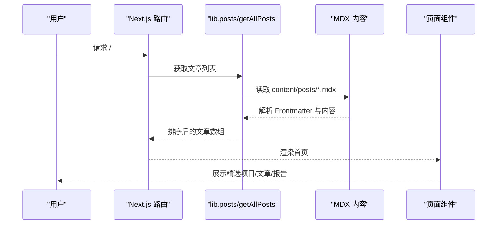
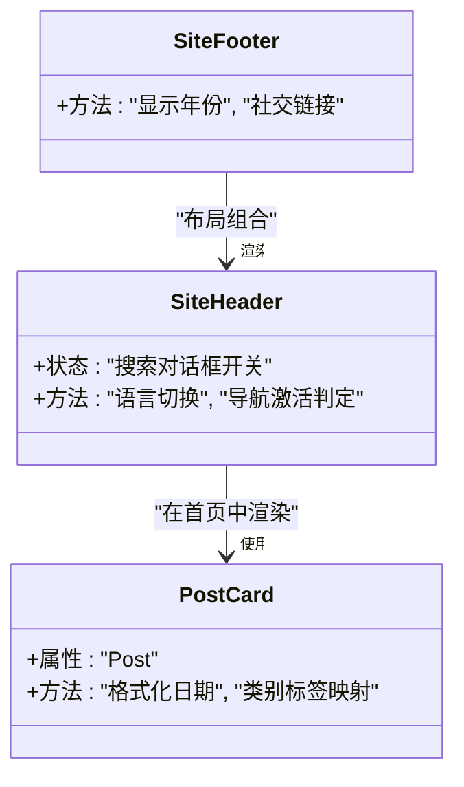
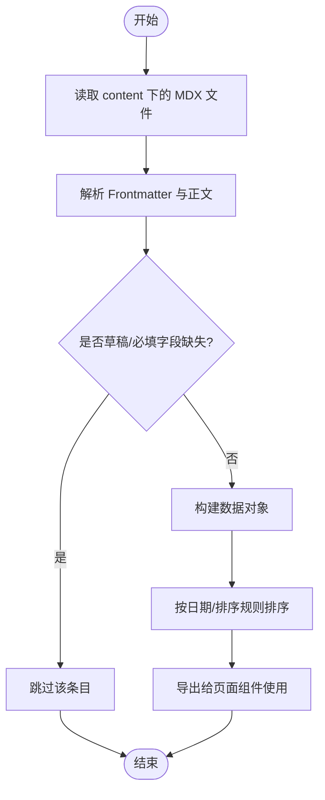
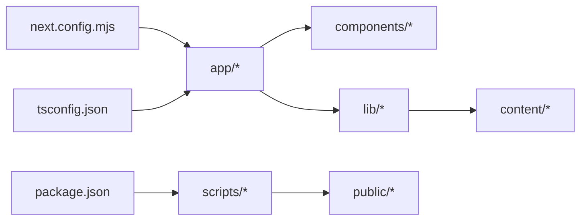

# 项目结构

<cite>
**本文引用的文件**
- [README.md](file://README.md)
- [package.json](file://package.json)
- [next.config.mjs](file://next.config.mjs)
- [tsconfig.json](file://tsconfig.json)
- [app/layout.tsx](file://app/layout.tsx)
- [app/page.tsx](file://app/page.tsx)
- [app/blog/[slug]/page.tsx](file://app/blog/[slug]/page.tsx)
- [app/projects/[slug]/page.tsx](file://app/projects/[slug]/page.tsx)
- [components/site-header.tsx](file://components/site-header.tsx)
- [components/site-footer.tsx](file://components/site-footer.tsx)
- [components/post-card.tsx](file://components/post-card.tsx)
- [lib/posts.ts](file://lib/posts.ts)
- [lib/projects.ts](file://lib/projects.ts)
- [lib/reports.ts](file://lib/reports.ts)
- [lib/utils.ts](file://lib/utils.ts)
- [scripts/build-search-index.ts](file://scripts/build-search-index.ts)
- [content/projects/example-project.mdx](file://content/projects/example-project.mdx)
</cite>

## 目录
1. [简介](#简介)
2. [项目结构](#项目结构)
3. [核心组件](#核心组件)
4. [架构总览](#架构总览)
5. [详细组件分析](#详细组件分析)
6. [依赖关系分析](#依赖关系分析)
7. [性能考虑](#性能考虑)
8. [故障排查指南](#故障排查指南)
9. [结论](#结论)
10. [附录](#附录)

## 简介
本项目是一个基于 Next.js App Router 的静态网站，采用 MDX 内容驱动与 Tailwind v4 样式体系，支持博客、项目档案、评测报告、简历与“现在”页面，并通过 GitHub Actions 自动部署至 GitHub Pages。项目遵循“内容即数据”的理念，所有内容以 MDX 文件形式存放在 content/ 目录下，运行时通过 lib/ 中的业务逻辑读取并渲染。

## 项目结构
项目采用“功能分层 + 内容分离”的组织方式：
- app/：Next.js App Router 路由入口与页面组件，包含页面路由、布局、全局样式与错误处理。
- components/：可复用 UI 组件，如导航、页脚、文章卡片等。
- content/：MDX 内容目录，存放博客、项目、报告三类内容，不参与编译源码。
- lib/：业务逻辑层，负责从 content/ 读取数据、解析 Frontmatter、聚合与排序。
- public/：静态资源与构建期生成的搜索索引。
- scripts/：构建期脚本，用于生成搜索索引。
- 配置文件：next.config.mjs、tsconfig.json、package.json 等。

图表来源
- [app/layout.tsx:1-57](file://app/layout.tsx#L1-L57)
- [app/page.tsx:1-157](file://app/page.tsx#L1-L157)
- [app/blog/[slug]/page.tsx](file://app/blog/[slug]/page.tsx#L1-L98)
- [app/projects/[slug]/page.tsx](file://app/projects/[slug]/page.tsx#L1-L105)
- [components/site-header.tsx:1-103](file://components/site-header.tsx#L1-L103)
- [components/site-footer.tsx:1-40](file://components/site-footer.tsx#L1-L40)
- [components/post-card.tsx:1-81](file://components/post-card.tsx#L1-L81)
- [lib/posts.ts:1-98](file://lib/posts.ts#L1-L98)
- [lib/projects.ts:1-64](file://lib/projects.ts#L1-L64)
- [lib/reports.ts:1-60](file://lib/reports.ts#L1-L60)
- [lib/utils.ts:1-24](file://lib/utils.ts#L1-L24)
- [scripts/build-search-index.ts:1-95](file://scripts/build-search-index.ts#L1-L95)

章节来源
- [README.md:122-135](file://README.md#L122-L135)
- [next.config.mjs:1-19](file://next.config.mjs#L1-L19)
- [tsconfig.json:1-45](file://tsconfig.json#L1-L45)

## 核心组件
- 应用布局与元数据：根布局负责注入全局样式、站点头部与底部，并设置默认元数据与主题。
- 首页：聚合精选项目、最新文章、最新报告与“现在”条目，使用卡片组件展示。
- 文章详情页：动态参数路由，根据 slug 读取对应 MDX 内容并渲染。
- 项目详情页：动态参数路由，根据 slug 读取项目内容并渲染。
- 可复用组件：导航栏、页脚、文章卡片等，统一风格与交互。
- 业务逻辑：从 content/ 读取 MDX 文件，解析 Frontmatter，提供查询与排序接口。
- 搜索索引：构建期扫描 content/ 下的 MDX，生成 public/search-index.json，供前端搜索使用。

章节来源
- [app/layout.tsx:1-57](file://app/layout.tsx#L1-L57)
- [app/page.tsx:1-157](file://app/page.tsx#L1-L157)
- [app/blog/[slug]/page.tsx:1-L98](file://app/blog/[slug]/page.tsx#L1-L98)
- [app/projects/[slug]/page.tsx:1-L105](file://app/projects/[slug]/page.tsx#L1-L105)
- [components/site-header.tsx:1-103](file://components/site-header.tsx#L1-L103)
- [components/site-footer.tsx:1-40](file://components/site-footer.tsx#L1-L40)
- [components/post-card.tsx:1-81](file://components/post-card.tsx#L1-L81)
- [lib/posts.ts:1-98](file://lib/posts.ts#L1-L98)
- [lib/projects.ts:1-64](file://lib/projects.ts#L1-L64)
- [lib/reports.ts:1-60](file://lib/reports.ts#L1-L60)
- [lib/utils.ts:1-24](file://lib/utils.ts#L1-L24)
- [scripts/build-search-index.ts:1-95](file://scripts/build-search-index.ts#L1-L95)

## 架构总览
系统采用“内容即数据 + 动态渲染 + 静态导出”的架构：
- 内容层：MDX 文件作为数据源，包含 Frontmatter 与正文。
- 业务层：lib/ 提供统一的数据读取、解析与聚合能力。
- 视图层：app/ 使用 Next.js App Router 渲染页面，components/ 提供可复用 UI。
- 构建层：scripts/ 在构建前生成搜索索引，next.config.mjs 配置静态导出。
- 部署层：GitHub Actions 自动化部署至 GitHub Pages。

图表来源
- [next.config.mjs:1-19](file://next.config.mjs#L1-L19)
- [tsconfig.json:1-45](file://tsconfig.json#L1-L45)
- [package.json:1-48](file://package.json#L1-L48)

## 详细组件分析

### app/ 目录下的 Next.js 路由结构
- 根布局与元数据：定义站点标题、描述、作者、关键词、Open Graph 与 Twitter 协议，注入全局样式与站点头部/底部。
- 首页：加载精选项目、最新文章、最新报告与“现在”条目，使用卡片组件渲染。
- 文章详情页：根据 slug 动态生成静态参数，读取对应文章内容并渲染，同时生成 SEO 元数据。
- 项目详情页：根据 slug 动态生成静态参数，读取项目内容并渲染，支持外部链接与仓库链接。
- 错误处理：未找到内容时返回 404。

图表来源
- [app/page.tsx:1-157](file://app/page.tsx#L1-L157)
- [lib/posts.ts:1-98](file://lib/posts.ts#L1-L98)

章节来源
- [app/layout.tsx:1-57](file://app/layout.tsx#L1-L57)
- [app/page.tsx:1-157](file://app/page.tsx#L1-L157)
- [app/blog/[slug]/page.tsx:1-L98](file://app/blog/[slug]/page.tsx#L1-L98)
- [app/projects/[slug]/page.tsx:1-L105](file://app/projects/[slug]/page.tsx#L1-L105)

### components/ 目录下的可复用组件
- 站点头部：包含导航菜单、语言切换、搜索按钮与搜索对话框。
- 站点底部：版权信息与社交链接。
- 文章卡片：展示文章标题、摘要、标签、分类与阅读时长，支持悬停高光效果。

图表来源
- [components/site-header.tsx:1-103](file://components/site-header.tsx#L1-L103)
- [components/site-footer.tsx:1-40](file://components/site-footer.tsx#L1-L40)
- [components/post-card.tsx:1-81](file://components/post-card.tsx#L1-L81)

章节来源
- [components/site-header.tsx:1-103](file://components/site-header.tsx#L1-L103)
- [components/site-footer.tsx:1-40](file://components/site-footer.tsx#L1-L40)
- [components/post-card.tsx:1-81](file://components/post-card.tsx#L1-L81)

### content/ 目录下的 MDX 内容文件
- 结构：按类型分为 posts/、projects/、reports/ 三个子目录。
- 内容：每篇 MDX 包含 YAML Frontmatter（标题、日期、摘要、标签、分类或项目相关字段）与正文。
- 示例：项目示例展示了 Frontmatter 字段与基本结构。

章节来源
- [content/projects/example-project.mdx:1-23](file://content/projects/example-project.mdx#L1-L23)

### lib/ 目录下的业务逻辑
- posts.ts：读取 content/posts/，解析 Frontmatter，过滤草稿，按日期排序，提供按标签筛选与分类统计。
- projects.ts：读取 content/projects/，解析 Frontmatter，支持 featured 与 order 排序。
- reports.ts：读取 content/reports/，解析 Frontmatter，支持草稿过滤与日期排序。
- utils.ts：通用工具函数，包括类名合并、日期格式化、阅读时长计算。

图表来源
- [lib/posts.ts:1-98](file://lib/posts.ts#L1-L98)
- [lib/projects.ts:1-64](file://lib/projects.ts#L1-L64)
- [lib/reports.ts:1-60](file://lib/reports.ts#L1-L60)
- [lib/utils.ts:1-24](file://lib/utils.ts#L1-L24)

章节来源
- [lib/posts.ts:1-98](file://lib/posts.ts#L1-L98)
- [lib/projects.ts:1-64](file://lib/projects.ts#L1-L64)
- [lib/reports.ts:1-60](file://lib/reports.ts#L1-L60)
- [lib/utils.ts:1-24](file://lib/utils.ts#L1-L24)

### public/ 目录下的静态资源
- 构建期生成的搜索索引：scripts/build-search-index.ts 将 posts、projects、reports 的内容汇总为 public/search-index.json，供前端搜索使用。
- 报告静态页面：部分报告以独立 HTML 形式放置在 public/reports/<slug>/index.html，便于直接访问。

章节来源
- [scripts/build-search-index.ts:1-95](file://scripts/build-search-index.ts#L1-L95)

### scripts/ 目录下的构建脚本
- build-search-index.ts：扫描 content/ 下的 MDX，过滤草稿与无效条目，生成统一的搜索索引并写入 public/search-index.json。
- package.json 中 predev/prebuild 钩子自动执行该脚本，确保索引与内容同步。

章节来源
- [scripts/build-search-index.ts:1-95](file://scripts/build-search-index.ts#L1-L95)
- [package.json:6-13](file://package.json#L6-L13)

## 依赖关系分析
- app/ 依赖 components/ 与 lib/，并通过 Next.js 的 App Router 机制进行页面渲染。
- lib/ 依赖 gray-matter 解析 Frontmatter，并读取 content/ 下的 MDX 文件。
- scripts/ 依赖 gray-matter 与 Node FS，生成 public/search-index.json。
- next.config.mjs 控制静态导出、图片优化与严格模式。
- tsconfig.json 提供路径别名与严格类型检查。

图表来源
- [next.config.mjs:1-19](file://next.config.mjs#L1-L19)
- [tsconfig.json:1-45](file://tsconfig.json#L1-L45)
- [package.json:1-48](file://package.json#L1-L48)

章节来源
- [next.config.mjs:1-19](file://next.config.mjs#L1-L19)
- [tsconfig.json:1-45](file://tsconfig.json#L1-L45)
- [package.json:1-48](file://package.json#L1-L48)

## 性能考虑
- 静态导出：next.config.mjs 设置 output 为 export，提升首屏性能与部署灵活性。
- 构建期索引：在 predev/prebuild 阶段生成搜索索引，避免运行时 IO 开销。
- 图片优化：关闭图片优化以适配静态导出环境。
- 严格模式：启用 reactStrictMode，提升开发阶段的稳定性。

章节来源
- [next.config.mjs:1-19](file://next.config.mjs#L1-L19)
- [package.json:6-13](file://package.json#L6-L13)

## 故障排查指南
- 404 页面：当 slug 对应的内容不存在时，文章与项目详情页会返回 404。
- 缺失 Frontmatter：若文章缺少标题或日期，将被跳过；项目缺少标题也会被跳过。
- 草稿内容：Frontmatter 中 draft: true 的文章或报告不会出现在索引与列表中。
- 搜索无结果：确认 predev/prebuild 是否成功生成 public/search-index.json。

章节来源
- [app/blog/[slug]/page.tsx:40-L41](file://app/blog/[slug]/page.tsx#L40-L41)
- [app/projects/[slug]/page.tsx:32-L33](file://app/projects/[slug]/page.tsx#L32-L33)
- [lib/posts.ts:39-43](file://lib/posts.ts#L39-L43)
- [lib/reports.ts:28-32](file://lib/reports.ts#L28-L32)
- [scripts/build-search-index.ts:33-34](file://scripts/build-search-index.ts#L33-L34)

## 结论
本项目通过清晰的目录划分与严格的开发约定，实现了内容与视图的解耦、构建期与运行时的分离。借助 MDX 的灵活性与 Next.js App Router 的强大生态，项目具备良好的可维护性与扩展性，适合长期迭代的内容型站点。

## 附录

### 目录命名规范与文件组织原则
- app/：按路由层级组织页面组件，根布局与全局样式集中管理。
- components/：按功能拆分可复用组件，保持单一职责。
- content/：按内容类型分目录，Frontmatter 字段统一，便于业务逻辑解析。
- lib/：按领域拆分模块，提供稳定的数据访问接口。
- public/：仅存放构建期生成的静态资源与索引文件。
- scripts/：构建期一次性任务，避免运行时开销。
- 配置文件：next.config.mjs、tsconfig.json、package.json 明确工程边界与类型约束。

章节来源
- [README.md:122-135](file://README.md#L122-L135)
- [next.config.mjs:1-19](file://next.config.mjs#L1-L19)
- [tsconfig.json:1-45](file://tsconfig.json#L1-L45)
- [package.json:1-48](file://package.json#L1-L48)